# AWS Certified Cloud Practitioner Course Notes (CLF-C01)

This note summarised the preparation course by Stephane Maarek on Udemy.

# What is Cloud Computing ?

## Traditional IT Overview 

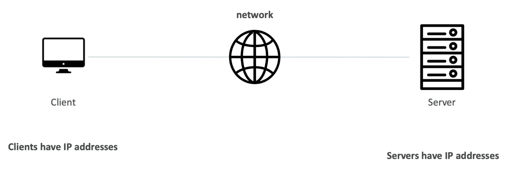

An simple example to demonstrate how website works is that we as the Client (using web browser) want to get access to the Server to visualise a website, through a network. The data packet gets routed though the network to the Server and the Server will get back to us, so that we can view the website. Both the Client and the Server has IP address which can be used to send/receive requests. 

So what is in the Server ?     
CPU: computation and finding results.        
RAM: fast memory (storing and retrieving quickly)       
Storage: long term storage of data              
Database: for large structured data      
Network tools: routers, switch, DNS server, etc.       

So what is in the network ?       
Cables: obviously       
Router: networking device that forwards data packets between computer networks        
Switch: when the data packet arrives at the destination, the switch will send the packet to the correct Server/Client on the network.     

So in summary it looks like this: Clients send data to a router, the router will find all its way to the switch through network, and the switch will send the packet to the specific Client/Server in the network.

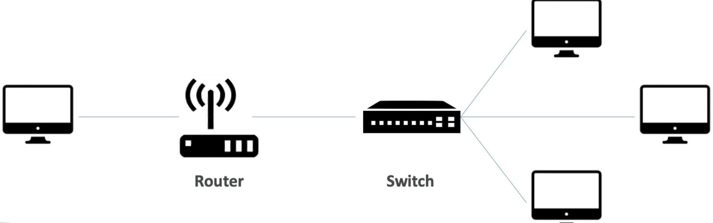

Traditionally,the infrastructure of building a company or website (e.g. Google) involving buy a lot of server (stored in Data Centre) to satisfy the demand (request) to your website. But there are a few problems with this approach:     

1) pay for the rent for Data Centre     
2) pay for power supply, cooling, maintenance       
3) add and replace hardware takes time      
4) scaling is limited      
5) need a 24/7 team to monitor the infrastructure      
6) natural disaster mitigations        

Let's move to cloud computing !

## What is Cloud Computing ?     

Cloud computing is the **on-demand delivery** of compute power, database storage, applications, and other IT resources. Through a cloud services platform we will **pay as we go pricing**. We can **provision exactly the right tye and size** of computing resource we need and we can get these resources **almost instantly**.     

There are different types of cloud services:       

1) Private Cloud: used by a single organisation, not exposed to the public. Having complete control and security for sensitive applications.                     
2) Public Cloud: Cloud resources owned and operated by a 3rd party cloud service provider (e.g. AWS) deliverd over the internet.         
3) Hybrid Cloud: keep some servers on premises and extend some capabilities to the Cloud. Have control over sensitive assets in our private infrastruture and having flexibility and cost-effectiveness of the public cloud.     

Five characteristics of Cloud Computing:       
1) Fully on-demand self service: use resources without human interaction from the service provider.      
2) Broad network access: resources available over the network, and can be accessed by diverse client platforms.     
3) Multi-tenancy and resource pooling: multiple customers can share the same infrastructure and applications with security and privacy. They are serviced from the same physical resources.             
4) Rapid elasticity and scalability: quickly acqure and discard resources.      
5) Measured service.          

Six advantages of Clould Computing:      
1) Trade capital expense (CAPEX) for operational expense (OPEX): pay-on-demand means no need to own hardware. Reduce Total Cost of Ownership (TCO) and OPEX.           
2) Massive economies of scale: many people are using the service, so the price is low due to AWS is more efficient when the scale is large.       
3) Stop guessing capacity: scale based on actual usage.     
4) Increase speed and agility.      
5) Stop spending money running and maintaining data centers.
6) Go global in minutes: leverage the AWS global infrastructure.         

Problem solved by the Cloud:      
1) Flexibility: change resource types when needed.      
2) Cost-Effectiveness: pay as you go      
3) Scalability: accomodate larger loads                 
4) Elasticity: scale out and scale in when needed       
5) High-availability and fault-tolerance        
6) Agility: rapidly develop, test and launch software applications   

## The Different Types of Cloud Computing     

1) Infrastructure as a Service (IaaS)       
Provide building blocks for cloud IT      
Provide networking, computers, data storage space in its raw form      
Highest level of flexibility     
Easy parallel with traditional on-premises IT      
e.g. EC2     

2) Platform as a Service (PaaS)          
Don't need to mamage infrastructure           
Just focus on the deployment and management of our applications           

3) Software as a Service (SaaS)       
Completed product that is run and managed by the service provider.      

A simple visualisation that shows how each service need to managed each components:    

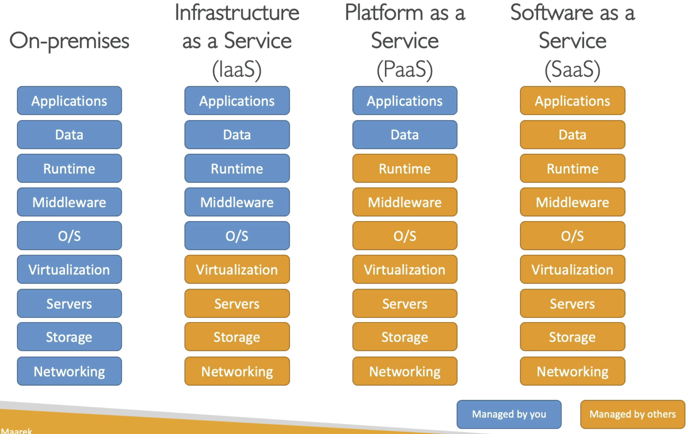

Some examples:     
1) IaaS: AWS EC2, GCP, Azure      
2) PaaS: AWS Beanstalk, Heroku             
3) SaaS: AWS Rekognition for ML, Gmail, Dropbox, Zoom     

AWS Pricing of the Cloud has 3 pricing fundamentals:      
1) **Compute: Pay for compute time**     
2) **Storage: Pay for data stored in the Cloud**      
3) **Networking: Pay for data transfer OUT of the Cloud**, i.e. any data goes into the Cloud is free.       

## AWS Cloud Overview

AWS Global Infrastructure:     
1) AWS Regions      

**Regions** (orange dot in the AWS map) include locations like Singapore Beijing Sydney etc, and they are all around the world. These regions are connected through the networks. Regions can have names like us-east-1, eu-west-3, etc. A Region is a cluster of data centers. 

**Most AWS services are region-scoped**, this means that if we use one service at Region A and attempt to use the same service in Region B, it will be like a new time using the service.         

How to choose which AWS Region ?        
**Compliance** with data governance and legal requirements: data never leaves a region without explicit permission. So if the government requires data stay in the country, we should launch our application within that country.       
**Proximity** to customers: reduced latency.       
**Available services within a Region**: new services and new features might not be available in every Region.     
**Pricing**: pricing varies region to region and is transparent in the serice pricing page.       

2) AWS Availability Zones       

Each Region has many Availability Zones. (usually 3, min is 2, max is 6, they are blue dots in the AWS map).     
e.g. AWS Region: Sydney: ap-southeast-2         
we will have 3 Availability Zones: ap-southeast-2a, ap-southeast-2b, ap-southeast-2c.       

Each Availability Zones is one or more discrete data centers with redundant power, networking and connectivity. They are separated from each other so they are isolated from disasters. These Availability Zones are connected with high bandwidth, ultra-low latency networking. They are thus linked together to form the Region.          

3) AWS Data Centers         

4) AWS Edge Locations/ Points of Presence           

Amazon has 216 Points of Presence (205 Edge Locations and 11 Regional Caches) in 84 cities across 42 countries. It is helpful to deliver content to end users with lower latency.       
  
AWS has Global Services:      
Identity and Access Management (IAM)        
Route 53 (DNS service)       
CloudFront (Content Delivery Network)      
WAF (Web Application Firewall)          

**Most** AWS services are Region-scoped:       
Amazon EC2 (IaaS)     
Elastic Beanstalk (PaaS)      
Lambda (Function as a Serice)     
Rekognition (SaaS)

We can check out the AWS Region Table to see if a service is available in our Region. Or we can go to AWS Global Infrastructure (just google it) and see AWS Regional Services then we can access which services are available in which Regions. If the Region we are at does not have certain services we can switch to another Region.    

## Shared Responsibility Model & AWS Acceptable Policy    

Customer: Responsible for the security **IN** in the Cloud. This includes security, our data, our OS, our network and firewall configuration.     

AWS: Responsible for the security **OF** the Cloud. In the CCP exam, there *will* be questions about the shared responsibility. 

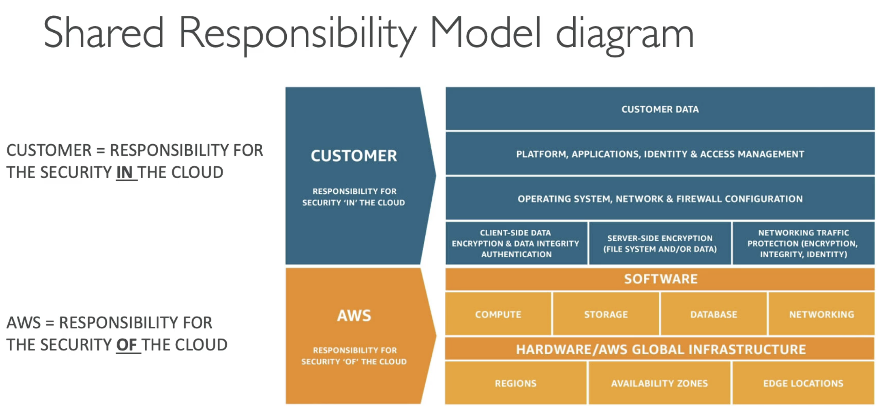

AWS Acceptable Use Policy      
No illgal, harmful or offensive use or content       
No security violation     
No network abuse     
No E-mail or other message abuse

# IAM - Identity and Access Management

This is a **Global** service. This is because in IAM we are going to create our users and assign them to group.    

**Root account** created by default when we create AWS account, this shouldn't be used or shared. This account is only used to setup other account.      

We should create **Users**, they are people within your organisation.     

Group can only contain users, not other groups. Some users don't have to belong to a group and some users can be in multiple groups.        

The reasons for users/groups is to give them various permissions. **Users** and **Groups** can be assigned JSON documents called *policies*.   

An example:     
```
{
    "Version": "2012-10-17",
    "Statement": [
        {
            "Effect": "Allow",
            "Action": "ec2:Describe*",
            "Resource": "*"
        },
        {
            "Effect": "Allow",
            "Action": "elasticcloadbalancing:Describe*",
            "Resource": "*"
        },
        {
            "Effect": "Allow",
            "Action": [
                "cloudwatch:ListMetrics",
                "cloudwatch:GetMetricsStatistics",
                "cloudwatch:Describe*"
            ],
            "Resource": "*"
        }
    ]
}
```

Another example for the policy: AdminstratorAccess: (Note the star means everything)             

```
{
    "Version": "2012-10-17",
    "Statement": [
        {
            "Effect": "Allow",
            "Action": "*",
            "Resource": "*"
        }
    ]
}
```

Through these policies we define the permissions of the users. In AWS, we apply **least privilege principle**: don't give more permissions than a user needs.      

For users, we can add tags, where we can mark the users and add in some attributes.   

After log in we can notice that if the user accout is something like `stephane@stephane-ccp`, this means that this account is logged in as IAM user. If the user account is just `stephane-ccp` then this is logged in with root user.      

To grant permissions to User, we can either add the user into a group (which has the group policy, so this user will inhereit this group policy) or assign a policy directly to the user. We can also create our own custom policy either use the GUI or write in JSON.      

## IAM MFA Overview

To protect the AWS account, we have 2 defense mechanisms:      

1) IAM Password Policy (helpful against brute force attack)         

Set minimum password length      
Requires specific character types: upper/lower case letters, numbers or non-alphanumeric characters.       
Allow all IAM users to change their own passwords      
Require users to change their password after some time       
Prevent password reuse                 

2) Multi Factor Authentication - MFA        

On AWS this is a must and very recommended to use it. **We want to protect Root Account and IAM users**.      
MFA = password you know + security device you own         

MFA devices options in AWS:         
1) Virtual MFA device:       
Google Authenticator: phone only   
Authy: multi-device, and supports multiple tokens on a single device.       

2) Universal 2nd Factor (U2F) Security Key:      
YubiKey by Yubico (3rd party): support for multiple root and IAM users using a single security key                

3.1) Hardware Key Fob MFA Device:    
Gemalto (3rd party)      

3.2) Hardware Key Fob MFA Device for AWS GovCloud (US):           
SurePassID (3rd party)        

## AWS CLI    

How can users access AWS ? There are 3 options:    
1) AWS Management Console (protected by password + MFA, for Root Account or other users)       
2) AWS Command Line Interface (CLI): protected by access keys      
3) AWS Software Developer Kit (SDK): this is mainly for code, also protected by access keys    

Access keys are generated through the AWS Console. Users manage their own access keys and these keys are **private**.    
Access key have 2 components: Access Key ID (username) and Secret Access Key (password).   

We have to install (OS specific) client and configure the CLI with the Access Key ID and the Secret Access Key in order to use command line to access AWS.    

## AWS CloudShell

There is an alternative to install the CLI and configure it, this is called CloudShell. At the top right corner of the AWS Console there is a `terminal` icon we can launch. This is basically CLI in the cloud with pre-installed tools, storage (1 GB per AWS region) and saved files/settings.     

We can directly run AWS command directly in the CloudShell instead on the local CLI. e.g. `aws --version` to check the version of the AWS CLI installed or `aws iam list-users` to list the IAM users.     

The credentials used by the CloudShell is the same credentials as the user we logged in to the console with, at the moment we launch the CloudShell.    

## IAM Roles for AWS Services

Some AWS services will need to perform actions on our behalf and on our account. We have to assign permissions to AWS services with IAM Roles.    

IAM Roles are just like users, but they are intended to be used *not* by physical people, but instead used by AWS Services.    

A quick example will be we created an EC2 instance (virtual server), and this EC2 instance would like to perform some action on AWS. To do so we need to give permissions to this EC2 instance. We will create an IAM Roles and together with the EC2 instance (as one entity), they can access AWS.     

Some common roles includes: EC2 Instance Roles, Lambda Function Roles, Roles for CloudFormation.      

## IAM Security Tools    

IAM Credentials Report (account level):      
We can create this report at the account level. This is a report that lists all your account's users and the status of their various credentials.    

IAM Access Advisor (user level):            
Access advisor shows the service permissions granted to a user and when those services were last used. We can use this information to revise your policies based on principle of least privilege.    

## IAM Best Practices

Do not use the Root Account except for AWS account setup      
One physical user = One AWS user       
**Assign users to groups** and assign permissions to groups (such that we manage permissions at a group level)           
Create a strong password policy       
Use and enforce the use of MFA              
Create and use Roles for giving permissions to AWS services           
Use Access Keys for Programmatic Access (CLI/SDK)      
Audit permissions of your account with the IAM Credential Reports     
Never share IAM users and Access keys     

## Shared Responsibility Model for IAM

AWS is responsible for everything they do include:      
Infrastructure (global network security)           
Configuration and vulnerability analysis            
Compliance validation          

For IAM, we are responsible for:     
User, Groups, Roles, Policies management and monitoring         
Enable MFA on all accounts          
Keys are rotated often           
Use IAM tools to apply appropriate permissions     
Analyse access patterns and review permissions          

In short, AWS is responsible for the infrastructure and we are responsible of how we use the infrastructure.           

## IAM Summary

Users: mapped to a physical user, has password for AWS Console         
Groups: contains users only (it is best to group users together)     
Policies: JSON document that outlines permissions for users or groups        
Roles: if we are within AWS, we can use roles to give permissions to AWS services to perform tasks      
Security: MFA + password policy        
Access Keys: access AWS using the CLI or SDK      
Audit: IAM Credential Reports and IAM Access Advisor          

# EC2 - Elastic Compute Cloud

*Before we start our journey in AWS services like EC2, we should set up AWS Cost budget just in case*.       

## EC2 Basics

One of the most popular AWS service and it is a Infrastructure as a Service (IaaS).       

It is comprised of many things (and capabilities) at a high level:       
-> You can rent virtual machinese on EC2 (they are called EC2 instances)     
-> You can store data in on their virual drives (they are called EBS volumes)     
-> You can distribute load across machines (Elastic Load Balancer, ELB)         
-> You can scale services using auto-scaling group (ASG)         

Knowing how EC2 works is *fundamental* to understand how Cloud works.      

EC2 sizing & configuration option: what can we choose for our instances (virtual servers) ?     

-> Operating System (OS): Linux or Windows (there is MacOS now)       
-> How much compute power & cores (CPU)       
-> How much random-access memory (RAM)            
-> How much storage space: Network-attached (EBS & EFS) or hardware-attached (EC2 Instance Store)           
-> The Network card that is attached to the EC2 instance: speed of the card, public IP address        
-> Firewall rules: **security group**              
-> Bootstrap script (configure at first launch): Configuration script needs to be run at first launch, this is called EC2 User Data           

The `t2.micro` instance is included in the AWS free-tier. It has 1 vCPU, 1 GiB Mem and EBS storage.      

## Create an EC2 Instance with EC2 User Data to have a Website (hands-on)

1. Log in AWS Console, search for EC2, go to EC2 Console    
2. Choose region (e.g. closest to you)
3. Go to `Instances` on the right panel and `Launch Instance`
4. Choose Amazon Machine Image (AMI), we can choose from Quick Start and select Amazon Linux 2 AMI (64-bit x86) which is free-tier eligible.  
5. Choose an Instance Type (e.g. t2.micro for free tier)
6. Configure Instance Details: Under `User Data` we can run a user data which is only run at the first boot of the instance. (an example script is given, which is going to launch a web server onto our EC2 instance and write a file to it)
7. Add Storage (check `Delete on Termination`)
8. Add tags
9. Configure Security Group: create a new security group and Add Rule (HTTP, port 80)
10. Review and launch (will be prompted to use a key pair (for SSH)) 
11. Create a new key-pair (public-private key) and download the key pair

We can then use the public IPv4 address to access the website. To stop the instance, we can right click the instance and `Stop Instance`. To get rid of the instance, choose `Terminate Instance`.       

Note that if we stop an instance and restart it again, the public IPv4 **is going to change**.   

## EC2 Instance Types Basics

AWS has the following naming convention (example):     
m5.2Xlarge    
m: instance class, in this case a general purpose instance      
5: generation of the instance (AWS improves them over time)         
2xlarge: size within the instance class         

**For exam we need to know this**, for various EC2 Instance Types:              
1. General Purpose        
Great for a diversity of workloads such as web servers or code repositories              
Balance between: Compute, Memory and Networking     
t2.micro is a General Purpose EC2 Instance (free tier)             

2. Compute Optimized        
Great for compute-intensive tasks that require high performance processors:      
Batch processing workloads       
Media transcoding      
High performance web server              
High performance computing (HPC)            
Scientific modeling and machine learning            
Dedicated gaming servers               
Currently all the Compute Optimized EC2 Instance start with `c`, e.g. c5 or c6.     

3. Memory Optimized
Fast performance for workloads that process large data sets in memory (RAM)       
Use cases includes:         
Floating point number calculations         
Graphic processing                
Data pattern matching        
These instances starts with `r`.             

4. Storage Optimized
Great for storage-intensive tasks that require high, sequential read and write access to large data sets on local storage     
Use cases include:        
High frequency online transaction processing (OLTP) systems    
Relational & NoSQL databases            
Cache for in-memory databases (e.g. Redis)       
Data warehousing applications                 
Distributed file systems           
These instance starts with `i`, `d` or `h1`.       

## Security Groups & Classic Ports Overview

Security Groups are the fundamental of network security in AWS.             
They control how traffic is allowed into or out of our EC2 Instances.    
Security Groups only contains *allow* rules, i.e. what is allowed to go in or go out.    
Security Groups rules can reference by IP address (i.e. where is your computer) or by Security Groups (i.e. Security Groups can reference each other).                

For example we are on our computer (i.e. public internet) and we would like to access our EC2 Instance. We will have to create a Security Group around our EC2 Instance (that is the firewall around it) and this Security Group is going to have rules that control which inbound traffic is allowed into the EC2 Instance and if the EC2 Instance can perform some Outbound traffic.      

Security Groups are acting as a "firewall" on EC2 Instance. They regulate:          
1. Access to Ports
2. Authorised IP ranges: IPv4 and IPv6 (e.g. 0.0.0.0/0 means any IP address is authorised)
3. Control of inbound network (i.e. from others to the EC2 Instance)
4. Control of outbound network (i.e. from EC2 Instance to others)

A quick example of Security Group works is shown below:           
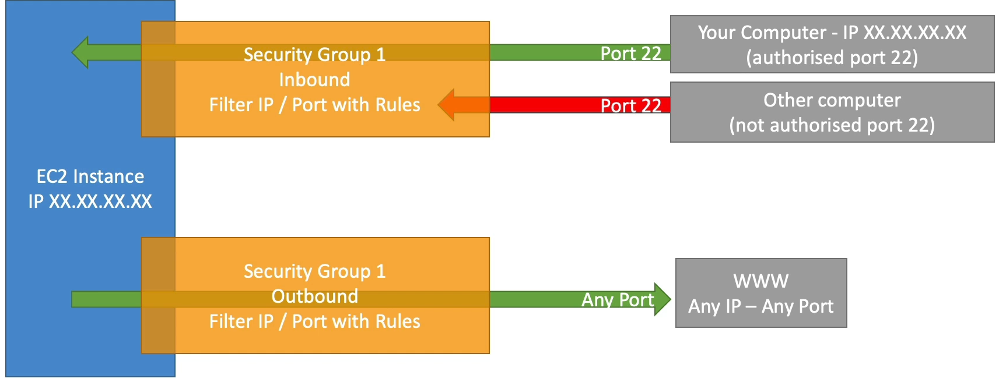     

For unauthorised inbound traffic, it will be a timeout error. By default for any Security Group, it will allow all outbound traffic out of the EC2 Instance. For example, if our EC2 Instance try to access a website, the Security Group is going to allow it.     

Classic Port we need to know (**EXAM**):        
1. 22 = SSH (Secure Shell) - log into a EC2 Instance on Linux
2. 21 = FTP (File Transport Protocol) - upload files into a file share
3. 22 = SFTP (Secure File Transport Protocol) - upload files using SSH
4. 80 = HTTP - access unsecured websites
5. 443 = HTTPS  - access secured websites
6. 3389 = RDP (Remote Desktop Protocol) - log into a Windows instance

The Security Groups (i.e. firewall) can be attached to multiple EC2 Instances.     

## SSH Overview

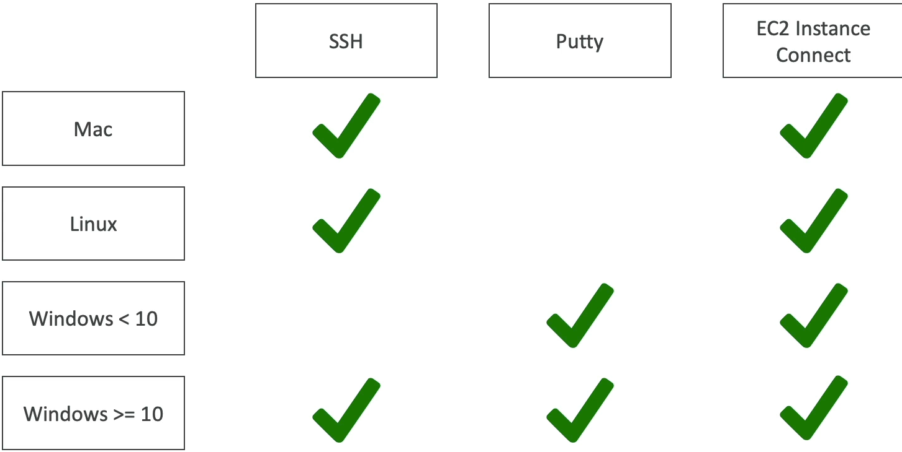

## SSH with Mac

When creating the EC2 Instance, we have created a key pair and download it (e.g. `ec2tutorial.pem`). We will need this key pair to SSH into this instance.      
```
ssh -i ec2tutorial.pem ec2-user@35.180.100.144
```
`ec2-user` is basically the Linux user in Amazon Linux machine. `35.180.100.144` is the IPv4 Public IP of the EC2 Instance.      

The above command will **fail**. This is because the first time we download the file, the permission is 0644 for the file. And this is too open for the private key, this means that the private key can leak, and it is accessable by others and it is a bad permission. The remedy is to change the file permission via:      
```
chmod 0400 ec2tutorial.pem
```
Run the SSH command again and we will be able to SSH into the EC2 instance. Once we are inside we can query the user (`whoami`) or ping a website (`ping google.com`)          

Note that in Windows 10 the `chmod` command does not exist. We will have to go to the property of the `.pem` file. We cab go to the Security tab and disable inherentence then remove all other user except yourself.        

To exit we can just press `exit` or `ctrl + d` to close the connection. (or `ctrl + c` or type `exit`)      

Note that on Windows when we use PuTTY, we need the PuTTygen to convert the key pair, which is in `.pem` to `.ppk` format so that PuTTY can use. Then after launching PuTTY and put in the public IPv4 of the EC2 Instance, we need to go to Connection -> SSH -> Auth to link the `.ppk` file.            

## EC2 Instance Connect

There is another way to connect to an EC2 Instance directly from AWS. We can click Connect in the AWS EC2 dashboard (where the list of EC2 Instance is shown). We can connect via EC2 Instance Connect after use a username. Note that this methods do not work with all type of AMIs in AWS. At the backend, it upload a temporary SSH key on your EC2 Instance for you. This methods ultimately still rely on SSH, so if we remove SSH rules from the Security Groups setting we will meet a timeout error if we use EC2 Instance Connect. So even though this method is based on browser, port 22 still needs to be opened for this method

## EC2 Instance Role Demo

After we connect to our EC2 Instance (via EC2 Connect) with our user, if we perform something like `aws iam list-users`, the CLI will prompt us to configure AWS to get our credentials. We can use `aws configure` to enter AWS Access Key ID and Secret Access Key but it is very bad practice. We can attach a Role to this instance (for example a Role with `IAMReadOnlyAccess` could allow us to run `aws iam list-users` without inputing credential again)

## EC2 Instance Launch Types

EC2 Instances purchasing options:         
1. On-Demand Instances: short workload, predictabel pricing     
Sometimes we will need to use the serve for a long time and we can get some cost saving through:        
2. Reserved(**minimum 1 year**): 3 types       
-> Reserved Instances: long workload (e.g. database)       
-> Convertible Reserved Instances: long workload with flexible instances       
-> Scheduled Reserved Instances: example, every Thurs 3-6 pm     
3. Spot Instances: short workloads, cheap, can lose instances (less reliable)      
4. Dedicated Host: book an entire physical server, control instance placement        

Exam will ask you question and expect us to find the best of EC2 for various situations for cost saving or comply with some rules.     

**EC2 On Demand**:      
We pay for what we use:       
-> Linux machine: billing per second, after the first minute         
-> All other OS: billing per hour when instance is running      
Has the *highest* cost but no upfront payment      
No long-term commitment        

Recommended for **short-term** and **un-interrupted workloads**, where you cannot predict how the application will behave.      

**EC2 Reserved Instances**:       
Up to 75% discount compared to On-Demand.        
Reservation period: 1 year = + discount | 3 years = +++ discount (ONLY 1 or 3 years, not any time in between)       
Purchasing options: no upfront | partial upfront = + discount | All upfront = ++ discount        
Reserve a specific instance type (t2.micro etc)      

Recommended for steady-state usage applications (think database)        

Convertible Reserved Instnace:      
-> can change the EC2 instance type (e.g. t2.large to c3.large)        
-> up to 54% discount      

Scheduled Reserved Instances       
-> launch within specific time window you reserve          
-> require a fraction of day / week / month      
-> still commitment over 1 to 3 years      

**EC2 Spot Instances**:       
Provides the highest discount, can get up to 90% compared to On-Demand      
Instances that you can lose at any point of time if your max price (you are willing to pay for them) is less than the current spot price (the spot price changes over time)          
The MOST cost-efficient instances in AWS       

Useful for workloads that are resilient to failure (e.g. wont lose the progress of your work if you lose that instance)       

Recommended: batch jobs, data analysis, image processing, any distributed workloads, workloads with a flexible start and end time.       
Not suitable for critical jobs or databases.          

**EC2 Dedicated Hosts**:         
An Amazon EC2 Dedicated Host is a physical server with EC2 instances capacity fully dedicated to your use. Dedicated Hosts can help you address **compliance requirements** and reduce costs by allowing you to **use your existing server-bound software licenses**.       

These hosts are going to be allocated for a 3-year period reservation.      
More expensive     

Useful for software that have complicated licensing model (BYOL - Bring Your Own License)    
Or for companies that have strong regulatory or complicance needs.        
Since AWS shares all their server with everyone, this will ensure no one is using the server except you.      

**EC2 Dedicated Instances**:      
These are for EC2 Instances running on hardware that is dedicated to you.        
May share hardware with other instances in the same account.         
No control over instance placement (hardware control). So this is more like a software-version of Dedicated Host.           
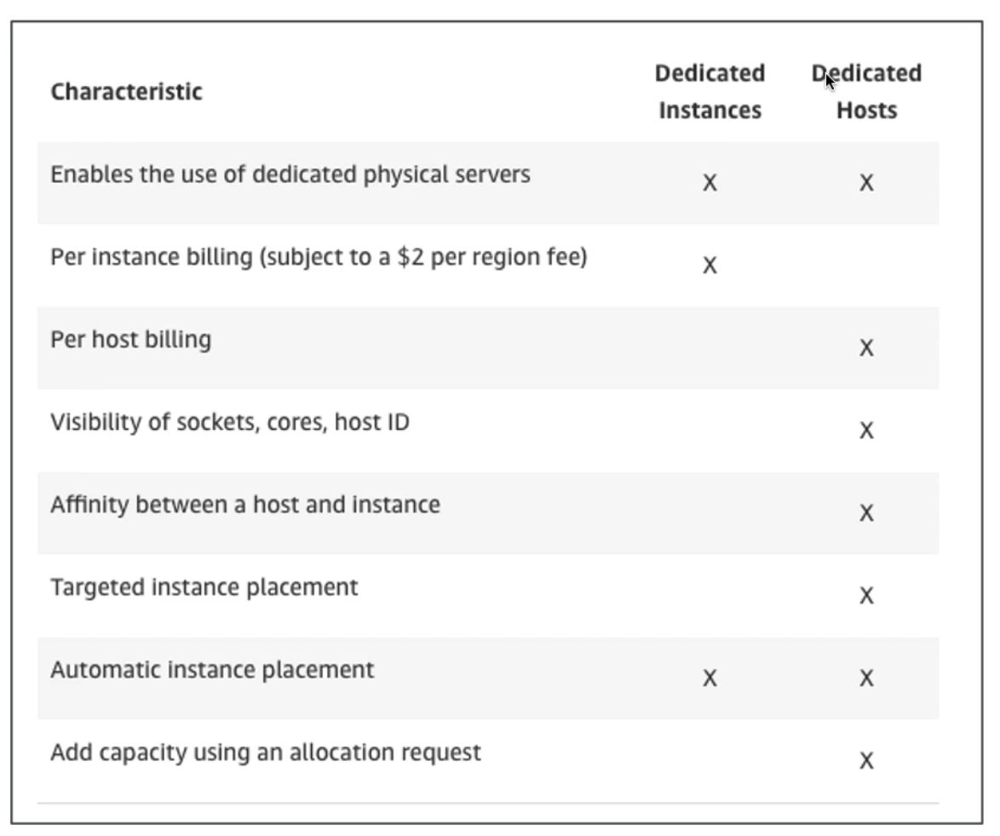      

Which purchasing option is right for me ?       
On-Demand: coming and staying in resort whenever we like, we pay full price.           
Reserved: like planning ahead and if we plan to stay for a long time, we may get a good discount.        
Spot instances: the hotel allows people to bid for the empty rooms and the highest bidder keeps the room. You can get kick out at any time.       
Dedicated: we book entire building of the resort.        

An example of cost comparison using m4.large instance:    
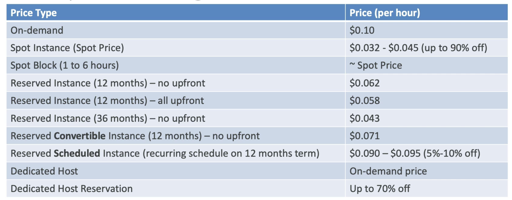   

## Shared Responsibility Model for EC2

**AWS**:              
Infrastructure (global network security): responsible for all data centers, infrastruture and the security of them      
Isolation on physical hosts: in the case of Dedicated Hosts         
Replace faulty hardware       
Compliance validation: making sure they are still compliant with the regulations that they have agreed to       

**User**:             
We are responsible for the security *in* the Cloud            
Security Groups Rules: we define the rules for allowing other people to access EC2 Instances or not           
Operating-system patches and updates: we own the entire virtual machine in the EC2 Instance, so we have to do the patches and updates ourself.          
Software and utilities installed on the EC2 Instance        
IAM Roles assigned to EC2 & IAM user access management        
Data security on your instance        

## EC2 Summary

EC2 Instance: AMI (OS) + Instance Size (CPU + RAM) + Storage + Security Groups + EC2 User Data (bootstrap script that runs when EC2 Instance first started)      

Security Groups: Firewall attached to the EC2 Instance, defines which ports and IP addresses get to access the instance.      

EC2 User Data: Script launched at the first start of an instance      

SSH: a way for us to start a terminal into our EC2 instances (to start issuing commands on port 22)             

EC2 Instance Role: link to IAM roles, to have our EC2 Instance issue commands agaist IAM             

Purchasing Options: On-Demand, Spot, Reserved (Standard + Convertible + Scheduled), Dedicated Host, Dedicated Instance

# EC2 Instance Storage

## EBS Overview

An EBS (Elastic Block Store) Volume is a *network* drive you can attach to your instances while they run.         
It allows your instances to persist data, even after their termination: we can re-create the instances and mount the same EBS Volume from before and we will get back our data.              
They can only be **mounted to one instance at a time** (at the CCP exam level)      
They are bound to **a specific availability zone** when we create an EBS Volume: you cannot have an EBS Volume created in US-East-1A and attach to an instance in US-East-1B            

Analogy: think of them as a "network USB stick"             
Free tier: 30GB of free EBS storage of type General Purpose (SSD) or Magnetic per month         

EBS Volume:            
1. network drive (i.e. not a physical drive)            
-> it uses the network to communicate the instance, which means there might be a bit of latency from one computer to reach another server                
-> can be detached from an EC2 Instance and attached to another one quickly    
2. locked to an Availability Zone (AZ)        
-> an EBS volume in us-east-1a cannot be attached to us-east-1b             
-> to move a volume across from different AZ, we need to snapshot it            
3. Have provisioned capacity (i.e. we have to provision capacity in advance): size in GBs, and IOPS (IO operations per second)           

An EBS example is given below, at CCP level, one EBS can only be attached to one EC2 Instance, but multiple EBS volume can be attached to one EC2 Instance:               
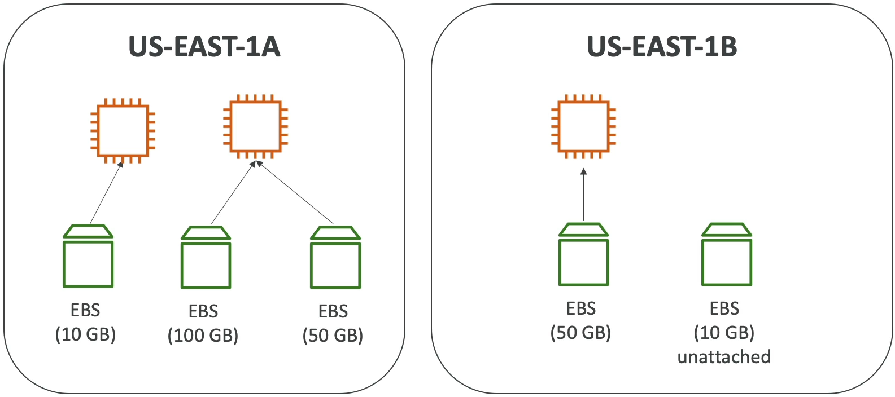   


## EBS Hands On

In the EC2 services, when we select the EC2 Instance, we can check the `Root Device` and `Block Devices`, and they both link the to same EBS Volume. When we click on them there will be an EBS ID (we can also access the EBS Volume under Elastic Block Store at the side bar).             

We can also create a stand-alone EBS volume in EC2 service. We will have to select the same Availability Zone as our instance. After creating the EBS Volume, it will appear in the `Elastic Block Store` under `Volumes`. We can then attach this volume to an instance.                 

If we terminate the EC2 Instance, the EBS Volumes which do not have "Delete on Termination" set to True will persist after the instance is terminated. By default, the root EBS Volume was created with termination in mind.       

## EBS Snapshots Overview

We can make a backup (snapshot) of our EBS volume at a point in time. We will be able to backup the state of it and even if the EBS volume is terminated later on, we can restore it from that backup.       
It is *not* necessary to detach volume to do snapshot, but *recommended*, just to make sure everything is clean on the EBS volume.      
We can also copy snapshots across Availability Zones or Region: we can transfer data in a different region to leverage on the global infrastructure of AWS.       

A simple illustration: the snapshot of the EBS volume will exist in your Region and can be used to restore into a EBS volume in another Availability Zone.                         
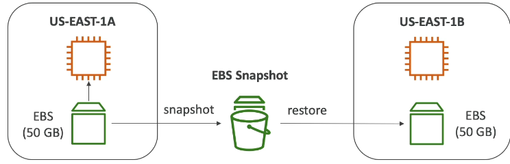           

We can create the snapshot in EC2 service and the snapshots can be seen under `Elatic Block Store` (at the side bar) under `Snapshots`.      

We can copy snapshot into a new snapshot. This new snapshot can be in *ANY* Region that we want.     

We can create an EBS volume from the snapshot, and we can create the volume in a different Availability Zones (but same Region from the original EBS volume)            

## AMI Overview

AMI = Amazon Machine Image           

They represent a customisation of an EC2 Instance       
-> add our own software, configuration, operating system, monitoring              
-> Faster boot / configuration time because all our software that we want to install is pre-packaged through AMI              

AMI are built for a **specific region**, and can be copied across Regions. 

We can launch EC2 Instances from:             
-> A Public AMI: AWS provided            
-> Your own AMI: you make and maintain them yourself            
-> An AWS Marketplace AMI: An AMI someone else made (and potentially someone sells them)               

AMI Process (from an EC2 Instance)               
-> start an EC2 instance and customize it      
-> stop the instance (for data integrity)        
-> build an AMI: this will create EBS snapshots behind the scenes              
-> finally we can launch instances from other AMIs       

Simple illustration on creating AMI and then use it to launch an EC2 instance:              
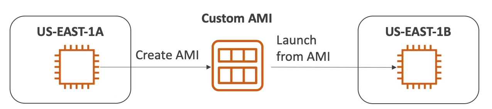                    

To create an AMI from existing EC2 Instance, we right click -> image -> create image.     

After the AMI is created, we can go to Images (at the sidebar) -> AMI, select the AMI and create an EC2 Instance. Go to `Launch Instance` and instead of selecting existing public AMI, we can choose My AMIs. We still needs to select instance type (e.g. t2.micro) but we don't need to input "User Data". This can save a lot of time (e.g. configure and install software on our other EC2 Instances).     

## EC2 Image Builder Overview

It is used to automate the creation of Virtual Machine or container images             
-> automate the creation, maintain, validate and test EC2 AMIs              

This service can be run on a schedule (weekly, whenever packages are updated etc.)                      

A simple illustration of the EC2 Image Builder process      
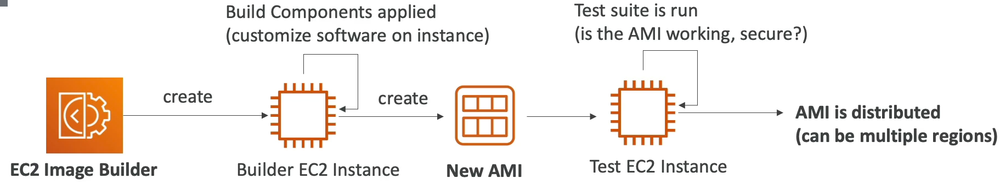       
From the EC2 Image Builder Service, it is going to create an EC2 instance called Builder EC2 Instance. And this EC2 instance is going to build components and customise software (e.g. install Java, update CLI). Once this is done, an AMI will be created out of that EC2 Instance. Then EC2 Image Builder will automatically create a test EC2 instance from that AMI and run a bunch of tests that we define in advance. Once tested, the AMI is distributed. Even though EC2 Image Builder is a regional service, it is possible to take that AMI and distribute it to multiple regions.        

This is a free service and we only pay for the underlying resources. This means that if we created an EC2 Instance in this process, we are going to pay for these instances. And when the AMI is created and distributed, we are going to pay for the storage for that AMI wherever it has been created and wherever it has been distributed.         

## EC2 Image Builder Hands On

To use the service we can go to `EC2 Image Builder` services then create Image piplines. We can specify pipeline details in step 1 (scheduled run or manual)             

In step 2 we choose recipe which defines how the source image is going to be customised. We can create the output image type as either AMI or Docker image. For source image we can either select from images created by AWS or enter a custom AMI ID. For the demo we choose Amazon Linux 2 as image OS and Amazon Linux 2 x 86 as the Image name. In the Components section, we can choose how to customise our image ? After selecting pre-build AWS components, we can arrange the order it will be installed. After which we can select which tests we want to run.        

In step 3 we define infrastructure configuration, this is optional. The setting here specify infrastructure details for the instances that will run in our AWS account. We can create a new infrastructure configuration and create an IAM role. We can create a role for EC2 instance and attach the necessary policies. We can get the policies from checking the service defaults.               

In step 4 We can set new distribution setting to distribute the image to different regions (other than the region where the AMI is created).      

After executing the pipeline, there will be a Builder Instance in the EC2 Instances followed by a Test Instance. This Test Instance is actually launched from the new AMI (built after the Builder EC2 Image). 

## EC2 Instance Store

EBS volumes are **network drives** with good but "limited" performance         
If we need a high-performance hardware disk, use EC2 Instance Store. EC2 Instance is a virtual machine but it is attached to a real hardware server and some of these servers do have disk space that is attached directly with a physical connection onto the server.      

They have better I/O performance       
EC2 Instance Store lose their storage if they are stopped (ephemeral) i.e. the EC2 Instance that has an Instance Store are stopped or terminated                
User case: Good for buffer / cache / scratch data / temporary content but NOT for long-term storage              
Risk of data loss if hardware fails -> Backups and Replication are our responsibility              

If we see very high performance hardware attached volume for EC2 Instance, think local EC2 Instance Store.

## EFS Overview

A third type of storage we can attach to an EC2 Instance: Elastic File System (EFS)            

EFS is a managed NFS (network file system) that can be mounted on **100s of EC2** at a time. Recall that EBS Volume attached to only 1 EC2 Instance at a time. So EFS makes it a shared network file system.         

EFS works only with Linux EC2 instances and works across multiple Availability Zones. i.e. EFS can be attached to instances in different AZ.        

Highly available, scalable, expensive (3x gp2 EBS Volume), pay per use, no capacity planning         

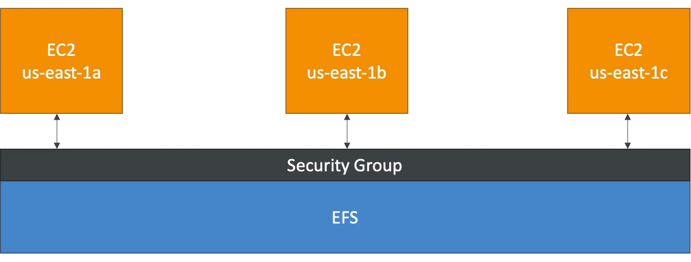      


We can move an EBS across AZ through a snapshot but it will be not be instant. EFS can be access and shared by multiple instances at the same time. i.e. all the instances can mount the same EFS drive using a mount target.       

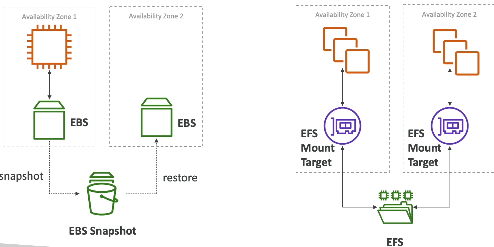     


## Shared Responsibility Model for EC2 Storage    

**AWS**:           
Infrastructure       
Replication for data for EBS Volumes & EFS drives      
Replacing faulty hardware            
Ensure their employees cannot access your data         


**Customer**:               
Setting up backup / snapshot procedures        
Setting up data encryption            
Responsibility of any data on the drives              
Understanding the risk of using EC2 Instance Store           


## EC2 Instance Storage - Summary   

EBS Volumes:              
-> network drives attached to one EC2 Instance at a time (at the CCP level)              
-> are tied or mapped to an Availability Zones             
-> can use EBS Snapshots for backups / transferring EBS  Volumes across AZ                 


AMI: create ready-to-use EC2 Instances with our customisations. We can create AMI from an EBS snapshots of an EC2 Instance.                   

EC2 Image Builder: automatically build, test and distribute AMIs.      

EC2: Instance Store:                 
-> High performance hardware disk attached to our EC2 Instance             
-> Lost if our instance is stopped / terminated               

EFS: network file system, can be attached to 100s of instances in a region     

## Section Clean up     

We can go to EC2 Dashboard to have an overview of all the resources we are using so far. (AMI we need to deregistering)


# ELB & ASG - Elastic Load Balancing & Auto Scalling Groups

## High Availability, Scalability, Elasticity     

**Scalability** means that an application / system can handle greater loads by adapting.        
There are two kinds of scalability in the Cloud:  
1. Vertical Scalability
2. Horizontal Scalability (= elasticity)         

Scalability is linked but different to High Availability.       

**Vertical Scalability**       
Vertical Scalability means increasing the size of the instance.          
For example, your application runs on t2.micro. Scaling that application *vertically* means running it on a t2.large, i.e. we change the size of our instance.         
Vertical scalability is very common for non-distributed system, such as a database. If we want to increase the performance of our database, we just increase the size of our database.           
There is usually a limit to how much you can vertically scale (hardware limit, even though the modern limits can be very very high)        

**Horizontal Scalability**            
Horizontal Scalability means increasing the number of instances / systems for your applications.         
Horizontal Scaling implies that we need to have a distributed system.      
This is very common for web applications / modern applications (usually design them with horizontal scalability in mind).       
It is easy to horizontally scale thanks to cloud offeringss such as AWS EC2.         

**High Availability**        
High Availability usually goes hand in hand with horizontal scaling           
High Availability means running your application / system in at least 2 Availability Zones on AWS        
The goal of high availability is to survive a data center loss (disaster)           

High Availability & Scalability for EC2:         
Vertical Scaling: increase instance size (= scale up / down)          
-> from: t2.nano - 0.5GB of RAM, 1 vCPU        
-> to: u-12tb1.metal - 12.3 TB of RAM, 448 vCPUs          

Horizontal Scaling: Increase number of instances (= scale out / in)        
-> Auto Scaling Group       
-> Load Balancer        

High Availability: Run instances for the same application across multi AZ           
-> Auto Scaling Group multi AZ         
-> Load Balancer multi AZ            

Scalability vs Elasticity vs Agility (Exam !)       
Scalability: ability to accomodate a larger load by making the hardware stronger (scale up), or by adding nodes (scale out)        

Elasticity: (more cloud native) once a system is scalable, elasticity means that there will be some "auto-scaling" so that the system can scale based on the load. This is "cloud-friendly": pay-per-use, match demand, optimize costs            

Agility: (not related to scalability - distractor) new IT resources are only a click away, which means that you reduce the time to make those resources available to your developers from weeks to just minites.          

## Elastic Load Balancing Overview

The first service on AWS that allows us to be more elastic and this is the Elastic Load Balancing.      

Load Balancer is a server that will forward the internet traffic down to multiple servers (EC2 Instances) downstream. They are also called the backend EC2 Instances.         

The Load Balancer will be publicly exposing for our users. There are multiple EC2 Instances behind that Load Balancer. User 1 will be talking to the Load Balancer and will be directed to one of these EC2 Instances. The EC2 Instances will reply back with something and the User 1 will get some response. This is same for User 2 and User 3.             

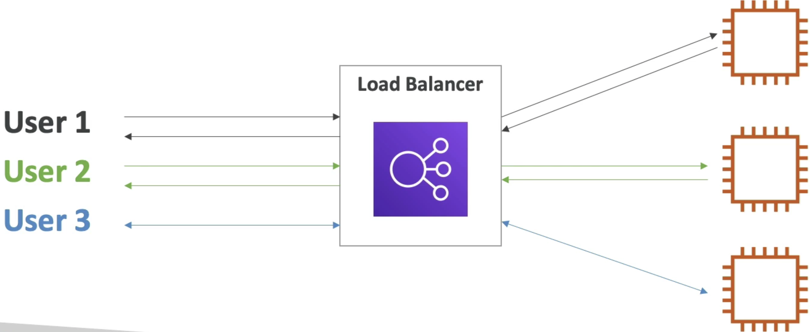           

Why use a load balancer ?         
-> Spread load across multiple downstream instances          
-> Expose a single point of access (DNS) to your application      
-> Seamlessly handle failures of downstream instances        
-> Do regular health checks to your instances (if one of the instance is failing , the load balancer will not direct traffic to that instance, i.e. hide the failure of the EC2 Instances with the load balancer)        
-> Provide SSL termination (HTTPS) for your websites         
-> High availability across zones (making our applications highly available)          

Why use an Elastic Load Balancer ?            
An ELB (Elastic Load Balancer) is a *managed load balancer*.           
-> So we don't need to be provisioning servers               
-> AWS guarantees that it will be working        
-> AWS takes care of upgrades, maintenance, high availability              
-> AWS provides only a few configuration knobs (for the behavior of the load balancer)           
It costs less to setup your own load balancer but it will be a lot more effort on your end (maintenance, integrations)      

AWS has 4 kinds of load balancers:             
-> Application Load Balancer (HTTP / HTTPS only) - Layer 7            
-> Network Load Balancer (ultra-high performance, allows for TCP, a lower level protocol) - Layer 4         
-> Classic Load Balancer (slowly retiring) - Layer 4 & 7             
-> Gateway Load Balancer (*New*, added in on Nov 10th 2020)           

## Application Load Balancer (ALB) Hands On    

Create two EC2 Instances in two availability zones and they will have two different IPv4 Public Addresses. It is tedious to access these addresses if we have multiple EC2 Instances. We can use ALB to balance the load.       

Go to `Load Balancer` at the sidebar to create a load balancer. We will register our existing EC2 Instances into a Target Group.        

## Auto Scaling Groups (ASG) Overview       

Now we have an application that can be load balanced through a load balancer. But how do we create, automatically, these servers at the backend ? We can use an Auto Scaling Group.               

In real-life, the load on your websites and application can change over time (high traffic during day time, but not during night time).     
In the cloud, we can create and get rid of servers very quickly.         
So the goal of an ASG is to:         
-> Scale out (add EC2 instances) to match an increased load           
-> Scale in (remove EC2 instances) to match a decreased load           
-> Ensure we have a minimum and maximum number of machines running            
-> Automatically register (or deregister) new instances to a load balancer           
-> Replace unhealthy instances       

Cost saving: only run at an optimal capacity (principle of the cloud)          
ASG in AWS:          
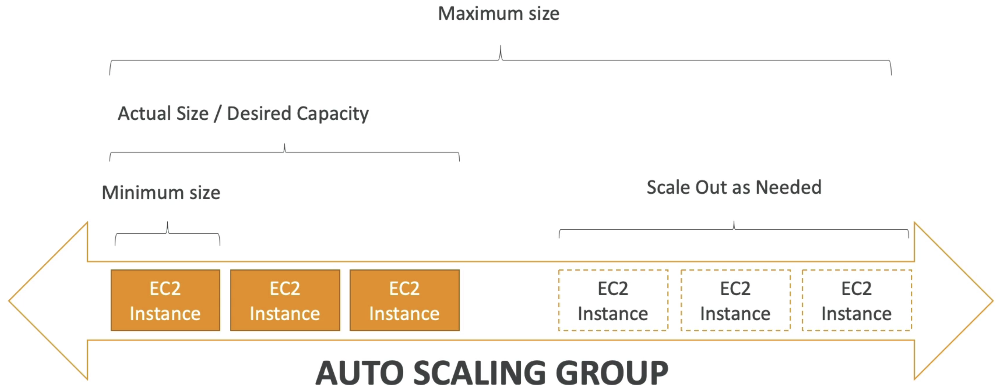           

ASG with a load balancer:       
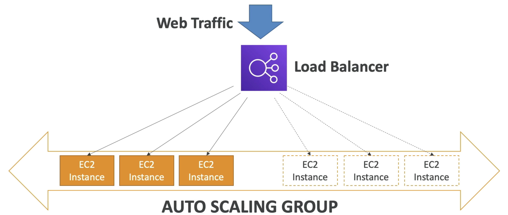           


## Auto Scaling Groups (ASG) Hands On     

We can setup the EC2 configuarations in ASG directly when creating launch template.        

Deleting ASG will automatically delete EC2 Instances that is managed by it. (Deleting EC2 Instances directly will cause ASG to replace these instances according to the desired instances specified.)       

## ELB & ASG Summary      

High Availability: applications in multiple AZ       
Scalability: vertical and horizontal        
Elasticity: ability to scale up and down base on demand            
Agility: concept in the Cloud that enable you to work faster as we can delete and create resources very quickly            

Elastic Load Balancer (ELB):           
-> Distribute traffic across backend EC2 Instances, can be multi-AZ          
-> Supports health check        
-> 3 types: Application LB (HTTP - L7), Network LB (TCP - L4), Classic LB (old)              

Auto Scaling Groups (ASG):     
-> Implement Elasticity for your application, across multiple AZ (horizontal scaling and elastic)         
-> Scale EC2 instances based on the demand on your systems, replace unhealthy instances            
-> Integrated with the ELB           


# Amazon S3   

Amazon S3 is a more cognitive storage type and is the center of many building blocks in AWS.          
It is advertised as "infinitely scaling" storage. This means that you can store as many objects as you want onto Amazon S3.           
Many website use Amazon S3 as a backbone.         
Many AWS services uses Amazon S3 as an integration as well (e.g. if we do an EBS snapshot, then that snapshot was actually stored in Amazon S3).            
The CCP exam requires "deeper" knowledge about S3.         

S3 Use Cases:           
-> Backup and storage          
-> Disaster Recovery: copy our data on Amazon S3 across different regions (high availability)           
-> Archive: archive data onto Amazon S3           
-> Hybrid Cloud Storage: extend on-premise onto Amazon S3         
-> Application hosting         
-> Media hosting         
-> Data lakes & big data analytics (directly on Amazon S3)          
-> Software delivery         
-> Static website            

Amazon S3 Overview - **Buckets**:           
Amazon S3 allows people to store objects (files) in "buckets" (directories)                  
Buckets must have a **globally unique name (across all regions all accounts, not only your accounts)**               
Buckets are defined at the region level                 
S3 looks like a global service but buckets are created in the *region*           
Naming convention:          
-> No uppercase        
-> No underscore          
-> 3-63 characters long          
-> Not an IP             
-> Must start with lowercase letter or number            

Amazon S3 Overview - **objects**:         
Objects (files) have a Key             
The Key is the FULL path to the object (e.g.):           
-> s3://my-bucket/my_file.txt (key is `my_file.txt`)              
-> s3://my-bucket/my_folder/another_folder/my_file.txt (key is `my_folder/another_folder/my_file.txt`)               
The Key is composed of prefix (`my_folder/another_folder/`) + object name (`my_file.txt`)              
There is no concept of "directories: within buckets, just keys with very long names that contains slashes.           
Object values are the content of the body:          
-> Max object size is 5TB (5000GB)        
-> If uploading more than 5GB, must use "multi-part upload"           
Metadata (list of text key / value pairs - system or user metadata)         
Tags (Unicode key / value pair - up to 10) - useful for security / lifecycle            
Version ID (if versioning is enabled)               

## S3 Hands On       

Upon uploading the object, we can select the object and go to `Object action` and open it. However direct access through the `Object URL` will not work as our bucket is not public yet so access it through web browser will be denied.       
When opening it through `Object action` it will open a special URL called a pre-signed URL and it contains my AWS credentials into the URL.      

## S3 Security: Bucket Policy      

There are different components of S3 Security:          
1. User based            
We have defined IAM users, and we will attach IAM policies - which API calls should be allowed for a specific user from IAM console.     
2. Resource based        
Bucket Policies - bucket wide rules from the S3 console attached directly to your S3 buckets - allows cross accounts (or public requests and so on)            
Object Access Control List (ACL) - finer grain           
Bucket Access Control List (ACL) - less common         

An IAM principal can access an S3 object if:          
the user IAM permissions (attached to the IAM principal so the user or the group of the role can allow access the S3 bucket) allow it OR the resource policy ALLOWs it            
AND there is no explicit DENY           
This means that if you give someone access directly through IAM, or if we give someone access through S3 objects bucket policy, then we are good to go.      

3. Encryption: encrypt objects in Amazon S3 using encryption keys       

Example 1: Public Access - Use Bucket Policy           
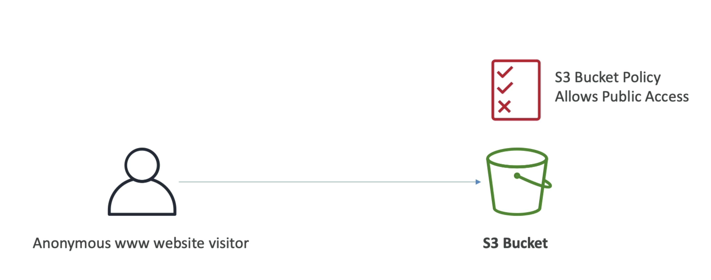         
We have to attach an S3 bucket policy to our S3 buckets, which is going to allow public access           

Example 2: User Access to S3 - IAM permissions           
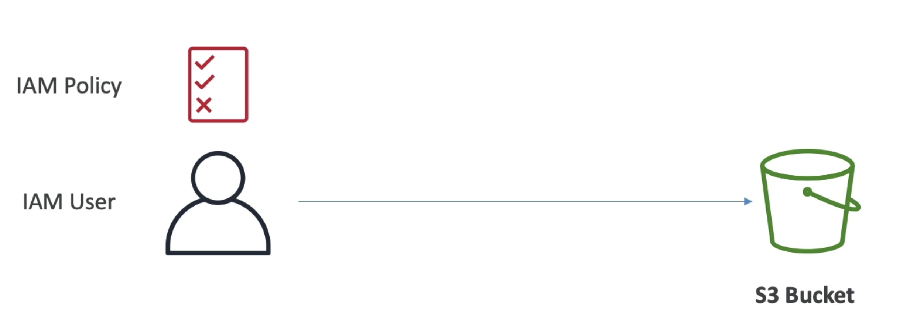          
IAM user wish to access S3 buckets. We attach an IAM policy to the user, saying the user can access the S3 buckets.           

Example 3: EC3 Instance access - use IAM Roles              
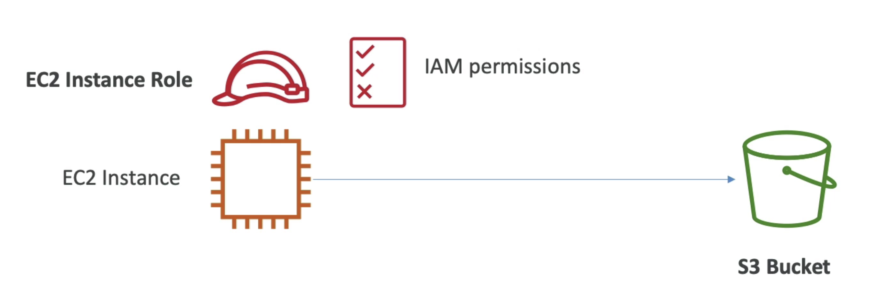           
The EC2 Instance wants to access S3 buckets. We create EC2 Instance role and attach IAM permissions to that EC2 Instance Role.         

Example 4: Cross-Account Access - Use Bucket Policy         
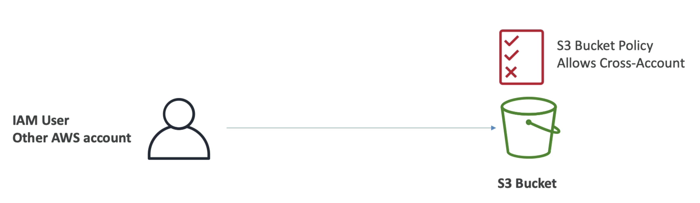          
User from another AWS account want to access S3 buckets. We create an S3 bucket policy which will allow cross account access.         

S3 Bucket Policies:        
JSON based policies (just like IAM policies)       
-> Resources: buckets and objects           
-> Actions: set of API to Allow or Deny        
-> Effect: Allow or Deny          
-> Principal: The account or user to apply the policy to      

Use S3 bucket for policy to:          
-> Grant public access to the bucket         
-> Force objects to be encrypted at upload            
-> Grant access to another account (Cross Account)             

```
{
    "Version": "2017-10-17",
    "Statement": [
        {
            "Sid": "PublicRead",
            "Effect": "Allow",
            "Principal": "*",
            "Action": [
                "s3:GetObject"
            ],
            "Resource": [
                "arn:aws:s3:::examplebucket/*:
            ]
        }
    ]
}
```

Bucket settings for Block Public Access:      
During setting up we have the `Block all public access` options (4 or 5 of them). These settings were created to prevent company data leaks.       
If you know your bucket should never be public, leave these on (by default).          
Can be set at the account level to ensure all S3 buckets within our account will never be made public.           

## S3 Security: Bucket Policy Hands On    

Using AWS Policy Generator to generate the Bucket Policy. Note that after copying the Amazon Resource Name (ARN), we need to add `/*` at the back because the Action we choose (GetObject) applies to the objects in the bucket.         

## S3 Website Overview          

One of the reason why we made our objects public is to be able to host websites onto Amazon S3.                
S3 is a great way to host static websites and have them accessible on the www.              
The website URL will be:       
-> `<bucket-name>.s3-website-<AWS-region>.amazonaws.com`            
OR (depend on region)     
-> `<bucket-name>.s3-website.<AWS-region>.amazonaws.com`         

If you get a 403 (Forbidden) error, make sure the bucket policy allows public reads.         

## S3 Website Hands On      

We will need a `index.html` at the root of the bucket to change the bucket into a website. Under bucket's property, there is a "Static website hosting" that we can use.       

## S3 Versioning Overview      

We can enable versioning for our files in Amazon S3          
It is enabled at the **bucket level**             
Same key overwrite will increment the "version": 1,2,3 ... i.e. anytime we update a file, it will get a new version.       
It is best practice to version your buckets          
-> Protect against unintended deletes (ability to restore a version)           
-> Easy roll back to previous version (e.g. something wrong with the files)         
Notes:       
Any file that is not versioned prior to enabling version will have version "null"       
Suspending versioning does not delete the previous versions            

## S3 Versioning Hands On     

After enable versioning, if we delete an object (with no prior versions, i.e. the version is "null"), it is not permenently deleted, but was added a delete marker to it. This means we can undo the delete later on.      

## S3 Server Access Logging    

For audit purpose, we may want to **log all access to S3 buckets**         
Any request made to S3, from any account, authorized or denied, will be logged into *another S3 Bucket* 
That data can be analyzed using data analysis tools        
Very helpful to come down to the root cause of an issue, or audit usage, view suspicious patterns, etc.        

## S3 Replication Overview   

We can enable replication for our extra buckets. It can be a Cross Region Replication (CRR) or Same Region Replication (SRR).        
e.g. bucket in eu-west-1 -> Asynchronous replication -> bucket in us-east-1          

Must enable versioning in source and destination         
The buckets can be in different accounts       
Copying is asynchronous      
Must give proper IAM permissions to S3 to copy the files over        

CRR - Use Case: compliance, lower latency access, replication across accounts         
SRR - Use Case: log aggregation, live replication between production and test accounts            

Note that object before we enabling replication are not replicated.      

## S3 Storage Classes Overview      

Now we have stored our files on Amazon S3 but we have different options to store our files on different storage class. These can give us cost saving.          

Amazon S3 Standard - General Purpose (so far we have been using)        
Amazon S3 Standard - Infrequent Access (IA)        
Amazon S3 Standard One Zone-Infrequent Access (only in one AZ)         
Amazon S3 Intelligent Tiering: if we don't know where to put between frequent or infrequent access           
Amazon Glacier: if you know you have backups and archives          
Amazon Glacier Deep Archive: backups and archives can take long time to retrieve         
Amazon S3 Reduced Redundancy Storage (deprecated - omitted)          

The exam will ask you, based on the situation. which of the 6 storage classes is going to be the most adaptive for your solution.         

**S3 Durability and Availability:**              
Durability: how often you will lose a file         
High durability (99.999999999% 11 9's) of objects across multiple AZ. i.e. if you store 10,000,000 objects with Amazon S3, you can on average expect to incur a loss of a single object once every 10,000 years          
Same for all storage classes          

Availability: how readily available a servce is (in this case, S3)           
S3 Standard has 99.99% availability, which means it will not be available 53 minutes a year              
Varies depending on storage class           

**S3 Standard - General Purposes**           
99.99% availability          
Used for frequently accessed data           
Low latency and high throughput       
Sustain up to 2 concurrent facility failures             
Use Cases: Big Data analytics, mobile & gaming applications, content distribution           

**S3 Standard - Infrequent Access (IA)**           
Suitable for data that is less frequently accessed, but requires rapid acccess when needed             
99.9% availability (so lower than the general purposes class)         
Lower cost compared to Amazon S3 Standard, but retrieval fee when we need to access the file           
Sustain 2 concurrent facility failures             
Use Cases: As a data store for disaster recovery, backups               

**S3 Intelligent-Tiering**              
99.9% availability           
Same low latency and high throughput performance of S3 Standard             
Cost-optimized by automatically moving objects between two access tiers based on changing access patterns:           
-> frequent access          
-> infrequent access           
Resilient against events that impact an entire AZ.                

**S3 One Zone - Infrequent Access (IA)**          
Same as IA but data is stored in a single AZ           
99.5% availability         
Low latency and high throughput performance            
Lower cost compared to S3-IA (by 20%)           
Use Cases: Storing secondary backup copies of on-premise data, or storing data you can recreate              

**Amazon Glacier & Glacier Deep Archive**          
(very) Low cost object storage (in GB/Month) meant for archiving / backup         
Data is retained for the longer term (years)       
Various retrieval options of time + fees for retrieval:             
Amazon Glacier - cheap, 3 ways to retrieve the data:            
1. Expedited (1 to 5 minutes)              
2. Standard (3 to 5 hours)          
3. Bulk (5 to 12 hours) (multiple files)             

Amazon Glacier Deep Archive - cheapest of all S3 Storage tier:        
1. Standard (12 hours)        
2. Bulk (48 hours)          

Comparison among all the S3 Storage Classes:         
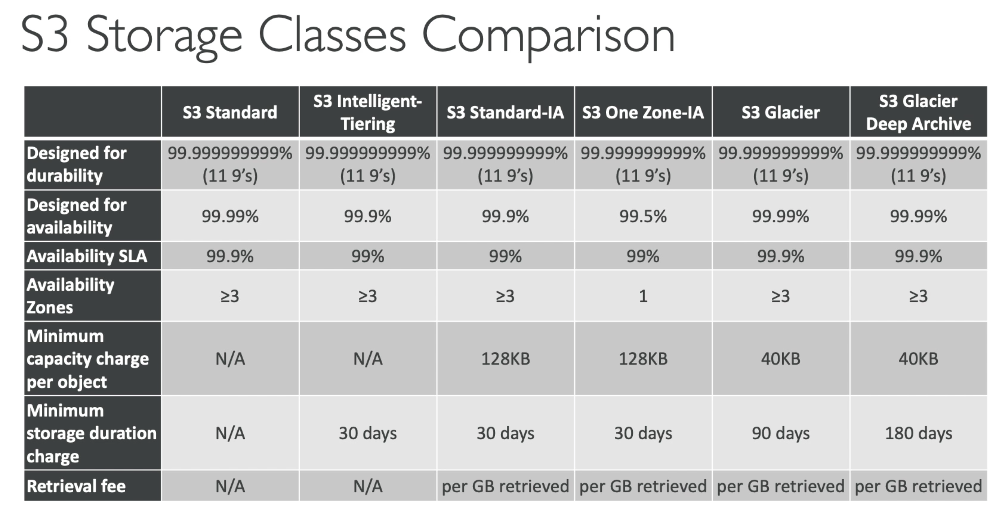            

S3 - Moving between storage classes:             
You can transition objects between storage classes (using transition rules or lifecyle rules)          
For infrequently accessed object, move them to "STANDARD_1A"           
For archive objects you don't need in real-time, GLACIER or DEEP_ARCHIVE.             

Moving objects can be automated using a **lifecycle configuration**.            
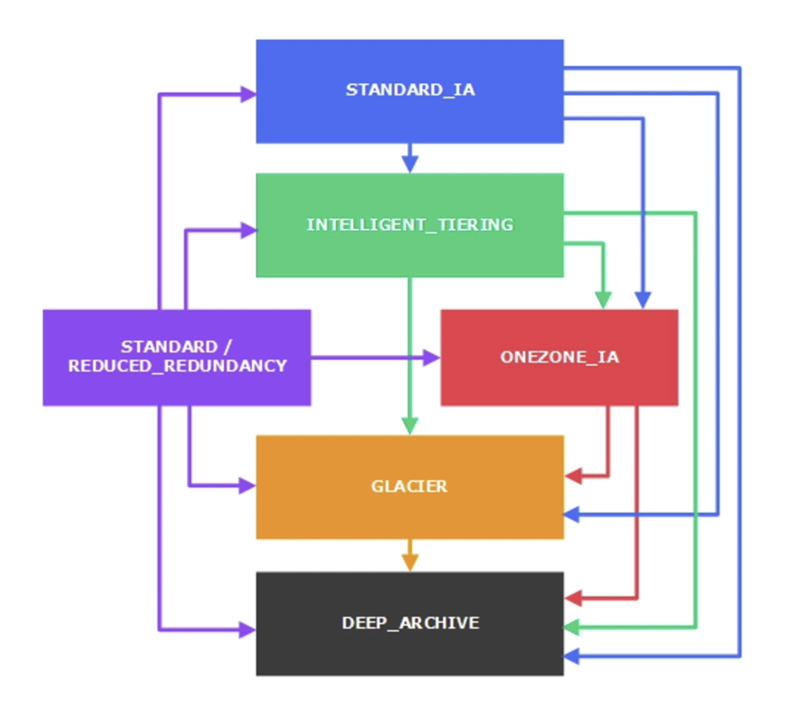        

Note that the "Lifecycle Rules" (and also "Replication Rules") are under individual bucket (under the "Management" tab)          

## S3 Glacier Vault Lock & S3 Object Lock        

S3 Object Lock:          
-> Adopt a WORM (Write Once Read Many) model. i.e. write the file once to your S3 bucket, and then block that object version to be deleted for a specific amount of time, so no one can touch it.          

Glacier Vault Lock:            
-> Adopt a WORM model          
-> Create a lock policy and that lock policy prevents future edits to that file so that it no longer can be changed. And also no one can delete that policy (even admin).           
-> Helpful for compliance and data retention (e.g. after put into the bucket, make sure noone will ever delete it and we will retrieve it in 7 years time)          

## Shared Responsibility Model for S3    

**AWS**          
Infrastructure (global security, durability, availability, sustain concurrent loss of data in two facilities)           
Configuration and vulnerability analysis           
Compliance validation            

**User**          
S3 Versioning        
S3 Bucket Policies         
S3 Replication Setup        
Logging and Monitoring         
S3 Storage Classes (optimised for cost saving)            
Data encryption at rest and in transit          

## AWS Snow Family          

Highly-secure, portable devices to **collect and porcess data at the edge**, and **migrate data into and out of AWS**.        
So 2 use cases:         
Data migration: Snowcone, Snowball Edge, Snowmobile            
Edge Computing: Snowcone, Snowball Edge          

Data Migrations with AWS Snow Family             
Large amount of data takes long time to transfer. Challenges: limited connectivity, limited bandwidth, high network cost, shared bandwidth (can't maximise the line), connection stability       
AWS Snow Family: offline devices to perform data migrations -> if it takes more than a week to transfer over the network, use Snowball devices. (AWS will send you an actual physical device and then we load your data onto it, and we send it back to AWS)         

**Snowball Edge** (for data transfer) is a huge box: move TBs or PBs of data in or out of AWS.            
Alternative to moving data over the network (and paying network fees)            
Pay per data transfer job             
Provide block strorage and Amazon S3-compatible object storage           
Two flavours:        
1. Snowball Edge Storage Optimized           
80TB of HDD capacity for block volume and S3 compatible object storage          
2. Snowball Edge Compute Optimized               
42TB of HDD capacity for block volume and S3 compatible object storage (provides powerful computing resources)           

Use cases: large data cloud migrations, DC decommission, disaster recovery             

**AWS Snowcone** is a much smaller device: small, portable computing, anywhere, rugged & secure, withstand harsh environments.           
Light and secured (2.1 kg)      
Device used for edge computing, storage and data transfer          
8TBs of usable storage           
Use Snowcone where Snowball does not fit (space-constrained environment)             
Must provide your own battery / cables         
Can be sent back to AWS offline, or connect it to internet and use **AWS DataSync** to send data.             

**AWS Snowmobile** is an actual truck: transfer exabytes of data (1EB = 1,000PB = 1,000,000 TBs)           
Each Snowmobile has 100PB of capacity (use multiple in parallel)               
High security: temperature controlled, GPS, 24/7 video surveillance             
Better than Snowball if you transfer more than 10 PB            

Summary:              
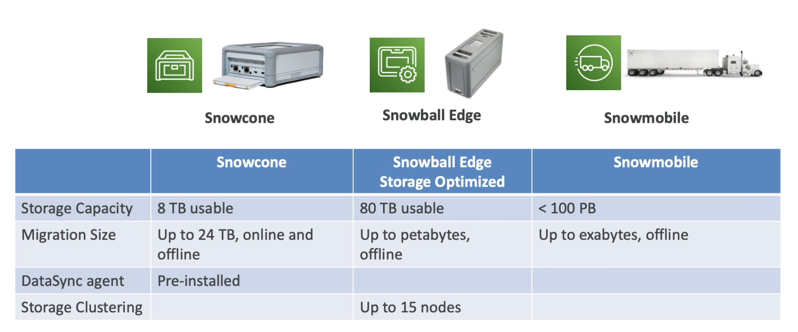                 

Snow Family - Usage Process         
1. Request Snowball devices from the AWS console for deliver          
2. Install the snowball client / AWS OpsHub on your servers                
3. Connect the snowball to your servers and copy files using the client             
4. Ship back the device when you're done (goes to the right AWS facility)           
5. Data will be loaded into an S3 bucket              
6. Snowball is completely wiped according to the highest security measures              

Data migration used to be the only use case for Snow Family, now we can do Edge Computing.       

Edge Computing means we process data while it is being created on an edge location.         
Edge location is anywhere that does not have internet. e.g. truck on the road, ship on the sea, mining station underground.            
They can produce data but may not have internet connectivity.            

These locations may have:        
limited / no internet access        
limited / no easy access to computing power          

We setup a Snowball Edge / Snowcone device to do edge computing.         
Use cases of Edge Computing:           
Preprocess data        
Machine learning at the edge            
transcoding media streams           
Eventually (if need be) we can ship back the device to AWS (for transferring data for example)          

Snow Family - Edge Computing           
1. Snowcone (smaller)              
2 CPUs, 4 GB of memory, wired or wireless access           
USB-C power using a cord or the optional battery             
2. Snowball Edge - Compute Optimized            
52 vCPUs, 208 GiB of RAM              
Optional GPU (useful for video processing or machine learning)             
42 TB usable storage           
3. Snowball Edge - Storage Optimized           
up to 40 vCPUs, 80 GiB of RAM           
Object storage clustering available          

All: can run EC2 Instances & AWS Lambda functions (using AWS  IoT Greengrass)            
Long-term deployment options: 1 and 3 years discounted pricing              

AWS OpsHub: historically, to use Snow Family devices, you needed a CLI.          
Today we can use AWS OpsHub (a software you install on your computer / laptop) to manage your Snow Family Device             
-> unlocking and configuring single or clustered devices              
-> transferring files           
-> launching and managing instances running on Snow Family Devices               
-> Monitor device metircs (storage, capacity, active instances on your devices)          
-> Launch compatible AWS services on your devices (e.g. EC2 Instances, AWS DataSync)               

## Stoage Gateway Overview         

AWS is pushing for "hybrid cloud"          
-> part of your infrastructrue is on-premises           
-> part of your instrastructure is on the cloud          

This can be due to:         
-> long cloud migrations (you have on-premises infra first and later decided to migrate to cloud)          
-> security requirements          
-> compliance requirements           
-> IT strategy           

S3 is a proprietary storage technology (unlike EFS / NFS), so how do we expose the S3 data on-premise ? Use **Storage Gateway**             

AWS Storage Cloud Native Options:             
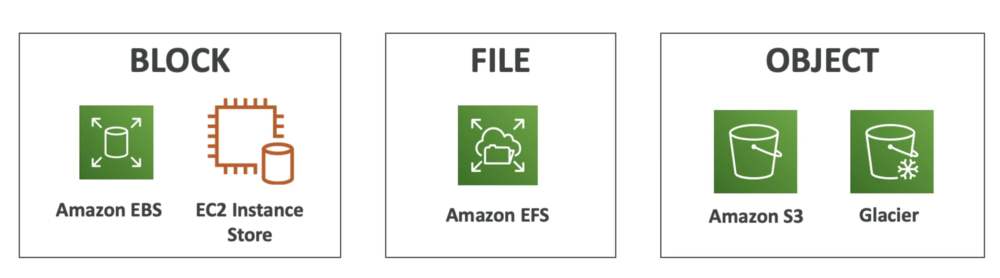         

AWS Storage Gateway will bridge between on-premise data and cloud data in S3.            
Hybrid storage service to allow on-premises to seamlessly use the AWS Cloud               

Use cases: disaster recovery, backup & restore, tiered storage            

Types of Storage Gateway:           
1. File Gateway           
2. Volume Gateway         
3. Tape Gateway      

No need to knw the types for exam, but we need to know that the Storage Gateway allows you to bridge whatever happens on-premises directly into the AWS Cloud. So under the scene, the Storage Gateway will be using Amazon EBS, S3, Glacier.          

## Amazon S3 - Summary      

Buckets vs Objects: bucket need global unique name, tied to a region             
S3 security: IAM policy, S3 Bucket Policy (public access), S3 Encryption             
S3 Websites: host a static website on Amazon S3          
S3 Versioning: multiple versions for files, prevent accidental deletes          
S3 Access Logs: log requests made within your S3 bucket           
S3 Replication: same-region or cross-region, must enable versioning           
S3 Storage Classes: Standard, IA, IZ-IZ, Intelligent, Glacier, Glacier Deep Archive               
S3 Lifecycle Rules: transition objects between classes         
S3 Glacier Vault Lock / S3 Object Lock: WORM (Write Once Read Many)               
Snow Family: import data onto S3 through a physical device, edge computing                     
Storage Gateway: hybrid solution to extend on-premises storaga to S3            


# Databases & Analytics

## Databases Introduction    

Storing data on disk (EFS, EBS, EC2 Instance Store, S3) can have its limits.         
Sometimes you want to store data in a database        
You can structure the data       
You build indexes to efficiently query / search through the data       
With EFS, EBS, EC2 Instance Store we can do per files operations, with databases, its going to be more structured           
You define **relationships between your datasets**        

Databases are *optimized for a purpose* and come with different features, shapes and constraints         
For the exam, we need to understand which database is going to fit best at the use case given to you by the question.          

**Relational Databases**:            
Looks like Excel spreadsheets, with links between them          
Can use the SQL language to perform queries / lookups          
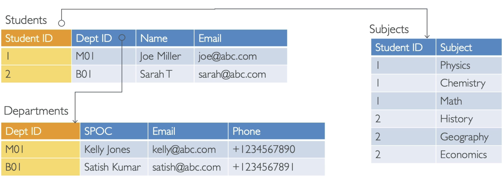              

**NoSQL Databases**:              
NoSQL = Non-SQL = non-relational databases          
NoSQL databases are newer kind and are purpose built for specific data models and have flexible schemas for building modern applications. (schema is basically the shape of the data)      
Benefits:       
Flexibility: easy to evolve data model       
Scalability: designed to scale-out (horizontal scaling) by using distributed clusters (relational database is not easy to add server to scale it, they can do vertical scaling)         
High-performance: optimized for a specific data model           
Highly functional: types optimized for the data model              
Examples: key-value, document, graph, in-memory, search databases          

NoSQL data example: JSON            
JSON - JavaScript Object Notation      
JSON is a common form of data that fits into a NoSQL model          
Data can be nested         
Fields can change over time           
Support for new types: arrays, etc.                  
```
{
    "name": "John",
    "age": 30,
    "cars" [
        "Ford",
        "BMW",
        "Fiat"
    ],
    "address": {
        "type": "house",
        "number": 23,
        "street": "Dream Road"
    }
}
```

**Databases & Shared Responsibility on AWS**:            
AWS offers use to **manage** different databases         
Benefits include:         
-> Quick Provisioning, High Availability, Vertical and Horizontal Scaling           
-> Automated Backup & Restore, Operations, Upgrades           
-> Operating System Patching is handled by AWS           
-> Monitoring, alerting          

Note: many databases technologies could be run on EC2, but you must handle yourself the resiliency, backup, patching, high availability, fault tolerance, scaling, etc.            

## RDS & Aurora Overview      

RDS = *Relational* Database Service          
It's a managed DB service for DB use SQL as a query language           
It allows you to create databases in the cloud that are managed by AWS            
-> Postgres               
-> MySQL               
-> MariaDB               
-> Oracle         
-> Microsoft SQL Server            
-> Aurora (AWS Proprietary database)           

Advantage over using RDS versus deploying DB on EC2              
RDS is a managed service:         
Automated provisioning, OS patching         
Continuous backups and restore to specific timestamp (Point in Time Restore)       
Monitoring dashboards            
Read replicas for improved read performance          
Multi AZ setup for DR (Disaster Recovery)             
Maintenance windows for upgrades       
Scaling capability (veritcal or horizontal)                  
Storage backed by EBS (gp2 or Io 1)              

But you can't SSH into your instances               

RDS Solution Architecture:             
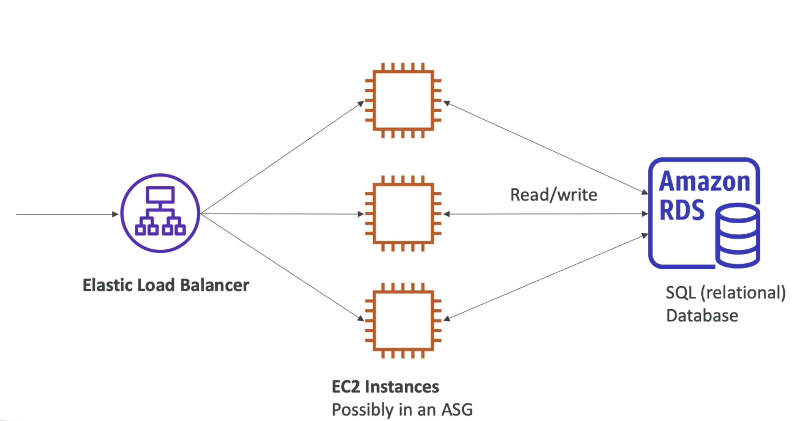          
Load balancing layer will be taking the web requests, the backend EC2 instances doing the application logic, the RDS doing reads and writes of the database.                  

**Amazon Aurora**               
Aurora is a proprietary technology from AWS (not open sourced)               
It works the same way as RDS and it supports **PostgreSQL** and **MySQL**                 
Aurora is "AWS cloud optimized" and claims 5x performance improvement over MySQL on RDS, over 3x the performance of Postgres on RDS                   
Aurora storage automatically grows in increments of 10GB, up to 64TB             
Aurora costs more than RDS (20% more), but more efficient.               
Not in the free tier (but RDS is)                 
From the exam perspective, RDS and Aurora are going to be the two ways for you to create relational database on AWS. They are both managed but Aurora is going to be more cloud native where RDS is going to be running the technologies directly as a managed service.             

## RDS Hands On            
This part is not tested in exam           
After creating the DB, we can create a snapshot of it and we can restore it into a new database, with possibly another instnace class (veritcal scaling).             
We can also copy the database into another region. We can also share this snapshot with other account or export it to S3 for later usage.          


          

 

# TO DO         
   


    