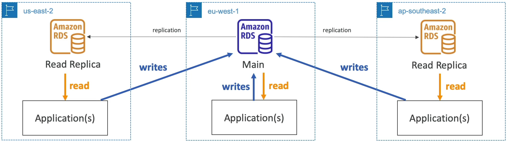
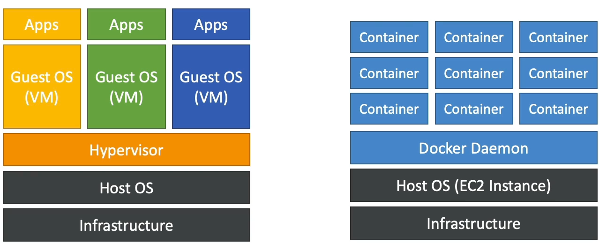
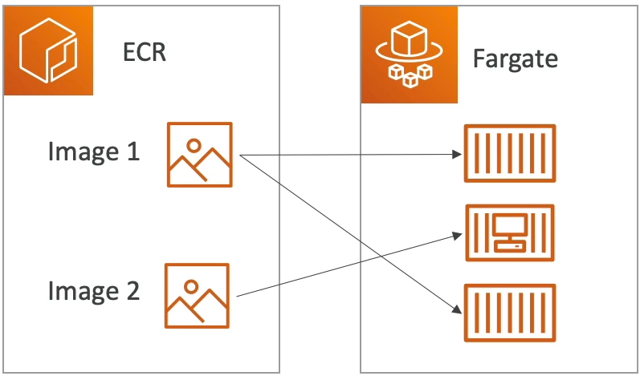

# AWS Certified Cloud Practitioner Course Notes (CLF-C01)

This note summarised the preparation course by Stephane Maarek on Udemy.

# What is Cloud Computing ?

## Traditional IT Overview 


An simple example to demonstrate how website works is that we as the Client (using web browser) want to get access to the Server to visualise a website, through a network. The data packet gets routed though the network to the Server and the Server will get back to us, so that we can view the website. Both the Client and the Server has IP address which can be used to send/receive requests. 

So what is in the Server ?     
CPU: computation and finding results.        
RAM: fast memory (storing and retrieving quickly)       
Storage: long term storage of data              
Database: for large structured data      
Network tools: routers, switch, DNS server, etc.       

So what is in the network ?       
Cables: obviously       
Router: networking device that forwards data packets between computer networks        
Switch: when the data packet arrives at the destination, the switch will send the packet to the correct Server/Client on the network.     

So in summary it looks like this: Clients send data to a router, the router will find all its way to the switch through network, and the switch will send the packet to the specific Client/Server in the network.


Traditionally,the infrastructure of building a company or website (e.g. Google) involving buy a lot of server (stored in Data Centre) to satisfy the demand (request) to your website. But there are a few problems with this approach:     

1) pay for the rent for Data Centre     
2) pay for power supply, cooling, maintenance       
3) add and replace hardware takes time      
4) scaling is limited      
5) need a 24/7 team to monitor the infrastructure      
6) natural disaster mitigations        

Let's move to cloud computing !

## What is Cloud Computing ?     

Cloud computing is the **on-demand delivery** of compute power, database storage, applications, and other IT resources. Through a cloud services platform we will **pay as we go pricing**. We can **provision exactly the right tye and size** of computing resource we need and we can get these resources **almost instantly**.     

There are different types of cloud services:       

1) Private Cloud: used by a single organisation, not exposed to the public. Having complete control and security for sensitive applications.                     
2) Public Cloud: Cloud resources owned and operated by a 3rd party cloud service provider (e.g. AWS) deliverd over the internet.         
3) Hybrid Cloud: keep some servers on premises and extend some capabilities to the Cloud. Have control over sensitive assets in our private infrastruture and having flexibility and cost-effectiveness of the public cloud.     

Five characteristics of Cloud Computing:       
1) Fully on-demand self service: use resources without human interaction from the service provider.      
2) Broad network access: resources available over the network, and can be accessed by diverse client platforms.     
3) Multi-tenancy and resource pooling: multiple customers can share the same infrastructure and applications with security and privacy. They are serviced from the same physical resources.             
4) Rapid elasticity and scalability: quickly acqure and discard resources.      
5) Measured service.          

Six advantages of Clould Computing:      
1) Trade capital expense (CAPEX) for operational expense (OPEX): pay-on-demand means no need to own hardware. Reduce Total Cost of Ownership (TCO) and OPEX.           
2) Massive economies of scale: many people are using the service, so the price is low due to AWS is more efficient when the scale is large.       
3) Stop guessing capacity: scale based on actual usage.     
4) Increase speed and agility.      
5) Stop spending money running and maintaining data centers.
6) Go global in minutes: leverage the AWS global infrastructure.         

Problem solved by the Cloud:      
1) Flexibility: change resource types when needed.      
2) Cost-Effectiveness: pay as you go      
3) Scalability: accomodate larger loads                 
4) Elasticity: scale out and scale in when needed       
5) High-availability and fault-tolerance        
6) Agility: rapidly develop, test and launch software applications   

## The Different Types of Cloud Computing     

1) Infrastructure as a Service (IaaS)       
Provide building blocks for cloud IT      
Provide networking, computers, data storage space in its raw form      
Highest level of flexibility     
Easy parallel with traditional on-premises IT      
e.g. EC2     

2) Platform as a Service (PaaS)          
Don't need to mamage infrastructure           
Just focus on the deployment and management of our applications           

3) Software as a Service (SaaS)       
Completed product that is run and managed by the service provider.      

A simple visualisation that shows how each service need to managed each components:    


Some examples:     
1) IaaS: AWS EC2, GCP, Azure      
2) PaaS: AWS Beanstalk, Heroku             
3) SaaS: AWS Rekognition for ML, Gmail, Dropbox, Zoom     

AWS Pricing of the Cloud has 3 pricing fundamentals:      
1) **Compute: Pay for compute time**     
2) **Storage: Pay for data stored in the Cloud**      
3) **Networking: Pay for data transfer OUT of the Cloud**, i.e. any data goes into the Cloud is free.       

## AWS Cloud Overview

AWS Global Infrastructure:     
1) AWS Regions      

**Regions** (orange dot in the AWS map) include locations like Singapore Beijing Sydney etc, and they are all around the world. These regions are connected through the networks. Regions can have names like us-east-1, eu-west-3, etc. A Region is a cluster of data centers. 

**Most AWS services are region-scoped**, this means that if we use one service at Region A and attempt to use the same service in Region B, it will be like a new time using the service.         

How to choose which AWS Region ?        
**Compliance** with data governance and legal requirements: data never leaves a region without explicit permission. So if the government requires data stay in the country, we should launch our application within that country.       
**Proximity** to customers: reduced latency.       
**Available services within a Region**: new services and new features might not be available in every Region.     
**Pricing**: pricing varies region to region and is transparent in the serice pricing page.       

2) AWS Availability Zones       

Each Region has many Availability Zones. (usually 3, min is 2, max is 6, they are blue dots in the AWS map).     
e.g. AWS Region: Sydney: ap-southeast-2         
we will have 3 Availability Zones: ap-southeast-2a, ap-southeast-2b, ap-southeast-2c.       

Each Availability Zones is one or more discrete data centers with redundant power, networking and connectivity. They are separated from each other so they are isolated from disasters. These Availability Zones are connected with high bandwidth, ultra-low latency networking. They are thus linked together to form the Region.          

3) AWS Data Centers         

4) AWS Edge Locations/ Points of Presence           

Amazon has 216 Points of Presence (205 Edge Locations and 11 Regional Caches) in 84 cities across 42 countries. It is helpful to deliver content to end users with lower latency.       
  
AWS has Global Services:      
Identity and Access Management (IAM)        
Route 53 (DNS service)       
CloudFront (Content Delivery Network)      
WAF (Web Application Firewall)          

**Most** AWS services are Region-scoped:       
Amazon EC2 (IaaS)     
Elastic Beanstalk (PaaS)      
Lambda (Function as a Serice)     
Rekognition (SaaS)

We can check out the AWS Region Table to see if a service is available in our Region. Or we can go to AWS Global Infrastructure (just google it) and see AWS Regional Services then we can access which services are available in which Regions. If the Region we are at does not have certain services we can switch to another Region.    

## Shared Responsibility Model & AWS Acceptable Policy    

Customer: Responsible for the security **IN** in the Cloud. This includes security, our data, our OS, our network and firewall configuration.     

AWS: Responsible for the security **OF** the Cloud. In the CCP exam, there *will* be questions about the shared responsibility. 


AWS Acceptable Use Policy      
No illgal, harmful or offensive use or content       
No security violation     
No network abuse     
No E-mail or other message abuse

# IAM - Identity and Access Management

This is a **Global** service. This is because in IAM we are going to create our users and assign them to group.    

**Root account** created by default when we create AWS account, this shouldn't be used or shared. This account is only used to setup other account.      

We should create **Users**, they are people within your organisation.     

Group can only contain users, not other groups. Some users don't have to belong to a group and some users can be in multiple groups.        

The reasons for users/groups is to give them various permissions. **Users** and **Groups** can be assigned JSON documents called *policies*.   

An example:     
```
{
    "Version": "2012-10-17",
    "Statement": [
        {
            "Effect": "Allow",
            "Action": "ec2:Describe*",
            "Resource": "*"
        },
        {
            "Effect": "Allow",
            "Action": "elasticcloadbalancing:Describe*",
            "Resource": "*"
        },
        {
            "Effect": "Allow",
            "Action": [
                "cloudwatch:ListMetrics",
                "cloudwatch:GetMetricsStatistics",
                "cloudwatch:Describe*"
            ],
            "Resource": "*"
        }
    ]
}
```

Another example for the policy: AdminstratorAccess: (Note the star means everything)             

```
{
    "Version": "2012-10-17",
    "Statement": [
        {
            "Effect": "Allow",
            "Action": "*",
            "Resource": "*"
        }
    ]
}
```

Through these policies we define the permissions of the users. In AWS, we apply **least privilege principle**: don't give more permissions than a user needs.      

For users, we can add tags, where we can mark the users and add in some attributes.   

After log in we can notice that if the user accout is something like `stephane@stephane-ccp`, this means that this account is logged in as IAM user. If the user account is just `stephane-ccp` then this is logged in with root user.      

To grant permissions to User, we can either add the user into a group (which has the group policy, so this user will inhereit this group policy) or assign a policy directly to the user. We can also create our own custom policy either use the GUI or write in JSON.      

## IAM MFA Overview

To protect the AWS account, we have 2 defense mechanisms:      

1) IAM Password Policy (helpful against brute force attack)         

Set minimum password length      
Requires specific character types: upper/lower case letters, numbers or non-alphanumeric characters.       
Allow all IAM users to change their own passwords      
Require users to change their password after some time       
Prevent password reuse                 

2) Multi Factor Authentication - MFA        

On AWS this is a must and very recommended to use it. **We want to protect Root Account and IAM users**.      
MFA = password you know + security device you own         

MFA devices options in AWS:         
1) Virtual MFA device:       
Google Authenticator: phone only   
Authy: multi-device, and supports multiple tokens on a single device.       

2) Universal 2nd Factor (U2F) Security Key:      
YubiKey by Yubico (3rd party): support for multiple root and IAM users using a single security key                

3.1) Hardware Key Fob MFA Device:    
Gemalto (3rd party)      

3.2) Hardware Key Fob MFA Device for AWS GovCloud (US):           
SurePassID (3rd party)        

## AWS CLI    

How can users access AWS ? There are 3 options:    
1) AWS Management Console (protected by password + MFA, for Root Account or other users)       
2) AWS Command Line Interface (CLI): protected by access keys      
3) AWS Software Developer Kit (SDK): this is mainly for code, also protected by access keys    

Access keys are generated through the AWS Console. Users manage their own access keys and these keys are **private**.    
Access key have 2 components: Access Key ID (username) and Secret Access Key (password).   

We have to install (OS specific) client and configure the CLI with the Access Key ID and the Secret Access Key in order to use command line to access AWS.    

## AWS CloudShell

There is an alternative to install the CLI and configure it, this is called CloudShell. At the top right corner of the AWS Console there is a `terminal` icon we can launch. This is basically CLI in the cloud with pre-installed tools, storage (1 GB per AWS region) and saved files/settings.     

We can directly run AWS command directly in the CloudShell instead on the local CLI. e.g. `aws --version` to check the version of the AWS CLI installed or `aws iam list-users` to list the IAM users.     

The credentials used by the CloudShell is the same credentials as the user we logged in to the console with, at the moment we launch the CloudShell.    

## IAM Roles for AWS Services

Some AWS services will need to perform actions on our behalf and on our account. We have to assign permissions to AWS services with IAM Roles.    

IAM Roles are just like users, but they are intended to be used *not* by physical people, but instead used by AWS Services.    

A quick example will be we created an EC2 instance (virtual server), and this EC2 instance would like to perform some action on AWS. To do so we need to give permissions to this EC2 instance. We will create an IAM Roles and together with the EC2 instance (as one entity), they can access AWS.     

Some common roles includes: EC2 Instance Roles, Lambda Function Roles, Roles for CloudFormation.      

## IAM Security Tools    

IAM Credentials Report (account level):      
We can create this report at the account level. This is a report that lists all your account's users and the status of their various credentials.    

IAM Access Advisor (user level):            
Access advisor shows the service permissions granted to a user and when those services were last used. We can use this information to revise your policies based on principle of least privilege.    

## IAM Best Practices

Do not use the Root Account except for AWS account setup      
One physical user = One AWS user       
**Assign users to groups** and assign permissions to groups (such that we manage permissions at a group level)           
Create a strong password policy       
Use and enforce the use of MFA              
Create and use Roles for giving permissions to AWS services           
Use Access Keys for Programmatic Access (CLI/SDK)      
Audit permissions of your account with the IAM Credential Reports     
Never share IAM users and Access keys     

## Shared Responsibility Model for IAM

AWS is responsible for everything they do include:      
Infrastructure (global network security)           
Configuration and vulnerability analysis            
Compliance validation          

For IAM, we are responsible for:     
User, Groups, Roles, Policies management and monitoring         
Enable MFA on all accounts          
Keys are rotated often           
Use IAM tools to apply appropriate permissions     
Analyse access patterns and review permissions          

In short, AWS is responsible for the infrastructure and we are responsible of how we use the infrastructure.           

## IAM Summary

Users: mapped to a physical user, has password for AWS Console         
Groups: contains users only (it is best to group users together)     
Policies: JSON document that outlines permissions for users or groups        
Roles: if we are within AWS, we can use roles to give permissions to AWS services to perform tasks      
Security: MFA + password policy        
Access Keys: access AWS using the CLI or SDK      
Audit: IAM Credential Reports and IAM Access Advisor          

# EC2 - Elastic Compute Cloud

*Before we start our journey in AWS services like EC2, we should set up AWS Cost budget just in case*.       

## EC2 Basics

One of the most popular AWS service and it is a Infrastructure as a Service (IaaS).       

It is comprised of many things (and capabilities) at a high level:       
-> You can rent virtual machinese on EC2 (they are called EC2 instances)     
-> You can store data in on their virual drives (they are called EBS volumes)     
-> You can distribute load across machines (Elastic Load Balancer, ELB)         
-> You can scale services using auto-scaling group (ASG)         

Knowing how EC2 works is *fundamental* to understand how Cloud works.      

EC2 sizing & configuration option: what can we choose for our instances (virtual servers) ?     

-> Operating System (OS): Linux or Windows (there is MacOS now)       
-> How much compute power & cores (CPU)       
-> How much random-access memory (RAM)            
-> How much storage space: Network-attached (EBS & EFS) or hardware-attached (EC2 Instance Store)           
-> The Network card that is attached to the EC2 instance: speed of the card, public IP address        
-> Firewall rules: **security group**              
-> Bootstrap script (configure at first launch): Configuration script needs to be run at first launch, this is called EC2 User Data           

The `t2.micro` instance is included in the AWS free-tier. It has 1 vCPU, 1 GiB Mem and EBS storage.      

## Create an EC2 Instance with EC2 User Data to have a Website (hands-on)

1. Log in AWS Console, search for EC2, go to EC2 Console    
2. Choose region (e.g. closest to you)
3. Go to `Instances` on the right panel and `Launch Instance`
4. Choose Amazon Machine Image (AMI), we can choose from Quick Start and select Amazon Linux 2 AMI (64-bit x86) which is free-tier eligible.  
5. Choose an Instance Type (e.g. t2.micro for free tier)
6. Configure Instance Details: Under `User Data` we can run a user data which is only run at the first boot of the instance. (an example script is given, which is going to launch a web server onto our EC2 instance and write a file to it)
7. Add Storage (check `Delete on Termination`)
8. Add tags
9. Configure Security Group: create a new security group and Add Rule (HTTP, port 80)
10. Review and launch (will be prompted to use a key pair (for SSH)) 
11. Create a new key-pair (public-private key) and download the key pair

We can then use the public IPv4 address to access the website. To stop the instance, we can right click the instance and `Stop Instance`. To get rid of the instance, choose `Terminate Instance`.       

Note that if we stop an instance and restart it again, the public IPv4 **is going to change**.   

## EC2 Instance Types Basics

AWS has the following naming convention (example):     
m5.2Xlarge    
m: instance class, in this case a general purpose instance      
5: generation of the instance (AWS improves them over time)         
2xlarge: size within the instance class         

**For exam we need to know this**, for various EC2 Instance Types:              
1. General Purpose        
Great for a diversity of workloads such as web servers or code repositories              
Balance between: Compute, Memory and Networking     
t2.micro is a General Purpose EC2 Instance (free tier)             

2. Compute Optimized        
Great for compute-intensive tasks that require high performance processors:      
Batch processing workloads       
Media transcoding      
High performance web server              
High performance computing (HPC)            
Scientific modeling and machine learning            
Dedicated gaming servers               
Currently all the Compute Optimized EC2 Instance start with `c`, e.g. c5 or c6.     

3. Memory Optimized
Fast performance for workloads that process large data sets in memory (RAM)       
Use cases includes:         
Floating point number calculations         
Graphic processing                
Data pattern matching        
These instances starts with `r`.             

4. Storage Optimized
Great for storage-intensive tasks that require high, sequential read and write access to large data sets on local storage     
Use cases include:        
High frequency online transaction processing (OLTP) systems    
Relational & NoSQL databases            
Cache for in-memory databases (e.g. Redis)       
Data warehousing applications                 
Distributed file systems           
These instance starts with `i`, `d` or `h1`.       

## Security Groups & Classic Ports Overview

Security Groups are the fundamental of network security in AWS.             
They control how traffic is allowed into or out of our EC2 Instances.    
Security Groups only contains *allow* rules, i.e. what is allowed to go in or go out.    
Security Groups rules can reference by IP address (i.e. where is your computer) or by Security Groups (i.e. Security Groups can reference each other).                

For example we are on our computer (i.e. public internet) and we would like to access our EC2 Instance. We will have to create a Security Group around our EC2 Instance (that is the firewall around it) and this Security Group is going to have rules that control which inbound traffic is allowed into the EC2 Instance and if the EC2 Instance can perform some Outbound traffic.      

Security Groups are acting as a "firewall" on EC2 Instance. They regulate:          
1. Access to Ports
2. Authorised IP ranges: IPv4 and IPv6 (e.g. 0.0.0.0/0 means any IP address is authorised)
3. Control of inbound network (i.e. from others to the EC2 Instance)
4. Control of outbound network (i.e. from EC2 Instance to others)

A quick example of Security Group works is shown below:           
     

For unauthorised inbound traffic, it will be a timeout error. By default for any Security Group, it will allow all outbound traffic out of the EC2 Instance. For example, if our EC2 Instance try to access a website, the Security Group is going to allow it.     

Classic Port we need to know (**EXAM**):        
1. 22 = SSH (Secure Shell) - log into a EC2 Instance on Linux
2. 21 = FTP (File Transport Protocol) - upload files into a file share
3. 22 = SFTP (Secure File Transport Protocol) - upload files using SSH
4. 80 = HTTP - access unsecured websites
5. 443 = HTTPS  - access secured websites
6. 3389 = RDP (Remote Desktop Protocol) - log into a Windows instance

The Security Groups (i.e. firewall) can be attached to multiple EC2 Instances.     

## SSH Overview


## SSH with Mac

When creating the EC2 Instance, we have created a key pair and download it (e.g. `ec2tutorial.pem`). We will need this key pair to SSH into this instance.      
```
ssh -i ec2tutorial.pem ec2-user@35.180.100.144
```
`ec2-user` is basically the Linux user in Amazon Linux machine. `35.180.100.144` is the IPv4 Public IP of the EC2 Instance.      

The above command will **fail**. This is because the first time we download the file, the permission is 0644 for the file. And this is too open for the private key, this means that the private key can leak, and it is accessable by others and it is a bad permission. The remedy is to change the file permission via:      
```
chmod 0400 ec2tutorial.pem
```
Run the SSH command again and we will be able to SSH into the EC2 instance. Once we are inside we can query the user (`whoami`) or ping a website (`ping google.com`)          

Note that in Windows 10 the `chmod` command does not exist. We will have to go to the property of the `.pem` file. We cab go to the Security tab and disable inherentence then remove all other user except yourself.        

To exit we can just press `exit` or `ctrl + d` to close the connection. (or `ctrl + c` or type `exit`)      

Note that on Windows when we use PuTTY, we need the PuTTygen to convert the key pair, which is in `.pem` to `.ppk` format so that PuTTY can use. Then after launching PuTTY and put in the public IPv4 of the EC2 Instance, we need to go to Connection -> SSH -> Auth to link the `.ppk` file.            

## EC2 Instance Connect

There is another way to connect to an EC2 Instance directly from AWS. We can click Connect in the AWS EC2 dashboard (where the list of EC2 Instance is shown). We can connect via EC2 Instance Connect after use a username. Note that this methods do not work with all type of AMIs in AWS. At the backend, it upload a temporary SSH key on your EC2 Instance for you. This methods ultimately still rely on SSH, so if we remove SSH rules from the Security Groups setting we will meet a timeout error if we use EC2 Instance Connect. So even though this method is based on browser, port 22 still needs to be opened for this method

## EC2 Instance Role Demo

After we connect to our EC2 Instance (via EC2 Connect) with our user, if we perform something like `aws iam list-users`, the CLI will prompt us to configure AWS to get our credentials. We can use `aws configure` to enter AWS Access Key ID and Secret Access Key but it is very bad practice. We can attach a Role to this instance (for example a Role with `IAMReadOnlyAccess` could allow us to run `aws iam list-users` without inputing credential again)

## EC2 Instance Launch Types

EC2 Instances purchasing options:         
1. On-Demand Instances: short workload, predictabel pricing     
Sometimes we will need to use the serve for a long time and we can get some cost saving through:        
2. Reserved(**minimum 1 year**): 3 types       
-> Reserved Instances: long workload (e.g. database)       
-> Convertible Reserved Instances: long workload with flexible instances       
-> Scheduled Reserved Instances: example, every Thurs 3-6 pm     
3. Spot Instances: short workloads, cheap, can lose instances (less reliable)      
4. Dedicated Host: book an entire physical server, control instance placement        

Exam will ask you question and expect us to find the best of EC2 for various situations for cost saving or comply with some rules.     

**EC2 On Demand**:      
We pay for what we use:       
-> Linux machine: billing per second, after the first minute         
-> All other OS: billing per hour when instance is running      
Has the *highest* cost but no upfront payment      
No long-term commitment        

Recommended for **short-term** and **un-interrupted workloads**, where you cannot predict how the application will behave.      

**EC2 Reserved Instances**:       
Up to 75% discount compared to On-Demand.        
Reservation period: 1 year = + discount | 3 years = +++ discount (ONLY 1 or 3 years, not any time in between)       
Purchasing options: no upfront | partial upfront = + discount | All upfront = ++ discount        
Reserve a specific instance type (t2.micro etc)      

Recommended for steady-state usage applications (think database)        

Convertible Reserved Instnace:      
-> can change the EC2 instance type (e.g. t2.large to c3.large)        
-> up to 54% discount      

Scheduled Reserved Instances       
-> launch within specific time window you reserve          
-> require a fraction of day / week / month      
-> still commitment over 1 to 3 years      

**EC2 Spot Instances**:       
Provides the highest discount, can get up to 90% compared to On-Demand      
Instances that you can lose at any point of time if your max price (you are willing to pay for them) is less than the current spot price (the spot price changes over time)          
The MOST cost-efficient instances in AWS       

Useful for workloads that are resilient to failure (e.g. wont lose the progress of your work if you lose that instance)       

Recommended: batch jobs, data analysis, image processing, any distributed workloads, workloads with a flexible start and end time.       
Not suitable for critical jobs or databases.          

**EC2 Dedicated Hosts**:         
An Amazon EC2 Dedicated Host is a physical server with EC2 instances capacity fully dedicated to your use. Dedicated Hosts can help you address **compliance requirements** and reduce costs by allowing you to **use your existing server-bound software licenses**.       

These hosts are going to be allocated for a 3-year period reservation.      
More expensive     

Useful for software that have complicated licensing model (BYOL - Bring Your Own License)    
Or for companies that have strong regulatory or complicance needs.        
Since AWS shares all their server with everyone, this will ensure no one is using the server except you.      

**EC2 Dedicated Instances**:      
These are for EC2 Instances running on hardware that is dedicated to you.        
May share hardware with other instances in the same account.         
No control over instance placement (hardware control). So this is more like a software-version of Dedicated Host.           
      

Which purchasing option is right for me ?       
On-Demand: coming and staying in resort whenever we like, we pay full price.           
Reserved: like planning ahead and if we plan to stay for a long time, we may get a good discount.        
Spot instances: the hotel allows people to bid for the empty rooms and the highest bidder keeps the room. You can get kick out at any time.       
Dedicated: we book entire building of the resort.        

An example of cost comparison using m4.large instance:    
   

## Shared Responsibility Model for EC2

**AWS**:              
Infrastructure (global network security): responsible for all data centers, infrastruture and the security of them      
Isolation on physical hosts: in the case of Dedicated Hosts         
Replace faulty hardware       
Compliance validation: making sure they are still compliant with the regulations that they have agreed to       

**User**:             
We are responsible for the security *in* the Cloud            
Security Groups Rules: we define the rules for allowing other people to access EC2 Instances or not           
Operating-system patches and updates: we own the entire virtual machine in the EC2 Instance, so we have to do the patches and updates ourself.          
Software and utilities installed on the EC2 Instance        
IAM Roles assigned to EC2 & IAM user access management        
Data security on your instance        

## EC2 Summary

EC2 Instance: AMI (OS) + Instance Size (CPU + RAM) + Storage + Security Groups + EC2 User Data (bootstrap script that runs when EC2 Instance first started)      

Security Groups: Firewall attached to the EC2 Instance, defines which ports and IP addresses get to access the instance.      

EC2 User Data: Script launched at the first start of an instance      

SSH: a way for us to start a terminal into our EC2 instances (to start issuing commands on port 22)             

EC2 Instance Role: link to IAM roles, to have our EC2 Instance issue commands agaist IAM             

Purchasing Options: On-Demand, Spot, Reserved (Standard + Convertible + Scheduled), Dedicated Host, Dedicated Instance

# EC2 Instance Storage

## EBS Overview

An EBS (Elastic Block Store) Volume is a *network* drive you can attach to your instances while they run.         
It allows your instances to persist data, even after their termination: we can re-create the instances and mount the same EBS Volume from before and we will get back our data.              
They can only be **mounted to one instance at a time** (at the CCP exam level)      
They are bound to **a specific availability zone** when we create an EBS Volume: you cannot have an EBS Volume created in US-East-1A and attach to an instance in US-East-1B            

Analogy: think of them as a "network USB stick"             
Free tier: 30GB of free EBS storage of type General Purpose (SSD) or Magnetic per month         

EBS Volume:            
1. network drive (i.e. not a physical drive)            
-> it uses the network to communicate the instance, which means there might be a bit of latency from one computer to reach another server                
-> can be detached from an EC2 Instance and attached to another one quickly    
2. locked to an Availability Zone (AZ)        
-> an EBS volume in us-east-1a cannot be attached to us-east-1b             
-> to move a volume across from different AZ, we need to snapshot it            
3. Have provisioned capacity (i.e. we have to provision capacity in advance): size in GBs, and IOPS (IO operations per second)           

An EBS example is given below, at CCP level, one EBS can only be attached to one EC2 Instance, but multiple EBS volume can be attached to one EC2 Instance:               
   


## EBS Hands On

In the EC2 services, when we select the EC2 Instance, we can check the `Root Device` and `Block Devices`, and they both link the to same EBS Volume. When we click on them there will be an EBS ID (we can also access the EBS Volume under Elastic Block Store at the side bar).             

We can also create a stand-alone EBS volume in EC2 service. We will have to select the same Availability Zone as our instance. After creating the EBS Volume, it will appear in the `Elastic Block Store` under `Volumes`. We can then attach this volume to an instance.                 

If we terminate the EC2 Instance, the EBS Volumes which do not have "Delete on Termination" set to True will persist after the instance is terminated. By default, the root EBS Volume was created with termination in mind.       

## EBS Snapshots Overview

We can make a backup (snapshot) of our EBS volume at a point in time. We will be able to backup the state of it and even if the EBS volume is terminated later on, we can restore it from that backup.       
It is *not* necessary to detach volume to do snapshot, but *recommended*, just to make sure everything is clean on the EBS volume.      
We can also copy snapshots across Availability Zones or Region: we can transfer data in a different region to leverage on the global infrastructure of AWS.       

A simple illustration: the snapshot of the EBS volume will exist in your Region and can be used to restore into a EBS volume in another Availability Zone.                         
           

We can create the snapshot in EC2 service and the snapshots can be seen under `Elatic Block Store` (at the side bar) under `Snapshots`.      

We can copy snapshot into a new snapshot. This new snapshot can be in *ANY* Region that we want.     

We can create an EBS volume from the snapshot, and we can create the volume in a different Availability Zones (but same Region from the original EBS volume)            

## AMI Overview

AMI = Amazon Machine Image           

They represent a customisation of an EC2 Instance       
-> add our own software, configuration, operating system, monitoring              
-> Faster boot / configuration time because all our software that we want to install is pre-packaged through AMI              

AMI are built for a **specific region**, and can be copied across Regions. 

We can launch EC2 Instances from:             
-> A Public AMI: AWS provided            
-> Your own AMI: you make and maintain them yourself            
-> An AWS Marketplace AMI: An AMI someone else made (and potentially someone sells them)               

AMI Process (from an EC2 Instance)               
-> start an EC2 instance and customize it      
-> stop the instance (for data integrity)        
-> build an AMI: this will create EBS snapshots behind the scenes              
-> finally we can launch instances from other AMIs       

Simple illustration on creating AMI and then use it to launch an EC2 instance:              
                    

To create an AMI from existing EC2 Instance, we right click -> image -> create image.     

After the AMI is created, we can go to Images (at the sidebar) -> AMI, select the AMI and create an EC2 Instance. Go to `Launch Instance` and instead of selecting existing public AMI, we can choose My AMIs. We still needs to select instance type (e.g. t2.micro) but we don't need to input "User Data". This can save a lot of time (e.g. configure and install software on our other EC2 Instances).     

## EC2 Image Builder Overview

It is used to automate the creation of Virtual Machine or container images             
-> automate the creation, maintain, validate and test EC2 AMIs              

This service can be run on a schedule (weekly, whenever packages are updated etc.)                      

A simple illustration of the EC2 Image Builder process      
       
From the EC2 Image Builder Service, it is going to create an EC2 instance called Builder EC2 Instance. And this EC2 instance is going to build components and customise software (e.g. install Java, update CLI). Once this is done, an AMI will be created out of that EC2 Instance. Then EC2 Image Builder will automatically create a test EC2 instance from that AMI and run a bunch of tests that we define in advance. Once tested, the AMI is distributed. Even though EC2 Image Builder is a regional service, it is possible to take that AMI and distribute it to multiple regions.        

This is a free service and we only pay for the underlying resources. This means that if we created an EC2 Instance in this process, we are going to pay for these instances. And when the AMI is created and distributed, we are going to pay for the storage for that AMI wherever it has been created and wherever it has been distributed.         

## EC2 Image Builder Hands On

To use the service we can go to `EC2 Image Builder` services then create Image piplines. We can specify pipeline details in step 1 (scheduled run or manual)             

In step 2 we choose recipe which defines how the source image is going to be customised. We can create the output image type as either AMI or Docker image. For source image we can either select from images created by AWS or enter a custom AMI ID. For the demo we choose Amazon Linux 2 as image OS and Amazon Linux 2 x 86 as the Image name. In the Components section, we can choose how to customise our image ? After selecting pre-build AWS components, we can arrange the order it will be installed. After which we can select which tests we want to run.        

In step 3 we define infrastructure configuration, this is optional. The setting here specify infrastructure details for the instances that will run in our AWS account. We can create a new infrastructure configuration and create an IAM role. We can create a role for EC2 instance and attach the necessary policies. We can get the policies from checking the service defaults.               

In step 4 We can set new distribution setting to distribute the image to different regions (other than the region where the AMI is created).      

After executing the pipeline, there will be a Builder Instance in the EC2 Instances followed by a Test Instance. This Test Instance is actually launched from the new AMI (built after the Builder EC2 Image). 

## EC2 Instance Store

EBS volumes are **network drives** with good but "limited" performance         
If we need a high-performance hardware disk, use EC2 Instance Store. EC2 Instance is a virtual machine but it is attached to a real hardware server and some of these servers do have disk space that is attached directly with a physical connection onto the server.      

They have better I/O performance       
EC2 Instance Store lose their storage if they are stopped (ephemeral) i.e. the EC2 Instance that has an Instance Store are stopped or terminated                
User case: Good for buffer / cache / scratch data / temporary content but NOT for long-term storage              
Risk of data loss if hardware fails -> Backups and Replication are our responsibility              

If we see very high performance hardware attached volume for EC2 Instance, think local EC2 Instance Store.

## EFS Overview

A third type of storage we can attach to an EC2 Instance: Elastic File System (EFS)            

EFS is a managed NFS (network file system) that can be mounted on **100s of EC2** at a time. Recall that EBS Volume attached to only 1 EC2 Instance at a time. So EFS makes it a shared network file system.         

EFS works only with Linux EC2 instances and works across multiple Availability Zones. i.e. EFS can be attached to instances in different AZ.        

Highly available, scalable, expensive (3x gp2 EBS Volume), pay per use, no capacity planning         

      


We can move an EBS across AZ through a snapshot but it will be not be instant. EFS can be access and shared by multiple instances at the same time. i.e. all the instances can mount the same EFS drive using a mount target.       

     


## Shared Responsibility Model for EC2 Storage    

**AWS**:           
Infrastructure       
Replication for data for EBS Volumes & EFS drives      
Replacing faulty hardware            
Ensure their employees cannot access your data         


**Customer**:               
Setting up backup / snapshot procedures        
Setting up data encryption            
Responsibility of any data on the drives              
Understanding the risk of using EC2 Instance Store           


## EC2 Instance Storage - Summary   

EBS Volumes:              
-> network drives attached to one EC2 Instance at a time (at the CCP level)              
-> are tied or mapped to an Availability Zones             
-> can use EBS Snapshots for backups / transferring EBS  Volumes across AZ                 


AMI: create ready-to-use EC2 Instances with our customisations. We can create AMI from an EBS snapshots of an EC2 Instance.                   

EC2 Image Builder: automatically build, test and distribute AMIs.      

EC2: Instance Store:                 
-> High performance hardware disk attached to our EC2 Instance             
-> Lost if our instance is stopped / terminated               

EFS: network file system, can be attached to 100s of instances in a region     

## Section Clean up     

We can go to EC2 Dashboard to have an overview of all the resources we are using so far. (AMI we need to deregistering)


# ELB & ASG - Elastic Load Balancing & Auto Scalling Groups

## High Availability, Scalability, Elasticity     

**Scalability** means that an application / system can handle greater loads by adapting.        
There are two kinds of scalability in the Cloud:  
1. Vertical Scalability
2. Horizontal Scalability (= elasticity)         

Scalability is linked but different to High Availability.       

**Vertical Scalability**       
Vertical Scalability means increasing the size of the instance.          
For example, your application runs on t2.micro. Scaling that application *vertically* means running it on a t2.large, i.e. we change the size of our instance.         
Vertical scalability is very common for non-distributed system, such as a database. If we want to increase the performance of our database, we just increase the size of our database.           
There is usually a limit to how much you can vertically scale (hardware limit, even though the modern limits can be very very high)        

**Horizontal Scalability**            
Horizontal Scalability means increasing the number of instances / systems for your applications.         
Horizontal Scaling implies that we need to have a distributed system.      
This is very common for web applications / modern applications (usually design them with horizontal scalability in mind).       
It is easy to horizontally scale thanks to cloud offeringss such as AWS EC2.         

**High Availability**        
High Availability usually goes hand in hand with horizontal scaling           
High Availability means running your application / system in at least 2 Availability Zones on AWS        
The goal of high availability is to survive a data center loss (disaster)           

High Availability & Scalability for EC2:         
Vertical Scaling: increase instance size (= scale up / down)          
-> from: t2.nano - 0.5GB of RAM, 1 vCPU        
-> to: u-12tb1.metal - 12.3 TB of RAM, 448 vCPUs          

Horizontal Scaling: Increase number of instances (= scale out / in)        
-> Auto Scaling Group       
-> Load Balancer        

High Availability: Run instances for the same application across multi AZ           
-> Auto Scaling Group multi AZ         
-> Load Balancer multi AZ            

Scalability vs Elasticity vs Agility (Exam !)       
Scalability: ability to accomodate a larger load by making the hardware stronger (scale up), or by adding nodes (scale out)        

Elasticity: (more cloud native) once a system is scalable, elasticity means that there will be some "auto-scaling" so that the system can scale based on the load. This is "cloud-friendly": pay-per-use, match demand, optimize costs            

Agility: (not related to scalability - distractor) new IT resources are only a click away, which means that you reduce the time to make those resources available to your developers from weeks to just minites.          

## Elastic Load Balancing Overview

The first service on AWS that allows us to be more elastic and this is the Elastic Load Balancing.      

Load Balancer is a server that will forward the internet traffic down to multiple servers (EC2 Instances) downstream. They are also called the backend EC2 Instances.         

The Load Balancer will be publicly exposing for our users. There are multiple EC2 Instances behind that Load Balancer. User 1 will be talking to the Load Balancer and will be directed to one of these EC2 Instances. The EC2 Instances will reply back with something and the User 1 will get some response. This is same for User 2 and User 3.             

           

Why use a load balancer ?         
-> Spread load across multiple downstream instances          
-> Expose a single point of access (DNS) to your application      
-> Seamlessly handle failures of downstream instances        
-> Do regular health checks to your instances (if one of the instance is failing , the load balancer will not direct traffic to that instance, i.e. hide the failure of the EC2 Instances with the load balancer)        
-> Provide SSL termination (HTTPS) for your websites         
-> High availability across zones (making our applications highly available)          

Why use an Elastic Load Balancer ?            
An ELB (Elastic Load Balancer) is a *managed load balancer*.           
-> So we don't need to be provisioning servers               
-> AWS guarantees that it will be working        
-> AWS takes care of upgrades, maintenance, high availability              
-> AWS provides only a few configuration knobs (for the behavior of the load balancer)           
It costs less to setup your own load balancer but it will be a lot more effort on your end (maintenance, integrations)      

AWS has 4 kinds of load balancers:             
-> Application Load Balancer (HTTP / HTTPS only) - Layer 7            
-> Network Load Balancer (ultra-high performance, allows for TCP, a lower level protocol) - Layer 4         
-> Classic Load Balancer (slowly retiring) - Layer 4 & 7             
-> Gateway Load Balancer (*New*, added in on Nov 10th 2020)           

## Application Load Balancer (ALB) Hands On    

Create two EC2 Instances in two availability zones and they will have two different IPv4 Public Addresses. It is tedious to access these addresses if we have multiple EC2 Instances. We can use ALB to balance the load.       

Go to `Load Balancer` at the sidebar to create a load balancer. We will register our existing EC2 Instances into a Target Group.        

## Auto Scaling Groups (ASG) Overview       

Now we have an application that can be load balanced through a load balancer. But how do we create, automatically, these servers at the backend ? We can use an Auto Scaling Group.               

In real-life, the load on your websites and application can change over time (high traffic during day time, but not during night time).     
In the cloud, we can create and get rid of servers very quickly.         
So the goal of an ASG is to:         
-> Scale out (add EC2 instances) to match an increased load           
-> Scale in (remove EC2 instances) to match a decreased load           
-> Ensure we have a minimum and maximum number of machines running            
-> Automatically register (or deregister) new instances to a load balancer           
-> Replace unhealthy instances       

Cost saving: only run at an optimal capacity (principle of the cloud)          
ASG in AWS:          
           

ASG with a load balancer:       
           


## Auto Scaling Groups (ASG) Hands On     

We can setup the EC2 configuarations in ASG directly when creating launch template.        

Deleting ASG will automatically delete EC2 Instances that is managed by it. (Deleting EC2 Instances directly will cause ASG to replace these instances according to the desired instances specified.)       

## ELB & ASG Summary      

High Availability: applications in multiple AZ       
Scalability: vertical and horizontal        
Elasticity: ability to scale up and down base on demand            
Agility: concept in the Cloud that enable you to work faster as we can delete and create resources very quickly            

Elastic Load Balancer (ELB):           
-> Distribute traffic across backend EC2 Instances, can be multi-AZ          
-> Supports health check        
-> 3 types: Application LB (HTTP - L7), Network LB (TCP - L4), Classic LB (old)              

Auto Scaling Groups (ASG):     
-> Implement Elasticity for your application, across multiple AZ (horizontal scaling and elastic)         
-> Scale EC2 instances based on the demand on your systems, replace unhealthy instances            
-> Integrated with the ELB           


# Amazon S3   

Amazon S3 is a more cognitive storage type and is the center of many building blocks in AWS.          
It is advertised as "infinitely scaling" storage. This means that you can store as many objects as you want onto Amazon S3.           
Many website use Amazon S3 as a backbone.         
Many AWS services uses Amazon S3 as an integration as well (e.g. if we do an EBS snapshot, then that snapshot was actually stored in Amazon S3).            
The CCP exam requires "deeper" knowledge about S3.         

S3 Use Cases:           
-> Backup and storage          
-> Disaster Recovery: copy our data on Amazon S3 across different regions (high availability)           
-> Archive: archive data onto Amazon S3           
-> Hybrid Cloud Storage: extend on-premise onto Amazon S3         
-> Application hosting         
-> Media hosting         
-> Data lakes & big data analytics (directly on Amazon S3)          
-> Software delivery         
-> Static website            

Amazon S3 Overview - **Buckets**:           
Amazon S3 allows people to store objects (files) in "buckets" (directories)                  
Buckets must have a **globally unique name (across all regions all accounts, not only your accounts)**               
Buckets are defined at the region level                 
S3 looks like a global service but buckets are created in the *region*           
Naming convention:          
-> No uppercase        
-> No underscore          
-> 3-63 characters long          
-> Not an IP             
-> Must start with lowercase letter or number            

Amazon S3 Overview - **objects**:         
Objects (files) have a Key             
The Key is the FULL path to the object (e.g.):           
-> s3://my-bucket/my_file.txt (key is `my_file.txt`)              
-> s3://my-bucket/my_folder/another_folder/my_file.txt (key is `my_folder/another_folder/my_file.txt`)               
The Key is composed of prefix (`my_folder/another_folder/`) + object name (`my_file.txt`)              
There is no concept of "directories: within buckets, just keys with very long names that contains slashes.           
Object values are the content of the body:          
-> Max object size is 5TB (5000GB)        
-> If uploading more than 5GB, must use "multi-part upload"           
Metadata (list of text key / value pairs - system or user metadata)         
Tags (Unicode key / value pair - up to 10) - useful for security / lifecycle            
Version ID (if versioning is enabled)               

## S3 Hands On       

Upon uploading the object, we can select the object and go to `Object action` and open it. However direct access through the `Object URL` will not work as our bucket is not public yet so access it through web browser will be denied.       
When opening it through `Object action` it will open a special URL called a pre-signed URL and it contains my AWS credentials into the URL.      

## S3 Security: Bucket Policy      

There are different components of S3 Security:          
1. User based            
We have defined IAM users, and we will attach IAM policies - which API calls should be allowed for a specific user from IAM console.     
2. Resource based        
Bucket Policies - bucket wide rules from the S3 console attached directly to your S3 buckets - allows cross accounts (or public requests and so on)            
Object Access Control List (ACL) - finer grain           
Bucket Access Control List (ACL) - less common         

An IAM principal can access an S3 object if:          
the user IAM permissions (attached to the IAM principal so the user or the group of the role can allow access the S3 bucket) allow it OR the resource policy ALLOWs it            
AND there is no explicit DENY           
This means that if you give someone access directly through IAM, or if we give someone access through S3 objects bucket policy, then we are good to go.      

3. Encryption: encrypt objects in Amazon S3 using encryption keys       

Example 1: Public Access - Use Bucket Policy           
         
We have to attach an S3 bucket policy to our S3 buckets, which is going to allow public access           

Example 2: User Access to S3 - IAM permissions           
          
IAM user wish to access S3 buckets. We attach an IAM policy to the user, saying the user can access the S3 buckets.           

Example 3: EC3 Instance access - use IAM Roles              
           
The EC2 Instance wants to access S3 buckets. We create EC2 Instance role and attach IAM permissions to that EC2 Instance Role.         

Example 4: Cross-Account Access - Use Bucket Policy         
          
User from another AWS account want to access S3 buckets. We create an S3 bucket policy which will allow cross account access.         

S3 Bucket Policies:        
JSON based policies (just like IAM policies)       
-> Resources: buckets and objects           
-> Actions: set of API to Allow or Deny        
-> Effect: Allow or Deny          
-> Principal: The account or user to apply the policy to      

Use S3 bucket for policy to:          
-> Grant public access to the bucket         
-> Force objects to be encrypted at upload            
-> Grant access to another account (Cross Account)             

```
{
    "Version": "2017-10-17",
    "Statement": [
        {
            "Sid": "PublicRead",
            "Effect": "Allow",
            "Principal": "*",
            "Action": [
                "s3:GetObject"
            ],
            "Resource": [
                "arn:aws:s3:::examplebucket/*:
            ]
        }
    ]
}
```

Bucket settings for Block Public Access:      
During setting up we have the `Block all public access` options (4 or 5 of them). These settings were created to prevent company data leaks.       
If you know your bucket should never be public, leave these on (by default).          
Can be set at the account level to ensure all S3 buckets within our account will never be made public.           

## S3 Security: Bucket Policy Hands On    

Using AWS Policy Generator to generate the Bucket Policy. Note that after copying the Amazon Resource Name (ARN), we need to add `/*` at the back because the Action we choose (GetObject) applies to the objects in the bucket.         

## S3 Website Overview          

One of the reason why we made our objects public is to be able to host websites onto Amazon S3.                
S3 is a great way to host static websites and have them accessible on the www.              
The website URL will be:       
-> `<bucket-name>.s3-website-<AWS-region>.amazonaws.com`            
OR (depend on region)     
-> `<bucket-name>.s3-website.<AWS-region>.amazonaws.com`         

If you get a 403 (Forbidden) error, make sure the bucket policy allows public reads.         

## S3 Website Hands On      

We will need a `index.html` at the root of the bucket to change the bucket into a website. Under bucket's property, there is a "Static website hosting" that we can use.       

## S3 Versioning Overview      

We can enable versioning for our files in Amazon S3          
It is enabled at the **bucket level**             
Same key overwrite will increment the "version": 1,2,3 ... i.e. anytime we update a file, it will get a new version.       
It is best practice to version your buckets          
-> Protect against unintended deletes (ability to restore a version)           
-> Easy roll back to previous version (e.g. something wrong with the files)         
Notes:       
Any file that is not versioned prior to enabling version will have version "null"       
Suspending versioning does not delete the previous versions            

## S3 Versioning Hands On     

After enable versioning, if we delete an object (with no prior versions, i.e. the version is "null"), it is not permenently deleted, but was added a delete marker to it. This means we can undo the delete later on.      

## S3 Server Access Logging    

For audit purpose, we may want to **log all access to S3 buckets**         
Any request made to S3, from any account, authorized or denied, will be logged into *another S3 Bucket* 
That data can be analyzed using data analysis tools        
Very helpful to come down to the root cause of an issue, or audit usage, view suspicious patterns, etc.        

## S3 Replication Overview   

We can enable replication for our extra buckets. It can be a Cross Region Replication (CRR) or Same Region Replication (SRR).        
e.g. bucket in eu-west-1 -> Asynchronous replication -> bucket in us-east-1          

Must enable versioning in source and destination         
The buckets can be in different accounts       
Copying is asynchronous      
Must give proper IAM permissions to S3 to copy the files over        

CRR - Use Case: compliance, lower latency access, replication across accounts         
SRR - Use Case: log aggregation, live replication between production and test accounts            

Note that object before we enabling replication are not replicated.      

## S3 Storage Classes Overview      

Now we have stored our files on Amazon S3 but we have different options to store our files on different storage class. These can give us cost saving.          

Amazon S3 Standard - General Purpose (so far we have been using)        
Amazon S3 Standard - Infrequent Access (IA)        
Amazon S3 Standard One Zone-Infrequent Access (only in one AZ)         
Amazon S3 Intelligent Tiering: if we don't know where to put between frequent or infrequent access           
Amazon Glacier: if you know you have backups and archives          
Amazon Glacier Deep Archive: backups and archives can take long time to retrieve         
Amazon S3 Reduced Redundancy Storage (deprecated - omitted)          

The exam will ask you, based on the situation. which of the 6 storage classes is going to be the most adaptive for your solution.         

**S3 Durability and Availability:**              
Durability: how often you will lose a file         
High durability (99.999999999% 11 9's) of objects across multiple AZ. i.e. if you store 10,000,000 objects with Amazon S3, you can on average expect to incur a loss of a single object once every 10,000 years          
Same for all storage classes          

Availability: how readily available a servce is (in this case, S3)           
S3 Standard has 99.99% availability, which means it will not be available 53 minutes a year              
Varies depending on storage class           

**S3 Standard - General Purposes**           
99.99% availability          
Used for frequently accessed data           
Low latency and high throughput       
Sustain up to 2 concurrent facility failures             
Use Cases: Big Data analytics, mobile & gaming applications, content distribution           

**S3 Standard - Infrequent Access (IA)**           
Suitable for data that is less frequently accessed, but requires rapid acccess when needed             
99.9% availability (so lower than the general purposes class)         
Lower cost compared to Amazon S3 Standard, but retrieval fee when we need to access the file           
Sustain 2 concurrent facility failures             
Use Cases: As a data store for disaster recovery, backups               

**S3 Intelligent-Tiering**              
99.9% availability           
Same low latency and high throughput performance of S3 Standard             
Cost-optimized by automatically moving objects between two access tiers based on changing access patterns:           
-> frequent access          
-> infrequent access           
Resilient against events that impact an entire AZ.                

**S3 One Zone - Infrequent Access (IA)**          
Same as IA but data is stored in a single AZ           
99.5% availability         
Low latency and high throughput performance            
Lower cost compared to S3-IA (by 20%)           
Use Cases: Storing secondary backup copies of on-premise data, or storing data you can recreate              

**Amazon Glacier & Glacier Deep Archive**          
(very) Low cost object storage (in GB/Month) meant for archiving / backup         
Data is retained for the longer term (years)       
Various retrieval options of time + fees for retrieval:             
Amazon Glacier - cheap, 3 ways to retrieve the data:            
1. Expedited (1 to 5 minutes)              
2. Standard (3 to 5 hours)          
3. Bulk (5 to 12 hours) (multiple files)             

Amazon Glacier Deep Archive - cheapest of all S3 Storage tier:        
1. Standard (12 hours)        
2. Bulk (48 hours)          

Comparison among all the S3 Storage Classes:         
            

S3 - Moving between storage classes:             
You can transition objects between storage classes (using transition rules or lifecyle rules)          
For infrequently accessed object, move them to "STANDARD_1A"           
For archive objects you don't need in real-time, GLACIER or DEEP_ARCHIVE.             

Moving objects can be automated using a **lifecycle configuration**.            
        

Note that the "Lifecycle Rules" (and also "Replication Rules") are under individual bucket (under the "Management" tab)          

## S3 Glacier Vault Lock & S3 Object Lock        

S3 Object Lock:          
-> Adopt a WORM (Write Once Read Many) model. i.e. write the file once to your S3 bucket, and then block that object version to be deleted for a specific amount of time, so no one can touch it.          

Glacier Vault Lock:            
-> Adopt a WORM model          
-> Create a lock policy and that lock policy prevents future edits to that file so that it no longer can be changed. And also no one can delete that policy (even admin).           
-> Helpful for compliance and data retention (e.g. after put into the bucket, make sure noone will ever delete it and we will retrieve it in 7 years time)          

## Shared Responsibility Model for S3    

**AWS**          
Infrastructure (global security, durability, availability, sustain concurrent loss of data in two facilities)           
Configuration and vulnerability analysis           
Compliance validation            

**User**          
S3 Versioning        
S3 Bucket Policies         
S3 Replication Setup        
Logging and Monitoring         
S3 Storage Classes (optimised for cost saving)            
Data encryption at rest and in transit          

## AWS Snow Family          

Highly-secure, portable devices to **collect and porcess data at the edge**, and **migrate data into and out of AWS**.        
So 2 use cases:         
Data migration: Snowcone, Snowball Edge, Snowmobile            
Edge Computing: Snowcone, Snowball Edge          

Data Migrations with AWS Snow Family             
Large amount of data takes long time to transfer. Challenges: limited connectivity, limited bandwidth, high network cost, shared bandwidth (can't maximise the line), connection stability       
AWS Snow Family: offline devices to perform data migrations -> if it takes more than a week to transfer over the network, use Snowball devices. (AWS will send you an actual physical device and then we load your data onto it, and we send it back to AWS)         

**Snowball Edge** (for data transfer) is a huge box: move TBs or PBs of data in or out of AWS.            
Alternative to moving data over the network (and paying network fees)            
Pay per data transfer job             
Provide block strorage and Amazon S3-compatible object storage           
Two flavours:        
1. Snowball Edge Storage Optimized           
80TB of HDD capacity for block volume and S3 compatible object storage          
2. Snowball Edge Compute Optimized               
42TB of HDD capacity for block volume and S3 compatible object storage (provides powerful computing resources)           

Use cases: large data cloud migrations, DC decommission, disaster recovery             

**AWS Snowcone** is a much smaller device: small, portable computing, anywhere, rugged & secure, withstand harsh environments.           
Light and secured (2.1 kg)      
Device used for edge computing, storage and data transfer          
8TBs of usable storage           
Use Snowcone where Snowball does not fit (space-constrained environment)             
Must provide your own battery / cables         
Can be sent back to AWS offline, or connect it to internet and use **AWS DataSync** to send data.             

**AWS Snowmobile** is an actual truck: transfer exabytes of data (1EB = 1,000PB = 1,000,000 TBs)           
Each Snowmobile has 100PB of capacity (use multiple in parallel)               
High security: temperature controlled, GPS, 24/7 video surveillance             
Better than Snowball if you transfer more than 10 PB            

Summary:              
                 

Snow Family - Usage Process         
1. Request Snowball devices from the AWS console for deliver          
2. Install the snowball client / AWS OpsHub on your servers                
3. Connect the snowball to your servers and copy files using the client             
4. Ship back the device when you're done (goes to the right AWS facility)           
5. Data will be loaded into an S3 bucket              
6. Snowball is completely wiped according to the highest security measures              

Data migration used to be the only use case for Snow Family, now we can do Edge Computing.       

Edge Computing means we process data while it is being created on an edge location.         
Edge location is anywhere that does not have internet. e.g. truck on the road, ship on the sea, mining station underground.            
They can produce data but may not have internet connectivity.            

These locations may have:        
limited / no internet access        
limited / no easy access to computing power          

We setup a Snowball Edge / Snowcone device to do edge computing.         
Use cases of Edge Computing:           
Preprocess data        
Machine learning at the edge            
transcoding media streams           
Eventually (if need be) we can ship back the device to AWS (for transferring data for example)          

Snow Family - Edge Computing           
1. Snowcone (smaller)              
2 CPUs, 4 GB of memory, wired or wireless access           
USB-C power using a cord or the optional battery             
2. Snowball Edge - Compute Optimized            
52 vCPUs, 208 GiB of RAM              
Optional GPU (useful for video processing or machine learning)             
42 TB usable storage           
3. Snowball Edge - Storage Optimized           
up to 40 vCPUs, 80 GiB of RAM           
Object storage clustering available          

All: can run EC2 Instances & AWS Lambda functions (using AWS  IoT Greengrass)            
Long-term deployment options: 1 and 3 years discounted pricing              

AWS OpsHub: historically, to use Snow Family devices, you needed a CLI.          
Today we can use AWS OpsHub (a software you install on your computer / laptop) to manage your Snow Family Device             
-> unlocking and configuring single or clustered devices              
-> transferring files           
-> launching and managing instances running on Snow Family Devices               
-> Monitor device metircs (storage, capacity, active instances on your devices)          
-> Launch compatible AWS services on your devices (e.g. EC2 Instances, AWS DataSync)               

## Stoage Gateway Overview         

AWS is pushing for "hybrid cloud"          
-> part of your infrastructrue is on-premises           
-> part of your instrastructure is on the cloud          

This can be due to:         
-> long cloud migrations (you have on-premises infra first and later decided to migrate to cloud)          
-> security requirements          
-> compliance requirements           
-> IT strategy           

S3 is a proprietary storage technology (unlike EFS / NFS), so how do we expose the S3 data on-premise ? Use **Storage Gateway**             

AWS Storage Cloud Native Options:             
         

AWS Storage Gateway will bridge between on-premise data and cloud data in S3.            
Hybrid storage service to allow on-premises to seamlessly use the AWS Cloud               

Use cases: disaster recovery, backup & restore, tiered storage            

Types of Storage Gateway:           
1. File Gateway           
2. Volume Gateway         
3. Tape Gateway      

No need to knw the types for exam, but we need to know that the Storage Gateway allows you to bridge whatever happens on-premises directly into the AWS Cloud. So under the scene, the Storage Gateway will be using Amazon EBS, S3, Glacier.          

## Amazon S3 - Summary      

Buckets vs Objects: bucket need global unique name, tied to a region             
S3 security: IAM policy, S3 Bucket Policy (public access), S3 Encryption             
S3 Websites: host a static website on Amazon S3          
S3 Versioning: multiple versions for files, prevent accidental deletes          
S3 Access Logs: log requests made within your S3 bucket           
S3 Replication: same-region or cross-region, must enable versioning           
S3 Storage Classes: Standard, IA, IZ-IZ, Intelligent, Glacier, Glacier Deep Archive               
S3 Lifecycle Rules: transition objects between classes         
S3 Glacier Vault Lock / S3 Object Lock: WORM (Write Once Read Many)               
Snow Family: import data onto S3 through a physical device, edge computing                     
Storage Gateway: hybrid solution to extend on-premises storaga to S3            


# Databases & Analytics

## Databases Introduction    

Storing data on disk (EFS, EBS, EC2 Instance Store, S3) can have its limits.         
Sometimes you want to store data in a database        
You can structure the data       
You build indexes to efficiently query / search through the data       
With EFS, EBS, EC2 Instance Store we can do per files operations, with databases, its going to be more structured           
You define **relationships between your datasets**        

Databases are *optimized for a purpose* and come with different features, shapes and constraints         
For the exam, we need to understand which database is going to fit best at the use case given to you by the question.          

**Relational Databases**:            
Looks like Excel spreadsheets, with links between them          
Can use the SQL language to perform queries / lookups          
              

**NoSQL Databases**:              
NoSQL = Non-SQL = non-relational databases          
NoSQL databases are newer kind and are purpose built for specific data models and have flexible schemas for building modern applications. (schema is basically the shape of the data)      
Benefits:       
Flexibility: easy to evolve data model       
Scalability: designed to scale-out (horizontal scaling) by using distributed clusters (relational database is not easy to add server to scale it, they can do vertical scaling)         
High-performance: optimized for a specific data model           
Highly functional: types optimized for the data model              
Examples: key-value, document, graph, in-memory, search databases          

NoSQL data example: JSON            
JSON - JavaScript Object Notation      
JSON is a common form of data that fits into a NoSQL model          
Data can be nested         
Fields can change over time           
Support for new types: arrays, etc.                  
```
{
    "name": "John",
    "age": 30,
    "cars" [
        "Ford",
        "BMW",
        "Fiat"
    ],
    "address": {
        "type": "house",
        "number": 23,
        "street": "Dream Road"
    }
}
```

**Databases & Shared Responsibility on AWS**:            
AWS offers use to **manage** different databases         
Benefits include:         
-> Quick Provisioning, High Availability, Vertical and Horizontal Scaling           
-> Automated Backup & Restore, Operations, Upgrades           
-> Operating System Patching is handled by AWS           
-> Monitoring, alerting          

Note: many databases technologies could be run on EC2, but you must handle yourself the resiliency, backup, patching, high availability, fault tolerance, scaling, etc.            

## RDS & Aurora Overview      

RDS = *Relational* Database Service          
It's a managed DB service for DB use SQL as a query language           
It allows you to create databases in the cloud that are managed by AWS            
-> Postgres               
-> MySQL               
-> MariaDB               
-> Oracle         
-> Microsoft SQL Server            
-> Aurora (AWS Proprietary database)           

Advantage over using RDS versus deploying DB on EC2              
RDS is a managed service:         
Automated provisioning, OS patching         
Continuous backups and restore to specific timestamp (Point in Time Restore)       
Monitoring dashboards            
Read replicas for improved read performance          
Multi AZ setup for DR (Disaster Recovery)             
Maintenance windows for upgrades       
Scaling capability (veritcal or horizontal)                  
Storage backed by EBS (gp2 or Io 1)              

But you can't SSH into your instances               

RDS Solution Architecture:             
          
Load balancing layer will be taking the web requests, the backend EC2 instances doing the application logic, the RDS doing reads and writes of the database.                  

**Amazon Aurora**               
Aurora is a proprietary technology from AWS (not open sourced)               
It works the same way as RDS and it supports **PostgreSQL** and **MySQL**                 
Aurora is "AWS cloud optimized" and claims 5x performance improvement over MySQL on RDS, over 3x the performance of Postgres on RDS                   
Aurora storage automatically grows in increments of 10GB, up to 64TB             
Aurora costs more than RDS (20% more), but more efficient.               
Not in the free tier (but RDS is)                 
From the exam perspective, RDS and Aurora are going to be the two ways for you to create relational database on AWS. They are both managed but Aurora is going to be more cloud native where RDS is going to be running the technologies directly as a managed service.             

## RDS Hands On            
This part is not tested in exam           
After creating the DB, we can create a snapshot of it and we can restore it into a new database, with possibly another instnace class (veritcal scaling).             
We can also copy the database into another region. We can also share this snapshot with other account or export it to S3 for later usage.          

## RDS Deployments Options       

When we deploy RDS databases, we need to understand that we have multiple architectural choices we can make.                  

RDS Read Replicas:         
Say we have our application that reads from our main RDS database and we want to scale the read workloads, i.e. we have more and more applications that needs to read more data from RDS. We can create Read Replicas.          
This means that we have some copies of your RDS database that are going to be created. And our applications can read from these Read Replicas.                 
So we have distributed the reads to different RDS databases.            
-> We can create up to 15 Read Replicas.                   
-> Writing data is only done to the *main database*.                  
                


Multi-AZ:                    
Failover in case of AZ outage (high availability)                     
The application still reads/writes to the main RDS database. But we are going to setup a replication cross AZ. This is a Failover database.              
In case the main RDS database crashes, RDS will trigger a failover. The application will failover to the Failover database in a different AZ.                  
The Failover DB is not accessable until there is an issue with the main database.                
Can only have 1 other AZ as failover.                        
                   

Multi-Region (Read Replicas):                 
For example we have the main RDS in eu-west-1 and we create a Read Replica in us-east-2. So application in us-east-2 can read locally.                 
But anytime this application (in us-east-2) needs to write data, the writes will happen cross region and so we need to write the data to eu-west-1.                 
-> Disaster recovery in case of region issue                 
-> Local performance for global reads (less latency as the database is local)                     
-> Replication cost (since we are replicating data across region)                


## ElastiCache Overview            

Second type of database we will see on AWS is the Amazon ElastiCache. It is as the same way RDS to get managed Relational Databases.                        
ElastiCache is to get managed Redis or Memcached                   
Caches are **in-memory databases** with high performance, low latency.                
In exam if there is mention about *in-memory* database, we have to think ElastiCache.              
Helps **reduce load off databases for read intensive workloads** (if we have an RDS database and we are doing alot of query on it and they are the same query all the time, it will put abit of pressure on the RDS. So we use a cache to reduce the pressure off the database by making sure the queries are directly going onto my in-memory database through ElastiCache).                                                

AWS takes care of OS maintenance / patching, optimization, setup, configuration, monitoring, failure recovery and backups.                   

ElastiCache Solution Architecture - Cache:                 
                                
The ELB will go to your EC2 Instances and they will read / write data from Amazon RDS database, which is slow. There will be some caching into an Amazon ElastiCache database.                
This is fast because it is in-memory.  So with ElastiCache it wil take pressure off from the main RDS database. (we want to save the queries somewhere else)                          

## DynamoDB Overview           

Fully Managed Highly available with replication across 3 AZ                 
NoSQL database - **NOT a relational database**                   
Scales to massive workloads, distributed "serverless" database (we don't provision any servers, with RDS or ElastiCache we need to provision an instance type. There are still servers at the backend for DynamoDB but we don't see them)                              
It scales with millions of requests per seconds, trillions of rows, 100s of TB of storage                  
Fast and consistent in performance                 
**Single-digit millisecond latency - low latency retrieval** (Key words in the exam: serverless, low latency, single-digit millisecond latency)                         
Integrated with IAM for security, authorization and administration               
Low cost and auto scaling capability                

DynamoDB - type of data: it is a key / value database                    
                   
It has a primary key (consist of 1 or 2 columns: partition key and sort key) and the attributes where you can define your own columns for your data.              
All items are row by row.                    

DynamoDB Accelerator - DAX                
Both can be used in the exam. This is Fully Managed **in-memory cache** for DynamoDB. (this is a cache specifically for DynamoDB)                 

Say our application want to access DynamoDB. For this if you want to cache the most frequently read objects then we can use DAX as a cache in between. (DAX is made only for DynamoDB and we will not be using ElastiCache. We could but DAX is already really well integrated with DynamoDB)             
**10X performance improvment** - single-digit millisecond latency to microseconds latency - when accessing your DynamoDB tables.               
Secure, highly scalable and highly available           
                 

Difference with ElastiCache at the CCP level:         
**DAX is only used for and is integrated with DynamoDB**, while ElastiCache can be used for other databases                     


## Redshift Overview               

Redshift is based on PostgreSQL, but **it's not used for OLTP (Online Transaction Processing)** (this is what RDS is good for)                   
It is **OLAP - Online Analytical Processing** (analytics and data warehousing)                  
In exam, look out for keywords like: database needs to be a warehouse and to do analytics on it.                 

With Redshift, we don't load data continuously, load data once every hour, not every second.                  

It is really good at analysing data and making some computation: 10x better performance than other data warehouse, scale to PBs of data                  

**Columnar** storage of data (instead of row based) (exam will ask)                  

Massively Parallel Query Execution (MPP), highly available                

Pay as you go based on the instances provisioned             

Has a SQL interface for performing the queries              

BI tools such as AWS Quicksight or Tableau integrated with it (if you want to create dashboard on top of our data)              

## Amazon EMR Overview   

EMR = Elastic MapReduce              
So EMR is not really a database, it helps creating Hadoop clusters (Big Data) to analyze and process vast amount of data               
The clusters can be made of **hundreds of EC2 Instances**                 
Also supports Apache Spark, HBase, Presto, Flink etc on top of the Hadoop clusters.               
EMR takes care of all the provisioning and configuration                
Auto-scaling and integrated with Spot instances                   

Use Cases: data processing, machine learning, web indexing, big data, etc.                      

From exam's perspective, anytime we see Hadoop cluster, it is going to be Amazon EMR.                       

## Athena Overview              

Fully Serverless database with SQL capabilities               
It is used only for 1 thing: query data in S3                

With Athena, we don't pay for the database but we pay per query.                   

Output results put back to S3.             

It is secured through IAM.               

Use Cases: one-time SQL queries, serverless queries on S3, log analytics                

From exam's perspective, anytime we see serverless database to perform queries on Amazon S3, this is going to be Athena.                 


## Amazon QuickSight                

Serverless machine learning-powered business intelligence service to create interactive dashboards.                   
Fast, automatically scalable, embeddable, with per-session pricing                       

Use Cases: business analytics, building visualizations, perform ad-hoc analysis, get business insights using data                       

Integrated with RDS, Aurora, Athena, Redshift, S3.

## DocumentDB Overview     

Aurora is an "AWS-implementation" of PostgreSQL / MySQL        
DocumentDB is the same for MongoDB (which is a NoSQL database)         

It is based on MongoDB technology and hence compatible with MongoDB.       

MongoDB is used to store, query, and index JSON data        

Similar "deployment concept" as Aurora        
Fully Managed, highly available with replication across 3 AZ         

Aurora storage automatically grows in increments of 10GB, up to 64TB           

Automatically scaled to workloads with millions of requests per second             

In exam, anything related to MongoDB, think DocumentDB. Anything related to NoSQL databases, think DocumentDB and also DynamoDB.            

## Neptune Overview         

Fully managed **graph** database           
A popular **graph dataset** would be a social network           

Highly available across 3 AZ, with up to 15 Read Replicas         
Build and run applications working with highly connected datasets - optimized for those complex and hard queries            

Can store up to billions of relations and query the graph with milliseconds latency              

Highly available with replications across multiple AZ       

Great for knowledge graphs (Wikipedia), fraud detection, recommendation engines, social networking           

From exam's perspective, anytime we see anything related to graph database, think Neptune.         

## Amazon QLDB Overview        

QLDB = Quantum Ledger Database           

A ledger is a book **recording financial transactions**             

Fully Managed, Serverless, High available, Replication across 3 AZ        

Used to **review history of all the changes made to your application data** over time          

**Immutable** system: no entry can be removed or modified, cryptographically verifiable          

Behind the scenes a journal, it has a sequence of modifications. Everytime a modification is made, there is a cryptographic hash that is computed which guarantees that nothing has been deleted or modified. This can be verified by anyone using the database.             
Extremely helpful for financial transcations              
            

2-3x better performance than common ledger blockchain frameworks, maipulate data using SQL             

Difference with Amazon Managed Blockchain: **no decentralization component**, in accordance with financial regulation rules. This means that this is a central database owned by Amazon that allows you to write this journal.              

From exam's perspective, anytime we see financial transaction or ledger, think QLDB.            

## Managed Blockchain Overview     

Blockchain makes it possible to build applications where multiple parties can execute transaction **without the need for a trusted, central authority**.                

Amazon Managed Blockchain is a managed service to:              
-> join public blockchain networks            
-> or create your own scalable private network             
-> Compatible with frameworks Hyperledger Fabric & Ethereum             

From exam perspective, anytime we see blockchain / Hyperledger Fabric / Ethereum, think Amazon Managed Blockchain, which is also a **de-centralised** blockchain.             


## DMS Overview           

DMS = Database Migration Service          

Once we extract the data from the source DB, we will run an EC2 instance that will be running the DMS software. The DMS will insert the data back to the target DB.          
            

Quickly and securely migrate databases to AWS, resilient, self healing           
The source DB remains available during the migration           

Supports:           
Homogeneous migrations: e.g. Oracle to Oracle (same database technology for the source and target DB)            
Heterogeneous migrations: e.g. Microsoft SQL Server to Aurora         

## Glue Overview

Managed **extract, transform, and load (ETL)** service (exam !)              

Useful to prepare and transform data for analytics          

Fully serverless service (traditionally we will use a server to do ETL)           

Note that we will provide a script in Glue service to do a transformation on the data            
             

Glue Data Catalog: catalog of datasets. Can be used by Athena, Redshift, EMR (central repository to store structural and operational metadata for data assets in AWS Glue)                

## Databases & Analytics Summary in AWS           

Relational Databases - OLTP (Online Transaction Processing): RDS & Aurora (SQL)           
(for RDS) Difference between Multi-AZ, Read Replicas, Multi-Region (and their use cases)          
In-memory Database: ElastiCache        
Key/Value Database: DynamoDB (serverless) & DAX (cache for DynamoDB)          
Warehouse - OLAP (Online Analytics Processing): Redshift (SQL)            
Hadoop Cluster: EMR               
Athena: query data on S3 (serverless & SQL)            
QuickSight: dashboards on your data (serverless)          
DocumentDB: "Aurora for MongoDB" (JSON - NoSQL database)             
Amazon QLDB: Financial Transactions Ledger (immutable journal, cryptographically verifiable, centralised)             
Amazon Managed Blockchain: managed Hyperledger Fabric & Ethereum blockchains (de-centralised)           
Glue: Managed ETL and Data Catalog service             
Database Migration: DMS                 
Neptune: graph database                


# Other Compute Services: ECS, Lambda, Batch, Lightsail     

## What is Docker ?          

Docker is a software development platform to deploy apps             
Apps are packaged in **containers** that can be run on any OS             
Apps run the same, regardless of where they are run             
-> any machine            
-> no compatibility issues            
-> predictable behavior                
-> less work             
-> easier to maintain and deploy             
-> works with any language, any OS, any technology                     

Scale containers up and down very quickly (seconds)                

An example of Docker on EC2 Instance, varies docker running Java/NodeJS all in one EC2 Instance:                     
                          

Docker images are stored in Docker Repositories                       
Public: Docker Hub                
-> find base image for many technologies or OS              
-> Ubuntu            
-> MySQL                

Private: Amazon ECR (Elastic Container Registry)                   

Docker vs Virtual Machines:               
                  

Resources are shared with the host => many containers on one server                   

On the left it is what happen when we create EC2 Instances and host various Apps on it (in this case there are 3 EC2 Instance).            
On the right is when we use Docker, once the Docker Daemon is running, we can have many containers running.                         

## ECS, Fargate & ECR Overview                 

ECS = Elastic Container Service                       

Launch Docker containers on AWS.          

We need the docker to run on somewhere and so we **must provision & maintain the infrastructure (the EC2 Instances)** yourself. This means that we need to create EC2 Instances in advance.                

AWS takes care of starting / stopping containers and has integrations with the Application Load Balancer (if you want to create a web application on ECS)                       

                     
We have multiple EC2 Instances, we need to create these EC2 Instances in advance. They are will be running different containers by the ECS service.                     
Anytime there is a new Docker Container, it will be smart enough to find on which EC2 Instance to place that Docker Container.                  
From exam's perspective, anytime we want to run Docker Containers on AWS, think of ECS.                         

**Fargate**               
Also used to launch Docker containers on AWS                      

**You do not provision the infrastructure (no EC2 Instances to manage) - simpler**                

Serverless offering !               

AWS just runs containers for you based on the CPU / RAM you need

             
If we have a new container, Fargate will automatically run the container for us (we don't exact know where, but it will be run)                
We don't manage any EC2 Instances with Fargate.                  

**Elastic Container Registry (ECR)**                               
We need a place to store all the Docker Images so that they can be run on AWS.                
Private Docker Registry on AWS               
This is where you **store your Docker Images** so they can be run by ECS or Fargate                        
             

## Serverless Introduction                

Serverless is a new paradigm (catchy word) in which the developers don't have to manage servers anymore             

Developer just deploy code or functions                  

Initially, Serverless == FaaS (Function as a Service)                 

Serverless was pioneered by AWS Lambda (each functions will be run independently by the Lambda service) but now also includes anything that's managed, e.g. dababases, messaging, storage, etc.                   

It means you just don't manage / provision / see them (of course there will be server at the backend or things will not run)                   

So far in the course, we have serverless services like:                   
S3: we used it as a storage layer (we don't manage any server, just uploading files)                  
DynamoDB: just create table directly          
Fargate: just run Docker Containers             
Lambda: run functions in the cloud                         

## Lambda Overview              

If we use EC2 services:                       
-> we have virtual servers in the cloud              
-> limited by RAM and CPU             
-> continuously running            
-> scaling means intervention to add / remove servers                     

With Amazon Lambda, there is a new way to think about it:                
-> we have virtual functions - no servers to manage             
-> limited by time - intended for short executions                
-> run on-demand              
-> scaling is automated                

Benefits of AWS Lambda:                
1. Easy Pricing:            
-> pay per request and compute time                
-> free tier (every month) of 1,000,000 AWS Lambda requests and 400,000 GBs of compute time                  
2. integrated with the whole AWS suite of services                 
3. **event-driven**: functions get invoked by AWS when needed (reactive kind of service)            
4. integrated with many programming languages                  
5. easy monitoring through AWS CloudWatch             
6. easy to get more resources per functions (up to 3GB of RAM)                       
7. increasing RAM will also improves CPU and network                

AWS Lambda language support:                            
Node.js, Python, Java, C# (.NET Core), Golang, C# / Powershell, Ruby, Custom Runtime API (community supported, e.g. Rust)             
Lambda Container Image: the image must implement the Lambda Runtime API        
Note (exam !): ECS/ Fargate is preferred for running arbitrary Docker images                   

e.g. Serverless Thumbnail creation                
                                
Say we have a S3 bucket and we add image to it. The S3 bucket will trigger a Lambda function once the image is uploaded. That Lambda function will change it into a thumbnail.                 
It will push the thumbnail back to the S3 bucket or it will push some of the metadata into DynamoDB.           
Fully event-driven and serverless !                         
This can scale really well and we don't provision any server.                       

e.g. Serverless CRON job                   
CRON allows to create a schedule (e.g. every hour) and it will run a script.                          
By default, a CRON job is run on an Linux AMI. But since it is serverless, we will not be running on EC2 Instance.                 
Instead we use CloudWatch Events (or EventBridge, also serverless) will be triggering every one hour our Lambda function to perform a task.                    
Effectively we are launching a scirpt every hour through a Lambda function.                                 

AWS Lambda Pricing (exam !):                         
Pay per **calls**:                
-> first 1,000,000 requests are free                     
-> $0.20 per 1 million requests thereafter ($0.0000002 per request)                       
also need to pay per **duration** (increment of 100ms)                            
-> 400,000 GB-second of compute time per month is FREE == 400,000 seconds if function is 1GB RAM                                  
-> after that $1 for 600,000 GB-seconds                      

It is usually very cheap to run AWS Lambda so it's very popular                       

## Amazon API Gateway                       

From exam's perspective, this is a use case for building a serverless HTTP API.                  

With serverless technology we are using Lambda to do CRUD (Creaing, Reading, Updating, Deleting) data from DynamoDB.                      
Now we want external clients to be able to access our Lambda function. But a Lambda function is not exposed as an API right away.                  
We need to expose it through an API Gateway, which is going to provide the client with the rest HTTP API.                      
The API Gateway will proxy the request to your Lambda function which will execute the transformations on your data.                       

                  

API Gateway is used as a fully managed service for developers to easily create, publish, maintain, monitor, and secure APIs.                  

**Serverless** and scalable                   

Supports RESTful APIs and WebSocket APIs for real time streaming of data                   

Support for security, user authentication, API throttling, API keys, monitoring.                                 

(exam) create serverless API, think API Gateway and Lambda                          

## Batch Overview               

**Fully managed** batch processing at **any scale**                  
Efficiently run 100,000s of computing batch jobs on AWS                    

A "batch" job is a job with a start and an end (opposed to continuous)                       

Batch will dynamically launch **EC2 Instances** or **Spot Instances** (to accommodate with the load that you have to run these batch jobs)                 

AWS Batch provisions the right amount of compute / memory                 

We just submit or schedule batch jobs and AWS Batch does the rest              

Batch jobs are defined as **Docker Images** and **run on ECS** (anything that can run on ECS can be run on Batch)                 

Helpful for cost optimizations (auto scale with the right number of EC2 Instances or Spot instances) and focusing less on the infrastructure                         

e.g. process images submitted by users into S3 in a batch way               
When image is put into S3, this will trigger a batch job.               
The Batch will automatically have an ECS cluster made of EC2 Instances or Spot Instances and Batch will make sure that there are right amount of instances to accommodate the load of batch jobs.          
These instances will be running your Docker images that will be doing your jobs.                       
                      

**Batch vs Lambda**                    
Lambda:            
-> it has time limit (15 minutes)                
-> only get access to a few programming languages               
-> limited runtimes            
-> limited temporary disk space               
-> serverless                         
Batch:                      
-> no time limit              
-> any runtime as long as it's packaged as a Docker image                 
-> Rely on EBS / instance store (come with EC2) for disk space (can be a lot more than Lambda function)          
-> NOT serverless, relies on EC2 (can be managed by AWS)                     

## Lightsail Overview      

Lightsail is kind of stand-alone service.                
We can get virtual servers, storage, databases, and networking in one place                 
Low and predictable pricing              
Simpler alternative to using EC2, RDS, ELB, EBS, Route 53, etc.                  

Great for people with **little cloud experience**              

Can setup notifications and monitoring of your Lightsail resources             

Use cases:                     
simple web applications                 
websites             
Dev / Test environment                  

Has high availability but no auto-scaling, limited AWS integrations                  

(exam) unless exam ask for someone with little cloud experience and want to start quickly with low and predictable pricing, think Lightsail. Otherwise it is always a wrong answer.                      


## Other Compute - Summary    

Docker: container technology to run applications               

ECS: run Docker containers on EC2 instances (have to provision these EC2 instances in advance)                

Fargate:              
-> run Docker containers without provisioning the infrastructure                
-> serverless offering (no EC2 instance)                      

ECR: Private Docker Images Repository           

Batch: run batch jobs on AWS across managed EC2 instances (the batch jobs run on top of ECS service)                   

Lightsail: predictable & low pricing for simple application & DB stacks (most like a distractor in the exam)                    

**Lambda Summary**:                    
Lambda is serverless, Function as a Service, seamless scaling, reactive                
Two components for billing:              
-> by the time run x by the RAM provisioned              
-> by the number of invocations                

Language Support: many programming languages except (arbitrary) Docker (we need to implement a specific runtime API, for arbitrary Docker we use ECS/Fargate)                 

Invocation time: up to 15 minutes              

Use cases:                 
-> create thumbnails for images uploaded onto S3 (e.g.)                   
-> run a serverless cron job                   

API Gateway: expose Lambda functions as HTTP API             

# Deployment & Managing Infrastructure at Scale       

## CloudFormation Overview               

CloudFormation is a declarative way of outlining your AWS Infrastructure, for any resources (most of them are supported)                           

For example, within a CloudFormation template, you say:                
-> I want a security group                
-> I want two EC2 Instances using this security group                 
-> I want an S3 bucket                
-> I want a load balancer (ELB) in front of these machines                     

Then CloudFormation creates those for you, in the **right order**, with the **exact configuration** that you specify.             

Note that CloudFormation template can be supplied in `.yaml` format.           

We can delete the stack in CloudFormation, it will automatically figure the order of which resources to be deleted. No need to go to individual services to delete resources (e.g. EC2 instance)

**Benefits of AWS CloudFormation**:                      
1. Infrastructure as code                  
No resources are created manually, which is excellent for control (we will never ever create resources manually, like in this course so far)                     
Changes to the infrastructure are reviewed through code (great way to operate in cloud)                  
2. Cost               
Each resources within the stack is tagged with an identifier so you can easily see how much a stack costs you                  
You can estimate the costs of your resources using the CloudFormation template                        
Saving strategy: e.g. in Dev, you could automation delete of templates at 5pm and recreated at 8am safely.                                    
3. Productivity                     
Ability to destroy and re-create an infrastructure on the cloud on the fly             
Automated generation of Diagram for your templates                      
Declarative programming (no need to figure out ordering and orchestration)                 
4. Don't re-invent the wheel                 
Leverage existing templates on the web               
Leverage the documentation                    
5. Supports (almost) all AWS resources:                     
Everything we see in this course is supported              
You can use "custom resources" for resources that are not supported              

CloudFormation Stack Designer:              
we can see all the resources and the relations between components                   

(exam), CloudFormation is going to be used when we have infrastructure as code, when we need to repeat architecture in a different environment / region / AWS account. 

## Beanstalk Overview         

When we have deployed a **web application** in AWS, we typically adopt a 3-tier architecture, shown below:            
                    
Our user talk to a load balancer (that could be in multi-AZ). The load balancer will forward traffic to multiple EC2 instances managed by an auto scaling group. These EC2 instances will store the data somewhere so they will use a database (such as Amazon RDS). If an in-memory database or in-memory cache is needed, then they can use ElastiCache to store or retrieve session data and cached data.                          

This architecture we can reproduce easily manually or through CloudFormation. But there is a better way.        

Developer problems on AWS:                   
Don't want to manage infrastructure, just deploying code.            
Configuring all the database, load balancers, etc is troublesome and we have scaling concerns.               

Most web app have the same architecture (ALB + ASG)                   

All the developers want is for their code ro run.             

Possibly, consistently across different applications and environments.                    

AWS Elastic Beanstalk:                            
Elastic Beanstalk is a developer centric view of deploying an application on AWS.           
It uses all the component's we have seen before: EC2, ASG, ELB, RDS, etc ...               
But it's all in one view that's easy to make sense of.                  
We still have full control over the configuratioj                   

From a cloud perspective, **Beanstalk == Platform as a Service (PaaS)**                   
**Beanstalk is free but you pay for the underlying instances**.                     

Elastic Beanstalk:                      
-> Managed Service                 
Instance configuration / OS is handled by Beanstalk            
Deployment strategy is configuration but performed by Elastic Beanstalk                
Capacity provisioning done by Beanstalk              
Load balancing & auto-scaling is done by Beanstalk            
Application health-monitoring & responsiveness included in the Beanstalk dashboard                   
-> As developers we just worry about the application code                      
-> **Three** architecture models with Beanstalks:                  
1. single instance deployment: good for dev environment                            
2. LB + ASG: great for production or pre-production web applications                
3. ASG only: great for non-web apps in production (workers, etc.)                  

It supports many platforms: Go, Java SE, Python, Ruby, Single/Multi-Container Docker, Preconfigured Docker. If not supported, you can write your custom platform (advanced)                     

Beanstalk does have a full monitoring suite available within the service itself. So there are **health agents** on each EC2 instances that is going to push metrics to CloudWatch.              
Checks for app health, publishes health events.          

Note that Beanstalk uses CloudFormation to do the provisoning.           

CloudFormation vs Beanstalk:        
CF is used to deploy infrastructure as code, so we can depoly anything on CF (not only EC2 instances). CF is infrastructure focused.                             
Beanstalk is a platform as a service, and is more application focused. Developer just focus on the application.         

## CodeDeploy Overview                    

It is also a way for us to deploy our application automatically.                  
CodeDeploy is abit more permissive. It doesn't need to be using Beanstalk or CloudFormation (i.e. completely independent).              

It works with EC2 Instances, and so we can have many EC2 instances being upgraded (in the case of updating application in EC2 instance).                   
It also works with On-Premises Servers.           
It is a *hybrid* service (cloud and on-premises)                         
Servers / Instances must be provisioned and configured ahead of time with the CodeDeploy Agent (that will be assisting us to do the upgrades).             
This service automatically upgrading version of application in EC2 instances in a single interface.              

## AWS CodeCommit                  

Before pushing the application code to servers, it needs to be stored somewhere.            
Developers usually store code in a repository, using the Git technology.                   
A famous public offering is Github, AWS's competing product is CodeCommit                     

-> Source-control service that hosts Git-based repositories                   
-> Makes it easy to collaborate with others on code                 
-> The code changes are automatically versioned                   

Benefits:              
-> fully managed               
-> scalable & highly available                     
-> private, secured, integrated with AWS                 

## CodeBuild Overview                

Code building service in the cloud                   
Compiles source code, run tests, and produces packages that are ready to be deployed (by CodeDeploy for example)                       
e.g. flow                            
Say the code is in CodeCommit, CodeBuild will retrieve this code from CodeCommit, run some script that we have to define, build the code and then we will have ready-to-deploy artifact.                        
                       
Benefits:                 
Fully managed, serverless               
Continuously scalable & highly available                    
Secure              
Pay-as-you-go pricing - only pay for the build time                     

## CodePipeline Overview                    

How do we know that CodeCommit and CodeBuild are connected ?                     
We can connect them with CodePipeline                       

CodePipeline orchestrate the different steps to have the code automatically pushed to production.           
code => build => test => provision => deploy                
basis for CICD (Continuous Integration & Continuous Delivery)                    
                            
CodePipeline will take the code from CodeCommit, build it with CodeBuild, deploy it with CodeDeploy and maybe deployed into a Elastic Beanstalk environment.                   
It is fully managed, compatible with CodeCommit, CodeBuild, CodeDeploy, Elastic Beanstalk, CloudFormation, Github, 3rd-party services (GitHub ...) & custom plugins.                     
Fast deliver & rapid updates.              
At the core of CICD services within AWS.                               

## CodeArtifact Overview                   

Software packages depend on each other to be built (also called code dependencies), and new ones are created.           

Storing and retrieving these dependencies is called **artifact management**.                 
Traditionally you need to setup your own artifact management system (e.g. on S3 or some other custom software in EC2 Instances).                          

CodeArtifact is a secure, scalable, and cost-effective artifact management for software development          
Works with common dependency management tools (e.g. pip).                    

Developers and CodeBuild can then retrieve dependencies straight from CodeArtifact                     

## CodeStar Overview                          

**Unified UI** to easily manage software development activities **in one place**.                 
Behind the scene CodeStart will create a CodeCommit repo, a CodeBuild build process, a CodeDeploy, a CodePipeline.                      
"Quick way" to get started to correctly set-up CodeCommit, CodePipeline, CodeBuild, CodeDeploy, Elastic Beanstalk, EC2, etc.                      
Can edit the code "in-the-cloud" direclty using **AWS Cloud9**.                          

## Cloud9 Overview                    

AWS Cloud9 is a cloud IDE (Integrated Development Environment) for writing, running and debugging code.          

A cloud IDE can be used within a web browser with no setup necessary.                         

Also allos for code collaboration in real-time (pair-programming)                 

## Systems Manager (SSM) Overview        

Helps you manage your fleet of **EC2 and On-Premises** systems at scale               
Another **hybrid** AWS service              
Quite a complex system but the high level idea is that it can operational insights about the state of your infrastructure         
Suite of 10+ products             
Most important features are (exam):                 
-> Patching automation for enhanced compliance           
-> Run commands across an entire fleet of servers                     
-> Store parameter configuration with the SSM Parameter Store                  

Works for both Windows and Linux OS               

(exam) Anytime we see a way to patch your fleet of EC2 instances or On-Premises servers, think about SSM or if you want to run commands across ALL your servers, SSM will be the right way.                   

How does SSM work ?                  
                          
We need to first install the SSM agent onto the systems we control.                    
Installed by default on Amazon Linux AMI & some Ubuntu AMI                   
These SSM agents will be reporting back to the SSM service in AWS                  
If an instance cannot be controlled with SSM, it is probably an issue with the SSM agent             
Thanks to the SSM agent, we can run commands, patch & configure our servers                   

## OpsWorks Overview                

*Chef* and *Puppet* (3rd party tools) help you perform server configuration automatically, or repetitive actions.                  
They work great with EC2 & On-Premises VM              
AWS OpsWorks = Managed Chef & Puppet               
**It is an alternative to AWS SSM**           
But only provision **standard AWS resources**:              
EC2 Instances, Databases, Load Balancer, EBS volumes ...                  
(exam) OpsWorks are simple to reason about, anytime you see **chef** or **Puppet**, you need to think about OpsWorks             

It is quite similar to the 3-tier web application where we use Beanstalk to deploy our application.               
The only reason why we would use OpsWorks in AWS if we already are using Chef and Puppets before migrating to AWS, and we want to reuse our Chef and Puppet templates to work on AWS.                     
                        


## Deployment Summary            

CloudFormation: (AWS only)              
-> infrastructure as Code, works with almost all of AWS resources                
-> use templates to repeat across Regions & Accounts             

Beanstalk: (AWS only)               
-> Platform as a Service (PaaS), limited to certain programming language or Docker            
-> Deploy code consistently with a known architecture: e.g. ALB + EC2 + RDS               

CodeDeploy: (hybrid tool, AWS + On-Premises)                
-> deploy & upgrade any application onto servers                 

Systems Manager (hybrid)
-> patch, configure and run commands at scale across all your servers                 

OpsWorks (hybrid)                  
-> managed Chef and Puppet in AWS                  

Developer Services - Summary:             

CodeCommit: store code in private git repo (verion controlled)               
CodeBuild: build and test code in AWS               
CodeDeploy: deploy code onto servers               
CodePipeline: orchestration of pipeline (from code to build to deploy)                    
CodeArtifact: store software packages / dependencies on AWS              
CodeStar: unified view for allowing developers to do CICD and code                           
Cloud9: Cloud IDE with collaborations             

# Leveraging the AWS Global Infrastructure               

## Why Global Application ?          

A **global application** is an application deployed in **multiple geographies**.               
On AWS: this could be Regions and / or Edge Locations           

For users, this means decreased latency:             
-> latency is the time it takes for a network packet to reach a server                
-> deploy your applications closer to your users to decrease latency, better experience             

Disaster Recovery (DR):                 
-> if an AWS region goes down (earthquake ...), you can fail-over to another region and have your application still working             
-> a DR plan is important to increase the availability of your application               

Attack protection:               
-> distributed global infrastructure is harder to attack             

Regions: For deploying applications and infrastructure                        
Availability Zones: Made of multiple data centers                 
Edge Locations (Points of Presence): for content delivery as close as possible to users              

Global DNS: Route 53           
-> great to route users to the closest deployment with least latency             
-> great for disaster recovery strategies           

Global Content Delivery Network (CDN): CloudFront           
-> replicate part of your application to AWS edge locations - decrease latency              
-> cache common requests - improved user experience and decrease latency               

S3 Transfer Acceleration           
-> accelerate global uploads & downloads into Amazon S3             

AWS Global Accelerator             
-> improve global application availability and performance using the AWS global network                 

## Route 53 Overview           

Route 53 is a Managed DNS (Domain Name System). It is a **Global Service**.            

DNS is a collection of rules and records which helps clients understand how to reach a server through URLs (think phone book)           

In AWS, the most common records are:            
www.google.com => 12.34.56.78 == A record (IPv4)            
www.google.com => 2001:0db8:85a3:0000:0000:8a2e:0370:7334 == AAAA IPv6              
search.google.com => www.google.com == CNAME: hostname to hostname                
example.com => AWS resource == Alias (e.g. ELB, CloudFront, S3, RDS, etc.)                 
(exam) no need to know all types of records               

Route 53 - Diagram for A Record              
                
We have an Application Server that we've deployed that has a public IPv4.                  
Ww want to access our application server using a normal URL.              
We can create A Record in Route 53, so that when the web browser does a DNS request for `myapp.mydomain.com`, the DNS will reply back with an IP, then that IP can used by our web browser to the get the correct server and then get the HTTP Response from our server.                   

(exam) Route 53 Routing Policies             
Need to know them at a high-level for the CCP exam.                
          
           

**Simple Routing Policy**:              
no health check        
web browser go into our DNS system, does a DNS query and gets an IPv4 for example as a result.             

**Weighted Routing Policy**:           
Allows us to distribute the traffic across multiple EC2 instances (some kind of load balancing)               
can do health check            

**Latency Routing Policy**:              
It will look at where the user is located, and it will redirect the user to talk to the server that is close to them
can do health check                

**Failover Routing Policy**:         
Disaster Recovery          
DNS system will do health check on the primary, if the primary instance fail we will be redirected to the failovers              

Note that you can buy a domain name within Route 53 ($12/year). 

## CloudFront Overview            

CloudFront is a content delivery network (CDN)              
It is a **global service**.            
(exam) anytime you see CDN, think CloudFront             

Improves read performance, by caching the content of your website at the different edge locations.            

Improves users experience (lower latency)            

CloudFront is made of 216 Point of Presence globally, which correspond to the AWS edge locations around the world.           

DDoS (attack at the same time) protection (because world wide), integration with Shield, AWS Web Application Firewall.           

CloudFront - Origins (where it can cache from)            
S3 bucket:         
-> for distributing files and caching them at the edge              
-> enhanced security with CloudFront **Origin Access Identity (OAI)**           
-> CloudFront can be used as an ingress (to upload files to S3)              
Custom Origin (HTTP):       
-> Application Load Balancer         
-> EC2 Instance        
-> S3 website (must first enable the bucket as a static website)              
-> any HTTP backend you want (or on-premises)                 

CloudFront at a high level:              
                 
We have edge locations (around the world) and then it will be connecting to your origin (S3 bucket or an HTTP server).        
And when client connects and does an HTTP request into your edge location, then the edge location will see if it has it in the cache.          
If it doesn't have in the cache it will go to the origin to get the request result. Once it retrieve the result it will be caching it into your local cache. So if another client request the same content from the same edge location,  then the edge location does not need to go to the origin.            

e.g. CloudFront - S3 as an Origin                  
               
S3 bucket is secured through CloudFront OAI. The connection from S3 to Edge will be private.                 

CloudFront vs S3 Cross Region Replication               
CloudFront:          
-> using Global Edge network         
-> the files are cached for a TTL (maybe a day)              
-> amazing for static content that must be available everywhere              
S3 Cross Region Replication:           
-> must be setup for each region you want replication to happen            
-> files are updated in near real-time (no caching)           
-> read only           
-> great for dynamic content that needs to be available at low-latency in few regions                 

## S3 Transfer Acceleration           

S3 buckets are only linked to one region, sometimes we want to transfer files from all around the world into 1 specific bucket.            

S3 Transfer Acceleration increase transfer speed by transferring file to an AWS edge location which will forward the data to the S3 bucket in the target region.           

High level of how it works:              
               

This is only used when you want to upload or download from this bucket that is far away from you.         

Note: there is a speed test available.

## AWS Global Accelerator           

Improve global application **availability** and **performance** using the AWS global network             

Leverage the AWS internal network to optimize the route to your application (60% improvement)                 

e.g. We have an application load balancer in India, and users all around the world want to access our application.             
When they use the Global Accelerator, they are actually connected to an edge location and the edge location will be routing the traffic directly into India.                
The traffic on the public interet only happens between America and the closest edge location. And it leverage on the private AWS network from the edge location to the your ALB.                       
              

**2 Anycast IP** (static IP) are created for your application and traffic is sent through **Edge Locations**. We only access the application through these 2 IPs. Using these 2 IPs we will be directed to the correct edge location.                        
The Edge locations send the traffic to your application.                     

Global Accelerator comparison:                   
                       

AWS Global Accelerator vs CloudFront                 
They both use the AWS global network and its edge locations around the world              
Both services integrate with AWS Shield for DDoS protection              
CloudFront - Content Delivery Network              
-> cache content at the Edge (e.g. images and videos)           
-> content is *served at the edge*             
Global Acccelerator             
-> no caching, *proxying packets* at the edge to applications running one one or more AWS regions, all request send back to the application         
-> improves performance for a wide range of applications over TCP or UDP            
-> good for HTTP use cases that require static IP addresses          
-> good for HTTP use cases that required deterministic, fast regional failover              

Note: it has a tool for speed test: direct internet vs Global Accelerator                     

## AWS Outposts              

Hybid Cloud: bussiness that keep an on-premises infrastructure alongside a cloud infrastructure               

Two ways of dealing with IT systems:           
One for the AWS cloud (using the AWS console, CLI, and AWS APIs)                
One for their on-premises infrastructure                  

AWS Outposts are "server racks" that offers the same AWS infrastructure, services, APIs & tools to build you own applications on-premises just as in the cloud.              

AWS will come and setup and manage "Outposts Racks" within your on-premises infrastructure and you can start leveraging AWS services on-premises. These racks come pre-loaded with AWS services.             

Difference between EC2 instance running in the cloud and an EC2 instances running in your own data center, is that now you are responsible for their physical security.             

Benefits:       
-> low-latency access to on-premises systems          
-> local data processing         
-> data residency        
-> easier migration from on-premises to the cloud          
-> fully managed service (AWS will manage the service for you)             
-> works with EC2, EBS, S3, EKS, ECS, RDS, EMR               

This service is extending cloud service onto your own infrastructure on-premises system.                

## Leveraging the AWS Global Infrastructure Summary               

Global DNS: Route 53            
-> great to route users to the cloest deployment with least latency           
-> great for disaster recovery strategies           
 
Global Content Delivery Network (CDN): CloudFront               
-> replicate part (static part) of your application to AWS Edge Locations - decrease latency             
-> cache common requests - improved user experience and decreased latency            

S3 Transfer Acceleration            
-> accelerate global uploads & downloads into Amazon S3           

AWS Global Accelerator               
-> improve global application availability and performance using the AWS global network                  

AWS Outposts:         
-> deploy Outposts Racks in your own Data Centers to extend AWS services              


# Cloud Integration             

## Cloud Integration Overview           

When we start deploying multiple applications, they will inevitably need to communicate with one another           

There are two patterns of application communication:         
         
1. Synchronous communications (application to application)              
integrate them synchronously as they talk directly to each other           
2. Asynchronous / Event based (application to queue to application)              

Synchronous between applications can be problematic if there are sudden spikes of traffic              
What if you need to suddenly encode 1000 videos but usually it is 10 ?           

In that case, it is better to **decouple** your applications:             
using SQS: queue model               
using SNS: pub/sub model             
using Kinesis: real-time data streaming model (out of scope for CCP exam)            

These services can scale independently from our application.              

## SQS Overview         

Amazon SQS = Simple Queue Service            

         

We have producers send messages into that queue. Once the messages are stored in a queue, then they can be read by consumers who will be polling the queue (i.e. requesting messages from the queue). (In this example) Once the consumer polls messages, they will share the work so each consumer will get different messages and when they are done processing a message (e.g. processing a video), then they will delete the message from the queue.                  

Amazon SQS - Standard Queue       
Oldest AWS offering (over 10 years old)         
Fully managed service (serverless), use to decouple applications          
(exam) if you see decouple, think SQS            
Scales from 1 message per second to 10,000s per second           
Default retention of messages: 4 days, maximum of 14 days          
No limit to how many messages can be in the queue         
**Messages are deleted after they're used by consumers**               
Low latency (less than 10 ms on publish and receive)         
**Consumers share the work to read messages & scale horizontally**             

SQS to decouple between application tiers           

             
A classic solution architecture. We have a web server and they are taking requests through an application load balancer. They are served through EC2 instances in an auto scaling group. Say our users want us to process some videos. Then instead of sending it directly to the video application, we can instead insert messages into an SQS queue.              
Then we will have a video processing layer made of an auto scaling group wiht EC2 instances. And these EC2 instances will be reading from the SQS queue and processing our videos.       
The cool thing about it is that we can scale the second auto scaling group independently from the first one. The scaling can happen based on how many messages there are (e.g.) in the SQS queue.             

## SNS Overview        

What if you want to send one message to many receivers ? 

            

The left part is a direct integration but it is quite complicated as we need to write four direct integration.             
The right part is Pub/Sub type of integration in which we have a SNS topic and the buying service will be sending a message into our SNS topic. And the SNS topic will send the message to downstream.          

SNS = Simple Notification Services           

The "event **publishers**" only sends message to one SNS topic          
As many "event **subscribers**" as we want to listen to the SNS topic notifications              
Each subscriber to the topic **will get all the messages**            
Up to 10,000,000 subscriptions per topic, 1000,1000 topics limit               

SNS Subscribers can be:       
-> HTTP/HTTPs (with delivery retries - how many times)              
-> Emails, SMS messages, Mobile Notifications        
-> SQS queue (fan-out pattern), Lambda Function (write your own integration)          

(exam) anytime we see notification, subscribers, publishers, etc, think Amazon SNS.                

## Kinesis Overview        

For the exam: **Kinesis = real-time big data streaming**                

It is a managed service to collect, process, and analyze real-time streaming data at any scale.         

Too detailed for CCP exam but good to know:          
Kinesis Data Streams: low latency streaming to ingest data at scale from hundreds of thousands of sources           
Kinesis Data Firehose: load streams into S3, Redshift, ElasticSearch, etc           
Kinesis Data Analytics: perform real-time analytics on streams using SQL             
Kinesis Video Streams: monitor real-time video streams for analytics or ML               

            

## Amazon MQ Overview          

SQS, SNS are "cloud-native" services, and they are using proprietary protocols from AWS.              

Traditional applications running from on-premise may use open protocols such as: MQTT, AMQP, STOMP, Openwire, WSS.            

When migrating to the cloud, instead of re-engineering the application to use SQS and SNS, we can use Amazon MQ.          

Amazon MQ = managed Apache ActiveMQ which has these protocols enabled by defaults               

Amazon MQ doesn't "scale" as much as SQS / SNS         

It is not serverless (it's like a database)                

Amazon MQ runs on a dedicated machine (not serverless)                

Amazon MQ has both queue feature (~SQS) and topic features (~SNS)               

It is used if and only if a company is migrating to the cloud and needs to use one of these opem protocols.         
Otherwise it should be using SQS or SNS as they are scaled much better and they are way more integrated with AWS.                

## Cloud Integration Summary             

SQS:               
Queue service in AWS          
Multiple Producers, messages are kept up to 14 days             
Multiple Consumers share the read and delete messages when done            
Used to **decouple** applications in AWS         

SNS:                 
Notification service in AWS            
Subscribers: Email, Lambda, SQS, HTTP, Mobile ...              
Multiple Subsribers, send all messages to all of them          
No message retention              

Kinesis: real-time data streaming, persistence and analysis             

Amazon MQ: managed Apache MQ in the cloud (MQTT, AMQP ... protocols)                

# Cloud Monitoring             

## CloudWatch Metrics & CloudWatch Alarms Overview              

CloudWatch provides metrics for every services in AWS               

**Metric** is a variable to monitor (CPUUtilization, NetworkIn ...)                   

Metrics have *timestamps*               

Can create **CloudWatch dashboards** of metrics if we want to see all metrics all the same time                  

e.g. CloudWatch Billing metrics              

Important Metrics:                  
**EC2 Instances**: CPU Utilization, Status Check, Network (not RAM)                  
-> Default metrics every 5 minutes                     
-> Option for Detailed Monitoring: metrics every 1 minute ($$$)            
**EBS volumes**: Disk Read / Writes                   
**S3 Buckets**: BucketSizeBytes, NumberOfObjects, AllRequests                          
**Billing**: Total Estimated Charge (only in us-east-1, but its for your entire account)                 
**Service Limits**: how much you've been using a service API                 
**Custom metrics**: push your own metrics                        

Amazon CloudWatch Alarms                 

Alarms are used to trigger notification for any metric (once the metrics goes above a threshold, then we can have a CloudWatch Alarm action)                            
Alarm actions:                        
Auto Scaling Group: increase or decrease EC2 instances "desired" count               
EC2 Actions: stop, terminate, reboot or recover an EC2 instance                  
SNS notification: send a notification into SNS topic (e.g. if my EC2 instance's utilization is more than 90%, send us an email)                          

Various options (sampling, percentage, max, min, etc)                    
Can choose the period on which to evaluate an alarm               
e.g. create a billing alarm on the CloudWatch Billing metric                     
Alarm states: OK, INSUFFICIENT_DATA, ALARM ...                             


## CloudWatch Logs Overview    

The logs can be in many forms and also CloudWatch Logs can collect log from:                             
Elastic Beanstalk: collection of logs from application                      
ECS: collection from containers                  
AWS Lambda: collection from function logs                    
CloudTrail based on filter                  
**CloudWatch log agents: on EC2 machines or on-premises servers**                              
Route53: Log DNS queries                

Enables **real-time monitoring** of logs               

Adjustable CloudWatch Logs retention (have the log for 1 week, 30 days or a year or infinitely)                                              

**CloudWatch Logs for EC2**                        
By default, no logs from your EC2 instance will go to CloudWatch                 
We will need to create a CloudWatch Log agent on your EC2 instance.                
The agent will push the log files that you want onto the CloudWatch Log service.                  
The EC2 instance has a proper instance role with the correct IAM permission for the agent to send the logs back to the CloudWatch Logs              
The CloudWatch log agent can be setup on-premises too (i.e.this is a **hybrid** agent).                          
                        


## CloudWatch Events / EventBridge Overview               

CloudWatch Event is a way for us to react to events happening within AWS.               

Use case:               
1. Schedule CRON jobs (scheduled scripts)                  
We can trigger the script every hour using Amazon CloudWatch Events and Amazon Lambda                           
2. Event Pattern: event rules to react to a service doing something                 
We can create a CloudWatch Event of an IAM Root User Sign in Event (which is something to be alarmed of).                              
Then this event will trigger to send a message to an SNS Topic that will have an email notification                      

The CloudWatch Events, at the end, can trigger Lambda functions, send message to SQS or SNS.                      

Amazon EventBridge                

EventBridge is the next evolution of CloudWatch Events              
**Default event bus**: generated by AWS services (CloudWatch Events)                    
**Partner event bus**: receive events from SaaS service or applications (Zendesk, DataDog, Segment, Auth0, etc)                   
**Custom event bus**: for your own applications                     
Schema Registry: model event schema                 

EventBridge (is just like CloudWatch Events) has a different name to mark the new capabilities.                  

(exam) CloudWatch Events and EventBridge will be the same thing (the name will be replaced)                      

Note: in the console we can choose the service we would trigger the event (EC2 instance state change) and the target (send message to SNS topic)                       


## CloudTrail Overview            

Provides governance, compliance and audit for your AWS Account                  

CloudTrail is enabled by default               

Get **an history of events / API calls made within your AWS Account** by:          
-> Console             
-> SDK                    
-> CLI               
-> AWS Services                      

Can put logs from CloudTrail into CloudWatch Logs or S3               

**A trail can be applied to All Regions (default) or a single Region.**                              

If a resource is deleted in AWS, investigate CloudTrail first.                        

CloudTrail Diagram:              
The action of SDK, CLI and even IAM Users and IAM Roles will be in the CloudTrail Console. We can look in it to inspect and audit what happened. If we want to have all the events for more than 90 days, then we can send them into CloudWatch Logs / S3 buckets.                           
                   

CloudTrail Events (3 kinds of events):                 
1. Management Events:                  
-> operations that are performed on resources in your AWS account                   
e.g.                          
whenever someone configure security (they will use the API code: `IAM AttachRolePolicy`)               
Setting up logging (AWS CloudTrail `CreateTrail`)                            
-> **by default, trails are configured to log management events**                         
-> can separate **Read Events** (that don't modify resources, e.g. someone try to list all the users in IAM) from **Write Events** (that may modify resources, e.g. someone try to delete a DynamoDB)                    

2. Data Events ($$$):                       
-> by default, data events are **NOT** logged (because high volume operations)                
e.g.                            
*Amazon S3* object-level activity (e.g. `GetObject`, `DeleteObject`): can separate Read and Write Events                      
AWS *Lambda* function execution activity (the `Invoke` API)                    

3. CloudTrail Insights Events ($$$):                     
Enable **CloudTrail Insights** to detect unusual activity in your account:                        
e.g.                
inaccurate resource provisioning                        
hitting service limit                  
bursts of AWS IAM actions                    
gaps in periodic maintenance activity                      
CloudTrail Insights analyze normal management events to create a baseline. Then it continuously analyzes **write** events to detect unusualy patterns.                  
These insights events will appear in CloudTrail, or S3 buckets or EventBridge event               

CloudTrail Events Retention:                   
Events are stored for 90 days in CloudTrail                    
To keep events beyond this period, log them to S3 and use Athena to analyze them.                              
                    
Note that we can directly create a table (in Athena) from CloudTrail.                                

## X-Ray Overview                  

Debugging in Production, the good old way:                               
-> test locally                  
-> add log statements everywhere                    
-> re-ploy in production                   

Log formats differ across applications and log analysis is hard.                
Easier to debug with one big monolith service compared to distributed services.                     
No common views of your entire architecture                         

With AWS X-Ray we can do a tracing and get visual analysis of your application.                        
                         

Advantages:               
1. Troubleshooting performance (bottleneck)                 
2. Understand dependencies in a microservice architecture (since everything is on a service graph)                  
3. Pinpoint service issues                  
4. Review request behavior                  
5. Find errors and exceptions             
6. Are we meeting Service-Level Agreement (SLA, i.e. are we replying on time for all the requests) ?                  
7. Where I am throttled ?                  
8. Identify users that are impacted                       

## Service Health Dashboard                   

It shows the health of the services for all regions and all services.                                        

Shows historical information for each day.                          

Has an RSS feed you can subscribe to.                    

Very high level, not personalised.                    

## Personal Health Dashboard                       

AWS Personal Health Dashboard provides **alerts and remediation guidance** when AWS is experiencing **events that may impact you or what you have deployed**.                           

While the Service Health Dashboard displays the general status of AWS services, Personal Health Dashboard gives you a **personalized view into the performance and availability of the AWS services underlying your AWS resources**.                          

The dashboard displays **relevant and timely information** to help you manage events in progress and provides proactive notifcation to help you plan for scheduled activities.                       

It is a **Global** service                       


## Cloud Monitoring Summary                

CloudWatch:                 
-> Metrics: monitor the performance of AWS services and billing metrics                   
-> Alarms: automate notification, perform EC2 action, notify to SNS based on metric                  
-> Logs: collect log files from EC2 instances, servers, Lambda functions                          
-> Events (or EventBridge): react to events in AWS, or trigger a rule on a schedule                          

CloudTrail: audit API calls made within your AWS account                       
CloudTrail Insights: automated analysis of your CloudTrail Events                      

X-Ray: trace requests made through your distributed applications                     

Service Health Dashboard: status of all AWS services across all regions                    
Personal Health Dashboard: AWS events that impact your infrastructure                      

# VPC & Networking            

## VPC, Subnet, Internet Gateway & NAT Gateway              

VPC = Virtual Private Cloud: private network to deploy your resources (regional resource)         

VPC is linked to a specific region (i.e. if you have multiple regions in AWS, then we have multiple VPC)               

Within VPC we can have **subnet**. A subnet is going to be a part of the VPC and it is going to be associated with an AZ.               

A **public subnet** is a subnet that is accessible from the internet.             
A **private subnet** is a subnet that is not accessible from the internet.          

To define access to the internet and between subnets, we use **Route Table**.            

In public subnet (included in the default VPC) we can put our EC2 Instances or Load Balancer.            
In private subnet (not in default VPC), we can place our database.          
           

How do we define access to the internet for these subnets ?           

**Internet Gateways** helps our VPC instances connect with the internet              
Public Subnets have a route to the Internet Gateway                  
Private Subnets may also want to have access to the internet (while remaining private) for OS updating etc.             
**NAT Gateways (AWS-managed)** & **NAT Instances (self-managed)** allow your instances in your Private Subnets to access the internet while remaining private           
              

## Security Groups & Network Access Control List (NACL)                 

The first line of defense for our EC2 Instances is a NACL (Network ACL)                    
-> A firewall which controls traffic from and to subnet         
-> can have ALLOW or DENY rules           
-> are attached at the **Subnet** level           
-> rules only include IP addresses             

Second line of defense is Security Groups              
-> a firewall that controls traffic to and from an ENI / EC2 instances             
-> can have only ALLOW rules            
-> rules include IP addresses and other security groups           

            

Security Groups: is stateful (return traffic is auto allowed, regardless of any rules)        
NACL : is stateless (return traffic must be explicityly allowed by rules)               

## VPC Flow Logs             

VPC Flow Logs are a log of all the IP traffic going through your interfaces:       
VPC Flow Logs             
Subnet Flow Logs           
Elastic Network Interface Flow Logs (in and out of EC2 instances)             

Helps to monitor & troubleshoot connectivity issues. Example:         
Subnets to internet        
Subnets to Subnets             
Internet to Subnets                 

Capture network information from AWS managed interfaces too: ELB, ElastiCache etc.                

VPC Flow logs data can be exported to S3 / CloudWatch Logs            

VPC Peering:             
Connect two VPC, privately using AWS's network        
Make them behave as if they were in the same network             
**Must not** have overlapping CIDR (IP address range)              

VPC Peering connection is **not transitive**: must be established for each VPC that need to communicate with one another, i.e. VPC A <-> VPC B <-> VPC C, VPC A and VPC C is **not** linked.             

## VPC Endpoints - Interface & Gateway (S3 & DynamoDB)             

All the AWS services so far are public. If we use VPC Endpoints, we can connect to them privately instead of using public internet network.           

This gives you enhanced security and lower latency to access AWS services.              

VPC Endpoint **Gateway**: S3 & DynamoDB          
VPC Endpoint **Interface**: the rest                                 
                   

## Site to Site VPN & Direct Connect            

2 options to connect on-premises data center to VPC.                

Site to Site VPN:                  
-> connect an on-premises VPN to AWS              
-> The connection is automatically encrypted              
-> goes over the **public internet**              
-> might have limited bandwidth and security issue                    

Direct Connect (DX):                  
-> establish a physical connection between on-premises and AWS                      
-> private, secure and fast                
-> goes over a **private network**             
-> at least 1 month to establish                  
                

Site to Site VPN             
On-premises: must use a **Customer Gateway (CGW)**                 
AWS: must use a **Virtual Private Gateway (VGW)**                    
                  

## Transit Gateway Overview             

VPC can be connected together through Peering Connections, VPN/DX and it can be quite complex.                

Transit Gateway is to have a Peering Connection between thousands of VPC and your on-premises system with a hub-and-spoke (star) connection.             

So we don't have to peer the VPC with one another or different connections or routes between each of them. All of this is done with a single gateway.                 

Works with Direct Connect Gateway, VPN connections.                   

               

(exam) you see a way to connect hundreds of VPC together with as well your on-premise infrastructure, think Transit Gateway.           

## VPC & Networking Summary                

VPC: Virtual Private Cloud            
Subnets: Tied to an AZ, network partition of the VPC             
Internet Gateway: at the VPC level, provide Internet Access to your public subnets            
NAT Gateway / Instance: give internet access to private subnets               
NACL: Stateless, subnet-level rules for inbound and outbound               
Security Groups: Stateful, operate at the EC2 instances level or ENI               
VPC Peering: connect 2 VPC with non overlapping IP ranges, nontransitive                 
VPC Endpoints: Provide private access to AWS services within VPC                     
VPC Flow Logs: network traffic logs             
Site to Site VPN: VPN over public internet between on-premises DC and AWS                 
Direct Connect: direct private connection to AWS             
Transit Gateway: Connect thousands of VPC and on-premises network together                    

# Security & Compliance       

## Shared Responsibility Model: Reminders & Examples             

AWS responsibility - **Security OF the Cloud**               
-> Protecting infrastructure (hardware, software, facilities, and networking) that runs all the AWS services.                
-> Managed services like S3, DynamoDB, RDS etc             

Customer responsibility - **Security IN the Cloud**                  
-> For EC2 instance, customer is responsible for management of the guest OS (including security patches and updates)
, firewall & network configuration, IAM              
-> Encrypting application data             

Shared controls (customer and AWS):                
-> Patch management (for RDS, AWS do the patch for us. for EC2, we do the OS patch ourself), Configuration management, Awareness & Training              

e.g. RDS                   
AWS Responsibility:                 
-> Manage the underlying EC2 instance, disable SSH access                 
-> Automated DB patching              
-> Automated OS pathing             
-> Audit the underlying instance and disks & guarantee its functions              

Your responsibility:             
-> Check the ports / IP / Security Group inbound rules in DB's Security Group           
-> In-database user creation and permissions            
-> Creating a database with or without public access             
-> Ensure parameter groups or DB is configured to only allow SSL connections               
-> Database encryption setting             

e.g. S3             
AWS Responsibility:             
-> Guarantee you get unlimited storage          
-> Guarantee you get encryption          
-> Ensure separation of the data between different customers              
-> Ensure AWS employees can't access your data         

Your Responsibility:              
-> Bucket configuration             
-> Bucket policy / public setting          
-> IAM user and roles              
-> Enabling encryption              

## DDoS Protection: WAF & Shield              

DDoS: Distributed Denial-of-Service               

The attacker will launch multiple masters server and these servers are going to launch bots and they are going to send requests to our application server. The application server will be overwhelmed and it will not be working anymore.                  
                 

DDoS Protection on AWS              
1. AWS Shield Standard: protects against DDoS attack for your website and applications, for all customers at *no* additiomal costs          
2. AWS Shield Advanced: 24/7 premium DDoS protection              
3. AWS WAF (Web Application Firewall): Filter specific requests based on rules               
4. CloudFront and Route 53:                 
-> Availability protection using global edge network             
-> Combined with AWS Shield, provides attack mitigation at the edge locations                  
5. Be ready to scale - leverage AWS Auto Scaling           

Sample Reference Architecture for DDoS Protection:                 
                 
Users will be routed through Route 53 (protected by Shield, so DNS is safe from DDoS attack), then we can use CloudFront Distribution to make sure your content is cached at the edge (also protected by Shield, and we can also filter through WAF). To serve the application we can use a load balancer in the public subnet that will scale for us. Then we should use EC2 instances in an auto scaling group to be able to scale to the higher demand.                

AWS Shield            
AWS Shield Standard:             
-> Free service that is activated for every AWS customer                 
-> Provides protection from attacks such as SYN/UDP Floods, Reflection attacks and other layer 3/ layer 4 attacks               
AWS Shield Advanced:                
-> Optional DDoS migigation service ($3,000 per month per organization)              
-> Protect against more sophisticated attack on Amazon EC2, Elastic Load Balancing (ELB), Amazon CloudFront, AWS Global Accelerator, and Route 53.                
-> 24/7 access to AWS DDoS response team (DRP)             
-> Protect against higher fees during usage spickes due to DDoS           
(exam) free version is activated by default for every customer.           

AWS WAF - Web Application Firewall           
Protects your web applications from common web exploits (Layer 7)                   
**Layer 7 is HTTP (vs Layer 4 is TCP)**              
Deploy on (HTTP friendly devices) **Application Load Balancer, API Gateway, CloudFront**                   
Define Web ACL (Web Access Control List)            
-> rules can include IP addresses, HTTP headers, HTTP body, or URI strings              
-> Protects from common attack - SQL injection and Cross-Site Scripting (XSS)                 
-> Size constraints, **geo-match (block countries)**                 
-> **Rate-based rules (to count occurrences of events) - for DDoS protection**               

# Penetration Testing              

This is when you are trying to attack your own infrastructure to test your security.                

AWS Customers are welcomed to carry out security assessments or penetration tests against their AWS infrastructure **wihtou prior approval for 8 services**:             
1. Amazon EC2 instances, NAT Gateways, and Elastic Load Balancer                   
2. Amazon RDS            
3. Amazon CloudFront                 
4. Amazon Aurora                
5. Amazon API Gateways                
6. AWS Lambda and Lambda Edge functions            
7. Amazon Lightsail resources           
8. Amazon Elastic Beanstalk environments                

List can increase over time (not tested in CCP)                   

Prohibited Activities:              
DNS zone walking via Amazon Route 53 Hosted Zones               
DoS, DDoS, Simulated DoS, Simulated DDoS                    
Port flooding           
Protocal flooding            
Request flooding (login request flooding, API request flooding)               

For any other simulated events, need to contact security team at AWS.                 

(exam) we can do pen test on cloud, but anything look like a DDoS attack or a DNS zone walking or port flooding is not authorized.            

## Encryption with KMS & CloudHSM               

Two types of encryption: encryption at rest or encryption in transit.                 

Data at rest vs Data in transit:                
at rest: data stored or archived on a device. (hard disk, on a RDS instance, S3 Glacier Deep Archive)                      
in transit:  data being moved form one locaiton to another location: (transfer from on-premises to AWS, EC2 to DynamoDB)              
-> means data transferred on the network               

                    

For this we use **encryption keys**                    

AWS KMS (Key Management Service)             
Anytime you hear "encryption" for an AWS service, it is most likely KMS               
KMS = AWS manages the encryption keys for us (we just manage who can have access to these keys)             

Encryption Opt-in:                
EBS volumes: encryot volumes          
S3 buckets: Server-sdie encryption of objects                 
Redshift database: encryption of data                    
RDS database: encryption of data          
EFS drives: encryption of data                   

Encryption automatically enabled:               
CloudTrail logs           
S3 Glacier                
Storage Gateway              

CloudHSM:          
KMS => AWS manages the software for encryption                  
CloudHSM => AWS provisions encryption **hardware**, but we are managing the keys ourselves            
Dedicated Hardware (HSM = Hardware Security Module)               
We managed your encryption keys entirely (not AWS)                

HSM device is tamper resistant, FIPS 140-2 Level 3 compliance                  

Types of Customer Master Keys (CMK):              
1. Customer Managed CMK ($$$):              
-> create, manage and used by the customer, can enable or disable                 
-> possibility of rotation policy (new key generated every year, old key preserved)             
-> possibility to bring-your-own-key          
2. AWS managed CMK:              
-> created, managed and used on the customer's behalf by AWS             
-> used by AWS service (aws/s3, aws/ebs)            
3. AWS owned CMK:                
-> Collection of CMKs that an AWS service owns and manages to use in multiple accounts             
-> AWS can use those to protect resources in your account (but you can't view the keys)              
4. CloudHSM Keys (custom keystore):           
-> keys are generated from your own CloudHSM hardware device              
-> cryptographic operations are performed within the CloudHSM cluster               

## Secrets Manager Overview                 

Newer service, meant for storing secrets               
Capability to force rotation of secrets every X days                 
Automate generation of secrets on rotation (use Lambda)                

Integration with Amazon RDS (MySQL, PostgreSQL, Aurora)              

Secrets are encypted using KMS               

(exam) anytime we see secret to be managing in RDS and to be rotated, think about Secrets Manager              

## Artifact Overview          

AWS Artifact (not really a service): Portal that provides customers with on-demand access to AWS compliance documentation and AWS agreements.               

Artifact Reports - Allows you to download AWS security and compliance documents from 3rd party auditors.             

Artifact Agreement - Allows you to review, accept and track the status of AWS agreement like Health Insurance Portability and Accountability Act (HIPAA), Business Associate Addendum (BAA)                           

Can be used to support internal audit or compliance                

## GuardDuty Overview              

Intelligent Threat discovery to Protect AWS account              
Uses Machine Learning Algorithms, anomaly detection, 3rd party data               
One click to enable (30 days trial), no need to install software                 

Input data includes:             
CloudTrail Logs: unusual API calls, unauthorized deployments             
VPC Flow Logs: unusual internal traffic, unusual IP address                   
DNS logs: compromised EC2 instances sending encoding data within DNS queries                

Can setup **CloudWatch Event rules** to be notified in case of findings                

CloudWatch Events rules can target AWS Lambda or SNS                  

                       

## Inspector Overview               

Automated Security Assessment for EC2 instances                             
Analyze the running OS against **known vulnerabilities**
Analyze against unintended network accessibility                   

AWS Inspector Agnet must be installed on OS in EC2 instances               

After the assessment, you get a report with a list of vulnerabilities                  

## Config Overview                   

Helps with **auditing and recording compliance of your AWS resources**                    
Helps **recording configurations and changes over time**                

Everytime we manually change some configuration, Config will track them. This configuration data can be stored in S3 (analyzed by Athena)            

Questions that can be solved by AWS Config:              
-> Is there unrestricted SSH access to my security groups ?             
-> Do my buckets have any public access ?             
-> How was my ALB configuration changed over time ?             

Can receive alerts (SNS notifications) for any changes              
AWS Config is a per-region service               
Can be aggregated across regions and accounts               

Note: not a free service               

## Macie Overview                

Fully managed data security and data privacy service that uses **machine learning and pattern matching to discover and protect your sensitive data in AWS**                  

Macie helps identify and alert you to **sensitive data, suck as personally identifiable information (PII)**          

In this example, it will be used to find the sensitive data in S3 buckets, that's all. (one click, specify the S3 buckets)              
                
Note: integrations with SNS topic, etc.            

## Security Hub Overview             

**Central security tool** to manage security **across several AWS accounts** and **automate security checks**                

Integrated dashboards showing current security and compliance status to quickly take actions                

Automatically aggregates alerts in pre-defined or personal findings formats from various AWS services & AWS partner tools:             
GuardDuty, Inspector, Macie, IAM Access Analyer, AWS System Manager, AWS Firewall Manager, AWS Partner Network Solutions            

Must first enable the AWS Config service                   

(exam) anytime we see security centralised place in multiple account, think Security Hub                 

             

## Amazon Detective Overview              

GuardDuty, Macie and Security Hub are used to identify potential security issues or findings                 

Amazon Detective **analyze, investigates, and quickly identifies the ROOT cause of security issues or suspecious activities** using ML and graphs             

**Automatcally collects and process events** from VPC Flow Logs, CloudTrail, GuardDuty and create a unified view.                 

Produces visualisations with details and context to get to the root cause                      

## AWS Abuse               

Report suspected AWS resources used for abusive or illegal purpose                  
Abusive & prohibited behaviors are:            
-> spam: receving undesired emails form AWS-owned IP address, websites & forums spammed by AWS resources                 
-> port scanning: sending packets to your ports (from AWS) to discover the unsecured ones             
-> Dos or DDoS attacks: AWS-owned IP addresses attempting to overwhelm or crash your servers / software             
-> Intrusion attempts: logging in on your resources               
-> Hosting objectionable or copyrighted content                
-> Dustributing malware                

Can contact AWS Abuse team               

## Root User Privileges               

Root User = Account Owner (created when the account is created)                 

Has complete access to all AWS services and resources              

Root user can do something even the most privileged created user in your account cannot do                  

Do not use the root account for everyday tasks, even administrative tasks                

(exam) Actions that can only be performed by root user:         
-> **Change account settings**: account name, email address, root user password, root user access keys             
-> view certain tax invoices            
-> **Close your AWS account**           
-> Restore IAM user permissions           
-> **Change or cancel your AWS Support Plan**            
-> **Register as seller in the Reserved Instance Marketplace**               
-> Configure an Amazon S3 bucket to enable MFA              
-> Edit or delete an Amazon S3 bucket policy that includes an invalid VPC ID or VPC endpoint ID              
-> Sign up for GovCloud                     

## Security and Comliance Summary                

Shared Responsibility on AWS               
Shield: Automatic DDoS Protection + 24/7 support for advanced               
WAF: Firewall to filter incoming requests based on rules            
Penetration Testing                   
KMS: Encryption keys managed by AWS              
CloudHSM: Hardware encryption, we managed encryption keys               
Artifact: Get access to compliance reports such as PCI, ISO, etc              
GuardGudy: Find malicious behavior with VPC, DNS & CloudTrail Logs (ML)             
Inspector: For EC2 only, install agent and find vulnerabilities             
Config: Track config changes and compliance against rules              
Macie: Find sensitive data (e.g. PII data) in Amazon S3 bucket               
CloudTrail: Track API calls made by users within account               
AWS Security Hub: Gather security findings from multiple AWS accounts                
Amazon Detective: Find the root cause of security issues or suspicious activities                
AWS Abuse: Report AWS resources used for abusive or illegal purposes                
Root user privieges:           
-> change account settings            
-> close your AWS account          
-> change or cancel your AWS support plan           
-> register as a seller in the Reserved Instance Marketplace                   


 


