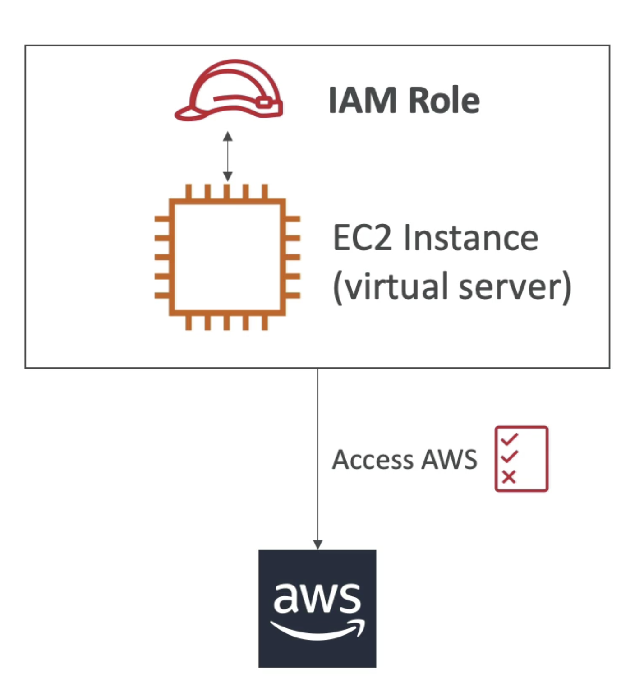

# AWS Certified Solutions Architect Associate                 

# Getting Started with AWS           

## AWS Cloud Overview - Region & AZ                

**AWS Regions**                  
AWS has **Regions** all around the world. Region has a name: us-east-1, eu-west-3, etc.                 
A region is a cluster of data centers.                  
Most AWS services are region-scoped                       

How to choose an AWS Region ?              
1. **Compliance** with data  governance and legal requirements: data never leaves a region without your explicit permission                 
2. **Proximity** to customers: reduced latency                       
3. **Available services** within a Region: not all regions have all services, new services and new features are not available in every region                       
4. **Pricing**: pricing varies region to region and is transparent in the service pricing page                    

For region-scoped services (e.g. EC2), when we switch region in AWS console, we will have a completely new different sets of resources.           

Resources are scoped to the Region for most services in AWS.                 

**AWS Availability Zones**                 
Each region has many availability zones, usually 3, min is 2, max is 6. e.g.             
Region: ap-southeast-2 has 3 AZ:             
ap-southeast-2a                
ap-southeast-2b                 
ap-southeast-2c                   

Each AZ is one or more discrete data centers with redundant power, networking and connectivity                 
They are separate from each other, so that they are isolated from disaters                  
They are connected with high bandwidth, ultra-low latency networking                        
They are linked together and form a region                 

**AWS Points of Presence (Edge Locations)**                             
Amazon has 216 Points of Presence (205 Edge Locations & 11 Regional Caches) in 84 cities across 42 countries.               
Content is delivered to end users with lower latency                

From Global Infrastrucutre, we can see which services are available within region.               

# IAM & AWS CLI           

## IAM Introduction: Users, Groups, Policies                         

**Global** services                    

IAM = Identity and Access Management        

When we create an account, we created a **root** account by default. This should NOT be used or shared.                            

We should create IAM **Users**. **Users** are people within your organisation, and can be grouped.                       

Groups can only contain Users, not other groups.                   
Users don't have to belong to a group, and user can belong to multiple groups.          

          

Users or Groups can be assigned JSON documents called policies.                
These policies define the permissions of the user.                 

In AWS you apply the **least privilege principle**: DO NOT give more permissions than a user needs.                                 

This is an example of IAM policy:                       
```
{
    "Version": "2012-10-17",
    "Statement": [
        {
            "Effect": "Allow",
            "Action": "ec2:Describe*",
            "Resource": "*"
        },
        {
            "Effect": "Allow",
            "Action": "elasticcloadbalancing:Describe*",
            "Resource": "*"
        },
        {
            "Effect": "Allow",
            "Action": [
                "cloudwatch:ListMetrics",
                "cloudwatch:GetMetricsStatistics",
                "cloudwatch:Describe*"
            ],
            "Resource": "*"
        }
    ]
}
```

Another example for the policy: AdminstratorAccess: (Note the star means everything)             

```
{
    "Version": "2012-10-17",
    "Statement": [
        {
            "Effect": "Allow",
            "Action": "*",
            "Resource": "*"
        }
    ]
}
```                               
For users, we can add tags, where we can mark the users and add in some attributes.                    

After log in we can notice that if the user accout is something like `stephane@stephane-ccp`, this means that this account is logged in as IAM user. The part after `@` is the account alias (e.g. can be `stephane-aws` for the account `stephane-ccp`, or the account name itself). If the user account is just `stephane-ccp` then this is logged in with root user (`stephane-ccp` is the account name).      

To grant permissions to User, we can either add the user into a group (which has the group policy, so this user will inhereit this group policy) or assign a policy directly to the user. We can also create our own custom policy either use the GUI or write in JSON.          

By clicing on the policy, we can also view what are the services that we have (full) access to.                 

## IAM MFA Overview

To protect the AWS account, we have 2 defense mechanisms:      

1) IAM Password Policy (helpful against brute force attack)         

1. Set minimum password length      
2. Requires specific character types: upper/lower case letters, numbers or non-alphanumeric characters.       
3. Allow all IAM users to change their own passwords       
4. Require users to change their password after some time                   
5. Prevent password reuse                 

2) Multi Factor Authentication - MFA        

On AWS this is a must and very recommended to use it. **We want to protect Root Account and IAM users**.      
MFA = password you know + security device you own         

MFA devices options in AWS:         
1) Virtual MFA device:       
Google Authenticator: phone only      
Authy: multi-device, and supports multiple tokens on a single device.       

2) Universal 2nd Factor (U2F) Security Key:      
YubiKey by Yubico (3rd party): support for multiple root and IAM users using a single security key, act as an USB-based key                

3.1) Hardware Key Fob MFA Device:    
Gemalto (3rd party)      
3.2) Hardware Key Fob MFA Device for AWS GovCloud (US):           
SurePassID (3rd party)             

## AWS CLI             

How can users access AWS ? There are 3 options:    
1) AWS Management Console (protected by password + MFA, for Root Account or other users)       
2) AWS Command Line Interface (CLI): protected by access keys      
3) AWS Software Developer Kit (SDK): this is mainly for code, (when your code is trying to access AWS), also protected by access keys    

Access keys are generated through the AWS Console. Users manage their own access keys and these keys are **private**.    
Access key have 2 components:            
Access Key ID (username) and Secret Access Key (password).   

We have to install (OS specific) client and configure the CLI with the Access Key ID and the Secret Access Key in order to use command line to access AWS.         

## AWS CloudShell

There is an alternative to install the CLI and configure it, this is called CloudShell. At the top right corner of the AWS Console there is a `terminal` icon we can launch. This is basically CLI in the cloud with pre-installed tools, storage (1 GB per AWS region) and saved files/settings.       

We can directly run AWS command directly in the CloudShell instead on the local CLI. e.g. `aws --version` to check the version of the AWS CLI installed or `aws iam list-users` to list the IAM users.        

The credentials used by the CloudShell is the same credentials as the user we logged in to the console with, at the moment we launch the CloudShell.             

## IAM Roles for AWS Service           

Some AWS services will need to perform actions on our behalf and on our account. We have to assign permissions to AWS services with IAM Roles.    

IAM Roles are just like users, but they are intended to be used *not* by physical people, but instead used by AWS Services.        

             

A quick example will be we created an EC2 instance (virtual server), and this EC2 instance would like to perform some action on AWS. To do so we need to give permissions to this EC2 instance. We will create an IAM Roles and together with the EC2 instance (as one entity), they can access AWS.     

Some common roles includes: EC2 Instance Roles, Lambda Function Roles, Roles for CloudFormation.        

## IAM Security Tools    

IAM Credentials Report (account level):      
We can create this report at the account level. This is a report that lists all your account's users and the status of their various credentials.         

IAM Access Advisor (user level):            
Access advisor shows the service permissions granted to a user and when those services were last used. We can use this information to revise your policies based on principle of least privilege.           

## IAM Best Practices

Do not use the Root Account except for AWS account setup      
One physical user = One AWS user       
**Assign users to groups** and assign permissions to groups (such that we manage permissions at a group level)           
Create a strong password policy       
Use and enforce the use of MFA              
Create and use Roles for giving permissions to AWS services           
Use Access Keys for Programmatic Access (CLI/SDK)      
Audit permissions of your account with the IAM Credential Reports (also IAM Access Advisor)    
Never share IAM users and Access keys        

## IAM Summary

Users: mapped to a physical user, has password for AWS Console         
Groups: contains users only (it is best to group users together)     
Policies: JSON document that outlines permissions for users or groups        
Roles: if we are within AWS, we can use roles to give permissions to AWS services to perform tasks      
Security: MFA + password policy        
Access Keys: access AWS using the CLI or SDK        
Audit: IAM Credential Reports and IAM Access Advisor          

# EC2 Fundamentals                

## EC2 Basics

One of the most popular AWS service and it is a Infrastructure as a Service (IaaS).            

EC2 = Elastic Compute Cloud             

It is comprised of many things (and capabilities) at a high level:            
-> You can rent virtual machinese on EC2 (they are called EC2 instances)          
-> You can store data in on their virual drives (they are called EBS volumes)              
-> You can distribute load across machines (Elastic Load Balancer, ELB)          
-> You can scale services using auto-scaling group (ASG)           

Knowing how EC2 works is *fundamental* to understand how Cloud works.      

EC2 sizing & configuration option: what can we choose for our instances (virtual servers) ?     

-> Operating System (OS): Linux or Windows or Mac        
-> How much compute power & cores (CPU)       
-> How much random-access memory (RAM)            
-> How much storage space: Network-attached (EBS & EFS) or hardware-attached (EC2 Instance Store)           
-> The Network card that is attached to the EC2 instance: speed of the card, public IP address        
-> Firewall rules: **security group**              
-> Bootstrap script (configure at first launch): Configuration script needs to be run at first launch, this is called EC2 User Data           

The `t2.micro` instance is included in the AWS free-tier. It has 1 vCPU, 1 GiB Mem and EBS storage.         

**EC2 User Data**            
It is possible to bootstrap our instances using an EC2 User Data scirpt.              
*Bootstrapping* means launching commands when a machine starts             
That script is *only run once* at the instance first start                
EC2 user data is used to automate boot tasks such as:            
-> installing updates           
-> installing software         
-> downloading common files from the internet           
The EC2 User Data Script runs with the root user (any command you have will have the pseudo rights)             

## Create an EC2 Instance with EC2 User Data to have a Website (hands-on)

1. Log in AWS Console, search for EC2, go to EC2 Console    
2. Choose region (e.g. closest to you)
3. Go to `Instances` on the right panel and `Launch Instance`
4. Choose Amazon Machine Image (AMI), we can choose from Quick Start and select Amazon Linux 2 AMI (64-bit x86) which is free-tier eligible.          
5. Choose an Instance Type (e.g. t2.micro for free tier), note that we are launching the instances in a default VPC (if we don't change the settings)          
6. Configure Instance Details: Under `User Data` we can run a user data which is only run at the first boot of the instance. (an example script is given, which is going to launch a web server onto our EC2 instance and write a file to it)
7. Add Storage (check `Delete on Termination`)
8. Add tags
9. Configure Security Group: create a new security group and Add Rule (HTTP, port 80)
10. Review and launch (will be prompted to use a key pair (for SSH)) 
11. Create a new key-pair (public-private key) and download the key pair

We can then use the public IPv4 address to access the website. To stop the instance, we can right click the instance and `Stop Instance`. To get rid of the instance, choose `Terminate Instance`.       

Note that if we stop an instance and restart it again, the public IPv4 **is going to change**. The private IPv4 will not change.        

## EC2 Instance Types Basics

AWS has the following naming convention (example):          
m5.2Xlarge         
m: **instance class**, in this case a general purpose instance         
5: **generation** of the instance (AWS improves them over time)         
2xlarge: **size** within the instance class         

**For exam we need to know this**, for various EC2 Instance Types:              
1. General Purpose        
Great for a diversity of workloads such as web servers or code repositories              
Balance between:        
-> Compute           
-> Memory              
-> Networking                  
t2.micro is a General Purpose EC2 Instance (free tier)             

2. Compute Optimized        
Great for compute-intensive tasks that require high performance processors:      
-> Batch processing workloads       
-> Media transcoding      
-> High performance web server              
-> High performance computing (HPC)            
-> Scientific modeling and machine learning            
-> Dedicated gaming servers               
Currently all the Compute Optimized EC2 Instance start with `c`, e.g. c5 or c6.     

3. Memory Optimized                
Fast performance for workloads that process large data sets in memory (RAM)       
Use cases includes:         
-> High performance, relational/non-relational databases        
-> Distributed web scale cache stores                
-> In-memory databases optimzed for BI           
-> Applications performing real-time processing of big unstructured data                   
These instances starts with `r`.             

4. Storage Optimized                      
Great for storage-intensive tasks that require high, sequential read and write access to large data sets on local storage     
Use cases include:        
-> High frequency online transaction processing (OLTP) systems    
-> Relational & NoSQL databases            
-> Cache for in-memory databases (e.g. Redis)       
-> Data warehousing applications                 
-> Distributed file systems           
These instance starts with `i`, `d` or `h1`.        

## Security Groups & Classic Ports Overview

Security Groups are the fundamental of network security in AWS.             
They control how traffic is allowed into or out of our EC2 Instances.    
Security Groups only contains *allow* rules, i.e. what is allowed to go in or go out.    
Security Groups rules can reference by IP address (i.e. where is your computer) or by Security Groups (i.e. Security Groups can reference each other).                

              

For example we are on our computer (i.e. public internet) and we would like to access our EC2 Instance. We will have to create a Security Group around our EC2 Instance (that is the firewall around it) and this Security Group is going to have rules that control which inbound traffic is allowed into the EC2 Instance and if the EC2 Instance can perform some Outbound traffic.      

Security Groups are acting as a "firewall" on EC2 Instance. They regulate:          
1. Access to Ports
2. Authorised IP ranges: IPv4 and IPv6 (e.g. 0.0.0.0/0 means any IP address is authorised)
3. Control of inbound network (i.e. from others to the EC2 Instance)
4. Control of outbound network (i.e. from EC2 Instance to others)

A quick example of Security Group works is shown below:           
     

For unauthorised inbound traffic, it will be a timeout error. By default for any Security Group, it will allow all outbound traffic out of the EC2 Instance. For example, if our EC2 Instance try to access a website, the Security Group is going to allow it.         

Security Groups good-to-know:            
-> can be attached to multiple instances          
-> instances can have multiple security groups              
-> Locked down to region/VPC combination           
-> Does live "outside" the EC2 - if traffic is blocked the EC2 instance won't see it (i.e. not like an application that runs on EC2)            
-> It is good to maintain one sepearate security group for SSH access                  
-> If your application is not accessible (time out), then it is a security group issue               
-> If your application gives a "connection refused" error, then it is an application error or it is not launched.           
-> By default, all inbound traffic is **blocked**           
-> By default, all outbound traffic is **authorised**                     

Referencing other security groups:                 
            

In the inbound rule for the EC2 instance, it is authorising Security Group 1 inbound AND Security Group 2. When another EC2 instance has Security Group 2, it can connect straight through on the port of the first EC2 instance. So regardless of the IP address, because they have the right Security Group attached to them, they are able to communicate straight through to other instances.                 

Classic Port we need to know (**EXAM**):        
1. 22 = SSH (Secure Shell) - log into a EC2 Instance on Linux
2. 21 = FTP (File Transport Protocol) - upload files into a file share
3. 22 = SFTP (Secure File Transport Protocol) - upload files using SSH
4. 80 = HTTP - access unsecured websites
5. 443 = HTTPS  - access secured websites
6. 3389 = RDP (Remote Desktop Protocol) - log into a Windows instance

The Security Groups (i.e. firewall) can be attached to multiple EC2 Instances.     


# Things to do            

