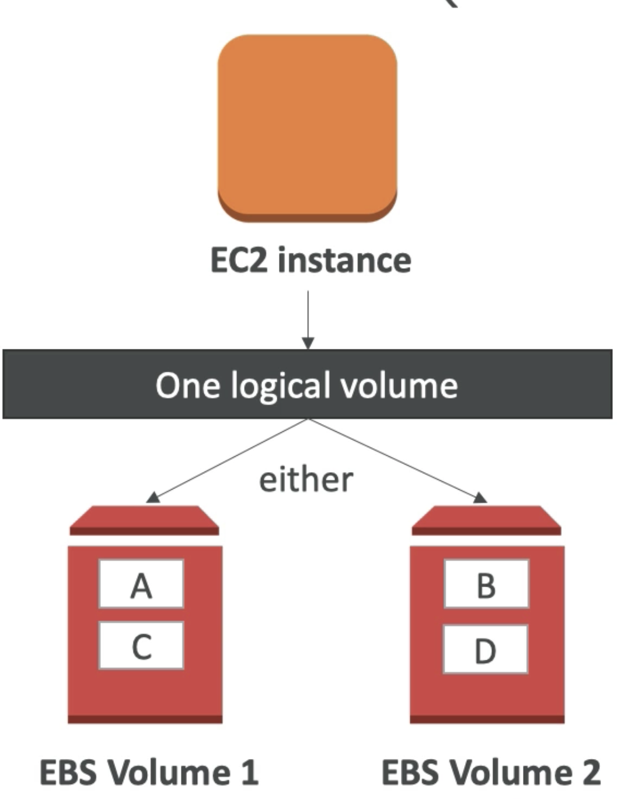
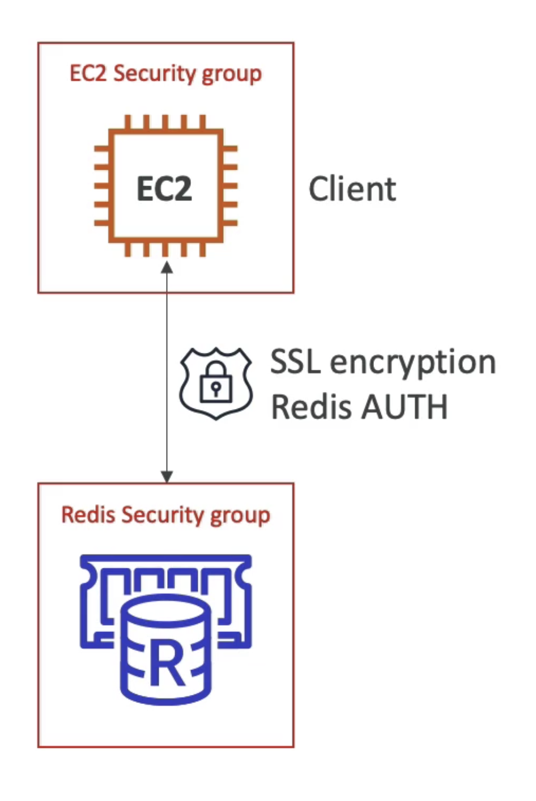
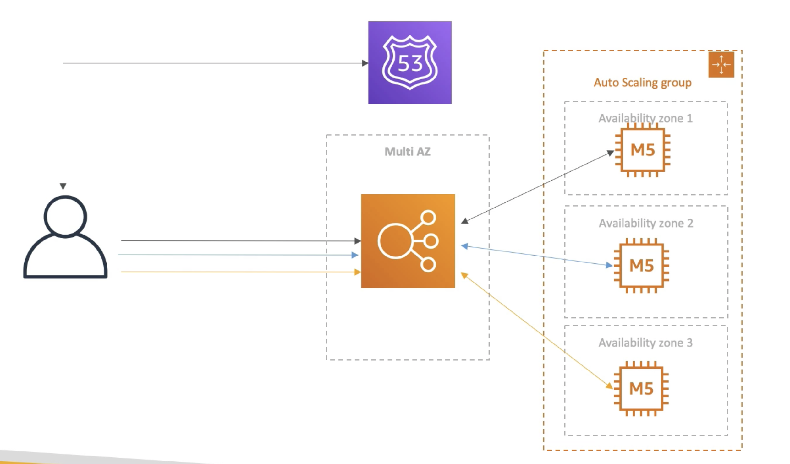
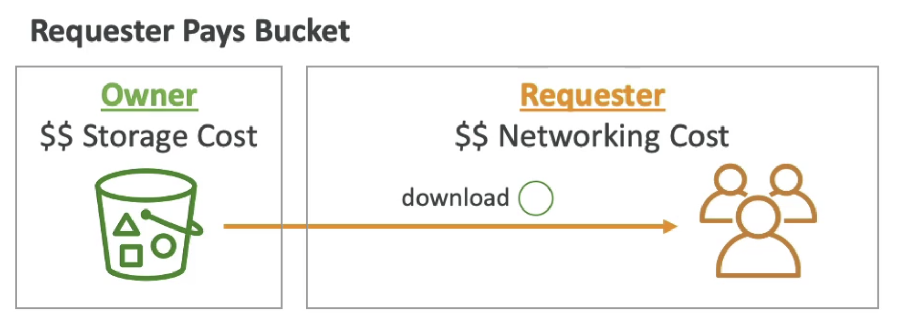
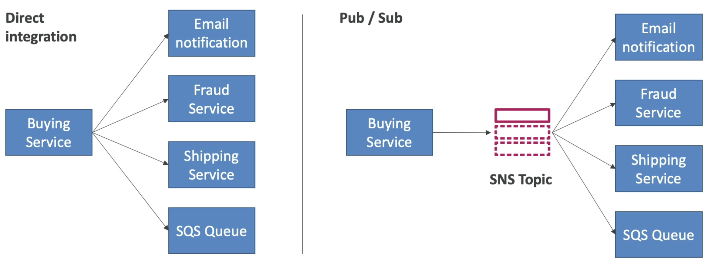

# AWS Certified Solutions Architect Associate                 

# Getting Started with AWS           

## AWS Cloud Overview - Region & AZ                

**AWS Regions**                  
AWS has **Regions** all around the world. Region has a name: us-east-1, eu-west-3, etc.                 
A region is a cluster of data centers.                  
Most AWS services are region-scoped                       

How to choose an AWS Region ?              
1. **Compliance** with data  governance and legal requirements: data never leaves a region without your explicit permission                 
2. **Proximity** to customers: reduced latency                       
3. **Available services** within a Region: not all regions have all services, new services and new features are not available in every region                       
4. **Pricing**: pricing varies region to region and is transparent in the service pricing page                    

For region-scoped services (e.g. EC2), when we switch region in AWS console, we will have a completely new different sets of resources.           

Resources are scoped to the Region for most services in AWS.                 

**AWS Availability Zones**                 
Each region has many availability zones, usually 3, min is 2, max is 6. e.g.             
Region: ap-southeast-2 has 3 AZ:             
ap-southeast-2a                
ap-southeast-2b                 
ap-southeast-2c                   

Each AZ is one or more discrete data centers with redundant power, networking and connectivity                 
They are separate from each other, so that they are isolated from disaters                  
They are connected with high bandwidth, ultra-low latency networking                        
They are linked together and form a region                 

**AWS Points of Presence (Edge Locations)**                             
Amazon has 216 Points of Presence (205 Edge Locations & 11 Regional Caches) in 84 cities across 42 countries.               
Content is delivered to end users with lower latency                

From Global Infrastrucutre, we can see which services are available within region.               

# IAM & AWS CLI           

## IAM Introduction: Users, Groups, Policies                         

**Global** services                    

IAM = Identity and Access Management        

When we create an account, we created a **root** account by default. This should NOT be used or shared.                            

We should create IAM **Users**. **Users** are people within your organisation, and can be grouped.                       

Groups can only contain Users, not other groups.                   
Users don't have to belong to a group, and user can belong to multiple groups.          

          

Users or Groups can be assigned JSON documents called policies.                
These policies define the permissions of the user.                 

In AWS you apply the **least privilege principle**: DO NOT give more permissions than a user needs.                                 

This is an example of IAM policy:                       
```
{
    "Version": "2012-10-17",
    "Statement": [
        {
            "Effect": "Allow",
            "Action": "ec2:Describe*",
            "Resource": "*"
        },
        {
            "Effect": "Allow",
            "Action": "elasticcloadbalancing:Describe*",
            "Resource": "*"
        },
        {
            "Effect": "Allow",
            "Action": [
                "cloudwatch:ListMetrics",
                "cloudwatch:GetMetricsStatistics",
                "cloudwatch:Describe*"
            ],
            "Resource": "*"
        }
    ]
}
```

Another example for the policy: AdminstratorAccess: (Note the star means everything)             

```
{
    "Version": "2012-10-17",
    "Statement": [
        {
            "Effect": "Allow",
            "Action": "*",
            "Resource": "*"
        }
    ]
}
```                               
For users, we can add tags, where we can mark the users and add in some attributes.                    

After log in we can notice that if the user accout is something like `stephane@stephane-ccp`, this means that this account is logged in as IAM user. The part after `@` is the account alias (e.g. can be `stephane-aws` for the account `stephane-ccp`, or the account name itself). If the user account is just `stephane-ccp` then this is logged in with root user (`stephane-ccp` is the account name).      

To grant permissions to User, we can either add the user into a group (which has the group policy, so this user will inhereit this group policy) or assign a policy directly to the user (this is called a inline policy). We can also create our own custom policy either use the GUI or write in JSON.          

IAM Policies Structure:                  


By clicking on the policy, we can also view what are the services that we have (full) access to.                 

## IAM MFA Overview

To protect the AWS account, we have 2 defense mechanisms:      

1) IAM Password Policy (helpful against brute force attack)         

-> Set minimum password length      
-> Requires specific character types: upper/lower case letters, numbers or non-alphanumeric characters.       
-> Allow all IAM users to change their own passwords       
-> Require users to change their password after some time                   
-> Prevent password reuse                 

2) Multi Factor Authentication - MFA        

On AWS this is a must and very recommended to use it. **We want to protect Root Account and IAM users**.      
MFA = password you know + security device you own         

MFA devices options in AWS:         
1) Virtual MFA device:       
Google Authenticator: phone only      
Authy: multi-device, and supports multiple tokens on a single device.       

2) Universal 2nd Factor (U2F) Security Key:      
YubiKey by Yubico (3rd party): support for multiple root and IAM users using a single security key, act as an USB-based key                

3) Hardware Key Fob MFA Device:    
Gemalto (3rd party)      
4) Hardware Key Fob MFA Device for AWS GovCloud (US):           
SurePassID (3rd party)             

## AWS CLI             

How can users access AWS ? There are 3 options:    
1) AWS Management Console (protected by password + MFA, for Root Account or other users)       
2) AWS Command Line Interface (CLI): protected by access keys      
3) AWS Software Developer Kit (SDK): this is mainly for code, (when your code is trying to access AWS), also protected by access keys    

Access keys are generated through the AWS Console. Users manage their own access keys and these keys are **private**.    
Access key have 2 components:            
Access Key ID (username) and Secret Access Key (password).   

We have to install (OS specific) client and configure the CLI with the Access Key ID and the Secret Access Key in order to use command line to access AWS.         

AWS SDK:                 
-> AWS Software Development Kit (AWS SDK0)                      
-> Language-specific APIs (set of libraries)                   
-> Enables you to access and manage AWS services programmatically                
-> Embedded within your application (not launched from the terminal)               
-> e.g. AWS CLI is built on AWS SDK for Python                   

## AWS CloudShell

There is an alternative to install the CLI and configure it, this is called CloudShell. At the top right corner of the AWS Console there is a `terminal` icon we can launch. This is basically CLI in the cloud with pre-installed tools, storage (1 GB per AWS region) and saved files/settings.       

We can directly run AWS command directly in the CloudShell instead on the local CLI. e.g. `aws --version` to check the version of the AWS CLI installed or `aws iam list-users` to list the IAM users.        

The credentials used by the CloudShell is the same credentials as the user we logged in to the console with, at the moment we launch the CloudShell.             

## IAM Roles for AWS Service           

Some AWS services will need to perform actions on our behalf and on our account. We have to assign permissions to AWS services with IAM Roles.    

IAM Roles are just like users, but they are intended to be used *not* by physical people, but instead used by AWS Services.        

             

A quick example will be we created an EC2 instance (virtual server), and this EC2 instance would like to perform some action on AWS. To do so we need to give permissions to this EC2 instance. We will create an IAM Roles and together with the EC2 instance (as one entity), they can access AWS.     

Some common roles includes: EC2 Instance Roles, Lambda Function Roles, Roles for CloudFormation.        

## IAM Security Tools    

IAM Credentials Report (account level):      
We can create this report at the account level. This is a report that lists all your account's users and the status of their various credentials.         

IAM Access Advisor (user level):            
Access advisor shows the service permissions granted to a user and when those services were last used. We can use this information to revise your policies based on principle of least privilege.           

## IAM Best Practices

Do not use the Root Account except for AWS account setup      
One physical user = One AWS user       
**Assign users to groups** and assign permissions to groups (such that we manage permissions at a group level)           
Create a strong password policy       
Use and enforce the use of MFA              
Create and use Roles for giving permissions to AWS services           
Use Access Keys for Programmatic Access (CLI/SDK)      
Audit permissions of your account with the IAM Credential Reports (also IAM Access Advisor)    
Never share IAM users and Access keys        

## IAM Summary

Users: mapped to a physical user, has password for AWS Console         
Groups: contains users only (it is best to group users together)     
Policies: JSON document that outlines permissions for users or groups        
Roles: if we are within AWS, we can use roles to give permissions to AWS services to perform tasks      
Security: MFA + password policy        
Access Keys: access AWS using the CLI or SDK        
Audit: IAM Credential Reports and IAM Access Advisor          

# EC2 Fundamentals                

## EC2 Basics

One of the most popular AWS service and it is a Infrastructure as a Service (IaaS).            

EC2 = Elastic Compute Cloud             

It is comprised of many things (and capabilities) at a high level:            
-> You can rent virtual machinese on EC2 (they are called EC2 instances)          
-> You can store data in on their virual drives (they are called EBS volumes)              
-> You can distribute load across machines (Elastic Load Balancer, ELB)          
-> You can scale services using auto-scaling group (ASG)           

Knowing how EC2 works is *fundamental* to understand how Cloud works.      

EC2 sizing & configuration option: what can we choose for our instances (virtual servers) ?     

-> Operating System (OS): Linux or Windows or Mac        
-> How much compute power & cores (CPU)       
-> How much random-access memory (RAM)            
-> How much storage space: Network-attached (EBS & EFS) or hardware-attached (EC2 Instance Store)           
-> The Network card that is attached to the EC2 instance: speed of the card, public IP address        
-> Firewall rules: **security group**              
-> Bootstrap script (configure at first launch): Configuration script needs to be run at first launch, this is called EC2 User Data           

The `t2.micro` instance is included in the AWS free-tier. It has 1 vCPU, 1 GiB Mem and EBS storage.         

**EC2 User Data**            
It is possible to bootstrap our instances using an EC2 User Data scirpt.              
*Bootstrapping* means launching commands when a machine starts             
That script is *only run once* at the instance first start                
EC2 user data is used to automate boot tasks such as:            
-> installing updates           
-> installing software         
-> downloading common files from the internet           
The EC2 User Data Script runs with the root user (any command you have will have the pseudo rights)             

## Create an EC2 Instance with EC2 User Data to have a Website (hands-on)

1. Log in AWS Console, search for EC2, go to EC2 Console    
2. Choose region (e.g. closest to you)
3. Go to `Instances` on the right panel and `Launch Instance`
4. Choose Amazon Machine Image (AMI), we can choose from Quick Start and select Amazon Linux 2 AMI (64-bit x86) which is free-tier eligible.          
5. Choose an Instance Type (e.g. t2.micro for free tier), note that we are launching the instances in a default VPC (if we don't change the settings)          
6. Configure Instance Details: Under `User Data` we can run a user data which is only run at the first boot of the instance. (an example script is given, which is going to launch a web server onto our EC2 instance and write a file to it)
7. Add Storage (check `Delete on Termination`)
8. Add tags
9. Configure Security Group: create a new security group and Add Rule (HTTP, port 80)
10. Review and launch (will be prompted to use a key pair (for SSH)) 
11. Create a new key-pair (public-private key) and download the key pair

We can then use the public IPv4 address to access the website. To stop the instance, we can right click the instance and `Stop Instance`. To get rid of the instance, choose `Terminate Instance`.       

Note that if we stop an instance and restart it again, the public IPv4 **is going to change**. The private IPv4 will not change.        

## EC2 Instance Types Basics

AWS has the following naming convention (example):          
m5.2Xlarge         
m: **instance class**, in this case a general purpose instance         
5: **generation** of the instance (AWS improves them over time)         
2xlarge: **size** within the instance class         

**For exam we need to know this**, for various EC2 Instance Types:              
1. General Purpose        
Great for a diversity of workloads such as web servers or code repositories              
Balance between:        
-> Compute           
-> Memory              
-> Networking                  
t2.micro is a General Purpose EC2 Instance (free tier)             

2. Compute Optimized        
Great for compute-intensive tasks that require high performance processors:      
-> Batch processing workloads       
-> Media transcoding      
-> High performance web server              
-> High performance computing (HPC)            
-> Scientific modeling and machine learning            
-> Dedicated gaming servers               
Currently all the Compute Optimized EC2 Instance start with `c`, e.g. c5 or c6.     

3. Memory Optimized                
Fast performance for workloads that process large data sets in memory (RAM)       
Use cases includes:         
-> High performance, relational/non-relational databases        
-> Distributed web scale cache stores                
-> In-memory databases optimzed for BI           
-> Applications performing real-time processing of big unstructured data                   
These instances starts with `r`.             

4. Storage Optimized                      
Great for storage-intensive tasks that require high, sequential read and write access to large data sets on local storage     
Use cases include:        
-> High frequency online transaction processing (OLTP) systems    
-> Relational & NoSQL databases            
-> Cache for in-memory databases (e.g. Redis)       
-> Data warehousing applications                 
-> Distributed file systems           
These instance starts with `i`, `d` or `h1`.        

## Security Groups & Classic Ports Overview

Security Groups are the fundamental of network security in AWS.             
They control how traffic is allowed into or out of our EC2 Instances.    
Security Groups only contains *allow* rules, i.e. what is allowed to go in or go out.    
Security Groups rules can reference by IP address (i.e. where is your computer) or by Security Groups (i.e. Security Groups can reference each other).                

              

For example we are on our computer (i.e. public internet) and we would like to access our EC2 Instance. We will have to create a Security Group around our EC2 Instance (that is the firewall around it) and this Security Group is going to have rules that control which inbound traffic is allowed into the EC2 Instance and if the EC2 Instance can perform some Outbound traffic.      

Security Groups are acting as a "firewall" on EC2 Instance. They regulate:          
1. Access to Ports
2. Authorised IP ranges: IPv4 and IPv6 (e.g. 0.0.0.0/0 means any IP address is authorised)
3. Control of inbound network (i.e. from others to the EC2 Instance)
4. Control of outbound network (i.e. from EC2 Instance to others)

A quick example of Security Group works is shown below:           
     

For unauthorised inbound traffic, it will be a timeout error. By default for any Security Group, it will allow all outbound traffic out of the EC2 Instance. For example, if our EC2 Instance try to access a website, the Security Group is going to allow it.         

Security Groups good-to-know:            
-> can be attached to multiple instances          
-> instances can have multiple security groups              
-> Locked down to region/VPC combination           
-> Does live "outside" the EC2 - if traffic is blocked the EC2 instance won't see it (i.e. not like an application that runs on EC2)            
-> It is good to maintain one sepearate security group for SSH access                  
-> If your application is not accessible (time out), then it is a security group issue               
-> If your application gives a "connection refused" error, then it is an application error or it is not launched.           
-> By default, all inbound traffic is **blocked**           
-> By default, all outbound traffic is **authorised**                     

Referencing other security groups:                 
            

In the inbound rule for the EC2 instance, it is authorising Security Group 1 inbound AND Security Group 2. When another EC2 instance has Security Group 2, it can connect straight through on the port of the first EC2 instance. So regardless of the IP address, because they have the right Security Group attached to them, they are able to communicate straight through to other instances.                 

Classic Port we need to know (**EXAM**):        
1. 22 = SSH (Secure Shell) - log into a EC2 Instance on Linux
2. 21 = FTP (File Transport Protocol) - upload files into a file share
3. 22 = SFTP (Secure File Transport Protocol) - upload files using SSH
4. 80 = HTTP - access unsecured websites
5. 443 = HTTPS  - access secured websites
6. 3389 = RDP (Remote Desktop Protocol) - log into a Windows instance

## SSH Overview


## SSH with Mac

When creating the EC2 Instance, we have created a key pair and download it (e.g. `ec2tutorial.pem`). We will need this key pair to SSH into this instance.      
```
ssh -i ec2tutorial.pem ec2-user@35.180.100.144
```
`ec2-user` is basically the Linux user in Amazon Linux machine. `35.180.100.144` is the IPv4 Public IP of the EC2 Instance.      

The above command will **fail**. This is because the first time we download the file, the permission is 0644 for the file. And this is too open for the private key, this means that the private key can leak, and it is accessable by others and it is a bad permission. The remedy is to change the file permission via:      
```
chmod 0400 ec2tutorial.pem
```
Run the SSH command again and we will be able to SSH into the EC2 instance. Once we are inside we can query the user (`whoami`) or ping a website (`ping google.com`)          

Note that in Windows 10 the `chmod` command does not exist. We will have to go to the property of the `.pem` file. We cab go to the Security tab and disable inherentence then remove all other user except yourself.        

To exit we can just press `exit` or `ctrl + d` to close the connection. (or `ctrl + c` or type `exit`)      

Note that on Windows when we use PuTTY, we need the PuTTygen to convert the key pair, which is in `.pem` to `.ppk` format so that PuTTY can use. Then after launching PuTTY and put in the public IPv4 of the EC2 Instance, we need to go to Connection -> SSH -> Auth to link the `.ppk` file.            

## EC2 Instance Connect

There is another way to connect to an EC2 Instance directly from AWS. We can click Connect in the AWS EC2 dashboard (where the list of EC2 Instance is shown). We can connect via EC2 Instance Connect after use a username. Note that this methods do not work with all type of AMIs in AWS. At the backend, it upload a temporary SSH key on your EC2 Instance for you. This methods ultimately still rely on SSH, so if we remove SSH rules from the Security Groups setting we will meet a timeout error if we use EC2 Instance Connect. So even though this method is based on browser, port 22 still needs to be opened for this method

## EC2 Instance Role Demo

After we connect to our EC2 Instance (via EC2 Connect) with our user, if we perform something like `aws iam list-users`, the CLI will prompt us to configure AWS to get our credentials. We can use `aws configure` to enter AWS Access Key ID and Secret Access Key but it is very bad practice. We can attach a Role to this instance (for example a Role with `IAMReadOnlyAccess` could allow us to run `aws iam list-users` without inputing credential again)                

## EC2 Instance Launch Types

EC2 Instances purchasing options:         
1. On-Demand Instances: short workload, predictabel pricing     
Sometimes we will need to use the serve for a long time and we can get some cost saving through:        
2. Reserved(**minimum 1 year**): 3 types       
-> Reserved Instances: long workload (e.g. database)       
-> Convertible Reserved Instances: long workload with flexible instances       
-> Scheduled Reserved Instances: example, every Thurs 3-6 pm     
3. Spot Instances: short workloads, cheap, can lose instances (less reliable)      
4. Dedicated Host: book an entire physical server, control instance placement        

Exam will ask you question and expect us to find the best of EC2 for various situations for cost saving or comply with some rules.    

**EC2 On Demand**:      
We pay for what we use:       
-> Linux machine: billing per second, after the first minute         
-> All other OS: billing per hour when instance is running      
Has the *highest* cost but no upfront payment      
No long-term commitment        

Recommended for **short-term** and **un-interrupted workloads**, where you cannot predict how the application will behave.      

**EC2 Reserved Instances**:       
Up to 75% discount compared to On-Demand.        
Reservation period: 1 year = + discount | 3 years = +++ discount (ONLY 1 or 3 years, not any time in between)       
Purchasing options: no upfront | partial upfront = + discount | All upfront = ++ discount        
Reserve a specific instance type (t2.micro etc)      

Recommended for steady-state usage applications (think database)        

Convertible Reserved Instnace:      
-> can change the EC2 instance type (e.g. t2.large to c3.large)        
-> up to 54% discount      

Scheduled Reserved Instances       
-> launch within specific time window you reserve          
-> require a fraction of day / week / month      
-> still commitment over 1 to 3 years      

**EC2 Spot Instances**:       
Provides the highest discount, can get up to 90% compared to On-Demand      
Instances that you can lose at any point of time if your max price (you are willing to pay for them) is less than the current spot price (the spot price changes over time)          
The MOST cost-efficient instances in AWS       

Useful for workloads that are resilient to failure (e.g. won't lose the progress of your work if you lose that instance)       

Recommended: batch jobs, data analysis, image processing, any distributed workloads, workloads with a flexible start and end time.       
Not suitable for critical jobs or databases.          

**EC2 Dedicated Hosts**:         
An Amazon EC2 Dedicated Host is a physical server with EC2 instances capacity fully dedicated to your use. Dedicated Hosts can help you address **compliance requirements** and reduce costs by allowing you to **use your existing server-bound software licenses**.       

These hosts are going to be allocated for a 3-year period reservation.      
More expensive     

Useful for software that have complicated licensing model (BYOL - Bring Your Own License)    
Or for companies that have strong regulatory or complicance needs.        
Since AWS shares all their server with everyone, this will ensure no one is using the server except you.      

**EC2 Dedicated Instances**:      
These are for EC2 Instances running on hardware that is dedicated to you.        
May share hardware with other instances in the same account.         
No control over instance placement (hardware control). So this is more like a software-version of Dedicated Host.           
      

Which purchasing option is right for me ?       
On-Demand: coming and staying in resort whenever we like, we pay full price.           
Reserved: like planning ahead and if we plan to stay for a long time, we may get a good discount.        
Spot instances: the hotel allows people to bid for the empty rooms and the highest bidder keeps the room. You can get kick out at any time.       
Dedicated: we book entire building of the resort.        

An example of cost comparison using m4.large instance:    
   

# EC2 - Solution Architect Associate Level             

## Private vs Public vs Elastic IP        

Networking has two sorts of IPs: **IPv4** and **IPv6**.             
IPv4: 4 numbers seperated by 3 dots, e.g. 1.160.10.240             
IPv6: 3ff2: 1900:4545:3:200:f8ff:f221:67cf                

IPv4 is still the most common format used online         
IPv6 is newer and solves problems for the Internet of Things (IoT)                

IPv4 allows for **3.7 billion** different addresses in the public space:             
[0-255].[0-255].[0-255].[0-255]                  

              

When you have a public IP, you are accessible over the internet and when you have a private IP, you are only accessible within your private netowrk.             

**Fundamental Differences**:                  
Public IP:          
-> Public IP means the machine can be identified on the internet (WWW)             
-> must be unique across the whole web (not two machines can have the same public IP)           
-> can be geo-located easily           
Private IP:             
-> Private IP means the machine can only be identified on a private network only         
-> IP must be unique across the private network            
-> BUT two different private networks (e.g. 2 companies) can have the same IPs        
-> machines connect to WWW using a NAT + internet gateway (a proxy)         
-> only a specified of IPs can be used as private IP            

**Elastic IPs**         
When you stop and then start an EC2 instance, it can change its public IP.                
If you need to have a fixed public IP for your instance, you need an Elastic IP              
An Elastic IP is a public IPv4 IP you own as long as you don't delete it                
You can attach it to one instance at a time                   
With an Elastic IP address, you can mask the failure of an instance or software by rapidly remapping the address to another instance in your account                    

You can only have 5 Elastic IP in your account (you can ask AWS to increase that)               

Overall, try to avoid using Elastic IP.               
-> they often reflect poor architectural decision             
-> instead, use a random public IP and register a DNS name to it                 
-> or, use a Load Balancer and don't use a public IP              

In EC2:         
By default, your EC2 machine comes with:         
-> a private IP for the internal AWS Network         
-> a public IP, for the WWW          

When we are doing SSH into our EC2 machines:         
-> we can't use a private IP, because we are not in the same network          
-> we can only use the public IP (if you don't have a VPN)         

If your machine is stopped and then started, the public IP can change            

We can find the Elastic IP in the EC2 console (under Network & Security), and we can allocate a new IP address from Amazon's pool of IPv4 addresses. By doing this we can create an IP address we own now, and this can be allocated to a specific EC2 instance. Now if we stop and restart an EC2 instance with an Elastic IP, (the public IPv4 is going to be the same as the Elastic IP associated to this EC2 instance), the Public IPv4 will remain the same.                

## Spot Instances & Spot Fleet    

Can get a discount of up to 90% compared to On-Demand          

Define **max spot price** and get the instance while **current spot price < max**              
-> the hourly spot price varies based on offer and capacity             
-> if the current spot price > your max price you can choose to **stop** or **terminate** your instance with a 2 minutes grace period              
Other strategy: **Spot Block**            
-> "block" spot instance during a specified time frame (1 to 6 hours) without interruptions                
-> in rare situations, the instance may be reclaimed             

Used for batch jobs, data analysis, or workloads that are resilient to failures.               
Not great for critical jobs or databases                

How do we terminate a spot instance ?                 

                          

Consider a spot request: we are defining how many instances we want, maximum price we are willing to pay, launching specifications (AMI etc) and when our request is *valid from* and *valid until* and **request type**.             
There are 2 types of request types: **one-time request** or **persistent request**                

If it is a **one-time request**, as soon as your spot request is fulfiled, our instances are going to be launched and then the spot request **GOES AWAY**. If it is a **persistent**, this means that we want these requested instance as long as the spot request is valid from to valid until. This means that if the instances do get stopped/interrupted, then our spot requests will go back into action. AWS will restart spot instances for us when the conditions are met.                

We can only cancel Spot Instance requests that are open, active or disabled.               
Cancelling a spot request DOES NOT terminate instances (its our responsibility to terminate these spot instances).             
We must first cancel a spot request, and then terminate the associated spot instances, else the spot request will re-start the instances.                 

**Spot Fleets**                  
Spot Fleets = set of Spot Instances + (optional) On-demand Instances                  
The Spot Fleets will try to meet the target capacity with price constraints               
-> define possible launch pools: instance type (m5.large), OS, AZ               
-> we can have multiple launch pools, so that the fleet can choose. The fleet can choose the best and most appropriate launch pool for you                  
-> Spot Fleet stops launching instances when reaching capacity or max cost            

Strategies to allocate Spot Instances (EXAM):                
-> lowestPrice: from the pool with the lowest price (cost optimization, short workload)           
-> diversified: distributed across all pools (great for availability, long workloads)               
-> capacityOptimized: pool with the optimal capacity for the number of instances                 

Spot Fleets allow us to automatically request Spot Instances with the lowest price, i.e. Spot Fleet gives us an extra saving based on spot instances because it is smart enough to choose the right spot instance pools to allow us to get the maximum amount of savings.           

## EC2 Placement Groups

Sometimes we want control over the EC2 instance placement strategy (i.e. how the EC2 instances is placed within the AWS infrastructure)                

That strategy can be defined using placement groups              

When we create a placement group, you specify one of the following strategies for the group:          
-> *Cluster*: clusters instances into a low-latency group (hardware setup) in a single AZ - **high performance, high risk**            
-> *Spread*: spreads instances across underlying hardware (max 7 instances per group per AZ) - **critial applications**             
-> *Partition*: spreads instances across many different partitions (which rely on different sets of racks) within an AZ. Scales to 100s of EC2 instances per group (Hadoop, Cassandra, Kafka).                

**Cluster**:           

                 

For Cluster, it means that all of our EC2 instances are on the same rack (means same hardware, same AZ).            
Pros: Great network (10 Gbps bandwidth between instances)           
Cons: if the rack fails, all instances fails at the same time                
Use cases:           
-> Big Data job that needs to complete fast            
-> Application that needs extremely low latency and high network throughput              
**Willing to take on the risk of failure**                    

**Spread**:              

               

We have 3 AZ and 6 EC2 instances, and each instance is on a different hardware.          
Pros:           
-> can span across AZ              
-> reduce risk in simultaneous failure             
-> EC2 Instances are on different physical hardware            

Cons:            
-> limited to 7 instances per AZ per placement group           

Use cases:              
-> Application that needs to maximize high availability           
-> Critical applications where each instance must be isolated from failure from each other           

**Partition**:               

             

We can have up to 7 partitions per AZ. And on each partition we can have many EC2 instances.         
Each partition represent a rack on AWS -> so instances are safe from rack failure affecting one another.              
Can span across multiple AZs in the same region               
Up to 100s of EC2 instances.               
The instances in a partition do not share racks with the instances in the other partitions             
A partition failure can affect many EC2 instances but won't affect other partitions             
EC2 instances get access to the partition information as metadata.                

Use cases: HDFS, HBase, Cassandra, Kafka                

We can create new placement group and assign EC2 instances during launching, or directly create the new placement group during the instance launching (after selecting AMIs etc)            


## Elastic Network Interfaces (ENI) - Overview             

Logical component in a VPC that represents a **virtual network card**             
They are used outside of EC2 instances as well.              

             

For example we have 1 EC2 instance in a AZ. There is a primary ENI `Eth0` attached to it.           
This will provide your EC2 instance network connectivity and (e.g.) Private IP.              

Each ENI can have the following attributes:            
-> primary private IPv4, one or more secondary IPv4 (here `Eth1` is a secondary ENI, this will give another IPv4)                                
-> One Elastic IP (IPv4) per private IPv4           
-> One Public IPv4              
-> One or more security groups           
-> a MAC address             

You can create ENI independently and attach them on the fly (move them) on EC2 instances for failover         
In the example above, we can move `Eth1` so that the private IP is moved to the second EC2 instance.                      
Bound to a specific AZ.                 

ENI is automatically created during EC2 Launching, we can create ENI manually and attach to them. These manually created ENI is going to stay (under `Network interfaces`) after the EC2 instances are terminated.                

## EC2 Hibernate          

We can stop and terminate instances:             
-> Stop: the data on disk (EBS) i skept intact in the next start            
-> Terminate: any EBS volumes (root) also *set-up to be destroyed* is lost               

On start, the following happens:          
-> First start: the OS boots & the EC2 User Data script is run             
-> Following start (stop and then restart): the OS boots up, then your application starts, caches get warmed up, and that can take time           

**EC2 Hibernate**       
The in-memory (RAM) state is preserved          
The instance boot is much faster (the OS is not stopped/restarted)             
Under the hood: the RAM state is written to a file in the root EBS volume              
The root EBS volume must be encrypted           

           

Use cases:           
-> long-running processing          
-> saving the RAM state          
-> services that take time to initialise             

EC2 Hibernate - Good to know           

Supported instance families - C3, C4, C5, M3, M4, M5, R3, R4 and R5          
Instance RAM size - must be less than 150 GB          
Instance size - not supported for bare metal instances              
AMI: Amazon Linux 2, Linux AMI, Ubuntu and Windows            
RootVolume: must be EBS (so not Instance Store), encrypted and large               
Available for On-Demand and Reserved Instances                  

An instance cannot be hibernated more than 60 days             

During EC2 launching, we can enable hibernation as an additional stop behavior              

## EC2 - Advanced Concepts (Nito, vCPU, Capacity Reservations)             

1. EC2 Nitro          

Underlying Platform for the next generation of EC2 instances               
New virtualisation technology             
Allows for better performances:               
-> better networking options (enhanced netowrking, HPC, IPv6)               
-> **High Speed EBS (Nitro is necessary for 64,000 EBS IOPS - max is 32,000 on non-Nitro)**           
Better underlying security             
Instance types example:         
-> Virtualised, A1, C5, C5a, C5ad, D3, D3gen, M5, M5a etc. (anything new will have Nitro in it)            
-> Bare metal: a1.metal, c5.metal, c6g.metal, etc.             

2. vCPU           

Multiple threads can run on one CPU or Core (multithreading)            
Each thread is represented as a virtual CPU (vCPU)             
e.g. launching m5.2xlarge:              
-> 4 CPU             
-> 2 threads per CPU (8 threads total)             
-> so 8 vCPU in total

We can optimise CPU options:           
EC2 instances come with a combination of RAM and vCPU              
In some rare cases, you may want to change the vCPU options (e.g. reduce):             
-> no. of CPU cores: you can decrease it (helpful if you need high RAM and low number of CPU) - decrease licensing costs           
-> no. of threads per core: disable multithreading to have 1 thread per CPU - helpful for high performance computing (HPC) workloads           

Only specified during the instance launch            

             

3. Capacity Reservations         

Capacity Reservations ensure you have EC2 Capacity when needed          
Manual or planned end-date for the reservation         
No need for 1 or 3-year commitment           
Capacity access is immediate, you get billed as soon as it starts           

Specify:       
-> the AZ in which to reserve the capacity (only one), if needed in 3 AZ, we need to do 3 Capacity Reservations              
-> the number of instances for which to reserve capacity            
-> the instance attributes, including the instance type, tenancy, and platform/OS             

Combined with Reserved Instances and Saving Plans to do cost saving                 

# EC2 Instance Storage      

## EBS Overview    

## EBS Overview

An EBS (Elastic Block Store) Volume is a *network* drive you can attach to your instances while they run.         
It allows your instances to persist data, even after their termination: we can re-create the instances and mount the same EBS Volume from before and we will get back our data.              
They can only be **mounted to one instance at a time** (at the CCP exam level)      
They are bound to **a specific availability zone** when we create an EBS Volume: you cannot have an EBS Volume created in US-East-1A and attach to an instance in US-East-1B            

Analogy: think of them as a "network USB stick"             
Free tier: 30GB of free EBS storage of type General Purpose (SSD) or Magnetic per month         

EBS Volume:            
1. network drive (i.e. not a physical drive)            
-> it uses the network to communicate the instance, which means there might be a bit of latency from one computer to reach another server                
-> can be detached from an EC2 Instance and attached to another one quickly    
2. locked to an Availability Zone (AZ)        
-> an EBS volume in us-east-1a cannot be attached to us-east-1b             
-> to move a volume across from different AZ, we need to snapshot it            
3. Have provisioned capacity (i.e. we have to provision capacity in advance): size in GBs, and IOPS (IO operations per second)           

An EBS example is given below, at CCP level, one EBS can only be attached to one EC2 Instance, but multiple EBS volume can be attached to one EC2 Instance:               
              

**Delete on Termination Attribute**         
When we create EBS volume through EC2 Instances, there is the Delete on Termination attribute.          

              

By default, it is ticked for the Root Volume and not the new EBS volume.           
This controls the EBS behavior when an EC3 instance terminates             
-> By default, the root EBS volume is deleted (attribute enabled)             
-> By default, any other attached EBS volume is not deleted (attribute disabled)              
This can be controlled by the AWS console / AWS CLI              

Use case: preserve root volume when instance is terminated                    

## EBS Hands On

In the EC2 services, when we select the EC2 Instance, we can check the `Root Device` and `Block Devices`, and they both link the to same EBS Volume. When we click on them there will be an EBS ID (we can also access the EBS Volume under Elastic Block Store at the side bar).             

We can also create a stand-alone EBS volume in EC2 service. We will have to select the same Availability Zone as our instance. After creating the EBS Volume, it will appear in the `Elastic Block Store` under `Volumes`. We can then attach this volume to an instance.                 

If we terminate the EC2 Instance, the EBS Volumes which do not have "Delete on Termination" set to True will persist after the instance is terminated. By default, the root EBS Volume was created with termination in mind.      

## EBS Snapshots Overview

We can make a backup (snapshot) of our EBS volume at a point in time. We will be able to backup the state of it and even if the EBS volume is terminated later on, we can restore it from that backup.       

It is *not* necessary to detach volume to do snapshot, but *recommended*, just to make sure everything is clean on the EBS volume.      

We can also copy snapshots across Availability Zones or Region: we can transfer data in a different region to leverage on the global infrastructure of AWS.       

A simple illustration: the snapshot of the EBS volume will exist in your Region and can be used to restore into a EBS volume in another Availability Zone.                         
           

We can create the snapshot in EC2 service and the snapshots can be seen under `Elatic Block Store` (at the side bar) under `Snapshots`.      

We can copy snapshot into a new snapshot. This new snapshot can be in *ANY* Region that we want.     

We can create an EBS volume from the snapshot, and we can create the volume in a different Availability Zones (but same Region from the original EBS volume)       

## AMI Overview

AMI = Amazon Machine Image           

They represent a customisation of an EC2 Instance       
-> add our own software, configuration, operating system, monitoring              
-> Faster boot / configuration time because all our software that we want to install is pre-packaged through AMI              

AMI are built for a **specific region**, and can be copied across Regions. 

We can launch EC2 Instances from:             
-> A Public AMI: AWS provided            
-> Your own AMI: you make and maintain them yourself            
-> An AWS Marketplace AMI: An AMI someone else made (and potentially someone sells them)               

AMI Process (from an EC2 Instance)               
-> start an EC2 instance and customize it      
-> stop the instance (for data integrity)        
-> build an AMI: this will create EBS snapshots behind the scenes              
-> finally we can launch instances from other AMIs       

Simple illustration on creating AMI and then use it to launch an EC2 instance:              
                    

To create an AMI from existing EC2 Instance, we right click -> image -> create image.     

After the AMI is created, we can go to Images (at the sidebar) -> AMI, select the AMI and create an EC2 Instance. Go to `Launch Instance` and instead of selecting existing public AMI, we can choose My AMIs. We still needs to select instance type (e.g. t2.micro) but we don't need to input "User Data". This can save a lot of time (e.g. configure and install software on our other EC2 Instances).       

## EC2 Instance Store

EBS volumes are **network drives** with good but "limited" performance         
**If we need a high-performance hardware disk, use EC2 Instance Store.** EC2 Instance is a virtual machine but it is attached to a real hardware server and some of these servers do have disk space that is attached directly with a physical connection onto the server.      

They have better I/O performance       
EC2 Instance Store lose their storage if they are stopped (ephemeral) i.e. the EC2 Instance that has an Instance Store are stopped or terminated                
User case: Good for buffer / cache / scratch data / temporary content but NOT for long-term storage              
Risk of data loss if hardware fails -> Backups and Replication are our responsibility              

If we see very high performance hardware attached volume for EC2 Instance, think local EC2 Instance Store.

## EBS Volume Types           

EBS Volumes come in 6 types.                
-> gp2 / gp3 (SSD): General purpose SSD Volume that balances price and performance for a wide variety of workloads           
-> io1 / io2 (SSD): Highest-performance SSD volume for mission-critical low-latency or high-throughput workloads           
-> st1 (HDD): Low cost HDD volume designed for frequently accessed, throughput intensive workloads               
-> sc1 (HDD): Lowest cost HDD volume designed for less frequently accessed workloads                

EBS Volumes are characterized in Size | Throughput | IOPS (I/O Ops Per Sec)              

For EC2 instances, only gp2/3, io1/2 can be used as boot volumes (i.e. where the root OS is going to be running).            

EBS Volume Types Use Cases:                 
**General Purpose SSD**:                 
*Cost effective storage, low-latency*         
System boot volumes, Virtual desktops, Development and test environments                
1 GiB - 16 TiB           
gp3:         
-> newer generation of volumes        
-> baseline of 3,000 IOPS and throughput of 125 MiB/s         
-> can increase IOPS up to 16,000 and throughput up to 1000 MiB/s independently            
gp2:        
-> small gp2 volumes can burst IOPS to 3,000           
-> size of the volume and IOPS are linked, max IOPS is 16,000            
-> 3 IOPS per GB, means at 5334 GB we are at the max IOPS              

**Provisioned IOPS (PIOPS) SSD**:             
*Critical business applications* with sustained IOPS performance          
Or applications that need more than 16,000 IOPS        
Great for **database workloads** (sensitive to storage perf and consistency)               
io1 /  io2 (4 GiB - 16 TiB)             
-> max PIOPS: 64,000 for Nitro EC2 instances & 32,000 for other           
-> can increase PIOPS independently from storage size           
-> io2 have more durability and more IOPS per GiB (at the same price as io1)            

io2 Block Express (4 GiB - 64 TiB)           
-> sub-millisecond latency         
-> max PIOPS: 256,000 with an IOPS: GiB ration of 1,000:1            

*Supports EBS Multi-attach*           

**Hard Disk Drives (HDD)**:             
Cannot be a boot volume           
125 MiB to 16 TiB           
Throughput Optimized HDD (st1)           
-> Big Data, Data Warehouses, Log Processing           
-> Max throughput 500 MiB/s - max IOPS 500                 
Cold HDD (sc1)             
-> for data that is infrequently accessed          
-> scenarios where lowest cost is important            
-> Max throughput 250 MiB/s - max IOPS 250                 

Summary:             

            

if we need more than 32,000 IOPS, we need EC2 Nitro with io1/2.                 

## EBS Multi-Attach           

For io1 / io2 family           

Attach the same EBS volume to multiple EC2 instances in the same AZ.           

                  

Each instance has full read & write permissions to the volume              

Use case:          
-> achieve **higher application availability** in clustered Linux applications (e.g. Teradata)                
-> applications must manage concurrent write operations             

Must use a file system that's cluster-aware (not XFS, EX4, etc)              

## EBS Encryption           

When you create an encrypted EBS volume, you get the following:         
-> data at rest is encrypted inside the volume           
-> all the data in flight moving between the instance and the volume is encrypted          
-> all snapshots are encrypted         
-> all volumes created from the snapshot are encrypted             

Encryption and decryption are handled transparently (you have nothing to do)              

Encryption has a minimal impact on latency            

EBS Encryption leverages keys from KMS (AES-256)                 

Copying an unencrypted snapshot allows encryption                   

Snapshots of encrypted volumes are encrypted            

**Encrypt an unencrypted EBS volume**:                
Create an EBS snapshot of the volume           
Encrypt the EBS snapshot (using copy, or while copying we can choose to encrypt the copied snapshot)                  
Create new EBS volume from the snapshot (the volume will also be encrypted)              
Now you can attach the encrypted volume to the original instance          

As a shortcut, we can also take an unencrypted snapshot and while creating a volume out of the snapshot, choose encrypt this volume.          

## EBS RAID configurations           

EBS is already redundant storage (replicated within an AZ)         
But what if you want to increase IOPS to say 100,000 IOPS ?               
What if you want to mirror your EBS volumes ?             
You would mount volumes in parallel in RAID settings                  

RAID is possible as long as your OS supports it            
Some RAID options are:             
-> RAID 0                  
-> RAID 1                     
-> RAID 5 (not recommended for EBS - see documentation)             
-> RAID 6 (not recommended for EBS - see documentation)                 

RAID 0 (increase performance)               

                   

Say we have one EC2 instance and this is backed by one logical volume. But this logical volume consist of 2 EBS Volume. It is either going to EBS Volume 1 or EBS Volume 2. When you write data, e.g. writing block A, B, C, D. They gets distributed between the two volumes.          

Combining 2 or more volumes and getting the total disk space and I/O.            
But one disk fails, all the data is failed             
We raise performance but increase our risk to have faults.               
Use cases would be:            
-> an application that needs a lot of IOPS and doesn't need fault-tolerance               
-> a database that has replication already built-in             

Using this, we can have a very big disk with a lot of IOPS                 

e.g. two 500 GiB Amazon EBS io1 volumes with 4,000 provisioned IOPS each -> 1,000 GiB RAID 0 array with an available bandwidth of 8,000 IOPS and 1,000 MB/s of throughput                 

RAID 1 (increase fault tolerance)                   

                    

We have a similar setup, but this time we are going to write to both at the same time. So anytime we write a block A on Volume 1, it will also go to Volume 2.               

RAID 1 = Mirroring a volume to another              

If one disk fails, our logical volume is still working               
We have to send the data to two EBS volume at the same time (2 x network)                  
So we need the EC2 instance to have more network throughput to handle the writes to 2 EBS volumes at a time.                 

Use cases:             
-> Application that need increase volume fault tolerance              
-> Application where you need to service disks               

e.g. two 500 GiB Amazon EBS io1 volumes with 4,000 privisioned IOPS each -> 500 GiB RAID 1 array with an available bandwidth of 4,000 IOPS and 500 MB/s of throughput.                      

## EFS Overview
     
EFS is a managed NFS (network file system) that can be mounted on **100s of EC2** at a time. Recall that EBS Volume attached to only 1 EC2 Instance at a time. So EFS makes it a shared network file system.            

EFS works only with **Linux EC2 instances** and **works across multiple Availability Zones**. i.e. EFS can be attached to instances in different AZ.        

Highly available, scalable, expensive (3x gp2 EBS Volume), pay per use, no capacity planning            

           

Use case: content management, web serving, data sharing, Wordpress           
Uses NFSv4.1 protocol                       
Uses security group to control access to EFS           
**Compatible with Linux based AMI (no Windows)**               
Encryption at rest using KMS               
POSIX file system (~Linux) that has a standard file API              
File system scales automatically, pay-per-use, no capacity planning              

EFS Scale:            
1000s of concurrent NFS clients, 10GB+/s throughput         
Grow to Petabyte-scale network file system, automatically            

Performance mode (set at EFS creation time)                
-> General purpse (default): latency-sensitive use cases (web server, CMS, Wordpress etc...), there is going to be alot of small files and you can access them very quickly. So EFS is built for that.                              
-> Max I/O - higher latency, throughout, highly parallel (big data, media processing)                

Throughput mode             
-> Bursting (1 TB = 50MiB/s + burst of up to 100 MiB/s)               
-> Provisioned: set your throughput regarless of storage size, e.g. 1 GiB.s for 1 TB storage (throughput usually grows with the file system's size) **small size file system but we want high throughput**                    

Storage Tiers (lifecycle management feature - move file after N days)                    
-> Standard: for frequently accessed files              
-> Infrequent access (EFS-IA): cost to retrieve files, lower price to store                 

**EFS Hands On**             

1. File system settings          
-> Name (optional)              
-> Automatic backup             
-> Lifecycle management (e.g. files not accessed after N days move to EFS Infrequent Access storage class)                 
-> Performance mode (General Purpose vs Max I/O)                 
-> Throughput mode (Bursting vs Provisioned (fixed throughput regardless file system size))                     
-> Encryption           

2. Network access              
-> VPC (choose VPC where you want EC2 instances to connect to your file system)                 
-> Mount targets (a mount target provides NFSv4 endpoint at which you can mount an EFS file system, recommend one mount target per AZ), and for each AZ we can define a security group (create the security group from EC2 console)                              

3. File system policy (optional)                     
4. Review and Create                 

After the EFS is created, we can create a few EC2 instance (in different AZ) to try to connect to the EFS. When we create the EC2 instance we can choose to add directly under "File systems". When configuring Security Group we can name a SG (allows SSH) so we can track and use this SG.                

We can SSH into each of these instance. Next we need to install EFS into the EC2 instances. From the EFS console, we can choose "Attach", and we can choose to mount the EFS via DNS or IP. There is a EFS mount helper, and in order to use this help we need to (go to the documentation) install a small package called `amazon-efs-utils`. So in the EC2 instance (after SSH in), key in:             
```
sudo yum install -y amazon-efs-utils
```
In order to use the helper we also need a directory for EFS, so in the EC2 console we can do:                   
```
mkdir efs
```
and then use the helper:                  
```
sudo mount -t efs -o tls fs-5dafeeac:/ efs
```
"tls" means there will be in flights encryption, and "fs-5dafeeac" is the ID for the EFS.                  

If you do these steps there will be a timeout, this is due to the Security Group of the EFS. We can add the inbound rules of the EFS's SG, the type is "NFS", and the source is the SG of the EC2 instances.          

Once the EFS is setup, then the 2 EC2 instances can access the files within the EFS simultaneously.             

## EBS vs EFS                   

**EBS** (Elastic Block Storage) Volumes:        

In general:              
-> can be attached to only one instance at a time              
-> are locked at the AZ level            
-> gp2: IO increases if the disk size increases                   
-> io1: can increase IO independently (great for running critical database)                  

To migrate an EBS volume across AZ              
-> take a snapshot           
-> restore the snapshot to another AZ            
-> EBS backups use IO and you should not run them while your application is handling a lot of traffic               

Root EBS volumes of instances get terminated by default if the EC2 instance gets terminated (you can disable that)                

                 

**EFS** Elastic File System:             

In general:                 
-> mounting 100s of instances across AZ            
-> EFS share websites files (WordPress)                    
-> Only for Linux Instances (POSIX)               
-> EFS has a higher price point than EBS (about 3x more expensive)            
-> Can leverage EFS-IA for cost savings               

For EFS we get billed only for what we use on EFS, for EBS we have to provision in advance a size that you know for EBS drive and we pay for the provision capacity and not the actual use capacity.             
   
                  

# High Availability and Scalability: ELB & ASG

## High Availability and Scalability

**Scalability** means that an application / system can handle greater loads by adapting.        
There are two kinds of scalability in the Cloud:  
1. Vertical Scalability
2. Horizontal Scalability (= elasticity)         

Scalability is linked but different to High Availability.       

**Vertical Scalability**       
Vertical Scalability means increasing the size of the instance.          
For example, your application runs on t2.micro. Scaling that application *vertically* means running it on a t2.large, i.e. we change the size of our instance.         
Vertical scalability is very common for non-distributed system, such as a database. If we want to increase the performance of our database, we just increase the size of our database.           
There is usually a limit to how much you can vertically scale (hardware limit, even though the modern limits can be very very high)        

**Horizontal Scalability**            
Horizontal Scalability means increasing the number of instances / systems for your applications.         
Horizontal Scaling implies that we need to have a distributed system.      
This is very common for web applications / modern applications (usually design them with horizontal scalability in mind).       
It is easy to horizontally scale thanks to cloud offeringss such as AWS EC2.         

**High Availability**        
High Availability usually goes hand in hand with horizontal scaling           
High Availability means running your application / system in at least 2 Availability Zones on AWS        
The goal of high availability is to survive a data center loss (disaster)           

High availablilty can be passive (for RDS Multi AZ for example)               
High availability can be active (for horizontal scaling)                

High Availability & Scalability for EC2:         
Vertical Scaling: increase instance size (= scale up / down)          
-> from: t2.nano - 0.5GB of RAM, 1 vCPU        
-> to: u-12tb1.metal - 12.3 TB of RAM, 448 vCPUs          

Horizontal Scaling: Increase number of instances (= scale out / in)        
-> Auto Scaling Group       
-> Load Balancer        

High Availability: Run instances for the same application across multi AZ           
-> Auto Scaling Group multi AZ         
-> Load Balancer multi AZ            

Scalability vs Elasticity vs Agility (Exam !)       
Scalability: ability to accomodate a larger load by making the hardware stronger (scale up), or by adding nodes (scale out)        

Elasticity: (more cloud native) once a system is scalable, elasticity means that there will be some "auto-scaling" so that the system can scale based on the load. This is "cloud-friendly": pay-per-use, match demand, optimize costs            

Agility: (not related to scalability - distractor) new IT resources are only a click away, which means that you reduce the time to make those resources available to your developers from weeks to just minites.      

## Elastic Load Balancing (ELB) Overview

The first service on AWS that allows us to be more elastic and this is the Elastic Load Balancing.      

Load Balancer is a server that will forward the internet traffic down to multiple servers (EC2 Instances) downstream. They are also called the backend EC2 Instances.         

The Load Balancer will be publicly exposing for our users. There are multiple EC2 Instances behind that Load Balancer. User 1 will be talking to the Load Balancer and will be directed to one of these EC2 Instances. The EC2 Instances will reply back with something and the User 1 will get some response. This is same for User 2 and User 3.             

           

Why use a load balancer ?         
-> Spread load across multiple downstream instances          
-> Expose a single point of access (DNS) to your application      
-> Seamlessly handle failures of downstream instances        
-> Do regular health checks to your instances (if one of the instance is failing , the load balancer will not direct traffic to that instance, i.e. hide the failure of the EC2 Instances with the load balancer)        
-> Provide SSL termination (HTTPS) for your websites         
-> Enforce stickness with cookies             
-> High availability across zones (making our applications highly available)          
-> Separate public traffic from private traffic            

Why use an Elastic Load Balancer ?            
An ELB (Elastic Load Balancer, EC2 Load Balancer) is a *managed load balancer*.           
-> So we don't need to be provisioning servers               
-> AWS guarantees that it will be working        
-> AWS takes care of upgrades, maintenance, high availability              
-> AWS provides only a few configuration knobs (for the behavior of the load balancer)           
It costs less to setup your own load balancer but it will be a lot more effort on your end (maintenance, integrations)          

Health Check                   
-> Health Checks are crucial for Load Balancers               
-> They enable the load balancer to know if instances it forwards traffic to are available to reply to requests                   
-> The health check is done by the load balancer, on a port and a route (/health is common)            
-> If the response is not 200 (OK), then the instance is unhealthy (if not unhealthy, LB will stop sending traffic)                      
-> can happen every 5 sec (can be configured)                   

                   

AWS has 4 kinds of managed load balancers:             
1. Classic Load Balancer (v1 - old generation) - 2009 - Layer 4 & 7             
-> HTTP, HTTPS, TCP                   
2. Application Load Balancer (v2 - new generation) - 2016 - Layer 7              
-> HTTP, HTTPS, WebSocket               
3. Network Load Balancer (v2 - new generation) - 2017 - Layer 4           
-> TCP, TLS (secure TCP), UDP             
4. Gateway Load Balancer (New, added in Nov 10th 2020)

Overall, it is recommended to use the newer (v2) generation load balancer as they provide more features.              

You can setup internal (private) or external (public) ELBs             

Load Balancer Security Groups               

The Load Balancer can accept traffic from anywhere, but the EC2 instance only accept traffic from the Load Balancer. The Source of the Application Security Group is actually a Security Group itself and it represents the Load Balancer's Security Group ID. i.e. the Load Balancer has a Security Group and the EC2's Security Group will reference to the Load Balancer's Security Group.                  


Load Balancer Good to Know            
-> LBs can scale out but not instantaneously - contact AWS for a "warm-up" if we have massive load balancing                
-> Troubleshooting :                   
--> 4xx errors are client induced errors            
--> 5xxx errors are application induced errors          
--> Load Balancer Errors 503 means at capacity or no registered target             
--> If the LB can't connect to your application, check your security groups                  
-> Monitoring :             
--> ELB access logs will log all access requests (so you can debug per request)              
--> CloudWatch Metrics will give you aggregate statistics (ex: connections count)            

## Classic Load Balancers (CLB)                

Classic Load Balancer (v1)         
Supports TCP (Layer 4), HTTP & HTTPS (Layer 7)                 
Health checks are TCP or HTTP based         
Fixed hostname         
`XXX.region.elb.amazonaws.com`          

            

## Application Load Balancer (ALB)                

Application Load Balancer (v2)                    
Supports HTTP/HTTPS (Layer 7)               

Load balancing to multiple HTTP applications across machines (target groups)                
Load balancing to multiple applications on the same machine (ex: containers)                     

Support for HTTP/2 and WebSocket           
Support redirects (from HTTP to HTTPS for example)                 

Supports routing to different target groups:               
-> routing based on path in URL (example.com/**users** & example.com/**posts**)                 
-> Routing based on hostname in URL (one.example.com & other.example.com)                  
-> Routing based on Query String, Headers (example.com/users?**id=123&order=false**)               

ALB are a great fit for micro services & container-based application (example: Docker & Amazon ECS)              
Has a port mapping feature to redirect to a dynamic port in ECS                    

In comparison, we would need multiple Classic Load Balancer per application                

We have our external ALB which is public facing and we have two target groups. The first target group made of EC2 instances which is targeted for the users. And this one is going to be routing for the route `/user`. We have a second target group made of EC2 instances again and this is going to be the search application. This is going to be routed for the `/search` route. We have two independent micro services that do different things.              

                 

Target Groups              
-> They can be EC2 instances (can be managed by an Auto Scaling Group) - HTTP            
-> ECS task (managed by ECS itself) - HTTP          
-> Lambda functions - HTTP request is translated into a JSON event            
-> A front to IP address - must be private IPs              

ALB can route to multiple target groups           
Health checks are at the target group level        

In this example, we have an ALB and two target groups. The first one is based on AWS with EC2 instances. The second one is going to have private servers on premise. We can send the first group all the mobile-based traffic and second group all the desktop-based traffic. If in the URL that the clients are trying to use there is a `?Platform=Mobile` we can write a rule in the ALB redirection rules to redirect to the first target groups. If we have `?Platform=Desktop` then we can redirect to the second target group.                  
              

Good to know:              
-> Fixed hostname (`XXX.region.elb.amazonaws.com`)               
-> The applicaiton servers do not see the IP of the clients direcly.                 
--> The true IP of the client is inserted in the header **X-Forwarded-For**            
--> We can also get Port (X-Forwarded-Port) and proto (X-Forwarded-Proto)            

The client's IP is directly talking to ALB (which performs something called Connection Termination). When the load balancer talks to our EC2 instance, it is going to use the load balancer IP, which is a private IP into your EC2 instance. And so for the EC2 instance to know the client IP, it will have to look at these extra headers in our HTTP request, which are called **X-Forwarded-Port** and **Proto**.           
           

## Network Load Balancer (NLB)              

Network Load Balancer (v2)                   
NLB (Layer 4) allow to:            
-> forward TCP & UDP traffic to your instances            
-> handle millions of request per seconds         
-> less latency ~100 ms (vs 400 ms for ALB)         

NLB has one **static IP per AZ**, and supports assigning Elastic IP (helpful for whitelisting specific IP)                  
i.e. we can use NLB when you want to have two entry points that are dedicated specific IP for your application.                   
ALB and CLB has a **static host name**               

NLB are used for extreme performance, TCP or UDP traffic               

Not included in the AWS free tier             

The target group can be EC2 instances, but now your TCP based traffic will reach your target groups and so it could be from the external and we can also have some rules around on how to redirect to our target groups.                          

      

## Elastic Load Balancer - Sticky Sessions                 

Sticky Sessions (Session Affinity)             

It is possible to implement stickness so that the same client is always redirected to the same instance behind a load balancer.        

        

If we have 3 clients, Client 1 makes a request and it goes through the first EC2 instance, when it does a second request to the load balancer, it will go to the same instance. This is different in the usual behavior where the balancer will do a spread of all the requests across all the EC2 instances.         

This behavior can be acitvated for the CLB and ALB.             

The "cookie" used for stickness has an expiration date you control. When the cookie expires, the client maybe redirected to another EC2 instance.               

Use case: make sure the user doesn't lose his session data              

Enabling stickness may bring imbalance to the load over the backend EC2 instances.               

Sticky Sessions - Cookie Names         
There are 2 types of cookies we can have for Sticky Sessions.                      
1. Application-based cookies      
-> Custom cookie:                
generated by the target (i.e. by the application itself.)         
can include any custom attributes required by the application                 
cookie name must be specified individually for each target group              
Do not use **AWSALB, AWSALBAPP, AWSALBBTG**, they are reserved for use by ELB                  
-> Application cookie:              
generated by the load balancer             
Cookie name is **AWSALBAPP**         
Duration specificed by the application itself  

2. Duration-based cookies             
Cookie generated by the load balancer             
Cookie name is **AWSALB** for ALB, **AWSELB** for CLB 
This will expire based on specific duration, the duration is generated by the load balancer itself.             

We can open up the target group (under EC2), under action and then select `attribute` of the target group. From there we can edit Stickiness.            

## Elastic Load Balancer - Cross Zone Load Balancing             

The client is accessing these load balancers and with cross zone load balancing, each load balancer instance distribute evenly across all registed EC2 instance in all AZ.                       

If not Cross Zone Load Balancing, requests are distributed in the instances of the node of the ELB.               

                   

Application Load Balancer             
-> always on (can't be disabled)           
-> no charges for inter AZ data            

Network Load Balancer            
-> disabled by default             
-> pay charge for inter AZ data if enabled                

Classic Load Balancer           
-> if created through the console: enabled by default                 
-> if created through CLI/API: disabled by default                 
-> no charges for inter AZ data if enabled                

## Elastic Load Balancer - SSL Certificates          

SSL/TLS basics              

An SSL Certificate allows traffic between your clients and your load balancer to be encrypted in transit (in-flight encryption)           

SSL = Secure Socket Layer, used to encrypt connections                

TLS = Transport Layer Security, which is a newer version           

Nowadays, TLS certificates are mainly used, but people still refer as SSL               

Public SSL certificates are issued by Certificate Authorities (CA)                      

SSL certificates have an expiration date (you set) and must be renewed               

            

User connect over HTTPS (using SSL certificate) to the load balancer, the load balancer talk to EC2 instance over (unsecured) HTTP, but since it is within your VPC, it is somewhat secured.               

The load balancer uses an X.509 certificate (SSL/TLS server certificate)           
You can manage certificates using ACM (AWS Cerficate Manager)             
You can upload your own certificates alternatively            
HTTPS listener:               
-> must specify a default certificate               
-> can add an optional list of certs to support multiple domains              
-> **Clients can use SNI (Server Name Indication) to specify the hostname they reach**              
-> Ability to specify a security policy to support older versions of SSL/TLS (legacy clients)                  

Server Name Indication - SNI                
SNI solves the problem of loading multiple SSL certificates onto one web server (to serve multiple websites)              

It is a "newer" protocol, and requires the client to **indicate** the hostname of the target server in the initial SSL handshake. The server will then find the correct certificate, or return the default one.              

Only works for ALB, NLB (newer generation), CloudFront             
Does NOT work for CLB (old generation)                 

             

Suppose our ALB has 2 target groups and the client wants to go to `mycorp.com`. This is part of the server name indication. ALB will then use the correct SSL certificate to fill that request and then direct to the correct target group.                 

Classic Load Balancer (v1)              
-> support only one SSL certificate           
-> must use multiple CLB for multiple hostname with multiple SSL certificates               

Application Load Balancer (v2)          
-> supports multiple listeners with multiple SSL certificates            
-> uses Server Name Indication (SNI) to make it work             

Network Load Balancer (v2)              
-> support multiple listeners with multiple SSL certificates             
-> uses Server Name Indication (SNI) to make it work.                  

## Elastic Load Balancer - Connection Draining        

It has two different name depend on what load balancing we are using:          
-> CLB: Connection Draining             
-> Target Group: Deregistration Delay (applicable for ALB and NLB)

It is the time to complete "in-flight requests" while the instance is de-registering or unhealthy. It will allow the instance to just shut down anything was doing before being de-registered.                  

Stop sending new requests to the instance which is de-registering. i.e. as soon as the instance is in draining mode, the ELB will stop sending new request.                   

               

For example one of our EC2 instance is unhealthy and is going into the draining mode. The existing connection will be waited for the duration of the connection draining period (default 300 secounds). Any new connection that is made by the users into the ELB will be redirected to the other EC2 instances available.          

The deregistration delay is beween 1 to 3600 seconds, the default is 300 seconds.           
Can be disabled (set value to 0)               
Set to a low value if your requests are short.                  
If the application takes long time to process, we want to set it abit higher such that those requests already in-flight has a chance to be completed.              

If set to 0, then the connection will be dropped while your EC2 instance is being killed. Then user will retrieve an error. Then it is (perhaps) the users' responsibility to retry the request again and the ELB will redirect to the healthy EC2 instance again.                

## Auto Scaling Groups (ASG) Overview       

Now we have an application that can be load balanced through a load balancer. But how do we create, automatically, these servers at the backend ? We can use an Auto Scaling Group.               

In real-life, the load on your websites and application can change over time (high traffic during day time, but not during night time).     
In the cloud, we can create and get rid of servers very quickly.         
So the goal of an ASG is to:         
-> Scale out (add EC2 instances) to match an increased load           
-> Scale in (remove EC2 instances) to match a decreased load           
-> Ensure we have a minimum and maximum number of machines running            
-> Automatically register (or deregister) new instances to a load balancer           
-> Replace unhealthy instances       

Cost saving: only run at an optimal capacity (principle of the cloud)          
ASG in AWS:          
           
What we need to know about is the minimum size, desired capacity and maximum size parameters as they will come out the exam very often. 

ASG with a load balancer:       
           
The load balancer will know directly how to connect to these ASG instances. If we add EC2 instances then the load balancer will also register its targets to them.                      

ASG have the following attributes:            
1. A launch configuration             
-> AMI + Instance type       
-> EC2 User Data         
-> EBS Volumes           
-> Security Groups           
-> SSH Key p=Pairs           
2. Min Size / Max Size / Initial Capacity            
3. Network + Subnets Information (ASG will be able to craete instances)            
4. Load Balancer Information (or target group information)            
5. Scaling Policies                    

Auto Scaling Alarms             
-> It is possible to scale an ASG based on CloudWatch alarms (i.e. CloudWatch would watch a few metrics, and when certain metrics goes up, it will tell the ASG to add more instances)      
-> An Alarm monitors a metric (such as Average CPU)            
-> **Metrics are computed for the overall ASG instances**                
-> Based on the alarm:
--> we can create scale-out policies (increase the number of instances)            
--> we can create scale-in policies (decrease the number of instances)            

Auto Scaling New Rules             
1. It is now possible to define "better" auto scaling rules that are directly managed by EC2              
-> Target Average CPU Usage            
-> number of requests on the ELB per instance          
-> Average Network In/Out               
2. These rules are easier to setup than the previous ones and can make more sense                  

Auto Scaling Custom Metric           
-> We can auto scale based on a custom metric (e.g. number of connected users)             
1. Send custom metric from application on EC2 to CloudWatch (PutMetricAPI)             
2. Create CloudWatch alarm to react to low/high values         
3. Use the CloudWatch alarm as the scaling policy for ASG                   
We should know that the ASG metrics is not tied to the metrics AWS exposes.                       

ASG Brain Dump:         
1. Scaling policies can be on CPU, Network ... and can even be on custom metrics or based on a schedule (if you know the visitor patterns)          
2. ASGs can use Launch configurations or Launch Templates (newer)           
3. To update an ASG, you must provide a new launch configuration / launch template          
4. IAM roles attached to an ASG will get assigned to EC2 instances              
5. ASG are free. You pay for the underlying resources being launched             
6. Having instances under an ASG means that if they get terminated for whatever reason, the ASG will automatically **create new ones as a replacement**                  
7. ASG can terminate instances marked as unhealthy by an LB (through LB health check, and hence replace them)        

## Auto Scaling Groups (ASG) Hands On     

We can setup the EC2 configuarations in ASG directly when creating launch template.        

Deleting ASG will automatically delete EC2 Instances that is managed by it. (Deleting EC2 Instances directly will cause ASG to replace these instances according to the desired instances specified.)       

## Auto Scaling Groups - Dynamic Scaling Policies

Within the dynamic scaling policies we have 3 kinds:              

1. Target Tracking Scaling               
-> most simple and easy to setup            
-> e.g. I want to track the average ASG CPU to stay at around 40%.         
2. Simple / Step Scaling         
-> when a CloudWatch alarm is triggered (e.g. CPU > 70%) then add 2 units          
-> when a CloudWatch alarm is triggered (e.g. CPU > 30%) then remove 1             
3. Scheduled Actions         
-> Anticipate a scaling based on known usage patterns            
-> e.g. increase the min capacity to 10 at 5pm on Fridays           

ASG: Predictive Scaling:            
-> continuously forecast load and schedule scaling ahead          
-> machine learning powered           

                

Good metrics to scale on             
-> CPUUtilization: average CPU utlilization across your instances         
-> RequestCountPerTarget: to make sure the number of requests per EC2 instance is stable           
-> Average Network In / Out (if your application is network bound)         
-> Any custom metric (that you push using CloudWatch)               

ASG: Scaling Cooldowns:           
-> After a scaling activity happens, you are in the **cooldown period (default 300 seconds)**.            
-> During the CD period, the ASG will not launch or terminate additional instances (to allow for netrics to stabilize)            
-> Advice: use a ready-to-use AMI to reduce configuration time in order to be serving request faster and reduce the CD period.

## Auto Scaling Groups - For Solution Architects            

There is a rule regarding how your instances are being terminated.                
ASG Default Termination Policy:            
1. Find the AZ which has the most number of instance          
2. If there are multiple instances in the AZ to choose from, delete the one witht he oldest launch configuration             

**ASG tries to balance the number of instances across AZ by default**                

         
In the above example, the v1 in AZ A will be terminated.           

Lifecycle Hooks:         
-> By default as soon as an instance is launched in an ASG it is in service        
-> But there is a long process for it.        
-> You have the ability to perform extra steps before the instance goes in service (`Pending State`)              
-> if there is no lifecycle hook, then the instance will go directly from `Pending` to `InService`.             
-> We can install extra software or extra checks before making sure your instance is declared in service.            
-> Similarly for `Terminating state`, we can define a Lifecyle Hooks. e.g. extra or log information before terminating.             

Launch Template vs Launch Configuration             
**Both**:        
-> ID of the AMI, instance type, key pair, security groups, and other parameter that you use to launch EC2 instances (user-data etc)           
 
**Launch Configuration (legacy)**:           
-> must be re-created every time you want to update any single parameter         

**Launch Template (newer)**:          
-> can have multiple version        
-> create paramter subsets (partial configuration for re-use and inheritance)           
-> Provision using both On-Demand and Spot instances (or a mix)            
-> can use T2 unlimited burst feature           
-> *recommended by AWS going forward*              
-> will completely replace Launch Configuration.             

       

# AWS Fundamentals: RDS + Aurora + ElasticCache         

## Amazon RDS Overview        

RDS = *Relational* Database Service          
It's a managed DB service for DB use SQL as a query language           
It allows you to create databases in the cloud that are managed by AWS            
-> Postgres               
-> MySQL               
-> MariaDB               
-> Oracle         
-> Microsoft SQL Server            
-> Aurora (AWS Proprietary database)          
We have to remember the name of these DB for the exam.          

Advantage over using RDS versus deploying DB on EC2              
-> RDS is a managed service:         
-> Automated provisioning, OS patching         
-> Continuous backups and restore to specific timestamp (Point in Time Restore)       
-> Monitoring dashboards            
-> Read replicas for improved read performance          
-> Multi AZ setup for DR (Disaster Recovery)             
-> Maintenance windows for upgrades       
-> Scaling capability (veritcal or horizontal)                  
-> Storage backed by EBS (gp2 or Io1)              

But you can't SSH into your instances               

RDS Backups:         
1. Backups are automatically enabled in RDS            
2. Automated backups:                
-> Daily full backup of the database (during the maintenance window)              
-> Transaction logs are backed-up by RDS every 5 minutes          
-> These 2 points above give you the ability to restore to any point in time (from oldest backup to 5 minutes ago)           
-> 7 days retention (can be increased to 35 days)            

DB Snapshots (slightly different from backups):            
-> Manually triggered by the user           
-> Retention of backup for as long as you want           

RDS - Storage Auto Scaling              
1. Helps you increase storage on your RDS DB instance dynamically         
2. when RDS detects you are running out of free database storage, it scales automatically             
3. Avoid manually scaling your database storage          
4. You have to set **Maximum Storage Threshold** (maximum limit for DB storage)               
5. Automatically modify storage if:          
-> free storage is less than 10% of allocated storage              
-> low-storage lasts at least 5 minutes              
-> 6 hours have passed since last modification          
6. Useful for applications with unpredicatable workloads              
7. Supports all RDS database engines (MariaDB, MySWL, PostgreSWL, SQL Server, Oracle)            

## RDS Read Replica vs Multi AZ


When we deploy RDS databases, we need to understand that we have multiple architectural choices we can make.                  

RDS Read Replicas:         
Say we have our application that reads from our main RDS database and we want to scale the read workloads, i.e. we have more and more applications that needs to read more data from RDS. We can create Read Replicas.          
This means that we have some copies of your RDS database that are going to be created. And our applications can read from these Read Replicas.                 
So we have distributed the reads to different RDS databases.            
-> We can create up to 5 Read Replicas.                   
-> Within AZ, cross AZ or cross Region            
-> Replication is **ASYNC** so reads are eventually consistent             
-> Replicas can be promoted to their own DB (i.e. has its own lifecycle etc afterwards)           
-> Applications must update the connection string to leverage replicas             
-> Writing data is only done to the *main database*.                  
                

RDS Read Replicas - Use Cases           
-> you have a production DB that is taking on normal load.            
-> You want to run a reporting application to run some analytics             
-> If we directly plug the Reporting Application into the main DB, it will overload the DB           
-> You create a Read Replica to run the new workload there            
-> The production application is unaffected           
-> Read Replicas are sued for SELECT (=read) only kind of statements (not INSERT, UPDATE, DELETE)           

          

RDS Read Replicas - Network Cost         

-> In AWS there's network cost when data goes from one AZ to another. There are exceptions, and usually for managed services             
-> **For RDS Read Replicas within the same region, you don't pay that fee**              
-> If we use **cross-region replica**, then we have to pay for the transfer data.               

                       

Multi-AZ (Disaster Recovery):                               
1. **SYNC** replication to a standby instance (e.g. in AZ B here), i.e. the modifications has to be in AZ B before the change is accepted.                         
2. One DNS name - automatic app failover to standby         
3. Increase **availability**         
4. Failover in case of loss of AZ, loss of network, instance or storage failure.             
5. No manual intervention in apps            
6. Not used for scaling (Just used as failover, no one can write to it)            
7. **Note: The Read Replica can be setup as Multi AZ for Disaster Recovery**             
                   
                   

RDS - From Single-AZ to Multi-AZ             
-> Zero downtime operation (no need to stop DB)        
-> Just click on "modify" for the database           
-> The following will happen internally:
1. A snapshot is taken       
2. A new DB is restored from the snapshot in a new AZ        
3. Synchronization is established between the 2 database           

           

## RDS Hands On                    
In the RDS console, we can choose 6 types of DB (e.g. MySQL).              
We need to put in credentials such as Master usermame and password             
We need to choose the class and also storage type/size.           
In most case we don't want your DB to be accessible to public, but only within your VPC.               
We also need a VPC security group.            
We can also choose maintenance window (in which DB updates will be performed)             
After creating the DB, we can create a snapshot of it and we can restore it into a new database, with possibly another instance class (veritcal scaling).             
We can also copy the database into another region. We can also share this snapshot with other account or export it to S3 for later usage.   

## RDS Encryption + Security            

1. At rest encryption           
-> Possibility to encrypt the master & read replicas with AWS KMS - AES256 encryption        
-> Encryption has to be defined at launch time        
-> **If the master is not encrypted, then the read replicas CANNOT be encrypted**         
-> Transparent Data Encryption (TDE) available for Oracle and SQL Server           

2. In-flight encryption        
-> SSL certificates to encrypt data to RDS in flight                 
-> Provide SSL options with trust certificate when connecting to database           
-> To **enforce** SSL:          
PostgreSQL: rds.force_ssl=1 in the AWS RDS Console (Parameter Groups)          
MySQL: Within the DB: GRANT USAGE ON *.* TO 'mysqluser'@'REQUIRE SSL;        

RDS Encryption Operations              
1. Encrypting RDS backups             
-> snapshots of un-encrypted RDS databases are un-encrypted        
-> snapshots of encrypted RDS databases are encrypted        
-> can copy a (unencrypted) snapshot into an encrypted one (we can created an encrypted version of the un-encrypted)             

2. To encrypt an un-encrypted RDS database:         
-> Create a snapshot of the un-encrypted database         
-> Copy the snapshot and enable encryption for the snapshot          
-> Restore the database from the encrypted snapshot         
-> Migrate applications to the new database, and delete the old database         

RDS Security - Network & IAM         
1. Network Security          
-> RDS databases are usually deloyed within a private subnet, not in a public one           
-> RDS security works by leveraging security groups (the same concepts as for EC2 instances) - it controls which IP/Security Group can **communicate** with RDS           
2. Access Management         
-> IAM policies help control who can **manage** AWS RDS (through the RDS API) (i.e. who can create/delete DB)         
-> Traditional Username and Password can be used to **login into** the DB           
-> IAM-based authentication can be used to login into RDS MySQL & PostgreSQL           

RDS - IAM Authentication         
-> IAM database authentication works with MySQL and PostgreSQL         
-> Don't need a password, just an authentication token obtained through IAM & RDS API calls         
-> Auth token has a lifetime of 15 minutes           

EC2 IAM role is going to issue an API call to the RDS service to get an authentication token. Using the token, the we can access the DB.         
             
Benefits:       
-> Netowrk in/out must be encrypted using SSL         
-> IAM to centrally manage users instead of DB               
-> Can leverage IAM Roles and EC2 Instance profiles for easy integration            

RDS Security Summary:            
1. Encryption at rest:          
-> is done only when you first create the DB instance        
-> or: unencrypted DB => snapshot => copy snapshot as encrypted => create DB from snapshot           
2. Your responsibility:           
-> check the ports/IP/security group inbound rules in DB's SG         
-> in-database user creation and permissions or manage through IAM            
-> create a DB with or without public access          
-> Ensure parameter groups or DB is configured to only allow SSL connections             
3. AWS responsibility:        
-> No SSH access         
-> No manual DB patching     
-> No manual OS patching         
-> No way to audit the underlying instance           

## Aurora Overview                

1. Aurora is a proprietary technology from AWS (not open sourced)               
2. It works the same way as RDS and it supports **PostgreSQL** and **MySQL**           
3. Postgre and MySQL are both supported as Aurora DB (that means your drivers will work as if Aurora was a Postgres or MySQL DB)            
4. Aurora is "AWS cloud optimized" and claims 5x performance improvement over MySQL on RDS, over 3x the performance of Postgres on RDS                   
5. Aurora storage **automatically** grows in increments of 10GB, up to 64TB             
6. Aurora can have 15 replicas while MySQL has 5, and the replication process is faster (sub 10 ms replica lag)             
7. Failover in Aurora is instantaneous. It's HA (high availability) native            
8. Aurora costs more than RDS (20% more), but more efficient.               
       
From the exam perspective, RDS and Aurora are going to be the two ways for you to create relational database on AWS. They are both managed but Aurora is going to be more cloud native where RDS is going to be running the technologies directly as a managed service.   

Aurora High Availability and Read Scaling           
1. 6 copies of your data across 3 AZ:              
-> 4 copies out of 6 needed for writes         
-> 3 copies out of 6 needed for reads             
-> Self healing with peer-to-peer replication (i.e. corrupted data can be healed through peer-to-peer from backend)                     
-> storage is striped across 100s of volumes            

for example, there is a shared (logical volume) for DB over 3 AZ. If we write some data (e.g. blue blocks), we will see 6 copies of data in 3 different AZ.              
-> Aurora is abit like multi-AZ for RDS.             
-> One Aurora Instance takes writes (master)                
-> If the master does not work, the failover will be there in less than 30 seconds               
-> Master + up to 15 Aurora Read Replicas serve reads            
-> Any of the read replica can become master if the master fails.               
-> Support for Cross Region Replicaion            
       

Aurora DB Cluster       
    
Your Master is the only thing will write to your storage. Aurora will provide a Writer Endpoint (it is a DNS name) and always pointing to the Master. We have a lot of read replicas and they can have auto scaling.              
As there are auto scaling and read replicas, it will be hard for the application to find the replicas.          
There is something called Reader Endpoint. It helps with connection load balancer and automatically connects to all the read replicas.            
Anytime the client connect to the Reader Endpoint, it will connect to one of the read replicas.           
            

Features of Aurora          
1. Automatic fail-over        
2. Backup and Recovery         
3. Isolation and security        
4. Industry compliance           
5. Push-button scaling           
6. Automated Patching with Zero Downtime         
7. Advanced Monitoring            
8. Routine Maintenance       
9. Backtrack: restore data at any point of time without using backups             

Aurora Security          
1. Similar to RDS because uses the same engines        
2. Encryption at rest using KMS       
3. Automated backups, snapshots and replcias are also encrypted        
4. Encryption in flight using SSL (same process as MySQL or Postgres)           
5. **Possibility** to authenticate using IAM token (same method as RDS)         
6. You are responsible for protecting the instance with security groups            
7. You can't SSH       
Overall, the security of Aurora is same as RDS.          

Note, when creating Aurora we can choose Server Less under DB features. This is for unpredictable workload.  

## Aurora - Advanced Concepts           

**Aurora Replicas - Auto Scaling**            
Say we have three Aurora instances right now. One will be writing through the Writer Endpoint and the other two will be reading through the Reader Endpoint. The 2 reader instances have increased CPU usage due to high usage. We can setup Replicas Auto Scaling and it will add Amazon Aurora replicas and the Reader Endpoint is going to be extended              

                   

**Aurora - Custom Endpoints**           
In this case there are 2 types of replicas. Some are larger and some are smaller. The reason we will do this is that we want to define a subset of your Aurora instances. So we can define Custom Endpoint are these bigger Aurora instances. These instances are more powerful so we will run analytics query on these specific replicas. In this case, in general, the Reader Endpoint will NOT be used after the Custom Endpoint is being defined. It will not disappear but you would not use it anymore.           

In practice, we will setup many Custom Endpoint for many different kind of workloads. Therefore allowing you to query olny a subset of your Aurora replicas.           

          

**Aurora Serverless**           

Automated database instantiation and auto-scaling based on actual usage.       
Good for infrequent, intermittent or unpredictable workloads.          
No capacity planning needed.            
Pay per second, can be more cost-effective.            

The client is going to talk to the Proxy Fleet. In the backend, many Aurora instances will be created based on the workload so we don't have to provision capacity at all in advance.          

               

**Aurora Multi-Master**           
This is in case you want immediate failover for writer node (High availability)         
Every nodes does read and write, VS promoting a Read Replica as the new master.            

All the Aurora instances can do writes/reads. In case one Aurora instance fails then we can automatically failover to another one, giving you immediate failover for the writer node.              

                

**Global Aurora**         
Aurora Cross Region Read Replicas:         
-> useful for disaster recovery            
-> simple to put in place           
Aurora Global Database (recommended):           
-> 1 Primary Region (read/write)            
-> up to 5 secondary (read-only) regions, replication lag is less than 1 second             
-> up to 16 Read Replicas per secondary region               
-> helps for decreasing latency            
-> promoting another region (for disaster recovery) has an Recovery Time Objective (RTO) of less than 1 minute.           

        

**Aurora Machine Learning**             

Enables you to add ML-based predictions to your application via SQL              
Simple, optimized, and secure integration between Aurora and AWS ML services.            
Supported services:        
-> Amazon SageMaker (use with any ML model)           
-> Amazon Comprehend (for sentiment analysis)         
No need to have ML experience        
Use cases: fraud detection, ads targeting, sentiment analysis, product recommendation                       

                   

## ElastiCache Overview            

Second type of database we will see on AWS is the Amazon ElastiCache. It is as the same way RDS to get managed Relational Databases.                        
ElastiCache is to get managed Redis or Memcached                   
Caches are **in-memory databases** with high performance, low latency.                
In exam if there is mention about *in-memory* database, we have to think ElastiCache.              
Helps **reduce load off databases for read intensive workloads** (if we have an RDS database and we are doing alot of query on it and they are the same query all the time, it will put abit of pressure on the RDS. So we use a cache to reduce the pressure off the database by making sure the queries are directly going onto my in-memory database through ElastiCache).                       

Helps make your application stateless.                 

AWS takes care of OS maintenance / patching, optimization, setup, configuration, monitoring, failure recovery and backups.                   

**Using ElastiCache involves heavy application code changes**                

ElastiCache Solution Architecture - DB Cache:                 
Applications queries ElastiCache, (if available, it is called a cache hit, and it will get the answer straight from ElastiCache, thus saving a trip to the DB to make the query).           
If not available, get from RDS and store in ElastiCache, then we will fetch the data from the DB. We can write the data back to the cache.                       
Helps relieve load in RDS.           
Cache must have an invalidation strategy to make sure only the most current data is used in there.          

                                

ElastiCache Solution Architecture - User Session Store:            
This is to make our application stateless         
User logs into any of the application            
The application will write the session data into ElastiCache               
The user hits another instance of our application, then the application can retrieve this session cache directly from the Amazon ElastiCache.         
Therefore the users still log in and he does not need to log in  again. 

            

ElastiCache - Redis vs Memcached                 
**Redis**:                 
Redis is a technology that allows you to multi AZ with Auto-Failover             
Read Replicas to scale reads and have high availbility            
Data Durability using AOF persistence                  
Backup and restore features          
Abit like RDS             
DB -> replication -> DB

**Memcached**:         
Multi-node for partition of data (sharding)          
No high availbility (no replication)              
Non persistent        
No backup and restore          
Multi-threaded architecture 
DB + sharding + DB           

Redis = high availablity, backup, read replica        
Memcache = pure cache distributed, no backup and no backup and no restore                  

## ElastiCache for Solution Architects            

Cache Security:          
1. All caches in ElastiCache:            
-> Do NOT support IAM authentication          
-> IAM policies on ElastiCache are only used for AWS API-level security (create cache, delete cache etc, any operation within the cache is not using IAM)            
2. Redis AUTH        
-> you can set a "password/token" when you create a Redis cluster (allows you to have password when go into a cache)         
-> this is an extra level of security for your cache (on top of security groups)           
-> support SSL in flight encryption        
3. Memcached            
-> supports SASL-based authentication (advanced)                

An EC2 instance will have its own security group, which can access Redis (which has its own security group as well). For encryption in flight we have SSL encryption. For authentication we can use Redis AUTH (if using Redis)                   
                   

Patterns for ElastiCache:                
There are 3 kind of pattern for loading data into ElastiCache               
1. Lazy Loading: all the read data is cached, data can become stale in cache                
2. Write Through: adds or update data in the cache when written to a DB (no stale data)            
3. Session Store: store temporary session data in a cache (using Time To Live (TTL) features)                

                          

Redis Use Case             
**EXAM**          
Creating Gaming Leaderboards are computationally complex.                   
**Redis Sorted sets** guarantee both uniqueness and element ordering               
Each time a new element added, it's ranked in real time, then added in correct order                 
All the Redis cache will have the same leaderboard available.          
     

## Important Port
Here's a list of standard ports you should see at least once. You shouldn't remember them (the exam will not test you on that), but you should be able to differentiate between an Important (HTTPS - port 443) and a database port (PostgreSQL - port 5432)             

**Important ports**:                       

FTP: 21                      
SSH: 22                       
SFTP: 22 (same as SSH)                               
HTTP: 80                                
HTTPS: 443                         

**vs RDS Databases ports**:              

PostgreSQL: 5432                 
MySQL: 3306                       
Oracle RDS: 1521                    
MSSQL Server: 1433                 
MariaDB: 3306 (same as MySQL)                    
Aurora: 5432 (if PostgreSQL compatible) or 3306 (if MySQL compatible)                    

Remember, you should just be able to differentiate an "Important Port" vs an "RDS database Port".

# Route 53 

## Route 53 Overview 

Route 53 is a Managed DNS (Domain Name System). It is a **Global Service**.            

DNS is a collection of rules and records which helps clients understand how to reach a server through URLs (think phone book) or domain name.                          

In AWS, the most common records are:            
1. **A Record: hostname to IPv4**: www.google.com => 12.34.56.78             
2. **AAAA Record: hostname to IPv6**: www.google.com => 2001:0db8:85a3:0000:0000:8a2e:0370:7334              
3. **CNAME: hostname to hostname**: search.google.com => www.google.com                 
4. **Alias: hostname to AWS resource**: example.com => AWS resource                  
(exam) no need to know all types of records               

Route 53 - Diagram for A Record              
                
We have an Application Server that we've deployed that has a public IPv4.                  
We want to access our application server using a normal URL through our web browser.              
We can create A Record in Route 53, so that when the web browser does a DNS request for `myapp.mydomain.com`, the DNS will reply back with an IP, then that IP can used by our web browser to the get the correct server and then get the HTTP Response from our server.                   

Route 53 Routing Policies             
Need to know them at a high-level for the CCP exam.                
          
           

**Simple Routing Policy**:              
no health check        
web browser go into our DNS system, does a DNS query and gets an IPv4 for example as a result.             

**Weighted Routing Policy**:           
Allows us to distribute the traffic across multiple EC2 instances (some kind of load balancing)               
can do health check            

**Latency Routing Policy**:              
It will look at where the user is located, and it will redirect the user to talk to the server that is close to them
can do health check                

**Failover Routing Policy**:         
Disaster Recovery          
DNS system will do health check on the primary, if the primary instance fail we will be redirected to the failovers              

Note that you can buy a domain name within Route 53 ($12/year). 

Route 53 can use:           
1. public domain names you own (or buy)           
-> `applicationI.mypublicdomain.com`            
2. private domain names that can be resolved by your instances in your VPCs         
-> `applicaitonI.company.internal`        

Route 53 has advanced features such as:           
1. Load balancing (through DNS - also called client load balancing)                  
2. Health checks (although limited)         
3. Routing Policy: simple, failover, geolocation, latency, weighted, multi value            

You pay $0.50 per month per hosted zone          

To look up the IP address for the DNS (i.e. check if the DNS record works), we can use these commands in the CLI:        
1. on Windows: `nslookup example.com`           
2. on Mac: `dig example.com`             


## Route 53 - TTL          

DNS Records TTL (Time to Live)             

TTL is basically a way for web browsers and clients to cache the response of a DNS query. The reason we do this is not to overload the DNS. So have Route 53 which is the DNS and we are going to make a DNS request from `myapp.mydomain.com`. Route 53 will send back the IP and also the TTL (we can set to 300 seconds). The web browser will cache that DNS request and the response for the TTL duration. Anytime we request `myapp.mydomain.com`, the web browser will just look internally and not ask Route 53 again. If there is some changes for the IP, the cache will be updated, but only after the TTL has expired.            

                 

This means that as soon as we update Route 53 Record, that does not mean that all the clients see the changes right away. They have to wait for the TTL to expire.               

**TTL is mandatory for each DNS record**                

## CNAME vs Alias          

AWS Resources (Load Balancer, CloudFront, ...) expose an AWS hostname: `lbl-1234.us-east-2.elb.amazonaws.com` and you want `myapp.mydomain.com` and this will point to our load balancer.           

CNAME:         
-> points a hostname to any other hostname (`app.domain.com` => `blabal.anything.com`)              
-> **ONLY FOR NON ROOT DOMAIN** (e.g. `something.mydomain.com`) (cannot be `mydomain.com`)              

Alias:        
-> points a hostname to an AWS resource (`app.mydomain.com` => `blabla.amazonaws.com`) (this is for AWS resources while CNAME can point to anywhere)              
-> **Works for ROOT DOMAIN and NON ROOT DOMAIN** (e.g. `mydomain.com`)                    
-> Free of charge        
-> Native health check           

In summary, if you have a ROOT DOMAIN, we have to use Alias. Most of the time Alias is free and better as we will point to AWS resources.               

## Routing Policy - Simple               

(All policy is set when we create a Record Set in Route 53)                  

We have a web browser and Route 53. We would like to know where is `foo.example.com` and Route 53 will reply us the IP address.        
Use when you need to redirect to a single resource.          
You **cannot** attach health checks to simple routing policy.          

**If multiple values are returned, n a random one is chosen by the CLIENT**            
We can add in multiple IP addresses under `Value` in DNS. When the web browser query for the domain name, it will receive multiple IP addresses and the browser will choose one of them to go. This is called client side load balancing.
                 

## Routing Policy - Weighted          

This policy will control the percentage of the requests that go to specific endpoint.                    

Our client in the below example will send 70% of the traffic to the first instance etc.         

e.g. Helpful to test 1% of traffic on new app version                  
e.g. Helpful to split traffic between two regions             

Can be associated with Health Checks                 
Note that the sum of the percentage need not to be 100%.           


                   

The policy can be set within Route 53 under `Create Record Set` in the "Hosted Zone" at the sidebar.                
We can set up 2 or more Record with independent percentage (directed to different EC2 instances or app), but with the same DNS name. Once the TTL expires, the app will direct the request to different EC2 instances according to the percentage.                   
If you do a `dig` on the domain, we will just get back 1 IP address.              
i.e. from the client's perspective, they will not aware that there is multiple IP in the backend (which is different from the Simple Routing Policy if you put multiple IP)             

## Routing Policy - Latency           

Redirect to the server that has the least latency close to us. It is a very useful policy.             
Super helpful when latency of users is a priority.                
**Latency is evaluated in terms of user to designated AWS Region**          
e.g. if a user is in Germany, if the us-east-1a is the least latency for that user, then it is going to be redirected.           

For the example below, the 4 users will be directed to the user (because of low latency) and other 3 will directed to Australia.            

                 

During the set up of the record, we can choose where the instance is going to be (usually auto filled once we provided the IP address in `Value`). We have to create multiple Record Set for each EC2 instance and set the Routing Policy. They can use the same `Name`, e.g. `latency.mydomain.com`.                

## Route 53 Health Checks

There are health checks in Route 53 and if an instance is unhealthy (just like an ELB), Route 53 will not send traffic to that instance.        

Have `X` health checks failed => unhealthy (default 3)                  
After `X` health checks passed => health (default 3)                

Default Health Check Interval: 30s (fast health check: can set to 10s - higher cost)            

**About 15 health checkers (launched by AWS) will check the endpoint health**         
=> one request every 2 seconds on average (if we set the 30s Health Check Interval)               

Can have HTTP, TCP and HTTPS health checks (no SSL verification)                  

Possibility of integrating the health check with CloudWatch              

Once we have the health check defined in Route 53, they can be directly linked to the record sets and the DNS queries and they will change the behaviour of Route 53.          
i.e. **Health Checks can be linked to Route 53 DNS queries**             

Health Checks can be created within Route 53 service at the `Health Checks` on the left sidebar.            
We can specify the endpoint for the health check (which is the EC2 instances IP)             

## Routing Policy - Failover              

Say we have 2 EC2 instances, one of them is called a Primary EC2 instance and the other one will be Secondary EC2 instance (meant to be only used if the Primary fails, then it will be used for disaster recovery).                     

The health check to the Primary instance is **mandatory** (i.e. associated with the Primary record). If the health check fails, then Route 53 will automatically failover to the Secondary instance.              

                

## Routing Policy - Geolocation             

**Different from latency based**          
**Routing based on user location**                 
Here we specify: traffic from the UK should go to this specific IP.              
Should create a "default" policy (in case there is no match on location)                

                

When creating the Record, we can choose either the continent or country that will be routed to the IP.             

## Routing Policy - Geoproximity         

Route traffic to your resources based on the geographic location of users and resources               

Ability to shift more traffic to resources based on the defined **bias**.           

To change the size of the geographic region, specify **bias** values:            
-> to expand (1 to 99) - more traffic to the resource          
-> to shrink (-1 to -99) - less traffic to the resource         

Resources can be:          
-> AWS resources (specify AWS region, AWS will automatically calculate the routing)           
-> Non-AWS resources (specify Latitude and Longitude)                 

You must use Route 53 Traffic Flow (advanced) to use this feature.               

Say we have two resources below and the bias is set to 0 for both regions. If we have users all around US trying to access these resources, there will be a line dividing the US into 2 and users on the left will go to `us-west-1` for example.                 

                     

With the same setup, but the bias is set to 50 on `us-east-1`. Then the dividing line will be more to the left so more users will go to `us-east-1`.              
If we want more users in that region, we increase the bias of the resource of that region to drag more users to it.                

It is really helpful when we need to shift traffic from one region to another, by increasing the bias.            

                        

## Routing Policy - Multi Value              

Use when routing traffic to multiple resources                
Want to associate a Route 53 health checks with records             
(some kind of improvement over Simple Routing Policy)                  

Up to 8 healthy records are returned for each Multi Value query (even if you have 50 records at the backend)               
**MultiValue is not a substitute for having an ELB**              

The `example.com` A record will have three different value and all these values are associated with health check. If one of these instances stops serving traffic the Route 53 will not send back the value of that to the clients.           

                

## 3rd Party Domains & Route 53              

Route 53 is also a Registrar.          

A **domain** name **registrar** is an organisation that manages the reservation of Internet **domain** names.          

And also Route 53 is also Registrar and hence we can buy domain names on a registrar.             

Domain Registrar IS NOT DNS.            

If you buy your domain on 3rd party website, you can still use Route 53.            

1. Create a Hosted Zone in Route53          
2. Update Name Server (NS) Records on 3rd party website to use Route 53 name servers            

Each domain registrar usually comes with some DNS features             

# Classic Solution Architecture Discussions           

## Solution Architecture Discussions Overview       

Understand how all the technologies we have seen so far work together.               

We will see the progression of a Solution Architect's mindset through many sample case studies:        
-> `WhatIsTheTime.com`            
-> `MyClothes.com`          
-> `MyWordPress.com`           
-> Instantiating application quickly           
-> Beanstalk          

## WhatIsTheTime       

Stateless Web App: WhatIsTheTime.com               
-> Allows people to know what time it is              
-> We do not need a database          
-> we want to start small and can accept downtime           
-> we want to fully scale vertically and horizontally, no downtime           

1. Starting Simple                  

We have a t2.micro instance and we have a user. The user can query about the time. We will attach a static IP (Elastic IP Address).          

                 

2. Scaling Vertically         

Our application is getting more traffic due to popularity. We can replace the t2.micro instance by something larger.             
The user will experience some downtime while upgrading to the M5 instance.               

              

3. Scaling Horizontally          

We start to adding more M5 instances and they all have elastic IP attached to it. The user will need to know exact IP addresses in order to talk to our instances. Downside is that users need to remember more and more IP addresses.

              

4. Improved Scaling Horizontally          

Let's remove the elastic IP and users is going to use Route 53. We have a website name `api.whatisthetime.com`. It is A Record with TTL of 1 hour.              

So the users can get to our instances through Route 53.                

                    

5. Improved Scaling Horizontally, adding and removing instances              

We would like to remove instances on the fly. If we remove the top instance, then the users is not able to talk to it. This is because the TTL is 1 hour so for that 1 hour the user will try to connect to the instance.              

              

6. Scaling Horizontally, with a load balancer            

So now we have private EC2 instances in the same AZ. We have a load balancer with health checks. The ELB is going to be public facing. Our users are going to query from Route 53. The ELB has its IP changes all the time so it cannot be A Record. We will use Alias Record since it is a load balancer. 

                

7. Scaling Horizontally, with auto-scaling group           

We have the same api with Route 53 as before. But we have ASG to add or remove istances this time. This is a really stable build.              

                   

8. Making our app multi-AZ             

The ELB will be multi-AZ. The ASG will be spanning multiple AZ. 

               

9. Minimum 2 AZ => let us reserve capacity             

We know 2 instances must be running at all times. 

            

We have discussed:       
1. Public vs Private IP and EC2 instances           
2. Elastic IP vs Route 53 vs Load Balancers            
3. Route 53 TTL, A Records and Alias Records           
4. Maintaining EC2 instances manually vs Auto Scaling Groups             
5. Multi AZ to survive disaster          
6. ELB health checks           
7. Security Group Rules              
8. Reservation of capacity for cost savings when possible                 

We are considering 5 pillars for a well architected applications:        
1. cost        
2. performance        
3. reliability           
4. security           
5. operational excellence             

## MyClothes                

Stateful Web App: `MyClothes.com`.         
The previous app `WhatIsTheTime.com` is stateless as we do not need any database, any external information to answer that question.             

`MyClothes.com` allows people to buy clothes online.          
There's a shopping cart.            

Our website is having hundreds of users at the same time.             

We need to scale, maintain horizontal scalability and keep our web application as stateless as possible. (even if we have a state of shopping cart, we want to scale our application as easy as possible)               

Users should not lose their shopping cart while navigating our website.                 

User should have their details (address, etc) in a database                

We have our user with Route 53 and multi-AZ ELB and 3 AZ with ASG.                 

1. Basic setup             

The user's shopping cart will be lost if their request is going to the second instance (switch from the first instance).             
The user will lose their shopping cart everytime they do something.              

                     

2. Introduce Stickiness (Session Affinity)             

We can introduce Stickiness and this is an ELB feature. All the request from the same user goes to the same instance and they can keep their shopping cart.            

But if the EC2 instance gets terminated for some reason, then we still lose the shopping cart.                

                      

3. Introduce User Cookies                 

Instead of the EC2 instances storing the content of the shopping cart, we have users storing the shopping cart. Every time it connects to the load balancer, it will send the shopping cart content in Web Cookies. When it talk to the different servers (EC2 instance), each server will know the content of the shopping cart because the user is the one sending the information directly into our EC2 instances.                

                

But the HTTP request is getting heavier as we are sending more and more data every time  we add something to our shopping cart.          
Security risk: cookies can be altered            
Cookies must be validated (by the EC2 instances)               
Cookies must be less than 4KB.                

4. Introduce Server Session             

Instead of sending a whole shopping cart in web cookies, we can just send a session ID which is just for the user.               
At the background we have the ElastiCache cluster. We are going to talk to the EC2 instance and we are going to add this thing to the cart and the EC2 instance will add the cart content into the ElastiCache and the ID to retrieve the cart content is going to be the session ID.          

When our user does the second request with the session ID, and it goes into another EC2 instance. That other EC2 instance is able using the session ID to look up the content of the cart from ElastiCache.               

For storing session data, we can also use DynamoDB.                

                     

Much more secured as ElastiCache cannot be easily changed.                

5. Storing user data in a database             

We want to store user data in a database. Again we can talk to our EC2 instance and this time it will talk to an RDS instance. It can then store and retrieve user data. Each of the instances can talk to RDS.                  

               

6. Scaling Reads              

We realise most of the user do Reads, they get product information.               
We would like to scale reads in this case. We can use an RDS Master which takes the Writes but we can also have RDS Read Replicas with some replication happening. Anytime we read stuff, we can read from the Read Replica and we can have up to 5 Replica in RDS. It will allow us to scale the reads.              

                  

7. Scaling Reads (alternative) - Write Through              

We can use the cache as an alternative. Our user talks to the EC2 instance, it looks into the cache and ask if this information is available. If it does not have it, it is going to read from the RDS and put it back to the ElastiCache. The second time the instance will get a hit in the ElastiCache.                  

It will decrease the CPU usage on RDS.              

                  

8. Multi AZ - Surivive disasters                 

We have a multi-AZ ELB. Our ASG is multi-AZ. RDS has multi-AZ feature and also standby Replica.               
ElastiCache also has multi-AZ feature.                

                 

9. Security Groups                 

We will open all ports from anywhere on the ELB side. We will restric traffic on the EC2 side to accept traffic only from the ELB. ElastiCache we will restric traffic to only accept from the EC2 Security Group. Same thing for the RDS's Security Group.               

               

**3-tier archnitecture for web application**                
1. ELB sticky sessions                
2. Web clients for storing cookies and making our web app stateless               
3. ElastiCache           
-> For storing sessions (alternative: DynamoDB)             
-> For caching data from RDS            
-> Multi AZ           
4. RDS            
-> For storing user data           
-> Read replica for scaling reads           
-> multi AZ for disaster recovery           
5. Tight security with security groups referencing each other            

3-tier: client tier, web tier, database tier => common architecture              


## MyWordPress         

We are trying to create a fully scalable WordPress website.               
We want that website to access and correctly display picture uploads.                 
This means that WordPress will store the pictures somewhere on some drive and then all our instances must access that data.                
Our user data, and the blog content should be stored in a MySOL database.              

1. With RDS layer            

First thing we do is to create a layer with RDS with multi-AZ and all the instances can talk to it.               

                  

2. Scaling with Aurora: Multi-AZ and Read Replicas           

We are getting less operations by using Aurora.               

                 

3. Storing images with EBS             

We can have one EC2 instance with one EBS volume attached to it. We have a load balancer and our user want to send an image to our load balancer and that image will go all the way to the EBS.               
If we want to read the image, the image can be read from the EBS volume and send back to the user.          

The problem arise when start scaling. We have two different instances in two different AZ. Each of the EC2 instance have their own EBS volumes. If we send the image to one of the instance but read from another instance, the user will not get that image.            

The problem with EBS volume is that it works well with 1 EC2 instance but when we start to scale across multiple instances or multiple AZ, it will start to become problematic.               

                    

4. Storing image with EFS            

EFS creates ENI (Elastic Network Interface) and it creates these ENI into each AZ. These ENI can be used for all our EC2 instances to access our EFS drive. The storage is shared among all the instances.           

                 

We have discussed:           
1. Aurora Database to have easy Multi-AZ and Read Replicas          
2. Storing data in EBS (single instance application)              
3. Vs Storing data in EFS (distributed application)              

## Instantiating applications quickly            

When launching a full stack (EC2, EBS, RDS), it can take time to:             
1. Install applications        
2. Insert initial (or recovery) data           
3. Configure everything             
4. Launch the application             
We can take advantage of the cloud to speed that up               

EC2 Instances:           
1. **Use a Golden AMI**: install your applications, OS dependencies etc. beforehand and launch your EC2 instance from the Golden AMI.            
2. **Bootstrap using User Data**: for *dynamic* configuration, use User Data scripts            
3. **Hybrid**: mix Golden AMI and User Data (Elastic Beanstalk)                  

RDS Databases:            
1. Restore from a snapshot: the database will have schemas and data ready (vs inserting a big chunck of data)                          

EBS Volumes:           
1. Restore from a snapshot: the disk will already be formatted and have data               

## Beanstalk Overview             

We have a load balancer that is taking all the requests from our users. We have an ASG with multi-AZ. In each AZ there will be some EC2 instances being deployed there. At the backend we can have some data subnet. We have an RDS database and read replicas. In case we need a caching layer we can consider using ElastiCache.                 

If we need to deploy many applications with the same architecture, it maybe a pain to recreate it every single time.              

                   

Developer problems on AWS          
1. Managing infrastructure            
2. Deploying code           
3. Configuring all the databases, load balancers, etc           
4. Scaling concerns                

Most web apps have the same architecture (ALB + ASG)                
All developers want is for their code to run.                 
Possibly, consistently across different applications and environments                

Elastic Beanstalk - Overview            
1. Elastic Beanstalk is a developer centric view of deploying an application on AWS.              
2. It uses all the components we have seen before: EC2, ASG, ELB, RDS, ...         
3. Managed service            
-> Automatically handles capacity provisioning, load balancing, scaling, application health monitoring, instance configuration etc.         
-> Just the application code is the responsibility of the developer            
4. We still have fill control over the configuration, these controls are bundled in the single interface in Beanstalk.             
5. Beanstalk is free but you pay for the underlying instances.                

Elastic Beanstalk - Components               
1. Applications: collection of Elastic Beanstalk components (environments, versions, configurations etc.)                 
2. Application Version: an iteration of your application code              
3. Environment                
-> Collection of AWS resources running an application version (only one application version at a time)               
-> Tiers (2 of them): Web Server Environment Tier and Worker Environment Tier                
-> You can create multiple environments (dev, test, prod, ...)               

The process is to create an application. Then we upload a version of it. Then we are going to launch an environment and we are going to manage the environment lifecycle. If we want to iterate on that we can update the version by uploading a new version and then deploy that new version again in our environment to update our application stack.                   

                  

Elastic Beanstalk - Supported Platforms             

1. Go          
2. Java SE              
3. Java with Tomcat                
4. .NET Core on Linux                
5. .NET on Windows Server              
6. Node.js                 
7. PHP              
8. Python               
9. Ruby                
10. Packer Builder              
11. Single Container Docker            
12. Multi-container Docker          
13. Preconfigured Docker              

If not supported, you can write your custom platform (advanced)           

Web Server Tier vs Worker Tier                 

The web tier is shown on the left below. This is a traditional architecture where we have a load balancer and it is sending traffic to ASG that has mulitple EC2 intances.           

Another architecture is around a worker environment and there is no clinets access it directly. We use a SQS Queue which is a message queue. The message will be sent into the SQS and the EC2 instances is going to workers and pull the messages from the SQS to execute the task. The worker environment is going to scale based on the number of SQS messages. We can push messages to SQS queue from another Web Server Tier.

                    

Note that the various resources that is being used by Beanstalk can be seen under the respective services.               

# Amazon S3 Introduction        

## Amazon S3 - Section Introduction             

Amazon S3 is one of the main building blocks of AWS.               
It is advertised as "infinitely scaling" storage.             
It is widely popular and deserves its own section             

Many websites uses Amazon S3 as a backbone            
Many AWS services uses Amazon S3 as in integration as well.           

## S3 Buckets and Objects           

Amazon S3 Overview - **Buckets**:           
Amazon S3 allows people to store objects (files) in "buckets" (directories)                  
Buckets must have a **globally unique name (across all regions all accounts, not only your accounts)**               
Buckets are defined at the region level                 
S3 looks like a global service but buckets are created in the *region*           
Naming convention:          
-> No uppercase        
-> No underscore          
-> 3-63 characters long          
-> Not an IP             
-> Must start with lowercase letter or number            

Amazon S3 Overview - **objects**:         
Objects (files) have a Key             
The Key is the FULL path to the object (e.g.):           
-> s3://my-bucket/my_file.txt (key is `my_file.txt`)              
-> s3://my-bucket/my_folder/another_folder/my_file.txt (key is `my_folder/another_folder/my_file.txt`)               
The Key is composed of prefix (`my_folder/another_folder/`) + object name (`my_file.txt`)              
There is no concept of "directories: within buckets, just keys with very long names that contains slashes.           
Object values are the content of the body:          
-> Max object size is 5TB (5000GB)        
-> If uploading more than 5GB, must use "multi-part upload"           
Metadata (list of text key / value pairs - system or user metadata) => this is to add information on your object                     
Tags (Unicode key / value pair - up to 10) - useful for security / lifecycle            
Version ID (if versioning is enabled)                   

Upon uploading the object, we can select the object and go to `Object action` and open it. However direct access through the `Object URL` will not work as our bucket is not public yet so access it through web browser will be denied.       
When opening it through `Object action` it will open a special URL called a pre-signed URL and it contains my AWS credentials into the URL.     

## S3 Versioning          

We can enable versioning for our files in Amazon S3          
It is enabled at the **bucket level**             
Same key overwrite will increment the "version": 1,2,3 ... i.e. anytime we update a file, it will get a new version. (it will actually create a new file)      
It is best practice to version your buckets          
-> Protect against unintended deletes (ability to restore a version)           
-> Easy roll back to previous version (e.g. something wrong with the files)             

Notes:       
Any file that is not versioned prior to enabling version will have version "null"       
Suspending versioning does not delete the previous versions            

After enable versioning, if we delete an object (with no prior versions, i.e. the version is "null"), it is not permenently deleted, but was added a delete marker to it. This means we can undo the delete later on.        

If we delete the delete marker version, we can get the object back.             

## S3 Encryption           

S3 Encryption for objects              
There are 4 methods of encrypting objects in S3.          
1. SSE-S3: encrypts S3 objects using keys handled and managed by AWS          
2. SSE-KMS: leverage AWS Key Management Service to manage encryption keys             
3. SSE-C: when you want to manage your own encryption keys                   
4. Client Side Encryption                              

SSE: Server Side Encryption                

It is important to understand which ones are adapted to which situaiton for the exam.             

**SSE-S3**          
1. encryption using keys handled and managed by Amazon S3           
2. Object is encrypted server side        
3. AES-256 encryption type             
4. To set SSE-S3 encryption, must set header: "x-amz-server-side-encryption":"AES256"              

We have an object that is not encrypted and we want to upload it to S3 with SSE-S3 encryption.           
We are going to upload it onto S3 using the HTTP/S protocol with the Header (from above)          
Then the S3 (thanks to the header), knows that it should apply its own S3 managed data key.            
Using this managed data key and the object, the object will be stored and encrypted in the S3 bucket.              
The data key is entired owned and managed by S3.            

              

**SSE-KMS**            
1. encryption using keys handled and managed by KMS            
2. KMS Advantages: user control + audit trail           
3. Object is encrypted server side         
4. must set the header: "x-amz-server-side-encryption":"aws:kms"                

Similar t0 the SSE-S3 (as they are all server side encryption), we upload it uisng HTTP/S with the right header.           
S3 knows to apply the KMS Customer Master key, and using this key defined and the object, encryption will happen and the file  will be stored in the bucket under the SSE-KMS scheme.                 

                 

**SSE-C**             
1. server-side encryption using data keys fully managed by the customer outside of AWS           
2. Amazon S3 does not store the encryption key you provide (they will use the key, but it will be discarded afterwards)           
3. **HTTPS must be used** to transmit the data into AWS             
4. Encryption key must provided in HTTP headers, for every HTTP request made (because it is going to be discarded every single time)                  
5. Can only be done through CLI.                  

We have the object but we have to provide ourselves the data key. The data key is in the header and AWS is going to perform the encryption at the server side using the key and object and store the encrypted object in the bucket.              
If we want to retrieve that file, we need to provide the same client side data key that was used.              

               

**Client Side Encryption**          
1. We encrypt the object before uploading it into Amazon S3.          
2. Client library such as Amazon S3 Encryption Client           
3. Clients must encrypt data themselves before sending to S3.              
4. Clients must decrypt data themselves when retrieving from S3.          
5. Customer fully managed the keys and encryption cycle              

Amazon S3 this time is just a bucket. The client will use a SDK and the encryption will happen at the client side. The object is going to be fully encrypted on the client side. We are just going to upload the encrypted object to S3 via HTTP/S.             

           

Encryption in Transit (SSL/TLS)             
1. Amazon S3 exposes:             
-> HTTP endpoint: non encrypted          
-> HTTPS endpoint: encryption in flight (relies on SSL and TLS certificates)         
2. HTTPS is usually recommended.            
3. Most clients would use the HTTPS endpoint by default             
4. HTTPS is mandatory for SSE-C              
5. Encryption in flight is also called SSL/TLS           


## S3 Security and Bucket Policies               

There are different components of S3 Security:          
1. User based            
We have defined IAM users, and we will attach IAM policies - which API calls should be allowed for a specific user from IAM console.     
2. Resource based        
Bucket Policies - bucket wide rules from the S3 console attached directly to your S3 buckets - allows cross accounts (or public requests and so on)            
Object Access Control List (ACL) - finer grain (object level access rules)          
Bucket Access Control List (ACL) - less common         

An IAM principal can access an S3 object if:          
the user IAM permissions (attached to the IAM principal so the user or the group of the role can allow access the S3 bucket) allow it OR the resource policy ALLOWs it            
AND there is no explicit DENY           
This means that if you give someone access directly through IAM, or if we give someone access through S3 objects bucket policy, then we are good to go.      

S3 Bucket Policies:        
JSON based policies (just like IAM policies)       
-> Resources: buckets and objects           
-> Actions: set of API to Allow or Deny        
-> Effect: Allow or Deny          
-> Principal: The account or user to apply the policy to      

Use S3 bucket for policy to:          
-> Grant public access to the bucket         
-> Force objects to be encrypted at upload            
-> Grant access to another account (Cross Account)             

```
{
    "Version": "2017-10-17",
    "Statement": [
        {
            "Sid": "PublicRead",
            "Effect": "Allow",
            "Principal": "*",
            "Action": [
                "s3:GetObject"
            ],
            "Resource": [
                "arn:aws:s3:::examplebucket/*:
            ]
        }
    ]
}
```

Bucket settings for Block Public Access:      
Block public access to buckets and objects granted through (there are 4 settings)            
1. new access control lists (ACLs)         
2. any access control lists (ACLs)        
3. new public bucket or access point policies         

Block public and cross-account access to buckets and objects through any public bucket or access point policies.        
These settings were created to prevent company data leaks.           
Can be set at the account level.          

During setting up we have the `Block all public access` options (4 or 5 of them). These settings were created to prevent company data leaks.       
If you know your bucket should never be public, leave these on (by default).          
Can be set at the account level to ensure all S3 buckets within our account will never be made public.           

S3 Security - Other        
1. Networking:           
-> Supports VPC Endpoints (for instances in VPC without internet)            
2. Logging and Audit:         
-> S3 Access Logs can be stored in other S3 bucket             
-> API calls can be logged in AWS CloudTrail          
3. User Security:       
-> MFA Delete: MFA can be required in versioned bucket to delete objects          
-> Pre-signed URLs: URLs that are valid only for a limited time (e.g. premium video service for logged in users)         

## S3 Websites              

S3 can host static websites and have them accessible on the www.            

One of the reason why we made our objects public is to be able to host websites onto Amazon S3.                
S3 is a great way to host static websites and have them accessible on the www.              
The website URL will be:       
-> `<bucket-name>.s3-website-<AWS-region>.amazonaws.com`            
OR (depend on region)     
-> `<bucket-name>.s3-website.<AWS-region>.amazonaws.com`         

If you get a 403 (Forbidden) error, make sure the bucket policy allows public reads.             

We will need a `index.html` at the root of the bucket to change the bucket into a website. Under bucket's property, there is a "Static website hosting" that we can use.          

## S3 CORS         

CORS = Cross-Origin Resource Sharing          

An **origin** is a scheme (protocol), host (domain) and port           
-> e.g. `https://www.example.com` (scheme is https, the host is `www.example.com` implied port is 443 or HTTPS, 80 for HTTP)            

CORS means we want to get resource from a different origin.       

**Web Browser** based mechanism to allow requests to other origins while visiting the main origin.          
i.e. as soon as you visit a website, you can make request to other origins only if the other origins allow you to make these request.           

Same origin: `http://example.com/app1` and `http://example.com/app2`          
Different origin: `http://www.example.com` and `http://other.example.com` (cross origin request if we make a request to the second website, and our web browser will block it unless we have the correct CORS headers)       

The requests will not be fulfilled unless the other origin allows for the requests, using **CORS Headers** (e.g. Access-Control-Allow-Origin)             

So we have the Web Browser and it visits our first web server. Because it is the first server so it is called the **Origin**.            
There is a second web server called a **Cross Origin** because it has a different URL.         
Our web browser visit the first Origin and it is going to be asked from the files that is being loaded in the Origin, to make a request to the Cross Origin.              
The web browser will do what is clled a preflight request. This preflight request is going to ask the Cross Origin if it is allowed to do a request on it.            
The Cross Origin will reply the things that you can do.           
Then it can issue a GET to the Cross Origin and it will be allowed.               

            

**S3 CORS**           
If a client does a Cross Origin request on our S3 bucket (enabled as a website), we need to enable the correct CORS headers.           
It is a popular exam question, need to know when we need enable CORS headers and where we need to enable CORS headers.                

You can allow for a specific origin or for `*` (all origins)        

The web browser is getting HTML files from our bucket and our bucket is enabled as a website.         
But there is a second bucket that is going to be our cross-origin bucket, also enabled as a website and contains some files that we want.        
So we going to GET the `index.html` from the Origin and that file is going to say we need to get the `coffee.jpg` from the second bucket.          
We need to configure the second bucket with the correct CORS headers.           
We need to define the CORS headers on the second (Cross Origin bucket), not the first (Origin) bucket.                 

                 

## S3 Consistency Model               

Strong consistency as December 2020:          
After a:           
-> successful write of a new object (new PUT)          
-> or an overwrite or delete of an existing object (overwrite PUT or DELETE)        
any:       
-> subsequest read request immediately receives the latest version of the object (read after write consistency)           
-> subsequent list request immediately reflects changes (list consistency)       

Available at no additional cost, without any performance impact.               

# AWS SDK, IAM Roles and Policies           

## AWS Policy Simulator        

This is a tool online to test your policies. It will take a look at the policy and try to simulate. It will perform actions (not real action) to test on your defined policies. It will tell you, e.g. if you are allow to get an object with this policy.            

In case something is denied in real life, we can use this policy simulator to see what is wrong.          

## AWS EC2 Instance Metadata        

AWS EC2 Instance Metadata is powerful but one of the least known features to developers         

It allows AWS EC2 instances to "learn about themselves" **without using an IAM Role for that purpose**           

The URL is `http://169.254.169.254/latest/meta-data`             
This is an internal IP to AWS. It will NOT work on our computer and it will only work from your EC2 instances.           

You can retrieve the IAM Role name from the metadata, but you CANNOT retrieve the IAM Policy        

Metadata = info about the EC2 instance            
Userdata = launch script of the EC2 instance            

## AWS SDK Overview        

What if you want to perform actions on AWS directly from your applications code (without using the CLI)         

We can use an SDK (software development kit)          

Official SDKs are:           
-> java        
-> .NET           
-> Node.js          
-> PHP          
-> Python (named boto3/botocore)            
-> Go           
-> Ruby        
-> C++         

We have to use the AWS SDK when coding against AWS Services such as DynamoDB           
AWS CLI uses te Python SDK (boto3)           

The exam expects you to know when you should use an SDK.           

We will practice the AWS SDK when we get to the Lambda functions.          

Good to know: if you don't specify or configure a default region, then us-east-1 will be chosen by default by your SDK to issue API calls.             

# Advanced Amazon S3 and Athena           

## S3 MFA Delete         

MFA (multi factor authentication) forces user to generate a code on a device (usually a mobile phone or hardware) before doing important operations on S3.           

To use MFA-Delete, enable Versioning on the S3 bucket              

You will need MFA to:         
1. permanently delete an object version      
2. suspend versioning on the bucket        

You won't need MFA for:       
1. enabling versioning       
2. listing deleted versions       

**Only the bucket owner (root account) can enable/disable MFA-Delete**         
i.e. even if you are on adminstrator account, you cannot enable MFA-Delete       

MFA-Delete currently can only be enabled using the CLI.         

## S3 Default Encryption        

One way to "force encryption" is to use a bucket policy and refuse any API call to PUT an S3 object without encryption headers:             

Another way is to use the "default encryption" option in S3.              
i.e. if you upload an un-encrypted object into S3, it will be encrypted using the default encryption options. If you already uploading the an encrypted version then it will not be re-encrypted again.           

Note: Bucket Policies are evaluated before "default encryption"            
i.e. if you want to force an encryption mechanism of SSE S3, you will need to use a bucket policy. If we just want to encrypt everything in the bucket, we can just use defailt encryption.                

## S3 Access Logs            

For audit purpose, you may want to log all access to S3 buckets      
Any request made to S3, from any account, authorized or denied, will be logged into another S3 bucket            
The data can be analyzed using data analysis tools or Amazon Athena !             

             

**S3 Access Logs: Warning**           
Do not set your logging bucket to be the monitored bucket. It will create a logging loop, and your bucket will grow in size exponentially             

S3 log deliver group under Access Control List (ACL) of the logging bucket will be added automatically if we enable the Server access logging under the monitored bucket.         

## S3 Replication (Cross Region and Same Region)           

The core idea is that we have an S3 bucket in one region, and we want to replicate it asynchronously into another region, into another bucket. (e.g. from eu-west-1 => us-east-1)       

**Must enable versioning** in source and destination             
Set up Cross Region Replication (CRR, if the two buckets are in different region) or Same Region Replication (SRR, if the two buckets are in the same region)               

Buckets can be in different accounts (so it is possible for you to save a copy of your data into another account using S3 replication)            

The copy happens asynchronously but is very quick.         

For the copying to happen, we need to create an IAM role, and that IAM role will have the permissions from the first S3 bucket to copy to the second S3 bucket               

CRR use cases: compliance, lower latency access, replication across accounts       
SRR use cases: log aggregation, live replication between production and test accounts           

S3 Replication - Notes               
1. After activating S3 Replication, only new objects are replicated, i.e. NOT retroactive            
2. For DELETE operations:        
-> can replicate delete markers from source to target (optional setting)          
-> deletions with a version ID are not replicated (to avoid malicious deletes)              
3. There is no "chaining" of replication             
-> i.e. if bucket 1 has replication into bucket 2, which has replication into bucket 2          
-> then objects created in bucket 1 are not replicated to bucket 3                  

## S3 Pre-signed URLs        

Can generate pre-signed URLs using SDK or CLI:            
1. For downloads (easy, can use the CLI)         
2. For uploads (harder, must use the SDK)         

Valid for a default of 3600 Seconds, can change timeout with `--expires-in [TIME_BY_SECONDS]` argument          

Users given a pre-signed URL inherit the permissions of the person who generated the URL for GET / PUT          

Examples:       
1. allow only logged-in users to download a permium video on your S3 bucket           
2. allow an ever changing list of users to download files by generating URLs dynamically       
3. allow temporarily a user to upload a file to a precise location in our bucket         

## S3 Storage Classes + Glacier       

Now we have stored our files on Amazon S3 but we have different options to store our files on different storage class. These can give us cost saving.          

Amazon S3 Standard - General Purpose (so far we have been using)        
Amazon S3 Standard - Infrequent Access (IA)        
Amazon S3 Standard One Zone-Infrequent Access (only in one AZ)           
Amazon S3 Intelligent Tiering: if we don't know where to put between frequent or infrequent access           
Amazon Glacier: if you know you have backups and archives          
Amazon Glacier Deep Archive: backups and archives can take long time to retrieve         
Amazon S3 Reduced Redundancy Storage (deprecated - omitted)        

**S3 Durability and Availability:**              
Durability: how often you will lose a file         
High durability (99.999999999% 11 9's) of objects across multiple AZ. i.e. if you store 10,000,000 objects with Amazon S3, you can on average expect to incur a loss of a single object once every 10,000 years          
Same for all storage classes          

Availability: how readily available a servce is (in this case, S3)           
S3 Standard has 99.99% availability, which means it will not be available 53 minutes a year              
Varies depending on storage class     

**S3 Standard - General Purposes**           
99.99% availability          
Used for frequently accessed data           
Low latency and high throughput       
Sustain up to 2 concurrent facility failures             
Use Cases: Big Data analytics, mobile & gaming applications, content distribution           

**S3 Standard - Infrequent Access (IA)**           
Suitable for data that is less frequently accessed, but requires rapid acccess when needed             
99.9% availability (so lower than the general purposes class)         
Lower cost compared to Amazon S3 Standard, but retrieval fee when we need to access the file           
Sustain 2 concurrent facility failures             
Use Cases: As a data store for disaster recovery, backups               

**S3 Intelligent-Tiering**              
99.9% availability           
Same low latency and high throughput performance of S3 Standard             
Small monthly monitoring and auto-tiering fee            
Cost-optimized by automatically moving objects between two access tiers based on changing access patterns (General purpose vs S3 IA):            
-> frequent access          
-> infrequent access           
Resilient against events that impact an entire AZ.                

**S3 One Zone - Infrequent Access (IA)**          
Same as IA but data is stored in a single AZ           
data lost when AZ is destroyed            
99.5% availability         
Low latency and high throughput performance            
Supports SSL for data at transit and encryption at rest            
Lower cost compared to S3-IA (by 20%)           
Use Cases: Storing secondary backup copies of on-premise data, or storing data you can recreate              

**Amazon Glacier**          
(very) Low cost object storage (in GB/Month) meant for archiving / backup         
Data is retained for the longer term (10s of years)           
Alternative to on-premise magnetic tape storage               
Various retrieval options of time + fees for retrieval:          
Cost per storage per month ($0.004/GB) + retrieval cost               
Each item in Glacier is called "Archive" (up to 40TB)              
Archives are stored in "Vaults"               

**Amazon Glacier and Glacier Deep Archive**         

Amazon Glacier - cheap, 3 ways to retrieve the data:            
1. Expedited (1 to 5 minutes)              
2. Standard (3 to 5 hours)          
3. Bulk (5 to 12 hours) (multiple files)             
-> Minimum storage duration of 90 days             

Amazon Glacier Deep Archive - cheapest of all S3 Storage tier:        
1. Standard (12 hours)          
2. Bulk (48 hours)           
-> Minimum storage duration of 180 days               

S3 Storage Classes Comparison:         

                  

Note that the storage class is tied to the object.          
It is possible to change the storage class of an object once uploaded into the bucket.                  

## S3 Lifecycle Rules             

S3 - Moving between storage classes:             
You can transition objects between storage classes (using transition rules or lifecyle rules)          
For infrequently accessed object, move them to "STANDARD_1A"           
For archive objects you don't need in real-time, GLACIER or DEEP_ARCHIVE.             
You cannot move object from Glacier back to Standard IA etc directly, you will need to restore it and then copy into IA.            

Moving objects can be automated using a **lifecycle configuration**.            

          

S3 Lifecyle Rules:            
1. **Transition actions**: it defines when objects are transitioned to another storage class            
-> move objects to Standard IA class 60 days after creation           
-> move to Glacier for archiving after 6 months         
2. **Expiration actions**: configure objects to expire (delete) after some time         
-> access log files can be set to delete after a 365 days          
-> **can be used to delete old versions of files (if versioning is enabled)**               
-> can be used to delete incomplete multi-part uploads         
3. Rules can be created for a certain prefix (e.g. `s3://mybucket/mp3/*`)             
4. Rules can be created for certain object tags (e.g. Department: Finance)                   

S3 Lifecycle Rules - Scenario 1:          
Your application on EC2 creates images thumbnails after profile photos are uploaded to S3. These thumbnails can be easily recreated, and only need to be kept for 45 days. The source images should be able to be immediately retrieved for these 45 days, and afterwards, the user can wait up to 6 hours. How would you design this ?        

Ans: S3 source images can be on STANDARD, with a lifecycle configuration to transition them to GLACIER after 45 days.           
S3 thumbnails can be on ONEZONE_IA, with a lifecycle configuration to expire them (delete them) after 45 days.           
Most cost effective rules for your S3 buckets               

S3 Lifecycle Rules - Scenario 2:          
A rule in your company states that you should be able to recover your deleted S3 objects immediately after 15 days, although this may happen rarely. After this time, and for up to 365 days, deleted objects should be recoverable within 48 hours.           

Ans: You need to enable S3 versioning in order to have object versions, so that "delete object" is in fact hidden by a "delete marker" and can be recovered.           
You can transition these "non-current versions" of the object to S3_IA.           
You can transition afterwards these "non-current versions" to DEEP_ARCHIVE               

## S3 Analytics        

Storage Class Analysis        

You can setup S3 Analytics to help determine when to transition objects from Standard to Standard_IA.          
Does not work for ONEZONE_IA or GLACIER       

Report is updated daily         
Takes about 24h to 48h to first start         

Good first step to put together Lifecycle Rules (or improve them)        

## S3 Performance         

S3 - Baseline performance         
Amazon S3 automatically scales to high request rates, latency 100-200 ms          
Your application can achieve at least 3,500 PUT/COPY/POST/DELETE and 5,500 GET/HEAD requests per second per prefix in a bucket.          
There are no limits to the number of prefixes in a bucket           

E.g. (object path => prefix):         
1. bucket/folder1/sub1/file => `/folder1/sub1/`  -> 3,500 PUT and 5,500 GET per second         
2. bucket/folder1/sub2/file => `/folder1/sub2/`  -> 3,500 PUT and 5,500 GET per second          
3. bucket/1/file => `/1/` -> 3,500 PUT and 5,500 GET per second          
4. bucket/2/file => `/2/` -> 3,500 PUT and 5,500 GET per second          
If you spread reads across all 4 prefixes evenly, you can achieve 22,000 requests per second for GET and HEAD              

**S3 - KMS Limitation**                    
If you use SSE-KMS, you may be impacted by the KMS limits          
When you upload, it calls the **GenerateDataKey** KMS API         
When you download the file, it calls the **Decrypt** KMS API         
These 2 requests will count towards the KMS quota             

e.g. Our users connect their S3 bucket and they want to upload or download a file using SSE-KMS encryption. The S3 bucket will perform an API call to a KMS key (to either encrypt or decrypt) and get the result from it.            
Count towads the KMS quota per second (5500, 10000, 30000 request based on region)              
You can request a quota increase using the **Service Quotas Console**          1

              

S3 Performance         
1. Multi-Part upload:         
-> recommended for files > 100MB, must use for files > 5GB        
-> can help parallelise uploads (speed up transfers)           
S3 is smart enough to put all the parts back into one big file         

              

2. S3 Transfer Acceeleration (for download and upload)        
-> Increase transfer speed by transfering files to an AWS edge location which will forward the data to the S3 bucket in the target location.           
-> Compatible with multi-part upload         

           

3. S3 Byte-Range Fetchs (for reading files efficiently)           
-> Parallelise GETs by requesting specific byte ranges          
-> Better resilience in case of failures (we can re-try with a smaller byte-range if failed with a big byte-range)        

-> can be used to speed up downloads            
We can request the first part of the (big) file in S3. We will request all the parts as specific Byte-Range Fetches            
All these requests can be made in parallel         

-> can be used to retrieve only partial data (e.g. the head of a file)          
if we know the first 50 bytes of the file in S3 is the header and it will give some information about the file, then we just issue a header request.           

            

## S3 Select and Glacier Select         

Retrieve less data using SQL by performing **server side filtering**            
Can filter by rows and columns (simple SQL statements)         
Less network transfer, less CPU cost client-side, S3 will perform the SELECT, the filtering for you            

If our client asking to get a CSV file with S3 Select just to get a few rows and columns. S3 will perform server side filtering on the CSV file to find the right collumns and rows, and send back the data filtered to our client.          

      

Exam: everytime we see filtering of data server-side in S3 to get less, think S3 Select. This works for Glacier (Glacier Select)         
For more complex query, it is going to be serverless on S3, we can Amazon Athena.            

## S3 Event Notifications           

Some events happen in your S3 bucket, can be new object created etc:       
S3:ObjectCreated, S3:ObjectRemoved, S3:ObjectRestore, S3:Replication, etc.           
and we would like to react to all these events.         

We can create rules, and for these rules we can filter by object names. (e.g. `*.jpg`).           
These rules allow us to trigger some reaction within our AWS account.         

Use case: Generate thumbnails of images uploaded to S3         
We have 3 targets for the S3 event notification:             
1. SNS (Simple Notification Service): send notifications and emails                       
2. SQS (Simple Queue Service): add message into a queue            
3. Lambda Function: to generate some custom code                

               

**Can create as many "S3 events" as desired**                 
S3 event notifications typically deliver events in seconds but can sometimes take a minute or longer.              

If 2 writes are made to a single non-versioned object at the same time, it is possible that only a single event notification will be sent.          
-> If you want to ensure that an event notification is sent for every successful write, you can enable versioning on your bucket             

## S3 Requester Pays          

In general, bucket owners pay for all S3 Storage and data transfer costs associated with their bucket.             

              

If we have a lot of heavy files and some of the customers want to download them, we may want to unable Requester Pays Buckets.        

**With Requester Pays buckets**, the requester instead of the bucket owner pays the cost of the request and the data download from the bucket.           

           

Helpful when you want to share large datasets with other accounts.            

The requester must be authenticated in AWS (cannot be anonymous), so that AWS knows to bill the requester of that request.           

## Athena Overview         

**Serverless** service to perform analytics **directly against S3 files**.                

Fully Serverless database with SQL capabilities               
It is used only for 1 thing: query data in S3                

With Athena, we leave our files in S3 and we do queries directly against them.                       
Has a JDBC/ODBC driver if we want to connect our BI tools to it.          
Charged per query and amount of data scanned           
Supports CSV, JSON, ORC, Avro and Parquet (built on Presto)           

Use cases: Business intelligence, analytics, reporting, analyze and query VPC Flow Logs, ELB Logs, CloudTrail trails, etc.         

Output results put back to S3.             

It is secured through IAM.               
           
From exam's perspective, anytime we see serverless database to perform queries on directly on Amazon S3, or how can we analyze ELB logs/VPC Flow Logs, this is going to be Athena.          

## S3 Lock Policies and Glacier Vault Lock         

S3 Object Lock:     
-> Versioning must be enabled                     
-> Adopt a WORM (Write Once Read Many) model. i.e. write the file once to your S3 bucket, and then block that object version to be deleted for a specific amount of time, so no one can touch it.          
-> Block an object version deletion for a specified amount of time           
Object retention:         
1. **Retention Period**: specifies a fixed period        
2. **Legal Hold**: same protection, no expiry date          
Modes:       
1. **Governance mode**: users cannot overwrite or delete an object version or alter its lock settings unless have special permissions         
2. **Compliance mode**: a protected object version cannot be overwritten or deleted by any user, including the root user in your AWS account. When an object is locked in compliance mode, its retention mode cannot be changed, and its retention period cannot be shortened.        

Glacier Vault Lock:            
-> Adopt a WORM model          
-> Create a lock policy and that lock policy prevents future edits to that file so that it no longer can be changed. And also no one can delete that policy (even admin).           
-> Helpful for compliance and data retention (e.g. after put into the bucket, make sure noone will ever delete it and we will retrieve it in 7 years time)  

# CloudFront and AWS Global Accelerator             

## CloudFront Overview

CloudFront is a content delivery network (CDN)              
It is a **global service**.            
(exam) anytime you see CDN, think CloudFront             

Improves read performance, by caching the content of your website at the different edge locations.            

Improves users experience (lower latency)            

CloudFront is made of 216 Point of Presence globally, which correspond to the AWS edge locations around the world.           

DDoS (attack at the same time) protection (because world wide), integration with Shield, AWS Web Application Firewall.           

Can expose external HTTPS and can talk to internal HTTPS backends           

CloudFront - Origins (where it can cache from)            
1. S3 bucket:         
-> for distributing files and caching them at the edge              
-> enhanced security with CloudFront **Origin Access Identity (OAI)**           
-> CloudFront can be used as an ingress (to upload files to S3)              
2. Custom Origin (HTTP):       
-> Application Load Balancer         
-> EC2 Instance        
-> S3 website (must first enable the bucket as a static website)              
-> any HTTP backend you want (or on-premises)                 

CloudFront at a high level:              
                 
We have edge locations (around the world) and then it will be connecting to your origin (S3 bucket or an HTTP server).        
And when client connects and does an HTTP request into your edge location, then the edge location will see if it has it in the cache.          
If it doesn't have in the cache it will go to the origin to get the request result. Once it retrieve the result it will be caching it into your local cache. So if another client request the same content from the same edge location,  then the edge location does not need to go to the origin.            

e.g. CloudFront - S3 as an origin                  
               
S3 bucket is secured through CloudFront OAI. The connection from S3 to Edge will be private.                 
For the edge location of CloudFront to access your S3 buckets, it is going to use an OAI (Origin Access Identity), it is an IAM role for your CloudFront. Using that role is going to access your S3 buckets and the bucket policy will say that this role is accessible and send the file to CloudFront.                  

e.g. CloudFront - ALB or EC2 as an origin             
       
We have our EC2 instances and they must be public because they must be publicly accessible from HTTP standpoint.          
The user will access our edge location and our edge location will access our EC2 instances.         
The security group must allow the IPs of CloudFront's edge locations into the EC2 instance. There is a list of public IP for edge locations. The security group must allow all these public IP of edge locations to allow CloudFront to fetch content from your EC2 instances.          

If we use ALB as an origin. The ALB must be public to be able to accessible by CloudFront. But the backend EC2 instances now can be private. The security group of the EC2 instance must allow the security group of the load balancer.     

CloudFront Geo Restriction:          
1. You can restrict who can access your distribution       
-> **Whitelist**: allow your users to access your content only if they are in one of the countries on a list of approved countries.         
-> **Blacklist**: prevent your users from accessing your content if they are in one of the countries on a blacklist of banned countries.         

2. The "country" is determined using a 3rd party Geo-IP database.               
3. Use case: Copyright Laws to control access to content            

CloudFront vs S3 Cross Region Replication               
CloudFront:          
-> using Global Edge network         
-> the files are cached for a TTL (maybe a day)              
-> **amazing for static content that must be available everywhere**              
S3 Cross Region Replication:           
-> must be setup for each region you want replication to happen            
-> files are updated in near real-time (no caching)           
-> read only (help with read performance)          
-> **great for dynamic content that needs to be available at low-latency in few regions**         

For a certain use case:      
1. create an S3 bucket       
2. create a CloudFront distribution       
3. create an Origin Access Identity (a user of CloudFront that will be access our S3 bucket)           
4. limit the S3 bucket to be accessed only using this identity (so noone else can access this bucket except through CloudFront)               

## CloudFront Signed URL / Cookies          

Say you have a CloudFront distribution, and you want to make it private but give access to people to premium shared content all over the world. We would like to see and know who has access to what on your CloudFront distribution.             

We can use CloudFront Signed URL/Cookie. We attach a policy with:           
1. Includes URL expiration (when does the URL or cookie expire)           
2. Includes IP ranges to access the data from        
3. Trusted signers (which AWS accounts can create signed URLs)          

How long should the URL be valid for ?         
1. Shared content (movie, music): make it short (a few minutes)          
2. Private content (private to the user): you can make it last for years           

Signed URL = access to individual files (one signed URL per file)              
Signed Cookies = access to multiple files (one signed cookie for manu files)             

**CloudFront Signed URL Diagram**          
Say we have our CloudFront distribution and have a bunch of edge locations. We can access our S3 bucket through the OAI for full security. This means that the object in our S3 bucket cannot be accessed by anything else but CloudFront.            
Our clients is going to authorize and authenticate to our application. The application will use the AWS SDK to generate a signed URL directly from CloudFront. It will then return the signed URL to the clients.           
The clients will then able to use the signed URL to get the data and files and objects.                
          

CloudFront Signed URL vs S3 Pre-Signed URL            
1. CloudFront Signed URL:          
-> allow access to a path, no matter the origin (not only S3, HTTP, backend etc)            
-> account wide key-pair, only the root can manage it            
-> can filter by IP, path, date, expiration        
-> can leverage caching features           

          

3. S3 Pre-Signed URL:          
-> issue a request as the person who pre-signed the URL         
-> uses the IAM key of the signing IAM principal          
-> limited lifetime          

            

If you want people to have access to CloudFront distribution and it is in front of S3. you have to use a signed URL because you cannot access S3 bucket as you should (because there is a bucket policy restricting it to the OAI).          
But if your users are using directly against S3 and you want to distribute a file directly without using CloudFront, then pre-signed URL would be a great use case for it.                

## CloudFront Advanced Concepts        

CloudFront - Pricing        

CloudFront Edge locations are all around the world          
The cost of data out per edge location varies               
The more data transfer out of CloudFront, the lower the cost.             

CloudFront - Price Classes            

You can reduce the number of edge locations for **cost reduction**           
Three price classes:          
1. Price Class All: all region - best performance                
2. Price Class 200: most regions, but excludes the most expensive regions           
3. Price Class 100: only the least expensive regions             

          

CloudFront - Multiple Origin         

To route to different kind of origins based on the content type             
Based on path pattern:            
1. `/images/*`         
2. `/api/*`         
3. `/*`                 

In CloudFront we can set different cache behavior with a path being determined. if we have the `/api/*` path, we can say that you need to have a response from the origin being your ALB.          
Anything else that is being requested, maybe everything else is static content, then you should get that content out of the your S3 buckets.       

We can define multiple origins based on the path being used in Amazon CloudFront              

          

CloudFront - Origin Groups           

To increase high-availability and do failover        
Origin Group: one primary and one secondary origin           
If the primary origin fails, the second one is used           

Say we have a CloudFront and an origin group made of two EC2 instances. The first one is going to be our primary origin and the second one is going to be our secondary origin. The CloudFront will send request to the first EC2 instance, if fails then CloudFront will try the same request on Origin B.              

We can also use this with S3. We can have Origin Group made of two S3 buckets. If these buckets are in different region, we can set up replication between these buckets. Same concept as above will be used for recovery.            

            

CloudFront - Field Level Encryption         

Protect user sensitive information through application stack              
Adds an additional layer of security along with HTTPS          
Sensitive information encrypted at the edge close to user (when sensitive information is sent to the user, the edge location is going to encrypt it and only able to be decrypted with a private key)            
Uses asymmetric encryption.                

Usage:        
1. specify set of fields in POST requests that you want to be encrypted (up to 10 fields)          
2. specify the public key to encrypt them       

Say we have a client talking over HTTPS to edge location which will be forwarding to the CloudFront service using HTTPS again.       
We can specify Field Level Encryption. Say our user is sending us some credit card information (the orange field below e.g.). Edge location encrypt using public key. So when edge location pass the information to CloudFront services, it will be encrypted thanks to the public key. The information will be decrypted at the web server with the private key.           

          

## AWS Global Accelerator - Overview            

Problem Statement: You have deployed an application and have global users who want to access it directly. But our application is only deployed in one region (e.g. india). But my users are all over the world. As they access my application, they will go over to the public internet. which can add a lot of latency due to many hops.            

                  

We wish to go as fast as possible through AWS network to minimize latency.             

**Unicast IP vs Anycast IP**            

Unicast IP: one server holds one IP address             
Anycast IP: all servers hold the same IP address and the client is routed to the nearest one             

AWS Global Accelerator uses the Anycast IP concept.         

Improve global application **availability** and **performance** using the AWS global network             

Leverage the AWS internal network to optimize the route to your application (60% improvement)                 

e.g. We have an application load balancer in India, and users all around the world want to access our application.             
When they use the Global Accelerator, they are actually connected to an edge location and the edge location will be routing the traffic directly into India.                
The traffic on the public interet only happens between America and the closest edge location. And it leverage on the private AWS network from the edge location to the your ALB.                       
              

**2 Anycast IP** (static IP) are created for your application and traffic is sent through **Edge Locations**. We only access the application through these 2 IPs. Using these 2 IPs we will be directed to the correct edge location.                        
The Edge locations send the traffic to your application.                     

1. Works with Elastic IP, EC2 instances, ALB, NLB, public or private             
2. Consistent performance         
-> intelligent routing to lowest latency and fast regional failover            
-> no issue with client cache (because the IP does not change)         
-> internal AWS network        
3. Health Checks        
-> Global Accelerator performs a health check of your applications        
-> helps make your application global (failover less than 1 minute for unhealthy)            
-> great for disaster recovery (thanks to the health checks)               
4. Security        
-> only 2 external IP need to be whitelisted          
-> DDoS protection automatically thanks to AWS Shield            
               

**AWS Global Accelerator vs CloudFront**                    
They both use the AWS global network and its edge locations around the world              
Both services integrate with AWS Shield for DDoS protection              
1. CloudFront - Content Delivery Network              
-> improves performance for both cacheabel content (such as images and videos) and dynamic content (e.g. API acceleration and dynamic site delivery)                      
-> cache content at the Edge (e.g. images and videos)           
-> content is *served at the edge*             
2. Global Acccelerator             
-> improves performance for a wide range of applications over TCP or UDP               
-> no caching, *proxying packets* at the edge to applications running one one or more AWS regions, all request send back to the application         
-> good for non-HTTP use cases, e.g. gaming (UDP), IoT (MQTT) or Voice over IP                   
-> good for HTTP use cases that require static IP addresses          
-> good for HTTP use cases that required deterministic, fast regional failover              

Note: it has a tool for speed test: direct internet vs Global Accelerator               

# AWS Storage Extras         

## AWS Snow Family Overview         

Highly-secure, portable devices to **collect and porcess data at the edge**, and **migrate data into and out of AWS**.        
So 2 use cases:         
Data migration: Snowcone, Snowball Edge, Snowmobile            
Edge computing: Snowcone, Snowball Edge          

Data Migrations with AWS Snow Family             
Large amount of data takes long time to transfer. Challenges: limited connectivity, limited bandwidth, high network cost, shared bandwidth (can't maximise the line), connection stability        

**AWS Snow Family**: offline devices to perform data migrations -> if it takes more than a week to transfer over the network, use Snowball devices. (AWS will send you an actual physical device and then we load your data onto it, and we send it back to AWS)         

**Snowball Edge** (for data transfer) is a huge box: move TBs or PBs of data in or out of AWS.            
Alternative to moving data over the network (and paying network fees)            
Pay per data transfer job             
Provide block strorage and Amazon S3-compatible object storage           
Two flavours:        
1. Snowball Edge Storage Optimized           
80TB of HDD capacity for block volume and S3 compatible object storage          
2. Snowball Edge Compute Optimized               
42TB of HDD capacity for block volume and S3 compatible object storage (provides powerful computing resources)           

Use cases: large data cloud migrations, DC decommission, disaster recovery             

**AWS Snowcone** is a much smaller device: small, portable computing, anywhere, rugged & secure, withstand harsh environments.           
Light and secured (2.1 kg)      
Device used for edge computing, storage and data transfer          
8TBs of usable storage           
Use Snowcone where Snowball does not fit (space-constrained environment)             
Must provide your own battery / cables         
Can be sent back to AWS offline, or connect it to internet and use **AWS DataSync** to send data.             

**AWS Snowmobile** is an actual truck: transfer exabytes of data (1EB = 1,000PB = 1,000,000 TBs)           
Each Snowmobile has 100PB of capacity (use multiple in parallel)               
High security: temperature controlled, GPS, 24/7 video surveillance             
Better than Snowball if you transfer more than 10 PB            

Summary:              
                 

Snow Family - Usage Process         
1. Request Snowball devices from the AWS console for delivery          
2. Install the snowball client / AWS OpsHub on your servers                
3. Connect the snowball to your servers and copy files using the client             
4. Ship back the device when you're done (goes to the right AWS facility, E Ink Marker)           
5. Data will be loaded into an S3 bucket              
6. Snowball is completely wiped according to the highest security measures              

Data migration used to be the only use case for Snow Family, now we can do Edge Computing.       

Edge Computing means we process data while it is being created on an edge location.         
Edge location is anywhere that does not have internet. e.g. truck on the road, ship on the sea, mining station underground.            
They can produce data but may not have internet connectivity.            

These locations may have:        
-> limited / no internet access        
-> limited / no easy access to computing power          

We setup a Snowball Edge / Snowcone device to do edge computing.         
Use cases of Edge Computing:           
Preprocess data        
Machine learning at the edge            
transcoding media streams           
Eventually (if need be) we can ship back the device to AWS (for transferring data for example)          

Snow Family - Edge Computing           
1. Snowcone (smaller)              
2 CPUs, 4 GB of memory, wired or wireless access           
USB-C power using a cord or the optional battery             
2. Snowball Edge - Compute Optimized            
52 vCPUs, 208 GiB of RAM              
Optional GPU (useful for video processing or machine learning)             
42 TB usable storage           
3. Snowball Edge - Storage Optimized           
up to 40 vCPUs, 80 GiB of RAM           
Object storage clustering available          

All: can run EC2 Instances & AWS Lambda functions (using AWS IoT Greengrass)            
Long-term deployment options: 1 and 3 years discounted pricing              

AWS OpsHub: historically, to use Snow Family devices, you needed a CLI.          
Today we can use AWS OpsHub (a software you install on your computer / laptop) to manage your Snow Family Device             
-> unlocking and configuring single or clustered devices              
-> transferring files           
-> launching and managing instances running on Snow Family Devices               
-> Monitor device metircs (storage, capacity, active instances on your devices)          
-> Launch compatible AWS services on your devices (e.g. EC2 Instances, AWS DataSync, Network File System (NFS))             

## Architecture: Snowball into Glacier        

The idea is that we want to have Snowball import data directly into Glacier.              

**Snowball CANNOT import data into Glacier DIRECTLY**         

You must use Amazon S3 first, in combination with an S3 lifecycle policy, to transition these objects into Glacier          

So Snowball imports the data into Amazon S3 and then thanks to an S3 lifecycle policy, the data is transitioned into Amazon Glacier.           

## Storage Gateway Overview       

AWS is pushing for "hybrid cloud"          
-> part of your infrastructrue is on-premises           
-> part of your instrastructure is on the cloud          

This can be due to:         
-> long cloud migrations (you have on-premises infra first and later decided to migrate to cloud)          
-> security requirements          
-> compliance requirements           
-> IT strategy           

S3 is a proprietary storage technology (unlike EFS / NFS), so how do we expose the S3 data on-premise ?         
Use **Storage Gateway**             

AWS Storage Cloud Native Options:             
         

AWS Storage Gateway will bridge between on-premise data and cloud data in S3.            
Hybrid storage service to allow on-premises to seamlessly use the AWS Cloud               

Use cases: disaster recovery, backup & restore, tiered storage            

Types of Storage Gateway:           
1. File Gateway           
2. Volume Gateway         
3. Tape Gateway      

You need to know the differences between all 3 !            

**File Gateway**          
1. Configured S3 buckets are accessible using the NFS and SMB protocol          
2. Supports S3 standard, S3 IA, S3 One Zone IA storage class                
3. Bucket access using IAM roles for each File Gateway         
4. Most recently used data is cached in the file gateway          
5. Can be mounted on many servers         
6. **Integraed with Active Directory (AD) on-premises** for user authentication            

The application server will be talking using the NFS protocol to the File Gateway. The File Gateway will do the bridge to the AWS cloud. The File Gateway will be interfacing and talking with HTTPS to these S3 buckets. If we want user authentication and we have setup Active Directory, then there is an integration between Active Directory and a File Gateway to provide authentication at the file Gateway level.         
Most commonly used files is going to be cached onto the File Gateway, which is going to be helpful for low-latency access to some files.        
This gives you a way to expand your NFS on-premises by leveraging Amazoin S3.               
               

**Volume Gateway**            
1. Block storage using iSCSI protocol backed by S3           
2. Backed by EBS snapshots which can help restore on-premises volumes !        
3. Two types of Volume Gateway           
-> Cached volumes: low latency access to most recent data         
-> Stored volumes: entire dataset is on premise, scheduled backups to S3            

Our application server needs to be backed up and using this protocol we are going to use Volume Gateway. The Volume Gateway will create Amazon EBS snapshots backed by Amazon S3.         
The goal is really to back up your volumes of your on-premises servers.             

                

**Tape Gateway**             
1. Some companies have backup processes using physical tapes !         
2. With Tape Gateway, companies use the same processes but, in the cloud       
3. Virtual Tape Library (VTL) backed by Amazon S3 and Glacier         
4. Back up data using existing tape-based processes (and iSCSI interface)            
5. Works with leading backup software vendors         

In the Corporate Data Center we will expect to have a backup server, which is tape-based. The Tape Gateway will do the interface into the cloud, by storing the tapes into Amazon S3 or in Amazon Glacier.          

              

Storage Gateway - Hardware appliance         
1. Using Storage Gateway means you need on-premises virtualisation       
2. Otherwise you can use a **Storage Gateway Hardware Appliance**           
3. You can buy in on `amazon.com`             
4. This is like a mini-server into your infrastructure          
5. Then we can set it up as a File Gateway, Volume Gateway or Tape Gateway             
6. This is a physical hardware you have to install and will have enough CPU, memory, network and SSD cache resources           
7. Helpful for daily NFS backups in small data centers                

AWS Storage Gateway Summary        
1. Exam tip: read the question well, it will hint at which gateway to use.             
2. On-premises data to the cloud => Storage Gateway        
3. File access / NFS - user auth with Active Directory => File Gateway (backed by S3)             
4. Volume / Block Storage / iSCSI => Volume gateway (backed by S3 with EBS snapshots)            
5. VTL Tape solution / Backup with iSCSL => Tape Gateway (backed by S3 and Glacier)             
6. No on-premises virtualisation => Hardware Appliance (and install it at your data center)              

## Amazon FSx Overview          

Two different Amazon FSx !           

**Amazon FSx for Windows (File Server)**:          

Problem statement:       
1. EFS is a shared POSIX system for linux systems (or on-premises machines)         
2. You cannot use EFS with your Windows servers          

Amazon comes up with **FSx for Windows**, and is a fully managed **Windows** file system share drive.               
Supports SMB protocol and Windows NTFS (EXAM)       
It supports Microsoft Active Directory integration, ACLs, user quotas        
Built on SSD, scale up to 10s of GB/s, millions of IOPS, 100s PB of data            

It is a scalable file system for distributed file system for Windows that is managed by AWS.            
Can be accessed from your on-premise infrastructure           
Can be configured to be Multi-AZ (high availability)            
Data is backed-up daily to S3            

Anytime you have shared storage for your Windows instances, this is Amazon FSx for Windows            

**Amazon FSx for Lustre**:               

Lustre is a type of parallel distributed file system, for large-scale computing            
The name Lustre is derived from "Linux" and "Cluster"           

Used for: Machine Learning, **High Performance Computing (HPC)**               
Anytime we see file system to perform HPC, then Lustre will be a good answer.          
We can also do video processing, financial modelling, electronic design automation              

Scale up to 100s GB/s, millions of IOPS, sub-ms latencies          
**Seamless integration with S3**            
-> can "read S3" as a file system (through FSx for Lustre)         
-> can write the output of the computations back to S3 (through FSx for Lustre)          

So FSx for Lustre is a way to expose your S3 bucket as a file system as well to your Linux instances.       
Can be used from on-premise servers if needed.                  

If you have a cluster, a HPC computing cluster that has a file system that is shared with high IOPS, high throughputs, very low latency and integration with S3 as a backend.               

FSx File System Deployment Options:          
1. **Scratch File System**:              
-> temporary storage        
-> data is not replicated (doesn't persist if file server fails)           
-> high burst (6x faster than persistent file system, 200MBps per TiB)          
-> usage: short-term processing, optimise costs (by not having the data being replicated)            

You have SFx and your compute instances are going to connect to AZ1 and AZ2. Then the FSx for Luster Scratch File System only has one copy of your data. We can also have optional extra buckets underlying for the data repository.              

                 

2. **Persistent File System**:            
-> long-term storage        
-> data is replicated within same AZ (NOT across different AZ)       
-> replace failed files within minutes            
-> usage: long-term processing, sensitive data               

Same architecture as above. FSx for Lustre only lives in one single AZ. It will have two copies of data.            

                      

## AWS Transfer Family           

A fully-managed service for file transfers into and out of Amazon S3 oe Amazon EFS using the FTP protocol         

Supports 3 kinds of protocol:      
1. AWS Transfer for FTP (File Transfer Protocol)           
2. AWS Transfer for FTPS (File Transfer Protocol over SSL)          
3. AWS Transfer for SFTP (Secure File Transfer Protocol)             

FTP: unencrypted, FTPS,SFTP: encrypted in flight         

The idea is that using the FTP protocol we can upload files to S3 or EFS.       

The Transfer Family is fully managed infrastructure, scalable, reliable, highly available (multi-AZ)              
Pay per provisioned endpoint per hour + data transfers in GB.              
Store and manage user's credentials within the service            
Integrate with existing authentication systems (Microsoft Active Directory, LDAP, Okta, Amazon Cognito, custom)              
Usage: sharing files, public dataset, CRM, ERP, etc.           

The transfer family has three flavours. The users can access directly using the endpoints of the FTP or optionally a DNS to provide your own host name into the FTP service. The transfer for the FTP service will have an IAM role, that will be assumed to send or retrieve through the files from S3 or EFS.            
If you want to secure the Transfer Family services, we can authenticate your users using an external authentication system.           

              

## All AWS Storage Options Compared            

1. S3: object storage, serverless           
2. Glacier: object archival, retrieve rarely          
3. EFS: Network File System for Linux instances, POSIX filesystem             
4. FSx for Windows: Network File System for Windows servers               
5. FSx for Lustre: High Performance Computing Linux file system            
6. EBS volumes: Network storage for one EC2 instance at a time, bound to AZ             
7. Instance Storage: Physical storage for your EC2 instance (high IOPS), lose the storage permanently if EC2 goes down               
8. Storage Gateway: File Gateway, Volume Gateway, (cache and stored), Tape Gateway             
9. Snowball / Snowmobile: to move large amount of data to the cloud, physically (into or out of S3)            
10. Database: for specific workloads, usually with indexing and querying               

# Decoupling applications: SQS, SNS, Kinesis, Active MQ               

## Introduction to Messaging          

When we start deploying multiple applications, they will inevitably need to communicate with one another           

There are two patterns of application communication:         
         
1. Synchronous communications (application to application)              
integrate them synchronously as they talk directly to each other           
2. Asynchronous / Event based (application to queue to application)              

Synchronous between applications can be problematic if there are sudden spikes of traffic              
What if you need to suddenly encode 1000 videos but usually it is 10 ?           

In that case, it is better to **decouple** your applications:             
using SQS: queue model               
using SNS: pub/sub model             
using Kinesis: real-time data streaming model                             

These services can scale independently from our application.               

## Amazon SQS - Standard Queues Overview         

Amazon SQS = Simple Queue Service            

         

We have producers send messages into that queue. Once the messages are stored in a queue, then they can be read by consumers who will be polling the queue (i.e. requesting messages from the queue). (In this example) Once the consumer polls messages, they will share the work so each consumer will get different messages and when they are done processing a message (e.g. processing a video), then they will delete the message from the queue.                  

Amazon SQS - Standard Queue       
Oldest AWS offering (over 10 years old)         
Fully managed service (serverless), use to decouple applications          
(exam) if you see application decoupling, think SQS            

Attributes:          
-> unlimited throughput, unlimited number of messages in queue           
-> each message is short-lived, default retention of messages: 4 days, maximum of 14 days         
-> **Messages are deleted after they're used by consumers**               
-> low latency (less than 10 ms on publish and receive)         
-> limitation of 256KB per message sent             
-> **Consumers share the work to read messages & scale horizontally**             

Can have duplicate messages (at least once deliver, occasionally), i.e. sometimes the message will be delivered twice.                         
Can have out of the order messages (best effort ordering).               

**SQS - Producing Messages**               

1. produced to SQS using the SDK (SendMessage API)             
2. the message is **persisted** in SQS until a consumer reads it and deletes it (therefore the message has been processed)          
3. message retention: default 4 days, up to 14 days            

e.g. send an order to be processed           
-> order id        
-> customer id        
-> any attributes            

SQS standard: unlimited throughput              
              

**SQS - Consuming Messages**           

1. consumers (running on EC2 instances, servers, or AWS Lambda, i.e. applications)             
2. consumer poll SQS for messages (receive up to 10 messages at a time)           
3. consumer process the messages (e.g. insert the message into an RDS database)           
4. consumer will delete messages using the DeleteMessage API            
5. therefore no other consumer will see this message.              

                  

SQS - Multiple EC2 Instance Consumers (i.e. scaling)                    

1. consumers receive and process messages in parallel            
2. if a message is not consumed fast enough, it will be received by other consumers          
-> at least once delivery         
-> best-effort message ordering          
3. consumers delete messages after processing them           
4. we can scale consumers *horizontally* to improve throughput of processing        


SQS with Auto Scaling Group (ASG)                  

Our consumers will be running on EC2 instances inside of a ASG. They will be polling for messages form the SQS queue. The ASG has to be scaling on some kind of metric.            
The metric available to us is the Queue Length from CloudWatch. We can setup an alarm such that whenever the queue length go over certain level, then trigger a CloudWatch Alarm. This alarm should increase the capacity of the ASG by X amount.            

               

SQS to **decouple** between application tiers              

              

A classic solution architecture. We have a web server and they are taking requests through an application load balancer. They are served through EC2 instances in an auto scaling group. Say our users want us to process some videos. Then instead of sending it directly to the video application, we can instead insert messages into an SQS queue.              
Then we will have a video processing layer made of an auto scaling group with EC2 instances. And these EC2 instances will be reading from the SQS queue and processing our videos. After which insert into a S3 bucket.                  
The cool thing about it is that we can scale the second auto scaling group independently from the first one. The scaling can happen based on how many messages there are (e.g.) in the SQS queue.             
We can also optimise the type of EC2 instances for the front-end and back-end separately.         

Amazon SQS - Security           
1. Encryption:         
-> in-flight encryption using HTTPS API           
-> at-rest encryption using KMS keys       
-> client-side encryption if the client wants to perform encryption/decryption itself (not supported by SQS out of the box)           
2. Access Contorls:        
-> IAM policies to regulate access to the SQS API        
3. SQS Access Policies (similar to S3 bucket policies)            
-> useful for cross-account access to SQS queues         
-> useful for allowing other services (SNS, S3, etc) to write to an SQS queue          

## SQS Queue Access Policy            

(EXAM) There are 2 good use cases for SQS queue accesss policies.                        

1. allows Cross Account Access        

Say you have a queue in an account, and another account needs to access that queue maybe it has an EC2 instance. So for EC2 instance to be able to poll message, we need to create a queue access policy that looks like below. And we attach it to the SQS queue in the first account.             
This policy will allow the second account to receive message on the resource specified.                

            

2. Publish S3 Event Notifications To SQS Queue            

For example we uploaded an object into an S3 bucket, and we want to get automatically a message sent to the SQS queue. The SQS queue will need to give permission to the S3 bucket to write a message to it. 

           

## SQS - Message Visibility Timeout         

After a message is polled by a consumer, it becomes **invisible** to other consumers                

Say we have a consumer doing a ReceiveMessage Request and therefore, a message will be returned from the queue. Now the visibility timeout begins.            
-> By default, the "message visibility timeout" is 30 seconds. This means that during these 30 seconds, the message has to be processed. That means that if the same or other consumers do a message request API call, Then the message will NOT be returned.           
-> After the message visibility timeout is over, the message is "visible" in SQS             
-> Another consumer or the same consumer doing a receive message API call will receive the message again (same message as before)          

             

If we don't process a message within the visibility timeout window, it will be processed *twice* potentially.           
-> if a consumer is actively processing a message but knows that it needs a bit more time, the consumer could call the **ChangeMessageVisibility** API to get more time.           
-> If visibility timeout is high (hours), and consumer crashes, re-processing will take time (hours).               
-> IF visibility timeout is too low (seconds), we may get duplicates             
Hence the visibility timeout should be set to something reasonble for your application and your consumer should know if they need a bit more time, then they should call the **ChangeMessageVisibility** API.             

## SQS - Dead Letter Queues           

If a consumer fails to process a message within the Visibility Timeout, the message goes back to the queue.            
This can be potentially bad if the consumer does not understand the message (hence it will be looping)                

We can set a threshold of how many times a message can go back to the queue.             

Afer the **MaximumReceives** threshold is exceeded, the message goes into a dead letter queue (DLQ)             

The DLQ will contain the message and send for later processing.         
-> the message will be removed from the first queue and sent into the second queue (DLQ)      

                 

It is useful for debugging            
Make sure to process the messages in the DLQ before they expire:           
-> good to set a retention of 14 days in the DLQ           

## SQS - Request Response          

You can have requesters and they could be multiple producers and they are going to send all the requests into a request queue.            
The responders are going to sit in an ASG. They are going to be applications running from the SQS queue. They will reply to the producer by putting it back into anotehr queue.            

The producer is going to send a message into the SQS queue with a correlation ID, which represents the number of the request as well as the content of the request, and the reply-to queue. This is saying:"if you receive this message, then please reply to queue response one." The responder will poll the requests and process them. Then they will send response. To produce a response, they are going to create that queue (if it doesn't exist already), they will then send back a response into that queue with the correlation ID (from before, so that the producer can understand which response corresponds to which request), as well as the response payload.              

The producer will read from the response queue 1 and therefore receive this response.            

With this architecture, we have a scalable back-end in the middle which allows you to send many, many different requests and responses without overwhelming your target systems.         

We can have a second producer, and we can have a response queue 2 and therefore the responders is going to respond to the reponse queue 2. Our producer 2 is going to read from that queue 2 to get the response it needs.               

                

(EXAM) To implement this pattern: use **SQS Temporary Queue Client**, not worry about the implementation but it will be handled by this client.                              

It leverages virtual queues instead of creating/deleting SQS queues (cost-effective)               

## SQS - Delay Queues             

Delay queue is to delay a message (consumers don't see it immediately) up to 15 minutes.             
By default, the delay parameter is 0 seconds (message is available right away).             
-> Can set a default at queue level (i.e. all the message to be delayed for X amount of time)            
-> Can override the default on send using the **DelaySeconds** parameter                   

e.g. if the queue has a default value for how long that message should be delayed (say 30 seconds). After 30 seconds, then when a consumer polls for messages, it will see that message and receive it successfully.              

              

## SQS - FIFO Queues             

FIFO = First In First Out (ordering of messages in the queue)          
-> First message to enter the queue will be the first message to leave the queue           

More ordering guarantee we can get than a standard queue.          

This SQS queue has limited throughput (since there is such a restriction)      
-> limited throughput: 300 msg/s without batching, 3000 msg/s with batching            
-> exactly-once send capability (by removing duplicates)              
-> messages are processed in order by the consumer              

Note the name of the queue has to end with `.fifo`, e.g. `DemoQueue.fifo`            

## SQS + Auto Scaling Group          

So we can a few EC2 instances in ASG and they are polling for messages from an SQS Queue. What we want is to scale the EC2 instances based on the amount of messages in the queue.           

We need a metric to scale the ASG on, with some alarms. EC2 instances are going to push a CloudWatch Custom Metric, which is going to represent Queue Length divided by number of instances in our ASG.           

If this metric goes above a certain threshold (either we have too many messages or not enough instances). We will create a CloudWatch Alarm for breaching this metric. The CloudWatch Alarm will automatically be assigned to a scaling policy on your ASG.         

We maybe can create two alarms, one for going above the threshold for that metric, one for going under anther threshold for that metric.         

There is no out-of-the-box metric you can use from SQS or from EC2 to do this scaling. We will have to create a custom metric.           

                

SQS to decouple between application tiers             

Say we have a bunch of request for EC2 Instances and they are also managed by an ASG (maybe behind a load balancer). We can put these requests into a SQS queue that is infintely scalable because of SQS. And then we have anotehr ASG  of EC2 instances behind that queue to pull for jobs. We can have auto scaling on this SQS and we get a very scalable architecture that is fully decoupled.          

                

## Amazon SNS - Overview      

What if you want to send one message to many receivers ? 

            

The left part is a direct integration but it is quite complicated as we need to write four direct integration.             
The right part is Pub/Sub type of integration in which we have a SNS topic and the buying service will be sending a message into our SNS topic. And the SNS topic will send the message to downstream.          

SNS = Simple Notification Services           

The "event **publishers** (or producer)" only sends message to one SNS topic          
As many "event **subscriber** (or receiver)" as we want to listen to the SNS topic notifications              
Each subscriber to the topic **will get all the messages** (note: new feature to filter messages)           
Up to 10,000,000 subscriptions per topic            
100,000 topics limit                           

SNS Subscribers can be:       
-> HTTP/HTTPs (with delivery retries - how many times)              
-> Emails, SMS messages, Mobile Notifications        
-> SQS queue (fan-out pattern)           
-> Lambda Function (write your own integration)          
-> SMS messages        
-> Mobile Notifications           
-> Amazon Kinesis Data Firehose            

SNS Integrates with a lot of AWS services:          
-> Many AWS services can send data directly to SNS for notifications       
-> CloudWatch (for alarms)       
-> Auto Scaling Groups notifications        
-> Amazon S3 (on bucket events)               
-> CloudFormation (upon state changes => failed to build, etc.)           
-> etc.          

AWS SNS - How to publish           
1. Topic Publish (using the SDK)           
-> Create a topic      
-> Create a subscription (or many)         
-> Publish to the topic         
-> all the subscribrer will automatically retrieve that message           

2. Direct Publish (for mobile apps SDK)         
-> Create a platform application        
-> Create a platform endpoint        
-> Publish into the platform endpoint        
-> Works with Google GCM, Apple APNS, Amazon ADM, ...           

Amazon SNS - Security        
1. Encryption         
-> In-flight encryption using HTTPS API        
-> At-rest encryption using KMS keys       
-> Client-side encryption if the client wants to perform encryption/decryption itself.           

2. Access Controls: IAM policies to regulate access to the SNS API          

3. ANS Access Policies (similar to S3 bucket policies)              
-> useful for cross-account access to SNS topics           
-> useful for allowing other services (S3 etc) to write to an SNS topic        

(exam) anytime we see notification, subscribers, publishers, etc, think Amazon SNS.     

## SNS and SQS - Fan Out Pattern         

The idea is that we want a message to be sent to multiple SQS queues. But if we send them individually to every SQS queue, they can be problems associated with it.         

Therefore we want to use a Fan Out pattern: Push once in SNS, receive in all SQS queues that are subscribers.            

e.g. we have a buying serivce that wants to send messages into two SQS queues, but it will do is that it will send to a SNS Topic and the queues are subscribers of that SNS topic. So that the fraud service and shipping service can read all messages from their own SQS queues.             

            

Fully decoupled model, no data loss          
SQS allows for: data persistence, delayed processing and retires of work.       
Ability to add more SQS subscribers over time.          
Make sure your SQS queue **access policy** allows for SNS to write.             

Application: S3 Events to multiple queues        

1. For the same combination of: **event type** (e.g. object create) and **prefix** (e.g. images/) you can only have one S3 Event rule.        
2. If you want to send the same S3 event to many SQS queues, use fan-out             
-> e.g we have an S3 object created as an event appearing in your S3 bucket. We will send this event into an SNS topic and we will subscribe many SQS queues to the SNS topic as a FAN Out pattern. We can also subscribe other type of application (e.g. Lambda etc)                

         

Amazon SNS - FIFO Topic          

FIFO = First In First Out (ordering of messages in the topic)            
Apart from SQS FIFO, SNS can have similar features:          
-> **Ordering** by Message Group ID (all messages in the same group are ordered)             
-> **Deduplication** using a Deduplication ID or Content Based Deduplication          
**Can only have SQS FIFO queues as subscribers** to read SNS FIFO topics     
Limited throughput (same throughput as SQS FIFO)               

SNS FIFO + SQS FIFO: Fan Out               
1. In case you need fan out + ordering + deduplication           

                           

SNS - Message Filtering               

-> JSON policy used to filter messages sent to SNS topic's subscriptions              
-> If a subscription doesn't have a filter policy, it receives every message        

With Filtering, we have a buying service and it sends transactions into an SNS topic. We want to create an SQS queue just for placed orders (not all the orders). For this we will subscribe the SQS queue into the SNS topic and we will apply a filter policy in JSON. We will specify in the policy that we want to have `state = placed`. So only the message matching that policy will go into that SQS queue.             

                    

## Kinesis Overview        

For the exam: **Kinesis = real-time big data streaming**                

It is a managed service to **collect, process, and analyze** real-time streaming data at any scale.         
Ingest real-time data such as: Application logs, Metrics, Website clickstreams, IoT telemetry data.        

We have 4 components in Kinesis:        
1. **Kinesis Data Streams**: capture, process, and store data streams         
2. **Kinesis Data Firehose**: load data streams into AWS data store           
3. **Kinesis Data Analytics**: analyze data streams with SQL or Apache Flink          
4. **Kinesis Video Streams**: capture, process, and store video streams            

**Kinesis Data Streams**         

In this service, we have streams. Streams are going to made of shards and there going to be numbers (i.e. shard 1, shard 2, etc.). The more shards we have in Kinesis Data Stream, the more througput is going to be allowed to go through that stream.            
To produce data into Kinesis Data Stream, we need to have producers and it could be varied: Application, Client. They will all use the SDK internally or KPL which is a Kinesis Producer Library or Kinesis Agent to sent it out into Kinesis Data Stream.             
They will send records into our stream and a record is made of a Partition Key and a Data Blob up to 1MB.            
Shards are used to scale our stream, so each shard is going to give you 1MB/sec or 1000 message/sec. If we have 30 shards then we have 30MB/sec.         
Then we have consumers and they are here to consume data from the Kinesis Data Streams. It could be applications that will be using KCL or SDK, Lambda, Kinesis Data Firehose and Kinesis Data Analytics.                 
They will receive these records with the same partition key, a sequence number (because data was added into a shard so it gets a sequence number) and data blob.         
We can have multiple consumers rooting for Kinesis Data Streams.       
So this is a fan-out or Pub-Sub pattern happening in Kinesis Data Streams           
There are 2 types of consumption mechanism.           
1. If we use the **shared** consumption mechanism, you get 2MB/sec per shard across ALL the consumer application you have             
2. If we use the **enhanced** consumer, you get 2MB/sec per shard per consumer. (more expensive ! but higher throughput)                  

Kinesis Data Streams         
1. Billing is per shard provisioned, can have as many shards as you want                   
2. Retention between 1 day (default) to 365 days           
3. Ability to reprocess (reply) data (thanks to the retention)         
4. Once data is inserted in Kinesis, it cannot be deleted (immutability)            
5. Data that shares the same partition goes to the same shard (ordering) (i.e. if content share the same partition key, they go to the same shard)        
6. Producers: AWS SDK, Kinesis Producer Library (KPL), Kinesis Agent           
7. Consumers:         
-> write your own: Kinesis Client Library (KCL), AWs SDK          
-> managed: AWS Lambda, Kinesis Data Firehose, Kinesis Data Analytics              

               

**Kinesis Data Firehose**                          

It is to store data into target destinations. We have producers and it could be again applications that can send data directly into Kinesis Data Firehose. Or Kinesis Data Firehose can read from your Kinesis Data Stream, Amazon CloudWatch or AWS IoT.          
The most commob one is going to be Firehose reading from Kinesis Data Streams.           
It is going to read the records one by one up to 1MB at a time.          
If we want to transform the record we could have a lambda function created to transform the record.        
Then Kinesis Firehose will try to fill a big batch of data to write that data into a target database or a target destination.             
It is a near real-time service as it does not write data right away but try to batch them efficiently.             
(EXAM) The destination can include AWS destinations like S3, Redshift (COPY through S3), ElastiSearch.            
We can also have 3rd-party partner destination, such as Datadog, splunk.                 
Or we can have custom destination as long as they have a valid HTTP endpoint as an API. You can have Firehose deliver data into that destination.            
We can send all or failed data into a backup S3 bucket.               

Kinesis Data Firehose            
1. Fully managed service, no administration, automatic scaling, serverless             
-> can send to AWS: Redshift, S3, ElastiSearch            
-> 3rd party partner        
-> custom: send to any HTTP endpoint            

2. Pay for data going through Firehose         
3. **Near Real Time**          
-> 60 seconds latency minimum for non full batchs.          
-> or minimum 32 MB of data at a time       
4. Supports many data formats, conversions, transformations, compression         
5. Supports custom data transformations using AWS Lambda           
6. Can send failed or all data to a backup S3 bucket            

                   

**Kinesis Data Streams VS Firehose**            

Kinesis Data Streams:         
-> streaming service for ingest at scale         
-> write custom code (to produce/comsume streams)         
-> real-time (~200 ms)           
-> manage scaling (shard splitting/merging)             
-> data storage is persistent (1 to 365 days)          
-> supports replay capability             

Kinesis Data Firehose:          
-> Load streaming data into S3/Redshift/ElastiSearch/3rd party/custom HTTP         
-> Fully managed           
-> Near Real Time (buffer time minimum 60 sec)            
-> Automatic scaling          
-> No data storage            
-> Does Not support replay capability                 

**Kinesis Data Analytics (SQL application)**           

So you want to write SQL codes on your streams. The Kinesis Data Analytics is going to read from sources. These sources can be Kinesis Data Streams or Kinesis Data Firehose. You will write your own SQL statements to process the data in real time. Then Kinesis Data Analytics can send the result of that query in real time to destinations: Kinesis Data Stream or Kinesis Data Firehose.           

From Firehose we can send to S3, Redshift or to other Firehose destinations.        
If we send to KDS, then we will write our own application to use e.g. Lambda to process the data in real time.                

So Kinesis Data Analytics:            
1. perform real-time analytics on Kinesis Streams using SQL         
2. fully managed, no servers to provision         
3. automatic scaling           
4. real-time analytics           
5. pay for actual consumption reate (data that flows through Kinesis Data Analytics)               
6. can create streams out of the real-time queries           
7. use cases:           
-> time-series analytics           
-> real-time dashboards          
-> real-tine metrics              

               

Too detailed for CCP exam but good to know:          
Kinesis Data Streams: low latency streaming to ingest data at scale from hundreds of thousands of sources           
Kinesis Data Firehose: load streams into S3, Redshift, ElasticSearch, etc           
Kinesis Data Analytics: perform real-time analytics on streams using SQL             
Kinesis Video Streams: monitor real-time video streams for analytics or ML                      

## Data Ordering for Kinesis vs SQS FIFO            

Ordering data into Kinesis:         

Imagine you have 100 trucks (truck_1, truck_2, ...) on the road sending their GPS position regularly into AWS.            
You want to consume the data in order for each truck, so that you can track their movement accurately.                 
How should we send that data into Kinesis ?         

Answer: sending using a "Partition Key", the value of the partition key is the value of the "truck_id".             
The same key will always go to the same shard.               

Say we have 3 shards and 5 trucks. We choose the partition key to be the truck ID. So truck 1 will will send its data to Kinesis with partition key truck_1. And Kinesis will do some hashing and put into shard 1. Truck 2 goes to shard 2 and truck 3 can go to shard 1 (after hashing the data).      
Truck 4 goes to shard 3 and truck 5 goes to shard 2. Truck one keep sending the same partition key so the data will always go to the same shard. Anytime truck 1 send data, it will be in shard 1. This is going to be the same for the rest of the truck.          
As soon as we have a stable partition key, the data will be in order for each truch at the shard level.        

            

Ordering data into SQS:             

For SQS standard, there is no ordering.          
For SQS FIFO, if you don't use a Group ID, messages are consumed in the order they are sent, **with only one consumer**          
In the truck example, all the truck will be sending data into a FIFO queue, but there only can be one consumer.         
So sometimes we want to scale the number of consumers and you want the message to be "grouped" when they are related to each other.      
Then we can use a Group ID (similar to Partition Key in Kinesis)             
So now using a Group Id, our FIFO queue will have 2 groups of FIFO within. And for each group as we define, you can have a different consumer.       

FIFO standard:          
                

FIFO with Group ID:               
              

**Kinesis vs SQS ordering**:       
let us assume 100 trucks, 5 kinesis shards, 1 SQS FIFO                
1. Kinesis Data Streams            
-> on average you will have 20 trucks per shard (thanks to the hashing)           
-> trucks will have their data ordered within each shard            
-> the maximum amount of consumers in parallel we can have is 5 (as we have 5 shards and we need one consumer per shard)        
-> can receive up to 5 MB/s of data         
2. SQS FIF            
-> you can only have 1 SQS FIFO queue             
-> you will have 100 Group ID       
-> you can have up to 100 consumers (due to 100 Group ID)        
-> have up to 300 messages per second (or 3000 if using batching)         

Based on use case, sometimes it is good to use SQS FIFO if you want to have a dynamic number of consumers based on the number of Group IDs, sometimes it is better to use Kinesis Data Stream if you have 10,000 trucks and you need to send a lot of data and also having data ordering per shard.                 

## SQS vs SNS vs Kinesis          

1. SQS         
-> has a model where consumers pull data by requesting message from the SQS queue            
-> data is deleted after being consumed         
-> can have as many workers (consumers) as we want        
-> no need to provision throughput          
-> ordering guaranteeds only on FIFO queues         
-> have individual message delay capability           

2. SNS         
-> push data to many subscribers and they all receive a copy                   
-> up to 12,500,000 subscribers per SNS topic           
-> data is not persisted (lost if not delivered)          
-> pub/sub model        
-> up to 100,000 topics          
-> no need to provision throughput         
-> integrates with SQS for fan-out architecture pattern           
-> FIFO capability for SQS FIFO           

3. Kinesis          
-> standard: consumers pull data from kinesis          
--> 2 MB per shard         
-> enhanced-fan out: push data into your consumers           
--> 2 MB per shard per consumer            
-> possibility to replay data        
-> meant for real-time big data, analytics and ETL                
-> ordering at the shard level          
-> data expires after X days           
-> must provision throughput (no auto scaling available for now, need custom solution within AWS)          

## Amazon MQ                      

SQS, SNS are "cloud-native" services, and they are using proprietary protocols from AWS.              

Traditional applications running from on-premise may use open protocols such as: MQTT, AMQP, STOMP, Openwire, WSS.            

**When migrating to the cloud**, instead of re-engineering the application to use SQS and SNS, we can use Amazon MQ.          

Amazon MQ = managed Apache ActiveMQ which has these protocols enabled by defaults               

Amazon MQ doesn't "scale" as much as SQS / SNS         

It is not serverless (it's like a database)                

Amazon MQ runs on a dedicated machine (not serverless), can run in high availablity with failover                

Amazon MQ has both queue feature (~SQS) and topic features (~SNS)               

(EXAM) It is used if and only if a company is migrating to the cloud and needs to use one of these open protocols.         
Otherwise it should be using SQS or SNS as they are scaled much better and they are way more integrated with AWS.                

Amazon HQ - High Availability             

Say we have a region us-east-1 and we have 2 AZ: us-east-1a and us-east-1b. One zone is going to be active and another one is going to be standby. So we are going to have an Amazon MQ Broker in both AZ. For the failover to work, you need to define a Amazon EFS as your backend storage. EFS is a network file system which can be mounted to multiple AZ.           

Whenever you have failover happening, the standby is going to be also mounted onto the Amazon EFS, and therefore will have the same data as your first active queue.        
So if your clients talk to the Amazon MQ broker, and there is a failover happening, then the data will be kept safe thanks to the EFS.            

              

# Containers on AWS: ECS, Fargate, ECR and EKS         

## Docker Introduction         

Docker is a software development platform to deploy apps             
Apps are packaged in **containers** that can be run on any OS             
Apps run the same, regardless of where they are run             
-> any machine            
-> no compatibility issues            
-> predictable behavior                
-> less work             
-> easier to maintain and deploy             
-> works with any language, any OS, any technology                     

Scale containers up and down very quickly (seconds)                

An example of Docker on EC2 Instance, varies docker running Java/NodeJS all in one EC2 Instance:                     
                          

Docker images are stored in Docker Repositories                       
Public: Docker Hub                
-> find base image for many technologies or OS              
-> Ubuntu            
-> MySQL             
-> NodeJS, Java               

Private: Amazon ECR (Elastic Container Registry)                   
Public: Amazon ECR Public                 

Docker vs Virtual Machines:               
1. Docker is "sort of" a virtualisation technology, but not exactly              
2. Resources are shared with the host => many containers on one server         

So on the left picture you have the structure of a VM, this is how EC2 sorks. This allows Amaozn to offer many EC2 instances. They are going to isolated and not sharing resources.              
For Docker container, you still have the infrastructure and Host OS (maybe this time an EC2 instance). You have the Docker Daemon and we can have a lot of containers. These containers can share networking and share some data etc. It allows you to run more containers on a single server.            

                  

**Docker Primer**              

First you have to create a Dockerfile. From the Dockerfile a Docker Image will be built and then we can do a Dicker run to get a Docker Container. The Docker Image can be stored in Docker Repository.            

           

Docker Containers Management       
1. To manage containers, we need a container management platform          
2. Three choices:       
-> ECS: Amazon's own container platform        
-> Fargate: Amazon's own serverless container platform       
-> EKS: Amazon's managed Kubernetes (open source)         

## ECS Overview        

