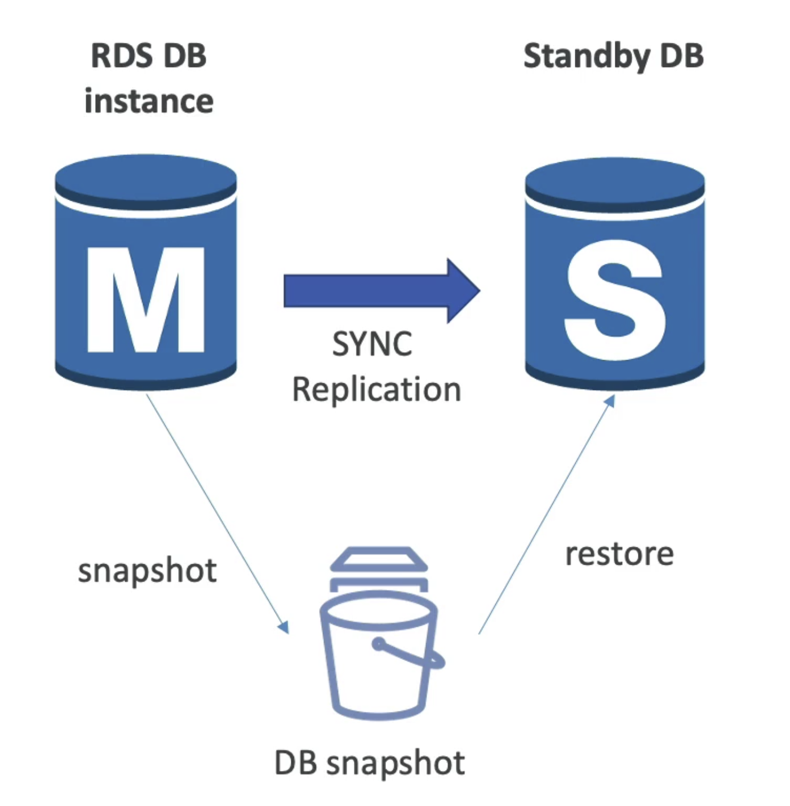
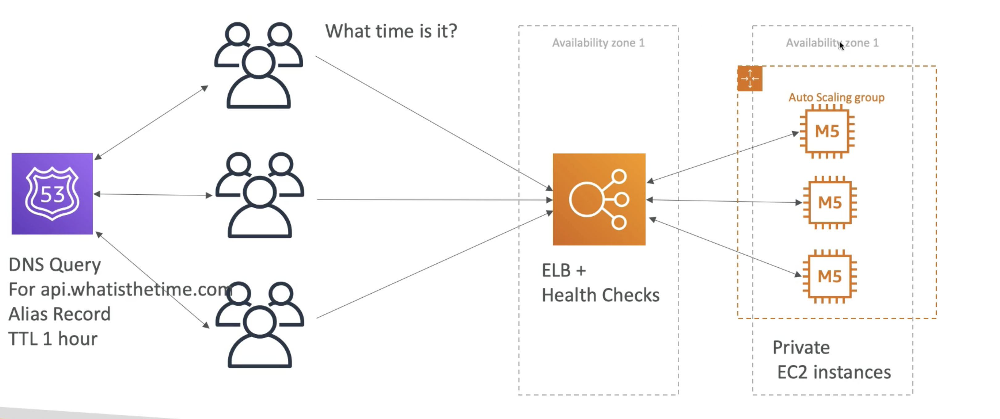
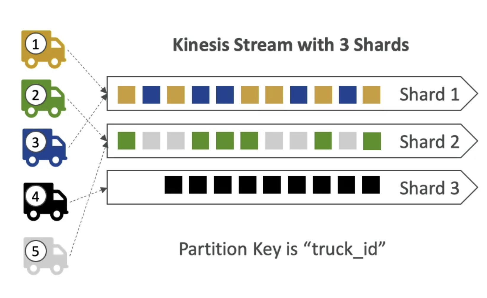
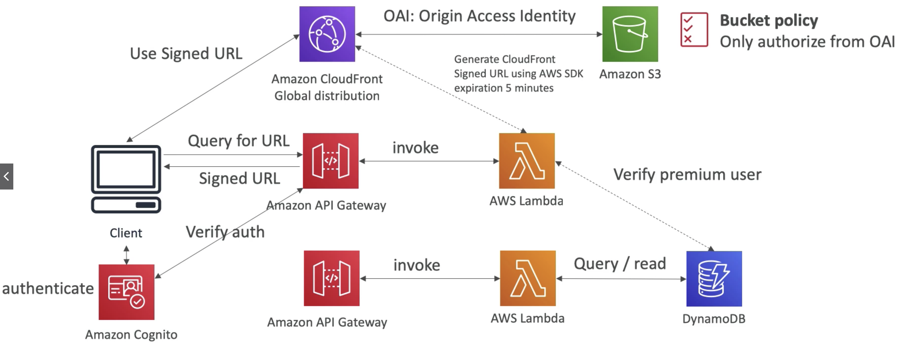
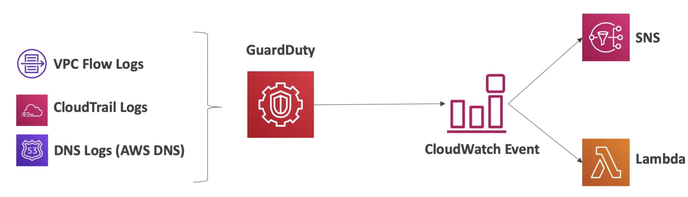
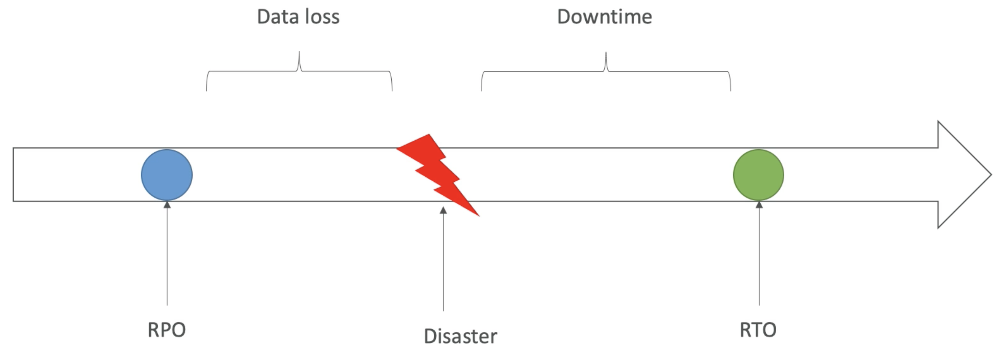
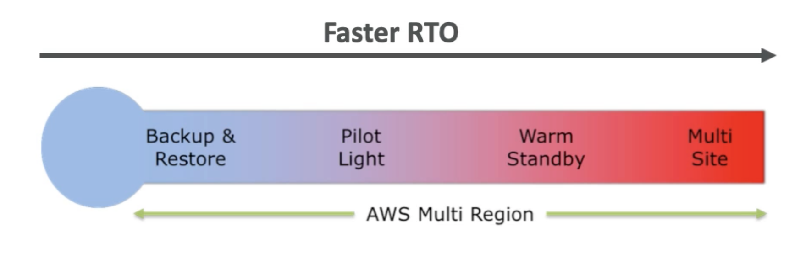
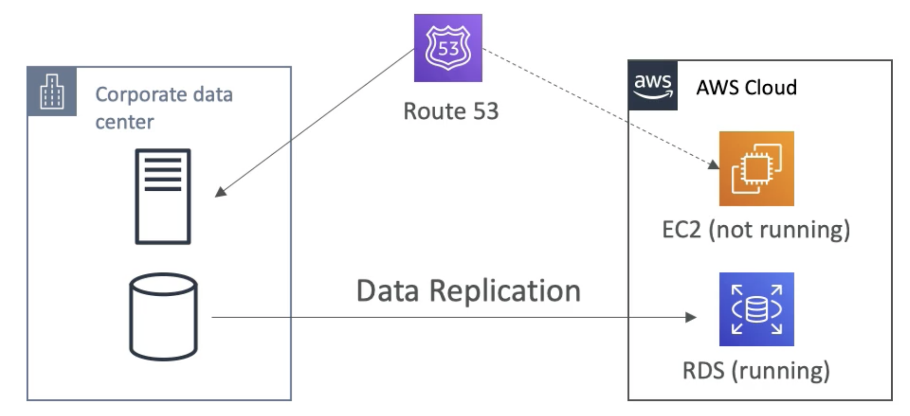

# AWS Certified Solutions Architect Associate                 

# Getting Started with AWS           

## AWS Cloud Overview - Region & AZ                

**AWS Regions**                  
AWS has **Regions** all around the world. Region has a name: us-east-1, eu-west-3, etc.                 
A region is a cluster of data centers.                  
Most AWS services are region-scoped                       

How to choose an AWS Region ?              
1. **Compliance** with data  governance and legal requirements: data never leaves a region without your explicit permission                 
2. **Proximity** to customers: reduced latency                       
3. **Available services** within a Region: not all regions have all services, new services and new features are not available in every region                       
4. **Pricing**: pricing varies region to region and is transparent in the service pricing page                    

For region-scoped services (e.g. EC2), when we switch region in AWS console, we will have a completely new different sets of resources.           

Resources are scoped to the Region for most services in AWS.                 

**AWS Availability Zones**                 
Each region has many availability zones, usually 3, min is 2, max is 6. e.g.             
Region: ap-southeast-2 has 3 AZ:             
ap-southeast-2a                
ap-southeast-2b                 
ap-southeast-2c                   

Each AZ is one or more discrete data centers with redundant power, networking and connectivity                 
They are separate from each other, so that they are isolated from disaters                  
They are connected with high bandwidth, ultra-low latency networking                        
They are linked together and form a region                 

**AWS Points of Presence (Edge Locations)**                             
Amazon has 216 Points of Presence (205 Edge Locations & 11 Regional Caches) in 84 cities across 42 countries.               
Content is delivered to end users with lower latency                

From Global Infrastrucutre, we can see which services are available within region.               

# IAM & AWS CLI           

## IAM Introduction: Users, Groups, Policies                         

**Global** services                    

IAM = Identity and Access Management        

When we create an account, we created a **root** account by default. This should NOT be used or shared.                            

We should create IAM **Users**. **Users** are people within your organisation, and can be grouped.                       

Groups can only contain Users, not other groups.                   
Users don't have to belong to a group, and user can belong to multiple groups.          

          

Users or Groups can be assigned JSON documents called policies.                
These policies define the permissions of the user.                 

In AWS you apply the **least privilege principle**: DO NOT give more permissions than a user needs.                                 

This is an example of IAM policy:                       
```
{
    "Version": "2012-10-17",
    "Statement": [
        {
            "Effect": "Allow",
            "Action": "ec2:Describe*",
            "Resource": "*"
        },
        {
            "Effect": "Allow",
            "Action": "elasticcloadbalancing:Describe*",
            "Resource": "*"
        },
        {
            "Effect": "Allow",
            "Action": [
                "cloudwatch:ListMetrics",
                "cloudwatch:GetMetricsStatistics",
                "cloudwatch:Describe*"
            ],
            "Resource": "*"
        }
    ]
}
```

Another example for the policy: AdminstratorAccess: (Note the star means everything)             

```
{
    "Version": "2012-10-17",
    "Statement": [
        {
            "Effect": "Allow",
            "Action": "*",
            "Resource": "*"
        }
    ]
}
```                               
For users, we can add tags, where we can mark the users and add in some attributes.                    

After log in we can notice that if the user accout is something like `stephane@stephane-ccp`, this means that this account is logged in as IAM user. The part after `@` is the account alias (e.g. can be `stephane-aws` for the account `stephane-ccp`, or the account name itself). If the user account is just `stephane-ccp` then this is logged in with root user (`stephane-ccp` is the account name).      

To grant permissions to User, we can either add the user into a group (which has the group policy, so this user will inhereit this group policy) or assign a policy directly to the user (this is called a inline policy). We can also create our own custom policy either use the GUI or write in JSON.          

IAM Policies Structure:                  


By clicking on the policy, we can also view what are the services that we have (full) access to.                 

## IAM MFA Overview

To protect the AWS account, we have 2 defense mechanisms:      

1) IAM Password Policy (helpful against brute force attack)         

-> Set minimum password length      
-> Requires specific character types: upper/lower case letters, numbers or non-alphanumeric characters.       
-> Allow all IAM users to change their own passwords       
-> Require users to change their password after some time                   
-> Prevent password reuse                 

2) Multi Factor Authentication - MFA        

On AWS this is a must and very recommended to use it. **We want to protect Root Account and IAM users**.      
MFA = password you know + security device you own         

MFA devices options in AWS:         
1) Virtual MFA device:       
Google Authenticator: phone only      
Authy: multi-device, and supports multiple tokens on a single device.       

2) Universal 2nd Factor (U2F) Security Key:      
YubiKey by Yubico (3rd party): support for multiple root and IAM users using a single security key, act as an USB-based key                

3) Hardware Key Fob MFA Device:    
Gemalto (3rd party)      
4) Hardware Key Fob MFA Device for AWS GovCloud (US):           
SurePassID (3rd party)             

## AWS CLI             

How can users access AWS ? There are 3 options:    
1) AWS Management Console (protected by password + MFA, for Root Account or other users)       
2) AWS Command Line Interface (CLI): protected by access keys      
3) AWS Software Developer Kit (SDK): this is mainly for code, (when your code is trying to access AWS), also protected by access keys    

Access keys are generated through the AWS Console. Users manage their own access keys and these keys are **private**.    
Access key have 2 components:            
Access Key ID (username) and Secret Access Key (password).   

We have to install (OS specific) client and configure the CLI with the Access Key ID and the Secret Access Key in order to use command line to access AWS.         

AWS SDK:                 
-> AWS Software Development Kit (AWS SDK0)                      
-> Language-specific APIs (set of libraries)                   
-> Enables you to access and manage AWS services programmatically                
-> Embedded within your application (not launched from the terminal)               
-> e.g. AWS CLI is built on AWS SDK for Python                   

## AWS CloudShell

There is an alternative to install the CLI and configure it, this is called CloudShell. At the top right corner of the AWS Console there is a `terminal` icon we can launch. This is basically CLI in the cloud with pre-installed tools, storage (1 GB per AWS region) and saved files/settings.       

We can directly run AWS command directly in the CloudShell instead on the local CLI. e.g. `aws --version` to check the version of the AWS CLI installed or `aws iam list-users` to list the IAM users.        

The credentials used by the CloudShell is the same credentials as the user we logged in to the console with, at the moment we launch the CloudShell.             

## IAM Roles for AWS Service           

Some AWS services will need to perform actions on our behalf and on our account. We have to assign permissions to AWS services with IAM Roles.    

IAM Roles are just like users, but they are intended to be used *not* by physical people, but instead used by AWS Services.        

             

A quick example will be we created an EC2 instance (virtual server), and this EC2 instance would like to perform some action on AWS. To do so we need to give permissions to this EC2 instance. We will create an IAM Roles and together with the EC2 instance (as one entity), they can access AWS.     

Some common roles includes: EC2 Instance Roles, Lambda Function Roles, Roles for CloudFormation.        

## IAM Security Tools    

IAM Credentials Report (account level):      
We can create this report at the account level. This is a report that lists all your account's users and the status of their various credentials.         

IAM Access Advisor (user level):            
Access advisor shows the service permissions granted to a user and when those services were last used. We can use this information to revise your policies based on principle of least privilege.           

## IAM Best Practices

Do not use the Root Account except for AWS account setup      
One physical user = One AWS user       
**Assign users to groups** and assign permissions to groups (such that we manage permissions at a group level)           
Create a strong password policy       
Use and enforce the use of MFA              
Create and use Roles for giving permissions to AWS services           
Use Access Keys for Programmatic Access (CLI/SDK)      
Audit permissions of your account with the IAM Credential Reports (also IAM Access Advisor)    
Never share IAM users and Access keys        

## IAM Summary

Users: mapped to a physical user, has password for AWS Console         
Groups: contains users only (it is best to group users together)     
Policies: JSON document that outlines permissions for users or groups        
Roles: if we are within AWS, we can use roles to give permissions to AWS services to perform tasks      
Security: MFA + password policy        
Access Keys: access AWS using the CLI or SDK        
Audit: IAM Credential Reports and IAM Access Advisor          

# EC2 Fundamentals                

## EC2 Basics

One of the most popular AWS service and it is a Infrastructure as a Service (IaaS).            

EC2 = Elastic Compute Cloud             

It is comprised of many things (and capabilities) at a high level:            
-> You can rent virtual machinese on EC2 (they are called EC2 instances)          
-> You can store data in on their virual drives (they are called EBS volumes)              
-> You can distribute load across machines (Elastic Load Balancer, ELB)          
-> You can scale services using auto-scaling group (ASG)           

Knowing how EC2 works is *fundamental* to understand how Cloud works.      

EC2 sizing & configuration option: what can we choose for our instances (virtual servers) ?     

-> Operating System (OS): Linux or Windows or Mac        
-> How much compute power & cores (CPU)       
-> How much random-access memory (RAM)            
-> How much storage space: Network-attached (EBS & EFS) or hardware-attached (EC2 Instance Store)           
-> The Network card that is attached to the EC2 instance: speed of the card, public IP address        
-> Firewall rules: **security group**              
-> Bootstrap script (configure at first launch): Configuration script needs to be run at first launch, this is called EC2 User Data           

The `t2.micro` instance is included in the AWS free-tier. It has 1 vCPU, 1 GiB Mem and EBS storage.         

**EC2 User Data**            
It is possible to bootstrap our instances using an EC2 User Data scirpt.              
*Bootstrapping* means launching commands when a machine starts             
That script is *only run once* at the instance first start                
EC2 user data is used to automate boot tasks such as:            
-> installing updates           
-> installing software         
-> downloading common files from the internet           
The EC2 User Data Script runs with the root user (any command you have will have the pseudo rights)             

## Create an EC2 Instance with EC2 User Data to have a Website (hands-on)

1. Log in AWS Console, search for EC2, go to EC2 Console    
2. Choose region (e.g. closest to you)
3. Go to `Instances` on the right panel and `Launch Instance`
4. Choose Amazon Machine Image (AMI), we can choose from Quick Start and select Amazon Linux 2 AMI (64-bit x86) which is free-tier eligible.          
5. Choose an Instance Type (e.g. t2.micro for free tier), note that we are launching the instances in a default VPC (if we don't change the settings)          
6. Configure Instance Details: Under `User Data` we can run a user data which is only run at the first boot of the instance. (an example script is given, which is going to launch a web server onto our EC2 instance and write a file to it)
7. Add Storage (check `Delete on Termination`)
8. Add tags
9. Configure Security Group: create a new security group and Add Rule (HTTP, port 80)
10. Review and launch (will be prompted to use a key pair (for SSH)) 
11. Create a new key-pair (public-private key) and download the key pair

We can then use the public IPv4 address to access the website. To stop the instance, we can right click the instance and `Stop Instance`. To get rid of the instance, choose `Terminate Instance`.       

Note that if we stop an instance and restart it again, the public IPv4 **is going to change**. The private IPv4 will not change.        

## EC2 Instance Types Basics

AWS has the following naming convention (example):          
m5.2Xlarge         
m: **instance class**, in this case a general purpose instance         
5: **generation** of the instance (AWS improves them over time)         
2xlarge: **size** within the instance class         

**For exam we need to know this**, for various EC2 Instance Types:              
1. General Purpose        
Great for a diversity of workloads such as web servers or code repositories              
Balance between:        
-> Compute           
-> Memory              
-> Networking                  
t2.micro is a General Purpose EC2 Instance (free tier)             

2. Compute Optimized        
Great for compute-intensive tasks that require high performance processors:      
-> Batch processing workloads       
-> Media transcoding      
-> High performance web server              
-> High performance computing (HPC)            
-> Scientific modeling and machine learning            
-> Dedicated gaming servers               
Currently all the Compute Optimized EC2 Instance start with `c`, e.g. c5 or c6.     

3. Memory Optimized                
Fast performance for workloads that process large data sets in memory (RAM)       
Use cases includes:         
-> High performance, relational/non-relational databases        
-> Distributed web scale cache stores                
-> In-memory databases optimzed for BI           
-> Applications performing real-time processing of big unstructured data                   
These instances starts with `r`.             

4. Storage Optimized                      
Great for storage-intensive tasks that require high, sequential read and write access to large data sets on local storage     
Use cases include:        
-> High frequency online transaction processing (OLTP) systems    
-> Relational & NoSQL databases            
-> Cache for in-memory databases (e.g. Redis)       
-> Data warehousing applications                 
-> Distributed file systems           
These instance starts with `i`, `d` or `h1`.        

## Security Groups & Classic Ports Overview

Security Groups are the fundamental of network security in AWS.             
They control how traffic is allowed into or out of our EC2 Instances.    
Security Groups only contains *allow* rules, i.e. what is allowed to go in or go out.    
Security Groups rules can reference by IP address (i.e. where is your computer) or by Security Groups (i.e. Security Groups can reference each other).                

              

For example we are on our computer (i.e. public internet) and we would like to access our EC2 Instance. We will have to create a Security Group around our EC2 Instance (that is the firewall around it) and this Security Group is going to have rules that control which inbound traffic is allowed into the EC2 Instance and if the EC2 Instance can perform some Outbound traffic.      

Security Groups are acting as a "firewall" on EC2 Instance. They regulate:          
1. Access to Ports
2. Authorised IP ranges: IPv4 and IPv6 (e.g. 0.0.0.0/0 means any IP address is authorised)
3. Control of inbound network (i.e. from others to the EC2 Instance)
4. Control of outbound network (i.e. from EC2 Instance to others)

A quick example of Security Group works is shown below:           
     

For unauthorised inbound traffic, it will be a timeout error. By default for any Security Group, it will allow all outbound traffic out of the EC2 Instance. For example, if our EC2 Instance try to access a website, the Security Group is going to allow it.         

Security Groups good-to-know:            
-> can be attached to multiple instances          
-> instances can have multiple security groups              
-> Locked down to region/VPC combination           
-> Does live "outside" the EC2 - if traffic is blocked the EC2 instance won't see it (i.e. not like an application that runs on EC2)            
-> It is good to maintain one sepearate security group for SSH access                  
-> If your application is not accessible (time out), then it is a security group issue               
-> If your application gives a "connection refused" error, then it is an application error or it is not launched.           
-> By default, all inbound traffic is **blocked**           
-> By default, all outbound traffic is **authorised**                     

Referencing other security groups:                 
            

In the inbound rule for the EC2 instance, it is authorising Security Group 1 inbound AND Security Group 2. When another EC2 instance has Security Group 2, it can connect straight through on the port of the first EC2 instance. So regardless of the IP address, because they have the right Security Group attached to them, they are able to communicate straight through to other instances.                 

Classic Port we need to know (**EXAM**):        
1. 22 = SSH (Secure Shell) - log into a EC2 Instance on Linux
2. 21 = FTP (File Transport Protocol) - upload files into a file share
3. 22 = SFTP (Secure File Transport Protocol) - upload files using SSH
4. 80 = HTTP - access unsecured websites
5. 443 = HTTPS  - access secured websites
6. 3389 = RDP (Remote Desktop Protocol) - log into a Windows instance

## SSH Overview


## SSH with Mac

When creating the EC2 Instance, we have created a key pair and download it (e.g. `ec2tutorial.pem`). We will need this key pair to SSH into this instance.      
```
ssh -i ec2tutorial.pem ec2-user@35.180.100.144
```
`ec2-user` is basically the Linux user in Amazon Linux machine. `35.180.100.144` is the IPv4 Public IP of the EC2 Instance.      

The above command will **fail**. This is because the first time we download the file, the permission is 0644 for the file. And this is too open for the private key, this means that the private key can leak, and it is accessable by others and it is a bad permission. The remedy is to change the file permission via:      
```
chmod 0400 ec2tutorial.pem
```
Run the SSH command again and we will be able to SSH into the EC2 instance. Once we are inside we can query the user (`whoami`) or ping a website (`ping google.com`)          

Note that in Windows 10 the `chmod` command does not exist. We will have to go to the property of the `.pem` file. We cab go to the Security tab and disable inherentence then remove all other user except yourself.        

To exit we can just press `exit` or `ctrl + d` to close the connection. (or `ctrl + c` or type `exit`)      

Note that on Windows when we use PuTTY, we need the PuTTygen to convert the key pair, which is in `.pem` to `.ppk` format so that PuTTY can use. Then after launching PuTTY and put in the public IPv4 of the EC2 Instance, we need to go to Connection -> SSH -> Auth to link the `.ppk` file.            

## EC2 Instance Connect

There is another way to connect to an EC2 Instance directly from AWS. We can click Connect in the AWS EC2 dashboard (where the list of EC2 Instance is shown). We can connect via EC2 Instance Connect after use a username. Note that this methods do not work with all type of AMIs in AWS. At the backend, it upload a temporary SSH key on your EC2 Instance for you. This methods ultimately still rely on SSH, so if we remove SSH rules from the Security Groups setting we will meet a timeout error if we use EC2 Instance Connect. So even though this method is based on browser, port 22 still needs to be opened for this method

## EC2 Instance Role Demo

After we connect to our EC2 Instance (via EC2 Connect) with our user, if we perform something like `aws iam list-users`, the CLI will prompt us to configure AWS to get our credentials. We can use `aws configure` to enter AWS Access Key ID and Secret Access Key but it is very bad practice. We can attach a Role to this instance (for example a Role with `IAMReadOnlyAccess` could allow us to run `aws iam list-users` without inputing credential again)                

## EC2 Instance Launch Types

EC2 Instances purchasing options:         
1. On-Demand Instances: short workload, predictabel pricing     
Sometimes we will need to use the serve for a long time and we can get some cost saving through:        
2. Reserved(**minimum 1 year**): 3 types       
-> Reserved Instances: long workload (e.g. database)       
-> Convertible Reserved Instances: long workload with flexible instances       
-> Scheduled Reserved Instances: example, every Thurs 3-6 pm     
3. Spot Instances: short workloads, cheap, can lose instances (less reliable)      
4. Dedicated Host: book an entire physical server, control instance placement        

Exam will ask you question and expect us to find the best of EC2 for various situations for cost saving or comply with some rules.    

**EC2 On Demand**:      
We pay for what we use:       
-> Linux machine: billing per second, after the first minute         
-> All other OS: billing per hour when instance is running      
Has the *highest* cost but no upfront payment      
No long-term commitment        

Recommended for **short-term** and **un-interrupted workloads**, where you cannot predict how the application will behave.      

**EC2 Reserved Instances**:       
Up to 75% discount compared to On-Demand.        
Reservation period: 1 year = + discount | 3 years = +++ discount (ONLY 1 or 3 years, not any time in between)       
Purchasing options: no upfront | partial upfront = + discount | All upfront = ++ discount        
Reserve a specific instance type (t2.micro etc)      

Recommended for steady-state usage applications (think database)        

Convertible Reserved Instnace:      
-> can change the EC2 instance type (e.g. t2.large to c3.large)        
-> up to 54% discount      

Scheduled Reserved Instances       
-> launch within specific time window you reserve          
-> require a fraction of day / week / month      
-> still commitment over 1 to 3 years      

**EC2 Spot Instances**:       
Provides the highest discount, can get up to 90% compared to On-Demand      
Instances that you can lose at any point of time if your max price (you are willing to pay for them) is less than the current spot price (the spot price changes over time)          
The MOST cost-efficient instances in AWS       

Useful for workloads that are resilient to failure (e.g. won't lose the progress of your work if you lose that instance)       

Recommended: batch jobs, data analysis, image processing, any distributed workloads, workloads with a flexible start and end time.       
Not suitable for critical jobs or databases.          

**EC2 Dedicated Hosts**:         
An Amazon EC2 Dedicated Host is a physical server with EC2 instances capacity fully dedicated to your use. Dedicated Hosts can help you address **compliance requirements** and reduce costs by allowing you to **use your existing server-bound software licenses**.       

These hosts are going to be allocated for a 3-year period reservation.      
More expensive     

Useful for software that have complicated licensing model (BYOL - Bring Your Own License)    
Or for companies that have strong regulatory or complicance needs.        
Since AWS shares all their server with everyone, this will ensure no one is using the server except you.      

**EC2 Dedicated Instances**:      
These are for EC2 Instances running on hardware that is dedicated to you.        
May share hardware with other instances in the same account.         
No control over instance placement (hardware control). So this is more like a software-version of Dedicated Host.           
      

Which purchasing option is right for me ?       
On-Demand: coming and staying in resort whenever we like, we pay full price.           
Reserved: like planning ahead and if we plan to stay for a long time, we may get a good discount.        
Spot instances: the hotel allows people to bid for the empty rooms and the highest bidder keeps the room. You can get kick out at any time.       
Dedicated: we book entire building of the resort.        

An example of cost comparison using m4.large instance:    
   

# EC2 - Solution Architect Associate Level             

## Private vs Public vs Elastic IP        

Networking has two sorts of IPs: **IPv4** and **IPv6**.             
IPv4: 4 numbers seperated by 3 dots, e.g. 1.160.10.240             
IPv6: 3ff2: 1900:4545:3:200:f8ff:f221:67cf                

IPv4 is still the most common format used online         
IPv6 is newer and solves problems for the Internet of Things (IoT)                

IPv4 allows for **3.7 billion** different addresses in the public space:             
[0-255].[0-255].[0-255].[0-255]                  

              

When you have a public IP, you are accessible over the internet and when you have a private IP, you are only accessible within your private netowrk.             

**Fundamental Differences**:                  
Public IP:          
-> Public IP means the machine can be identified on the internet (WWW)             
-> must be unique across the whole web (not two machines can have the same public IP)           
-> can be geo-located easily           
Private IP:             
-> Private IP means the machine can only be identified on a private network only         
-> IP must be unique across the private network            
-> BUT two different private networks (e.g. 2 companies) can have the same IPs        
-> machines connect to WWW using a NAT + internet gateway (a proxy)         
-> only a specified of IPs can be used as private IP            

**Elastic IPs**         
When you stop and then start an EC2 instance, it can change its public IP.                
If you need to have a fixed public IP for your instance, you need an Elastic IP              
An Elastic IP is a public IPv4 IP you own as long as you don't delete it                
You can attach it to one instance at a time                   
With an Elastic IP address, you can mask the failure of an instance or software by rapidly remapping the address to another instance in your account                    

You can only have 5 Elastic IP in your account (you can ask AWS to increase that)               

Overall, try to avoid using Elastic IP.               
-> they often reflect poor architectural decision             
-> instead, use a random public IP and register a DNS name to it                 
-> or, use a Load Balancer and don't use a public IP              

In EC2:         
By default, your EC2 machine comes with:         
-> a private IP for the internal AWS Network         
-> a public IP, for the WWW          

When we are doing SSH into our EC2 machines:         
-> we can't use a private IP, because we are not in the same network          
-> we can only use the public IP (if you don't have a VPN)         

If your machine is stopped and then started, the public IP can change            

We can find the Elastic IP in the EC2 console (under Network & Security), and we can allocate a new IP address from Amazon's pool of IPv4 addresses. By doing this we can create an IP address we own now, and this can be allocated to a specific EC2 instance. Now if we stop and restart an EC2 instance with an Elastic IP, (the public IPv4 is going to be the same as the Elastic IP associated to this EC2 instance), the Public IPv4 will remain the same.                

## Spot Instances & Spot Fleet    

Can get a discount of up to 90% compared to On-Demand          

Define **max spot price** and get the instance while **current spot price < max**              
-> the hourly spot price varies based on offer and capacity             
-> if the current spot price > your max price you can choose to **stop** or **terminate** your instance with a 2 minutes grace period              
Other strategy: **Spot Block**            
-> "block" spot instance during a specified time frame (1 to 6 hours) without interruptions                
-> in rare situations, the instance may be reclaimed             

Used for batch jobs, data analysis, or workloads that are resilient to failures.               
Not great for critical jobs or databases                

How do we terminate a spot instance ?                 

                          

Consider a spot request: we are defining how many instances we want, maximum price we are willing to pay, launching specifications (AMI etc) and when our request is *valid from* and *valid until* and **request type**.             
There are 2 types of request types: **one-time request** or **persistent request**                

If it is a **one-time request**, as soon as your spot request is fulfiled, our instances are going to be launched and then the spot request **GOES AWAY**. If it is a **persistent**, this means that we want these requested instance as long as the spot request is valid from to valid until. This means that if the instances do get stopped/interrupted, then our spot requests will go back into action. AWS will restart spot instances for us when the conditions are met.                

We can only cancel Spot Instance requests that are open, active or disabled.               
Cancelling a spot request DOES NOT terminate instances (its our responsibility to terminate these spot instances).             
We must first cancel a spot request, and then terminate the associated spot instances, else the spot request will re-start the instances.                 

**Spot Fleets**                  
Spot Fleets = set of Spot Instances + (optional) On-demand Instances                  
The Spot Fleets will try to meet the target capacity with price constraints               
-> define possible launch pools: instance type (m5.large), OS, AZ               
-> we can have multiple launch pools, so that the fleet can choose. The fleet can choose the best and most appropriate launch pool for you                  
-> Spot Fleet stops launching instances when reaching capacity or max cost            

Strategies to allocate Spot Instances (EXAM):                
-> lowestPrice: from the pool with the lowest price (cost optimization, short workload)           
-> diversified: distributed across all pools (great for availability, long workloads)               
-> capacityOptimized: pool with the optimal capacity for the number of instances                 

Spot Fleets allow us to automatically request Spot Instances with the lowest price, i.e. Spot Fleet gives us an extra saving based on spot instances because it is smart enough to choose the right spot instance pools to allow us to get the maximum amount of savings.           

## EC2 Placement Groups

Sometimes we want control over the EC2 instance placement strategy (i.e. how the EC2 instances is placed within the AWS infrastructure)                

That strategy can be defined using placement groups              

When we create a placement group, you specify one of the following strategies for the group:          
-> *Cluster*: clusters instances into a low-latency group (hardware setup) in a single AZ - **high performance, high risk**            
-> *Spread*: spreads instances across underlying hardware (max 7 instances per group per AZ) - **critial applications**             
-> *Partition*: spreads instances across many different partitions (which rely on different sets of racks) within an AZ. Scales to 100s of EC2 instances per group (Hadoop, Cassandra, Kafka).                

**Cluster**:           

                 

For Cluster, it means that all of our EC2 instances are on the same rack (means same hardware, same AZ).            
Pros: Great network (10 Gbps bandwidth between instances)           
Cons: if the rack fails, all instances fails at the same time                
Use cases:           
-> Big Data job that needs to complete fast            
-> Application that needs extremely low latency and high network throughput              
**Willing to take on the risk of failure**                    

**Spread**:              

               

We have 3 AZ and 6 EC2 instances, and each instance is on a different hardware.          
Pros:           
-> can span across AZ              
-> reduce risk in simultaneous failure             
-> EC2 Instances are on different physical hardware            

Cons:            
-> limited to 7 instances per AZ per placement group           

Use cases:              
-> Application that needs to maximize high availability           
-> Critical applications where each instance must be isolated from failure from each other           

**Partition**:               

             

We can have up to 7 partitions per AZ. And on each partition we can have many EC2 instances.         
Each partition represent a rack on AWS -> so instances are safe from rack failure affecting one another.              
Can span across multiple AZs in the same region               
Up to 100s of EC2 instances.               
The instances in a partition do not share racks with the instances in the other partitions             
A partition failure can affect many EC2 instances but won't affect other partitions             
EC2 instances get access to the partition information as metadata.                

Use cases: HDFS, HBase, Cassandra, Kafka                

We can create new placement group and assign EC2 instances during launching, or directly create the new placement group during the instance launching (after selecting AMIs etc)            


## Elastic Network Interfaces (ENI) - Overview             

Logical component in a VPC that represents a **virtual network card**             
They are used outside of EC2 instances as well.              

             

For example we have 1 EC2 instance in a AZ. There is a primary ENI `Eth0` attached to it.           
This will provide your EC2 instance network connectivity and (e.g.) Private IP.              

Each ENI can have the following attributes:            
-> primary private IPv4, one or more secondary IPv4 (here `Eth1` is a secondary ENI, this will give another IPv4)                                
-> One Elastic IP (IPv4) per private IPv4           
-> One Public IPv4              
-> One or more security groups           
-> a MAC address             

You can create ENI independently and attach them on the fly (move them) on EC2 instances for failover         
In the example above, we can move `Eth1` so that the private IP is moved to the second EC2 instance.                      
Bound to a specific AZ.                 

ENI is automatically created during EC2 Launching, we can create ENI manually and attach to them. These manually created ENI is going to stay (under `Network interfaces`) after the EC2 instances are terminated.                

## EC2 Hibernate          

We can stop and terminate instances:             
-> Stop: the data on disk (EBS) i skept intact in the next start            
-> Terminate: any EBS volumes (root) also *set-up to be destroyed* is lost               

On start, the following happens:          
-> First start: the OS boots & the EC2 User Data script is run             
-> Following start (stop and then restart): the OS boots up, then your application starts, caches get warmed up, and that can take time           

**EC2 Hibernate**       
The in-memory (RAM) state is preserved          
The instance boot is much faster (the OS is not stopped/restarted)             
Under the hood: the RAM state is written to a file in the root EBS volume              
The root EBS volume must be encrypted           

           

Use cases:           
-> long-running processing          
-> saving the RAM state          
-> services that take time to initialise             

EC2 Hibernate - Good to know           

Supported instance families - C3, C4, C5, M3, M4, M5, R3, R4 and R5          
Instance RAM size - must be less than 150 GB          
Instance size - not supported for bare metal instances              
AMI: Amazon Linux 2, Linux AMI, Ubuntu and Windows            
RootVolume: must be EBS (so not Instance Store), encrypted and large               
Available for On-Demand and Reserved Instances                  

An instance cannot be hibernated more than 60 days             

During EC2 launching, we can enable hibernation as an additional stop behavior              

## EC2 - Advanced Concepts (Nito, vCPU, Capacity Reservations)             

1. EC2 Nitro          

Underlying Platform for the next generation of EC2 instances               
New virtualisation technology             
Allows for better performances:               
-> better networking options (enhanced netowrking, HPC, IPv6)               
-> **High Speed EBS (Nitro is necessary for 64,000 EBS IOPS - max is 32,000 on non-Nitro)**           
Better underlying security             
Instance types example:         
-> Virtualised, A1, C5, C5a, C5ad, D3, D3gen, M5, M5a etc. (anything new will have Nitro in it)            
-> Bare metal: a1.metal, c5.metal, c6g.metal, etc.             

2. vCPU           

Multiple threads can run on one CPU or Core (multithreading)            
Each thread is represented as a virtual CPU (vCPU)             
e.g. launching m5.2xlarge:              
-> 4 CPU             
-> 2 threads per CPU (8 threads total)             
-> so 8 vCPU in total

We can optimise CPU options:           
EC2 instances come with a combination of RAM and vCPU              
In some rare cases, you may want to change the vCPU options (e.g. reduce):             
-> no. of CPU cores: you can decrease it (helpful if you need high RAM and low number of CPU) - decrease licensing costs           
-> no. of threads per core: disable multithreading to have 1 thread per CPU - helpful for high performance computing (HPC) workloads           

Only specified during the instance launch            

             

3. Capacity Reservations         

Capacity Reservations ensure you have EC2 Capacity when needed          
Manual or planned end-date for the reservation         
No need for 1 or 3-year commitment           
Capacity access is immediate, you get billed as soon as it starts           

Specify:       
-> the AZ in which to reserve the capacity (only one), if needed in 3 AZ, we need to do 3 Capacity Reservations              
-> the number of instances for which to reserve capacity            
-> the instance attributes, including the instance type, tenancy, and platform/OS             

Combined with Reserved Instances and Saving Plans to do cost saving                 

# EC2 Instance Storage      

## EBS Overview    

## EBS Overview

An EBS (Elastic Block Store) Volume is a *network* drive you can attach to your instances while they run.         
It allows your instances to persist data, even after their termination: we can re-create the instances and mount the same EBS Volume from before and we will get back our data.              
They can only be **mounted to one instance at a time** (at the CCP exam level)      
They are bound to **a specific availability zone** when we create an EBS Volume: you cannot have an EBS Volume created in US-East-1A and attach to an instance in US-East-1B            

Analogy: think of them as a "network USB stick"             
Free tier: 30GB of free EBS storage of type General Purpose (SSD) or Magnetic per month         

EBS Volume:            
1. network drive (i.e. not a physical drive)            
-> it uses the network to communicate the instance, which means there might be a bit of latency from one computer to reach another server                
-> can be detached from an EC2 Instance and attached to another one quickly    
2. locked to an Availability Zone (AZ)        
-> an EBS volume in us-east-1a cannot be attached to us-east-1b             
-> to move a volume across from different AZ, we need to snapshot it            
3. Have provisioned capacity (i.e. we have to provision capacity in advance): size in GBs, and IOPS (IO operations per second)           

An EBS example is given below, at CCP level, one EBS can only be attached to one EC2 Instance, but multiple EBS volume can be attached to one EC2 Instance:               
              

**Delete on Termination Attribute**         
When we create EBS volume through EC2 Instances, there is the Delete on Termination attribute.          

              

By default, it is ticked for the Root Volume and not the new EBS volume.           
This controls the EBS behavior when an EC3 instance terminates             
-> By default, the root EBS volume is deleted (attribute enabled)             
-> By default, any other attached EBS volume is not deleted (attribute disabled)              
This can be controlled by the AWS console / AWS CLI              

Use case: preserve root volume when instance is terminated                    

## EBS Hands On

In the EC2 services, when we select the EC2 Instance, we can check the `Root Device` and `Block Devices`, and they both link the to same EBS Volume. When we click on them there will be an EBS ID (we can also access the EBS Volume under Elastic Block Store at the side bar).             

We can also create a stand-alone EBS volume in EC2 service. We will have to select the same Availability Zone as our instance. After creating the EBS Volume, it will appear in the `Elastic Block Store` under `Volumes`. We can then attach this volume to an instance.                 

If we terminate the EC2 Instance, the EBS Volumes which do not have "Delete on Termination" set to True will persist after the instance is terminated. By default, the root EBS Volume was created with termination in mind.      

## EBS Snapshots Overview

We can make a backup (snapshot) of our EBS volume at a point in time. We will be able to backup the state of it and even if the EBS volume is terminated later on, we can restore it from that backup.       

It is *not* necessary to detach volume to do snapshot, but *recommended*, just to make sure everything is clean on the EBS volume.      

We can also copy snapshots across Availability Zones or Region: we can transfer data in a different region to leverage on the global infrastructure of AWS.       

A simple illustration: the snapshot of the EBS volume will exist in your Region and can be used to restore into a EBS volume in another Availability Zone.                         
           

We can create the snapshot in EC2 service and the snapshots can be seen under `Elatic Block Store` (at the side bar) under `Snapshots`.      

We can copy snapshot into a new snapshot. This new snapshot can be in *ANY* Region that we want.     

We can create an EBS volume from the snapshot, and we can create the volume in a different Availability Zones (but same Region from the original EBS volume)       

## AMI Overview

AMI = Amazon Machine Image           

They represent a customisation of an EC2 Instance       
-> add our own software, configuration, operating system, monitoring              
-> Faster boot / configuration time because all our software that we want to install is pre-packaged through AMI              

AMI are built for a **specific region**, and can be copied across Regions. 

We can launch EC2 Instances from:             
-> A Public AMI: AWS provided            
-> Your own AMI: you make and maintain them yourself            
-> An AWS Marketplace AMI: An AMI someone else made (and potentially someone sells them)               

AMI Process (from an EC2 Instance)               
-> start an EC2 instance and customize it      
-> stop the instance (for data integrity)        
-> build an AMI: this will create EBS snapshots behind the scenes              
-> finally we can launch instances from other AMIs       

Simple illustration on creating AMI and then use it to launch an EC2 instance:              
                    

To create an AMI from existing EC2 Instance, we right click -> image -> create image.     

After the AMI is created, we can go to Images (at the sidebar) -> AMI, select the AMI and create an EC2 Instance. Go to `Launch Instance` and instead of selecting existing public AMI, we can choose My AMIs. We still needs to select instance type (e.g. t2.micro) but we don't need to input "User Data". This can save a lot of time (e.g. configure and install software on our other EC2 Instances).       

## EC2 Instance Store

EBS volumes are **network drives** with good but "limited" performance         
**If we need a high-performance hardware disk, use EC2 Instance Store.** EC2 Instance is a virtual machine but it is attached to a real hardware server and some of these servers do have disk space that is attached directly with a physical connection onto the server.      

They have better I/O performance       
EC2 Instance Store lose their storage if they are stopped (ephemeral) i.e. the EC2 Instance that has an Instance Store are stopped or terminated                
User case: Good for buffer / cache / scratch data / temporary content but NOT for long-term storage              
Risk of data loss if hardware fails -> Backups and Replication are our responsibility              

If we see very high performance hardware attached volume for EC2 Instance, think local EC2 Instance Store.

## EBS Volume Types           

EBS Volumes come in 6 types.                
-> gp2 / gp3 (SSD): General purpose SSD Volume that balances price and performance for a wide variety of workloads           
-> io1 / io2 (SSD): Highest-performance SSD volume for mission-critical low-latency or high-throughput workloads           
-> st1 (HDD): Low cost HDD volume designed for frequently accessed, throughput intensive workloads               
-> sc1 (HDD): Lowest cost HDD volume designed for less frequently accessed workloads                

EBS Volumes are characterized in Size | Throughput | IOPS (I/O Ops Per Sec)              

For EC2 instances, only gp2/3, io1/2 can be used as boot volumes (i.e. where the root OS is going to be running).            

EBS Volume Types Use Cases:                 
**General Purpose SSD**:                 
*Cost effective storage, low-latency*         
System boot volumes, Virtual desktops, Development and test environments                
1 GiB - 16 TiB           
gp3:         
-> newer generation of volumes        
-> baseline of 3,000 IOPS and throughput of 125 MiB/s         
-> can increase IOPS up to 16,000 and throughput up to 1000 MiB/s independently            
gp2:        
-> small gp2 volumes can burst IOPS to 3,000           
-> size of the volume and IOPS are linked, max IOPS is 16,000            
-> 3 IOPS per GB, means at 5334 GB we are at the max IOPS              

**Provisioned IOPS (PIOPS) SSD**:             
*Critical business applications* with sustained IOPS performance          
Or applications that need more than 16,000 IOPS        
Great for **database workloads** (sensitive to storage perf and consistency)               
io1 /  io2 (4 GiB - 16 TiB)             
-> max PIOPS: 64,000 for Nitro EC2 instances & 32,000 for other           
-> can increase PIOPS independently from storage size           
-> io2 have more durability and more IOPS per GiB (at the same price as io1)            

io2 Block Express (4 GiB - 64 TiB)           
-> sub-millisecond latency         
-> max PIOPS: 256,000 with an IOPS: GiB ration of 1,000:1            

*Supports EBS Multi-attach*           

**Hard Disk Drives (HDD)**:             
Cannot be a boot volume           
125 MiB to 16 TiB           
Throughput Optimized HDD (st1)           
-> Big Data, Data Warehouses, Log Processing           
-> Max throughput 500 MiB/s - max IOPS 500                 
Cold HDD (sc1)             
-> for data that is infrequently accessed          
-> scenarios where lowest cost is important            
-> Max throughput 250 MiB/s - max IOPS 250                 

Summary:             

            

if we need more than 32,000 IOPS, we need EC2 Nitro with io1/2.                 

## EBS Multi-Attach           

For io1 / io2 family           

Attach the same EBS volume to multiple EC2 instances in the same AZ.           

                  

Each instance has full read & write permissions to the volume              

Use case:          
-> achieve **higher application availability** in clustered Linux applications (e.g. Teradata)                
-> applications must manage concurrent write operations             

Must use a file system that's cluster-aware (not XFS, EX4, etc)              

## EBS Encryption           

When you create an encrypted EBS volume, you get the following:         
-> data at rest is encrypted inside the volume           
-> all the data in flight moving between the instance and the volume is encrypted          
-> all snapshots are encrypted         
-> all volumes created from the snapshot are encrypted             

Encryption and decryption are handled transparently (you have nothing to do)              

Encryption has a minimal impact on latency            

EBS Encryption leverages keys from KMS (AES-256)                 

Copying an unencrypted snapshot allows encryption                   

Snapshots of encrypted volumes are encrypted            

**Encrypt an unencrypted EBS volume**:                
Create an EBS snapshot of the volume           
Encrypt the EBS snapshot (using copy, or while copying we can choose to encrypt the copied snapshot)                  
Create new EBS volume from the snapshot (the volume will also be encrypted)              
Now you can attach the encrypted volume to the original instance          

As a shortcut, we can also take an unencrypted snapshot and while creating a volume out of the snapshot, choose encrypt this volume.          

## EBS RAID configurations           

EBS is already redundant storage (replicated within an AZ)         
But what if you want to increase IOPS to say 100,000 IOPS ?               
What if you want to mirror your EBS volumes ?             
You would mount volumes in parallel in RAID settings                  

RAID is possible as long as your OS supports it            
Some RAID options are:             
-> RAID 0                  
-> RAID 1                     
-> RAID 5 (not recommended for EBS - see documentation)             
-> RAID 6 (not recommended for EBS - see documentation)                 

RAID 0 (increase performance)               

                   

Say we have one EC2 instance and this is backed by one logical volume. But this logical volume consist of 2 EBS Volume. It is either going to EBS Volume 1 or EBS Volume 2. When you write data, e.g. writing block A, B, C, D. They gets distributed between the two volumes.          

Combining 2 or more volumes and getting the total disk space and I/O.            
But one disk fails, all the data is failed             
We raise performance but increase our risk to have faults.               
Use cases would be:            
-> an application that needs a lot of IOPS and doesn't need fault-tolerance               
-> a database that has replication already built-in             

Using this, we can have a very big disk with a lot of IOPS                 

e.g. two 500 GiB Amazon EBS io1 volumes with 4,000 provisioned IOPS each -> 1,000 GiB RAID 0 array with an available bandwidth of 8,000 IOPS and 1,000 MB/s of throughput                 

RAID 1 (increase fault tolerance)                   

                    

We have a similar setup, but this time we are going to write to both at the same time. So anytime we write a block A on Volume 1, it will also go to Volume 2.               

RAID 1 = Mirroring a volume to another              

If one disk fails, our logical volume is still working               
We have to send the data to two EBS volume at the same time (2 x network)                  
So we need the EC2 instance to have more network throughput to handle the writes to 2 EBS volumes at a time.                 

Use cases:             
-> Application that need increase volume fault tolerance              
-> Application where you need to service disks               

e.g. two 500 GiB Amazon EBS io1 volumes with 4,000 privisioned IOPS each -> 500 GiB RAID 1 array with an available bandwidth of 4,000 IOPS and 500 MB/s of throughput.                      

## EFS Overview
     
EFS is a managed NFS (network file system) that can be mounted on **100s of EC2** at a time. Recall that EBS Volume attached to only 1 EC2 Instance at a time. So EFS makes it a shared network file system.            

EFS works only with **Linux EC2 instances** and **works across multiple Availability Zones**. i.e. EFS can be attached to instances in different AZ.        

Highly available, scalable, expensive (3x gp2 EBS Volume), pay per use, no capacity planning            

           

Use case: content management, web serving, data sharing, Wordpress           
Uses NFSv4.1 protocol                       
Uses security group to control access to EFS           
**Compatible with Linux based AMI (no Windows)**               
Encryption at rest using KMS               
POSIX file system (~Linux) that has a standard file API              
File system scales automatically, pay-per-use, no capacity planning              

EFS Scale:            
1000s of concurrent NFS clients, 10GB+/s throughput         
Grow to Petabyte-scale network file system, automatically            

Performance mode (set at EFS creation time)                
-> General purpse (default): latency-sensitive use cases (web server, CMS, Wordpress etc...), there is going to be alot of small files and you can access them very quickly. So EFS is built for that.                              
-> Max I/O - higher latency, throughout, highly parallel (big data, media processing)                

Throughput mode             
-> Bursting (1 TB = 50MiB/s + burst of up to 100 MiB/s)               
-> Provisioned: set your throughput regarless of storage size, e.g. 1 GiB.s for 1 TB storage (throughput usually grows with the file system's size) **small size file system but we want high throughput**                    

Storage Tiers (lifecycle management feature - move file after N days)                    
-> Standard: for frequently accessed files              
-> Infrequent access (EFS-IA): cost to retrieve files, lower price to store                 

**EFS Hands On**             

1. File system settings          
-> Name (optional)              
-> Automatic backup             
-> Lifecycle management (e.g. files not accessed after N days move to EFS Infrequent Access storage class)                 
-> Performance mode (General Purpose vs Max I/O)                 
-> Throughput mode (Bursting vs Provisioned (fixed throughput regardless file system size))                     
-> Encryption           

2. Network access              
-> VPC (choose VPC where you want EC2 instances to connect to your file system)                 
-> Mount targets (a mount target provides NFSv4 endpoint at which you can mount an EFS file system, recommend one mount target per AZ), and for each AZ we can define a security group (create the security group from EC2 console)                              

3. File system policy (optional)                     
4. Review and Create                 

After the EFS is created, we can create a few EC2 instance (in different AZ) to try to connect to the EFS. When we create the EC2 instance we can choose to add directly under "File systems". When configuring Security Group we can name a SG (allows SSH) so we can track and use this SG.                

We can SSH into each of these instance. Next we need to install EFS into the EC2 instances. From the EFS console, we can choose "Attach", and we can choose to mount the EFS via DNS or IP. There is a EFS mount helper, and in order to use this help we need to (go to the documentation) install a small package called `amazon-efs-utils`. So in the EC2 instance (after SSH in), key in:             
```
sudo yum install -y amazon-efs-utils
```
In order to use the helper we also need a directory for EFS, so in the EC2 console we can do:                   
```
mkdir efs
```
and then use the helper:                  
```
sudo mount -t efs -o tls fs-5dafeeac:/ efs
```
"tls" means there will be in flights encryption, and "fs-5dafeeac" is the ID for the EFS.                  

If you do these steps there will be a timeout, this is due to the Security Group of the EFS. We can add the inbound rules of the EFS's SG, the type is "NFS", and the source is the SG of the EC2 instances.          

Once the EFS is setup, then the 2 EC2 instances can access the files within the EFS simultaneously.             

## EBS vs EFS                   

**EBS** (Elastic Block Storage) Volumes:        

In general:              
-> can be attached to only one instance at a time              
-> are locked at the AZ level            
-> gp2: IO increases if the disk size increases                   
-> io1: can increase IO independently (great for running critical database)                  

To migrate an EBS volume across AZ              
-> take a snapshot           
-> restore the snapshot to another AZ            
-> EBS backups use IO and you should not run them while your application is handling a lot of traffic               

Root EBS volumes of instances get terminated by default if the EC2 instance gets terminated (you can disable that)                

                 

**EFS** Elastic File System:             

In general:                 
-> mounting 100s of instances across AZ            
-> EFS share websites files (WordPress)                    
-> Only for Linux Instances (POSIX)               
-> EFS has a higher price point than EBS (about 3x more expensive)            
-> Can leverage EFS-IA for cost savings               

For EFS we get billed only for what we use on EFS, for EBS we have to provision in advance a size that you know for EBS drive and we pay for the provision capacity and not the actual use capacity.             
   
                  

# High Availability and Scalability: ELB & ASG

## High Availability and Scalability

**Scalability** means that an application / system can handle greater loads by adapting.        
There are two kinds of scalability in the Cloud:  
1. Vertical Scalability
2. Horizontal Scalability (= elasticity)         

Scalability is linked but different to High Availability.       

**Vertical Scalability**       
Vertical Scalability means increasing the size of the instance.          
For example, your application runs on t2.micro. Scaling that application *vertically* means running it on a t2.large, i.e. we change the size of our instance.         
Vertical scalability is very common for non-distributed system, such as a database. If we want to increase the performance of our database, we just increase the size of our database.           
There is usually a limit to how much you can vertically scale (hardware limit, even though the modern limits can be very very high)        

**Horizontal Scalability**            
Horizontal Scalability means increasing the number of instances / systems for your applications.         
Horizontal Scaling implies that we need to have a distributed system.      
This is very common for web applications / modern applications (usually design them with horizontal scalability in mind).       
It is easy to horizontally scale thanks to cloud offeringss such as AWS EC2.         

**High Availability**        
High Availability usually goes hand in hand with horizontal scaling           
High Availability means running your application / system in at least 2 Availability Zones on AWS        
The goal of high availability is to survive a data center loss (disaster)           

High availablilty can be passive (for RDS Multi AZ for example)               
High availability can be active (for horizontal scaling)                

High Availability & Scalability for EC2:         
Vertical Scaling: increase instance size (= scale up / down)          
-> from: t2.nano - 0.5GB of RAM, 1 vCPU        
-> to: u-12tb1.metal - 12.3 TB of RAM, 448 vCPUs          

Horizontal Scaling: Increase number of instances (= scale out / in)        
-> Auto Scaling Group       
-> Load Balancer        

High Availability: Run instances for the same application across multi AZ           
-> Auto Scaling Group multi AZ         
-> Load Balancer multi AZ            

Scalability vs Elasticity vs Agility (Exam !)       
Scalability: ability to accomodate a larger load by making the hardware stronger (scale up), or by adding nodes (scale out)        

Elasticity: (more cloud native) once a system is scalable, elasticity means that there will be some "auto-scaling" so that the system can scale based on the load. This is "cloud-friendly": pay-per-use, match demand, optimize costs            

Agility: (not related to scalability - distractor) new IT resources are only a click away, which means that you reduce the time to make those resources available to your developers from weeks to just minites.      

## Elastic Load Balancing (ELB) Overview

The first service on AWS that allows us to be more elastic and this is the Elastic Load Balancing.      

Load Balancer is a server that will forward the internet traffic down to multiple servers (EC2 Instances) downstream. They are also called the backend EC2 Instances.         

The Load Balancer will be publicly exposing for our users. There are multiple EC2 Instances behind that Load Balancer. User 1 will be talking to the Load Balancer and will be directed to one of these EC2 Instances. The EC2 Instances will reply back with something and the User 1 will get some response. This is same for User 2 and User 3.             

           

Why use a load balancer ?         
-> Spread load across multiple downstream instances          
-> Expose a single point of access (DNS) to your application      
-> Seamlessly handle failures of downstream instances        
-> Do regular health checks to your instances (if one of the instance is failing , the load balancer will not direct traffic to that instance, i.e. hide the failure of the EC2 Instances with the load balancer)        
-> Provide SSL termination (HTTPS) for your websites         
-> Enforce stickness with cookies             
-> High availability across zones (making our applications highly available)          
-> Separate public traffic from private traffic            

Why use an Elastic Load Balancer ?            
An ELB (Elastic Load Balancer, EC2 Load Balancer) is a *managed load balancer*.           
-> So we don't need to be provisioning servers               
-> AWS guarantees that it will be working        
-> AWS takes care of upgrades, maintenance, high availability              
-> AWS provides only a few configuration knobs (for the behavior of the load balancer)           
It costs less to setup your own load balancer but it will be a lot more effort on your end (maintenance, integrations)          

Health Check                   
-> Health Checks are crucial for Load Balancers               
-> They enable the load balancer to know if instances it forwards traffic to are available to reply to requests                   
-> The health check is done by the load balancer, on a port and a route (/health is common)            
-> If the response is not 200 (OK), then the instance is unhealthy (if not unhealthy, LB will stop sending traffic)                      
-> can happen every 5 sec (can be configured)                   

                   

AWS has 4 kinds of managed load balancers:             
1. Classic Load Balancer (v1 - old generation) - 2009 - Layer 4 & 7             
-> HTTP, HTTPS, TCP                   
2. Application Load Balancer (v2 - new generation) - 2016 - Layer 7              
-> HTTP, HTTPS, WebSocket               
3. Network Load Balancer (v2 - new generation) - 2017 - Layer 4           
-> TCP, TLS (secure TCP), UDP             
4. Gateway Load Balancer (New, added in Nov 10th 2020)

Overall, it is recommended to use the newer (v2) generation load balancer as they provide more features.              

You can setup internal (private) or external (public) ELBs             

Load Balancer Security Groups               

The Load Balancer can accept traffic from anywhere, but the EC2 instance only accept traffic from the Load Balancer. The Source of the Application Security Group is actually a Security Group itself and it represents the Load Balancer's Security Group ID. i.e. the Load Balancer has a Security Group and the EC2's Security Group will reference to the Load Balancer's Security Group.                  


Load Balancer Good to Know            
-> LBs can scale out but not instantaneously - contact AWS for a "warm-up" if we have massive load balancing                
-> Troubleshooting :                   
--> 4xx errors are client induced errors            
--> 5xxx errors are application induced errors          
--> Load Balancer Errors 503 means at capacity or no registered target             
--> If the LB can't connect to your application, check your security groups                  
-> Monitoring :             
--> ELB access logs will log all access requests (so you can debug per request)              
--> CloudWatch Metrics will give you aggregate statistics (ex: connections count)            

## Classic Load Balancers (CLB)                

Classic Load Balancer (v1)         
Supports TCP (Layer 4), HTTP & HTTPS (Layer 7)                 
Health checks are TCP or HTTP based         
Fixed hostname         
`XXX.region.elb.amazonaws.com`          

            

## Application Load Balancer (ALB)                

Application Load Balancer (v2)                    
Supports HTTP/HTTPS (Layer 7)               

Load balancing to multiple HTTP applications across machines (target groups)                
Load balancing to multiple applications on the same machine (ex: containers)                     

Support for HTTP/2 and WebSocket           
Support redirects (from HTTP to HTTPS for example)                 

Supports routing to different target groups:               
-> routing based on path in URL (example.com/**users** & example.com/**posts**)                 
-> Routing based on hostname in URL (one.example.com & other.example.com)                  
-> Routing based on Query String, Headers (example.com/users?**id=123&order=false**)               

ALB are a great fit for micro services & container-based application (example: Docker & Amazon ECS)              
Has a port mapping feature to redirect to a dynamic port in ECS                    

In comparison, we would need multiple Classic Load Balancer per application                

We have our external ALB which is public facing and we have two target groups. The first target group made of EC2 instances which is targeted for the users. And this one is going to be routing for the route `/user`. We have a second target group made of EC2 instances again and this is going to be the search application. This is going to be routed for the `/search` route. We have two independent micro services that do different things.              

                 

Target Groups              
-> They can be EC2 instances (can be managed by an Auto Scaling Group) - HTTP            
-> ECS task (managed by ECS itself) - HTTP          
-> Lambda functions - HTTP request is translated into a JSON event            
-> A front to IP address - must be private IPs              

ALB can route to multiple target groups           
Health checks are at the target group level        

In this example, we have an ALB and two target groups. The first one is based on AWS with EC2 instances. The second one is going to have private servers on premise. We can send the first group all the mobile-based traffic and second group all the desktop-based traffic. If in the URL that the clients are trying to use there is a `?Platform=Mobile` we can write a rule in the ALB redirection rules to redirect to the first target groups. If we have `?Platform=Desktop` then we can redirect to the second target group.                  
              

Good to know:              
-> Fixed hostname (`XXX.region.elb.amazonaws.com`)               
-> The applicaiton servers do not see the IP of the clients direcly.                 
--> The true IP of the client is inserted in the header **X-Forwarded-For**            
--> We can also get Port (X-Forwarded-Port) and proto (X-Forwarded-Proto)            

The client's IP is directly talking to ALB (which performs something called Connection Termination). When the load balancer talks to our EC2 instance, it is going to use the load balancer IP, which is a private IP into your EC2 instance. And so for the EC2 instance to know the client IP, it will have to look at these extra headers in our HTTP request, which are called **X-Forwarded-Port** and **Proto**.           
           

## Network Load Balancer (NLB)              

Network Load Balancer (v2)                   
NLB (Layer 4) allow to:            
-> forward TCP & UDP traffic to your instances            
-> handle millions of request per seconds         
-> less latency ~100 ms (vs 400 ms for ALB)         

NLB has one **static IP per AZ**, and supports assigning Elastic IP (helpful for whitelisting specific IP)                  
i.e. we can use NLB when you want to have two entry points that are dedicated specific IP for your application.                   
ALB and CLB has a **static host name**               

NLB are used for extreme performance, TCP or UDP traffic               

Not included in the AWS free tier             

The target group can be EC2 instances, but now your TCP based traffic will reach your target groups and so it could be from the external and we can also have some rules around on how to redirect to our target groups.                          

      

## Elastic Load Balancer - Sticky Sessions                 

Sticky Sessions (Session Affinity)             

It is possible to implement stickness so that the same client is always redirected to the same instance behind a load balancer.        

        

If we have 3 clients, Client 1 makes a request and it goes through the first EC2 instance, when it does a second request to the load balancer, it will go to the same instance. This is different in the usual behavior where the balancer will do a spread of all the requests across all the EC2 instances.         

This behavior can be acitvated for the CLB and ALB.             

The "cookie" used for stickness has an expiration date you control. When the cookie expires, the client maybe redirected to another EC2 instance.               

Use case: make sure the user doesn't lose his session data              

Enabling stickness may bring imbalance to the load over the backend EC2 instances.               

Sticky Sessions - Cookie Names         
There are 2 types of cookies we can have for Sticky Sessions.                      
1. Application-based cookies      
-> Custom cookie:                
generated by the target (i.e. by the application itself.)         
can include any custom attributes required by the application                 
cookie name must be specified individually for each target group              
Do not use **AWSALB, AWSALBAPP, AWSALBBTG**, they are reserved for use by ELB                  
-> Application cookie:              
generated by the load balancer             
Cookie name is **AWSALBAPP**         
Duration specificed by the application itself  

2. Duration-based cookies             
Cookie generated by the load balancer             
Cookie name is **AWSALB** for ALB, **AWSELB** for CLB 
This will expire based on specific duration, the duration is generated by the load balancer itself.             

We can open up the target group (under EC2), under action and then select `attribute` of the target group. From there we can edit Stickiness.            

## Elastic Load Balancer - Cross Zone Load Balancing             

The client is accessing these load balancers and with cross zone load balancing, each load balancer instance distribute evenly across all registed EC2 instance in all AZ.                       

If not Cross Zone Load Balancing, requests are distributed in the instances of the node of the ELB.               

                   

Application Load Balancer             
-> always on (can't be disabled)           
-> no charges for inter AZ data            

Network Load Balancer            
-> disabled by default             
-> pay charge for inter AZ data if enabled                

Classic Load Balancer           
-> if created through the console: enabled by default                 
-> if created through CLI/API: disabled by default                 
-> no charges for inter AZ data if enabled                

## Elastic Load Balancer - SSL Certificates          

SSL/TLS basics              

An SSL Certificate allows traffic between your clients and your load balancer to be encrypted in transit (in-flight encryption)           

SSL = Secure Socket Layer, used to encrypt connections                

TLS = Transport Layer Security, which is a newer version           

Nowadays, TLS certificates are mainly used, but people still refer as SSL               

Public SSL certificates are issued by Certificate Authorities (CA)                      

SSL certificates have an expiration date (you set) and must be renewed               

            

User connect over HTTPS (using SSL certificate) to the load balancer, the load balancer talk to EC2 instance over (unsecured) HTTP, but since it is within your VPC, it is somewhat secured.               

The load balancer uses an X.509 certificate (SSL/TLS server certificate)           
You can manage certificates using ACM (AWS Cerficate Manager)             
You can upload your own certificates alternatively            
HTTPS listener:               
-> must specify a default certificate               
-> can add an optional list of certs to support multiple domains              
-> **Clients can use SNI (Server Name Indication) to specify the hostname they reach**              
-> Ability to specify a security policy to support older versions of SSL/TLS (legacy clients)                  

Server Name Indication - SNI                
SNI solves the problem of loading multiple SSL certificates onto one web server (to serve multiple websites)              

It is a "newer" protocol, and requires the client to **indicate** the hostname of the target server in the initial SSL handshake. The server will then find the correct certificate, or return the default one.              

Only works for ALB, NLB (newer generation), CloudFront             
Does NOT work for CLB (old generation)                 

             

Suppose our ALB has 2 target groups and the client wants to go to `mycorp.com`. This is part of the server name indication. ALB will then use the correct SSL certificate to fill that request and then direct to the correct target group.                 

Classic Load Balancer (v1)              
-> support only one SSL certificate           
-> must use multiple CLB for multiple hostname with multiple SSL certificates               

Application Load Balancer (v2)          
-> supports multiple listeners with multiple SSL certificates            
-> uses Server Name Indication (SNI) to make it work             

Network Load Balancer (v2)              
-> support multiple listeners with multiple SSL certificates             
-> uses Server Name Indication (SNI) to make it work.                  

## Elastic Load Balancer - Connection Draining        

It has two different name depend on what load balancing we are using:          
-> CLB: Connection Draining             
-> Target Group: Deregistration Delay (applicable for ALB and NLB)

It is the time to complete "in-flight requests" while the instance is de-registering or unhealthy. It will allow the instance to just shut down anything was doing before being de-registered.                  

Stop sending new requests to the instance which is de-registering. i.e. as soon as the instance is in draining mode, the ELB will stop sending new request.                   

               

For example one of our EC2 instance is unhealthy and is going into the draining mode. The existing connection will be waited for the duration of the connection draining period (default 300 secounds). Any new connection that is made by the users into the ELB will be redirected to the other EC2 instances available.          

The deregistration delay is beween 1 to 3600 seconds, the default is 300 seconds.           
Can be disabled (set value to 0)               
Set to a low value if your requests are short.                  
If the application takes long time to process, we want to set it abit higher such that those requests already in-flight has a chance to be completed.              

If set to 0, then the connection will be dropped while your EC2 instance is being killed. Then user will retrieve an error. Then it is (perhaps) the users' responsibility to retry the request again and the ELB will redirect to the healthy EC2 instance again.                

## Auto Scaling Groups (ASG) Overview       

Now we have an application that can be load balanced through a load balancer. But how do we create, automatically, these servers at the backend ? We can use an Auto Scaling Group.               

In real-life, the load on your websites and application can change over time (high traffic during day time, but not during night time).     
In the cloud, we can create and get rid of servers very quickly.         
So the goal of an ASG is to:         
-> Scale out (add EC2 instances) to match an increased load           
-> Scale in (remove EC2 instances) to match a decreased load           
-> Ensure we have a minimum and maximum number of machines running            
-> Automatically register (or deregister) new instances to a load balancer           
-> Replace unhealthy instances       

Cost saving: only run at an optimal capacity (principle of the cloud)          
ASG in AWS:          
           
What we need to know about is the minimum size, desired capacity and maximum size parameters as they will come out the exam very often. 

ASG with a load balancer:       
           
The load balancer will know directly how to connect to these ASG instances. If we add EC2 instances then the load balancer will also register its targets to them.                      

ASG have the following attributes:            
1. A launch configuration             
-> AMI + Instance type       
-> EC2 User Data         
-> EBS Volumes           
-> Security Groups           
-> SSH Key p=Pairs           
2. Min Size / Max Size / Initial Capacity            
3. Network + Subnets Information (ASG will be able to craete instances)            
4. Load Balancer Information (or target group information)            
5. Scaling Policies                    

Auto Scaling Alarms             
-> It is possible to scale an ASG based on CloudWatch alarms (i.e. CloudWatch would watch a few metrics, and when certain metrics goes up, it will tell the ASG to add more instances)      
-> An Alarm monitors a metric (such as Average CPU)            
-> **Metrics are computed for the overall ASG instances**                
-> Based on the alarm:
--> we can create scale-out policies (increase the number of instances)            
--> we can create scale-in policies (decrease the number of instances)            

Auto Scaling New Rules             
1. It is now possible to define "better" auto scaling rules that are directly managed by EC2              
-> Target Average CPU Usage            
-> number of requests on the ELB per instance          
-> Average Network In/Out               
2. These rules are easier to setup than the previous ones and can make more sense                  

Auto Scaling Custom Metric           
-> We can auto scale based on a custom metric (e.g. number of connected users)             
1. Send custom metric from application on EC2 to CloudWatch (PutMetricAPI)             
2. Create CloudWatch alarm to react to low/high values         
3. Use the CloudWatch alarm as the scaling policy for ASG                   
We should know that the ASG metrics is not tied to the metrics AWS exposes.                       

ASG Brain Dump:         
1. Scaling policies can be on CPU, Network ... and can even be on custom metrics or based on a schedule (if you know the visitor patterns)          
2. ASGs can use Launch configurations or Launch Templates (newer)           
3. To update an ASG, you must provide a new launch configuration / launch template          
4. IAM roles attached to an ASG will get assigned to EC2 instances              
5. ASG are free. You pay for the underlying resources being launched             
6. Having instances under an ASG means that if they get terminated for whatever reason, the ASG will automatically **create new ones as a replacement**                  
7. ASG can terminate instances marked as unhealthy by an LB (through LB health check, and hence replace them)        

## Auto Scaling Groups (ASG) Hands On     

We can setup the EC2 configuarations in ASG directly when creating launch template.        

Deleting ASG will automatically delete EC2 Instances that is managed by it. (Deleting EC2 Instances directly will cause ASG to replace these instances according to the desired instances specified.)       

## Auto Scaling Groups - Dynamic Scaling Policies

Within the dynamic scaling policies we have 3 kinds:              

1. Target Tracking Scaling               
-> most simple and easy to setup            
-> e.g. I want to track the average ASG CPU to stay at around 40%.         
2. Simple / Step Scaling         
-> when a CloudWatch alarm is triggered (e.g. CPU > 70%) then add 2 units          
-> when a CloudWatch alarm is triggered (e.g. CPU > 30%) then remove 1             
3. Scheduled Actions         
-> Anticipate a scaling based on known usage patterns            
-> e.g. increase the min capacity to 10 at 5pm on Fridays           

ASG: Predictive Scaling:            
-> continuously forecast load and schedule scaling ahead          
-> machine learning powered           

                

Good metrics to scale on             
-> CPUUtilization: average CPU utlilization across your instances         
-> RequestCountPerTarget: to make sure the number of requests per EC2 instance is stable           
-> Average Network In / Out (if your application is network bound)         
-> Any custom metric (that you push using CloudWatch)               

ASG: Scaling Cooldowns:           
-> After a scaling activity happens, you are in the **cooldown period (default 300 seconds)**.            
-> During the CD period, the ASG will not launch or terminate additional instances (to allow for netrics to stabilize)            
-> Advice: use a ready-to-use AMI to reduce configuration time in order to be serving request faster and reduce the CD period.

## Auto Scaling Groups - For Solution Architects            

There is a rule regarding how your instances are being terminated.                
ASG Default Termination Policy:            
1. Find the AZ which has the most number of instance          
2. If there are multiple instances in the AZ to choose from, delete the one witht he oldest launch configuration             

**ASG tries to balance the number of instances across AZ by default**                

         
In the above example, the v1 in AZ A will be terminated.           

Lifecycle Hooks:         
-> By default as soon as an instance is launched in an ASG it is in service        
-> But there is a long process for it.        
-> You have the ability to perform extra steps before the instance goes in service (`Pending State`)              
-> if there is no lifecycle hook, then the instance will go directly from `Pending` to `InService`.             
-> We can install extra software or extra checks before making sure your instance is declared in service.            
-> Similarly for `Terminating state`, we can define a Lifecyle Hooks. e.g. extra or log information before terminating.             

Launch Template vs Launch Configuration             
**Both**:        
-> ID of the AMI, instance type, key pair, security groups, and other parameter that you use to launch EC2 instances (user-data etc)           
 
**Launch Configuration (legacy)**:           
-> must be re-created every time you want to update any single parameter         

**Launch Template (newer)**:          
-> can have multiple version        
-> create paramter subsets (partial configuration for re-use and inheritance)           
-> Provision using both On-Demand and Spot instances (or a mix)            
-> can use T2 unlimited burst feature           
-> *recommended by AWS going forward*              
-> will completely replace Launch Configuration.             

       

# AWS Fundamentals: RDS + Aurora + ElasticCache         

## Amazon RDS Overview        

RDS = *Relational* Database Service          
It's a managed DB service for DB use SQL as a query language           
It allows you to create databases in the cloud that are managed by AWS            
-> Postgres               
-> MySQL               
-> MariaDB               
-> Oracle         
-> Microsoft SQL Server            
-> Aurora (AWS Proprietary database)          
We have to remember the name of these DB for the exam.          

Advantage over using RDS versus deploying DB on EC2              
-> RDS is a managed service:         
-> Automated provisioning, OS patching         
-> Continuous backups and restore to specific timestamp (Point in Time Restore)       
-> Monitoring dashboards            
-> Read replicas for improved read performance          
-> Multi AZ setup for DR (Disaster Recovery)             
-> Maintenance windows for upgrades       
-> Scaling capability (veritcal or horizontal)                  
-> Storage backed by EBS (gp2 or Io1)              

But you can't SSH into your instances               

RDS Backups:         
1. Backups are automatically enabled in RDS            
2. Automated backups:                
-> Daily full backup of the database (during the maintenance window)              
-> Transaction logs are backed-up by RDS every 5 minutes          
-> These 2 points above give you the ability to restore to any point in time (from oldest backup to 5 minutes ago)           
-> 7 days retention (can be increased to 35 days)            

DB Snapshots (slightly different from backups):            
-> Manually triggered by the user           
-> Retention of backup for as long as you want           

RDS - Storage Auto Scaling              
1. Helps you increase storage on your RDS DB instance dynamically         
2. when RDS detects you are running out of free database storage, it scales automatically             
3. Avoid manually scaling your database storage          
4. You have to set **Maximum Storage Threshold** (maximum limit for DB storage)               
5. Automatically modify storage if:          
-> free storage is less than 10% of allocated storage              
-> low-storage lasts at least 5 minutes              
-> 6 hours have passed since last modification          
6. Useful for applications with unpredicatable workloads              
7. Supports all RDS database engines (MariaDB, MySWL, PostgreSWL, SQL Server, Oracle)            

## RDS Read Replica vs Multi AZ


When we deploy RDS databases, we need to understand that we have multiple architectural choices we can make.                  

RDS Read Replicas:         
Say we have our application that reads from our main RDS database and we want to scale the read workloads, i.e. we have more and more applications that needs to read more data from RDS. We can create Read Replicas.          
This means that we have some copies of your RDS database that are going to be created. And our applications can read from these Read Replicas.                 
So we have distributed the reads to different RDS databases.            
-> We can create up to 5 Read Replicas.                   
-> Within AZ, cross AZ or cross Region            
-> Replication is **ASYNC** so reads are eventually consistent             
-> Replicas can be promoted to their own DB (i.e. has its own lifecycle etc afterwards)           
-> Applications must update the connection string to leverage replicas             
-> Writing data is only done to the *main database*.                  
                

RDS Read Replicas - Use Cases           
-> you have a production DB that is taking on normal load.            
-> You want to run a reporting application to run some analytics             
-> If we directly plug the Reporting Application into the main DB, it will overload the DB           
-> You create a Read Replica to run the new workload there            
-> The production application is unaffected           
-> Read Replicas are sued for SELECT (=read) only kind of statements (not INSERT, UPDATE, DELETE)           

          

RDS Read Replicas - Network Cost         

-> In AWS there's network cost when data goes from one AZ to another. There are exceptions, and usually for managed services             
-> **For RDS Read Replicas within the same region, you don't pay that fee**              
-> If we use **cross-region replica**, then we have to pay for the transfer data.               

                       

Multi-AZ (Disaster Recovery):                               
1. **SYNC** replication to a standby instance (e.g. in AZ B here), i.e. the modifications has to be in AZ B before the change is accepted.                         
2. One DNS name - automatic app failover to standby         
3. Increase **availability**         
4. Failover in case of loss of AZ, loss of network, instance or storage failure.             
5. No manual intervention in apps            
6. Not used for scaling (Just used as failover, no one can write to it)            
7. **Note: The Read Replica can be setup as Multi AZ for Disaster Recovery**             
                   
                   

RDS - From Single-AZ to Multi-AZ             
-> Zero downtime operation (no need to stop DB)        
-> Just click on "modify" for the database           
-> The following will happen internally:
1. A snapshot is taken       
2. A new DB is restored from the snapshot in a new AZ        
3. Synchronization is established between the 2 database           

           

## RDS Hands On                    
In the RDS console, we can choose 6 types of DB (e.g. MySQL).              
We need to put in credentials such as Master usermame and password             
We need to choose the class and also storage type/size.           
In most case we don't want your DB to be accessible to public, but only within your VPC.               
We also need a VPC security group.            
We can also choose maintenance window (in which DB updates will be performed)             
After creating the DB, we can create a snapshot of it and we can restore it into a new database, with possibly another instance class (veritcal scaling).             
We can also copy the database into another region. We can also share this snapshot with other account or export it to S3 for later usage.   

## RDS Encryption + Security            

1. At rest encryption           
-> Possibility to encrypt the master & read replicas with AWS KMS - AES256 encryption        
-> Encryption has to be defined at launch time        
-> **If the master is not encrypted, then the read replicas CANNOT be encrypted**         
-> Transparent Data Encryption (TDE) available for Oracle and SQL Server           

2. In-flight encryption        
-> SSL certificates to encrypt data to RDS in flight                 
-> Provide SSL options with trust certificate when connecting to database           
-> To **enforce** SSL:          
PostgreSQL: rds.force_ssl=1 in the AWS RDS Console (Parameter Groups)          
MySQL: Within the DB: GRANT USAGE ON *.* TO 'mysqluser'@'REQUIRE SSL;        

RDS Encryption Operations              
1. Encrypting RDS backups             
-> snapshots of un-encrypted RDS databases are un-encrypted        
-> snapshots of encrypted RDS databases are encrypted        
-> can copy a (unencrypted) snapshot into an encrypted one (we can created an encrypted version of the un-encrypted)             

2. To encrypt an un-encrypted RDS database:         
-> Create a snapshot of the un-encrypted database         
-> Copy the snapshot and enable encryption for the snapshot          
-> Restore the database from the encrypted snapshot         
-> Migrate applications to the new database, and delete the old database         

RDS Security - Network & IAM         
1. Network Security          
-> RDS databases are usually deloyed within a private subnet, not in a public one           
-> RDS security works by leveraging security groups (the same concepts as for EC2 instances) - it controls which IP/Security Group can **communicate** with RDS           
2. Access Management         
-> IAM policies help control who can **manage** AWS RDS (through the RDS API) (i.e. who can create/delete DB)         
-> Traditional Username and Password can be used to **login into** the DB           
-> IAM-based authentication can be used to login into RDS MySQL & PostgreSQL           

RDS - IAM Authentication         
-> IAM database authentication works with MySQL and PostgreSQL         
-> Don't need a password, just an authentication token obtained through IAM & RDS API calls         
-> Auth token has a lifetime of 15 minutes           

EC2 IAM role is going to issue an API call to the RDS service to get an authentication token. Using the token, the we can access the DB.         
             
Benefits:       
-> Netowrk in/out must be encrypted using SSL         
-> IAM to centrally manage users instead of DB               
-> Can leverage IAM Roles and EC2 Instance profiles for easy integration            

RDS Security Summary:            
1. Encryption at rest:          
-> is done only when you first create the DB instance        
-> or: unencrypted DB => snapshot => copy snapshot as encrypted => create DB from snapshot           
2. Your responsibility:           
-> check the ports/IP/security group inbound rules in DB's SG         
-> in-database user creation and permissions or manage through IAM            
-> create a DB with or without public access          
-> Ensure parameter groups or DB is configured to only allow SSL connections             
3. AWS responsibility:        
-> No SSH access         
-> No manual DB patching     
-> No manual OS patching         
-> No way to audit the underlying instance           

## Aurora Overview                

1. Aurora is a proprietary technology from AWS (not open sourced)               
2. It works the same way as RDS and it supports **PostgreSQL** and **MySQL**           
3. Postgre and MySQL are both supported as Aurora DB (that means your drivers will work as if Aurora was a Postgres or MySQL DB)            
4. Aurora is "AWS cloud optimized" and claims 5x performance improvement over MySQL on RDS, over 3x the performance of Postgres on RDS                   
5. Aurora storage **automatically** grows in increments of 10GB, up to 64TB             
6. Aurora can have 15 replicas while MySQL has 5, and the replication process is faster (sub 10 ms replica lag)             
7. Failover in Aurora is instantaneous. It's HA (high availability) native            
8. Aurora costs more than RDS (20% more), but more efficient.               
       
From the exam perspective, RDS and Aurora are going to be the two ways for you to create relational database on AWS. They are both managed but Aurora is going to be more cloud native where RDS is going to be running the technologies directly as a managed service.   

Aurora High Availability and Read Scaling           
1. 6 copies of your data across 3 AZ:              
-> 4 copies out of 6 needed for writes         
-> 3 copies out of 6 needed for reads             
-> Self healing with peer-to-peer replication (i.e. corrupted data can be healed through peer-to-peer from backend)                     
-> storage is striped across 100s of volumes            

for example, there is a shared (logical volume) for DB over 3 AZ. If we write some data (e.g. blue blocks), we will see 6 copies of data in 3 different AZ.              
-> Aurora is abit like multi-AZ for RDS.             
-> One Aurora Instance takes writes (master)                
-> If the master does not work, the failover will be there in less than 30 seconds               
-> Master + up to 15 Aurora Read Replicas serve reads            
-> Any of the read replica can become master if the master fails.               
-> Support for Cross Region Replicaion            
       

Aurora DB Cluster       
    
Your Master is the only thing will write to your storage. Aurora will provide a Writer Endpoint (it is a DNS name) and always pointing to the Master. We have a lot of read replicas and they can have auto scaling.              
As there are auto scaling and read replicas, it will be hard for the application to find the replicas.          
There is something called Reader Endpoint. It helps with connection load balancer and automatically connects to all the read replicas.            
Anytime the client connect to the Reader Endpoint, it will connect to one of the read replicas.           
            

Features of Aurora          
1. Automatic fail-over        
2. Backup and Recovery         
3. Isolation and security        
4. Industry compliance           
5. Push-button scaling           
6. Automated Patching with Zero Downtime         
7. Advanced Monitoring            
8. Routine Maintenance       
9. Backtrack: restore data at any point of time without using backups             

Aurora Security          
1. Similar to RDS because uses the same engines        
2. Encryption at rest using KMS       
3. Automated backups, snapshots and replcias are also encrypted        
4. Encryption in flight using SSL (same process as MySQL or Postgres)           
5. **Possibility** to authenticate using IAM token (same method as RDS)         
6. You are responsible for protecting the instance with security groups            
7. You can't SSH       
Overall, the security of Aurora is same as RDS.          

Note, when creating Aurora we can choose Server Less under DB features. This is for unpredictable workload.  

## Aurora - Advanced Concepts           

**Aurora Replicas - Auto Scaling**            
Say we have three Aurora instances right now. One will be writing through the Writer Endpoint and the other two will be reading through the Reader Endpoint. The 2 reader instances have increased CPU usage due to high usage. We can setup Replicas Auto Scaling and it will add Amazon Aurora replicas and the Reader Endpoint is going to be extended              

                   

**Aurora - Custom Endpoints**           
In this case there are 2 types of replicas. Some are larger and some are smaller. The reason we will do this is that we want to define a subset of your Aurora instances. So we can define Custom Endpoint are these bigger Aurora instances. These instances are more powerful so we will run analytics query on these specific replicas. In this case, in general, the Reader Endpoint will NOT be used after the Custom Endpoint is being defined. It will not disappear but you would not use it anymore.           

In practice, we will setup many Custom Endpoint for many different kind of workloads. Therefore allowing you to query olny a subset of your Aurora replicas.           

          

**Aurora Serverless**           

Automated database instantiation and auto-scaling based on actual usage.       
Good for infrequent, intermittent or unpredictable workloads.          
No capacity planning needed.            
Pay per second, can be more cost-effective.            

The client is going to talk to the Proxy Fleet. In the backend, many Aurora instances will be created based on the workload so we don't have to provision capacity at all in advance.          

               

**Aurora Multi-Master**           
This is in case you want immediate failover for writer node (High availability)         
Every nodes does read and write, VS promoting a Read Replica as the new master.            

All the Aurora instances can do writes/reads. In case one Aurora instance fails then we can automatically failover to another one, giving you immediate failover for the writer node.              

                

**Global Aurora**         
Aurora Cross Region Read Replicas:         
-> useful for disaster recovery            
-> simple to put in place           
Aurora Global Database (recommended):           
-> 1 Primary Region (read/write)            
-> up to 5 secondary (read-only) regions, replication lag is less than 1 second             
-> up to 16 Read Replicas per secondary region               
-> helps for decreasing latency            
-> promoting another region (for disaster recovery) has an Recovery Time Objective (RTO) of less than 1 minute.           

        

**Aurora Machine Learning**             

Enables you to add ML-based predictions to your application via SQL              
Simple, optimized, and secure integration between Aurora and AWS ML services.            
Supported services:        
-> Amazon SageMaker (use with any ML model)           
-> Amazon Comprehend (for sentiment analysis)         
No need to have ML experience        
Use cases: fraud detection, ads targeting, sentiment analysis, product recommendation                       

                   

## ElastiCache Overview            

Second type of database we will see on AWS is the Amazon ElastiCache. It is as the same way RDS to get managed Relational Databases.                        
ElastiCache is to get managed Redis or Memcached                   
Caches are **in-memory databases** with high performance, low latency.                
In exam if there is mention about *in-memory* database, we have to think ElastiCache.              
Helps **reduce load off databases for read intensive workloads** (if we have an RDS database and we are doing alot of query on it and they are the same query all the time, it will put abit of pressure on the RDS. So we use a cache to reduce the pressure off the database by making sure the queries are directly going onto my in-memory database through ElastiCache).                       

Helps make your application stateless.                 

AWS takes care of OS maintenance / patching, optimization, setup, configuration, monitoring, failure recovery and backups.                   

**Using ElastiCache involves heavy application code changes**                

ElastiCache Solution Architecture - DB Cache:                 
Applications queries ElastiCache, (if available, it is called a cache hit, and it will get the answer straight from ElastiCache, thus saving a trip to the DB to make the query).           
If not available, get from RDS and store in ElastiCache, then we will fetch the data from the DB. We can write the data back to the cache.                       
Helps relieve load in RDS.           
Cache must have an invalidation strategy to make sure only the most current data is used in there.          

                                

ElastiCache Solution Architecture - User Session Store:            
This is to make our application stateless         
User logs into any of the application            
The application will write the session data into ElastiCache               
The user hits another instance of our application, then the application can retrieve this session cache directly from the Amazon ElastiCache.         
Therefore the users still log in and he does not need to log in  again. 

            

ElastiCache - Redis vs Memcached                 
**Redis**:                 
Redis is a technology that allows you to multi AZ with Auto-Failover             
Read Replicas to scale reads and have high availbility            
Data Durability using AOF persistence                  
Backup and restore features          
Abit like RDS             
DB -> replication -> DB

**Memcached**:         
Multi-node for partition of data (sharding)          
No high availbility (no replication)              
Non persistent        
No backup and restore          
Multi-threaded architecture 
DB + sharding + DB           

Redis = high availablity, backup, read replica        
Memcache = pure cache distributed, no backup and no backup and no restore                  

## ElastiCache for Solution Architects            

Cache Security:          
1. All caches in ElastiCache:            
-> Do NOT support IAM authentication          
-> IAM policies on ElastiCache are only used for AWS API-level security (create cache, delete cache etc, any operation within the cache is not using IAM)            
2. Redis AUTH        
-> you can set a "password/token" when you create a Redis cluster (allows you to have password when go into a cache)         
-> this is an extra level of security for your cache (on top of security groups)           
-> support SSL in flight encryption        
3. Memcached            
-> supports SASL-based authentication (advanced)                

An EC2 instance will have its own security group, which can access Redis (which has its own security group as well). For encryption in flight we have SSL encryption. For authentication we can use Redis AUTH (if using Redis)                   
                   

Patterns for ElastiCache:                
There are 3 kind of pattern for loading data into ElastiCache               
1. Lazy Loading: all the read data is cached, data can become stale in cache                
2. Write Through: adds or update data in the cache when written to a DB (no stale data)            
3. Session Store: store temporary session data in a cache (using Time To Live (TTL) features)                

                          

Redis Use Case             
**EXAM**          
Creating Gaming Leaderboards are computationally complex.                   
**Redis Sorted sets** guarantee both uniqueness and element ordering               
Each time a new element added, it's ranked in real time, then added in correct order                 
All the Redis cache will have the same leaderboard available.          
     

## Important Port
Here's a list of standard ports you should see at least once. You shouldn't remember them (the exam will not test you on that), but you should be able to differentiate between an Important (HTTPS - port 443) and a database port (PostgreSQL - port 5432)             

**Important ports**:                       

FTP: 21                      
SSH: 22                       
SFTP: 22 (same as SSH)                               
HTTP: 80                                
HTTPS: 443                         

**vs RDS Databases ports**:              

PostgreSQL: 5432                 
MySQL: 3306                       
Oracle RDS: 1521                    
MSSQL Server: 1433                 
MariaDB: 3306 (same as MySQL)                    
Aurora: 5432 (if PostgreSQL compatible) or 3306 (if MySQL compatible)                    

Remember, you should just be able to differentiate an "Important Port" vs an "RDS database Port".

# Route 53 

## Route 53 Overview 

Route 53 is a Managed DNS (Domain Name System). It is a **Global Service**.            

DNS is a collection of rules and records which helps clients understand how to reach a server through URLs (think phone book) or domain name.                          

In AWS, the most common records are:            
1. **A Record: hostname to IPv4**: www.google.com => 12.34.56.78             
2. **AAAA Record: hostname to IPv6**: www.google.com => 2001:0db8:85a3:0000:0000:8a2e:0370:7334              
3. **CNAME: hostname to hostname**: search.google.com => www.google.com                 
4. **Alias: hostname to AWS resource**: example.com => AWS resource                  
(exam) no need to know all types of records               

Route 53 - Diagram for A Record              
                
We have an Application Server that we've deployed that has a public IPv4.                  
We want to access our application server using a normal URL through our web browser.              
We can create A Record in Route 53, so that when the web browser does a DNS request for `myapp.mydomain.com`, the DNS will reply back with an IP, then that IP can used by our web browser to the get the correct server and then get the HTTP Response from our server.                   

Route 53 Routing Policies             
Need to know them at a high-level for the CCP exam.                
          
           

**Simple Routing Policy**:              
no health check        
web browser go into our DNS system, does a DNS query and gets an IPv4 for example as a result.             

**Weighted Routing Policy**:           
Allows us to distribute the traffic across multiple EC2 instances (some kind of load balancing)               
can do health check            

**Latency Routing Policy**:              
It will look at where the user is located, and it will redirect the user to talk to the server that is close to them
can do health check                

**Failover Routing Policy**:         
Disaster Recovery          
DNS system will do health check on the primary, if the primary instance fail we will be redirected to the failovers              

Note that you can buy a domain name within Route 53 ($12/year). 

Route 53 can use:           
1. public domain names you own (or buy)           
-> `applicationI.mypublicdomain.com`            
2. private domain names that can be resolved by your instances in your VPCs         
-> `applicaitonI.company.internal`        

Route 53 has advanced features such as:           
1. Load balancing (through DNS - also called client load balancing)                  
2. Health checks (although limited)         
3. Routing Policy: simple, failover, geolocation, latency, weighted, multi value            

You pay $0.50 per month per hosted zone          

To look up the IP address for the DNS (i.e. check if the DNS record works), we can use these commands in the CLI:        
1. on Windows: `nslookup example.com`           
2. on Mac: `dig example.com`             


## Route 53 - TTL          

DNS Records TTL (Time to Live)             

TTL is basically a way for web browsers and clients to cache the response of a DNS query. The reason we do this is not to overload the DNS. So have Route 53 which is the DNS and we are going to make a DNS request from `myapp.mydomain.com`. Route 53 will send back the IP and also the TTL (we can set to 300 seconds). The web browser will cache that DNS request and the response for the TTL duration. Anytime we request `myapp.mydomain.com`, the web browser will just look internally and not ask Route 53 again. If there is some changes for the IP, the cache will be updated, but only after the TTL has expired.            

                 

This means that as soon as we update Route 53 Record, that does not mean that all the clients see the changes right away. They have to wait for the TTL to expire.               

**TTL is mandatory for each DNS record**                

## CNAME vs Alias          

AWS Resources (Load Balancer, CloudFront, ...) expose an AWS hostname: `lbl-1234.us-east-2.elb.amazonaws.com` and you want `myapp.mydomain.com` and this will point to our load balancer.           

CNAME:         
-> points a hostname to any other hostname (`app.domain.com` => `blabal.anything.com`)              
-> **ONLY FOR NON ROOT DOMAIN** (e.g. `something.mydomain.com`) (cannot be `mydomain.com`)              

Alias:        
-> points a hostname to an AWS resource (`app.mydomain.com` => `blabla.amazonaws.com`) (this is for AWS resources while CNAME can point to anywhere)              
-> **Works for ROOT DOMAIN and NON ROOT DOMAIN** (e.g. `mydomain.com`)                    
-> Free of charge        
-> Native health check           

In summary, if you have a ROOT DOMAIN, we have to use Alias. Most of the time Alias is free and better as we will point to AWS resources.               

## Routing Policy - Simple               

(All policy is set when we create a Record Set in Route 53)                  

We have a web browser and Route 53. We would like to know where is `foo.example.com` and Route 53 will reply us the IP address.        
Use when you need to redirect to a single resource.          
You **cannot** attach health checks to simple routing policy.          

**If multiple values are returned, n a random one is chosen by the CLIENT**            
We can add in multiple IP addresses under `Value` in DNS. When the web browser query for the domain name, it will receive multiple IP addresses and the browser will choose one of them to go. This is called client side load balancing.
                 

## Routing Policy - Weighted          

This policy will control the percentage of the requests that go to specific endpoint.                    

Our client in the below example will send 70% of the traffic to the first instance etc.         

e.g. Helpful to test 1% of traffic on new app version                  
e.g. Helpful to split traffic between two regions             

Can be associated with Health Checks                 
Note that the sum of the percentage need not to be 100%.           


                   

The policy can be set within Route 53 under `Create Record Set` in the "Hosted Zone" at the sidebar.                
We can set up 2 or more Record with independent percentage (directed to different EC2 instances or app), but with the same DNS name. Once the TTL expires, the app will direct the request to different EC2 instances according to the percentage.                   
If you do a `dig` on the domain, we will just get back 1 IP address.              
i.e. from the client's perspective, they will not aware that there is multiple IP in the backend (which is different from the Simple Routing Policy if you put multiple IP)             

## Routing Policy - Latency           

Redirect to the server that has the least latency close to us. It is a very useful policy.             
Super helpful when latency of users is a priority.                
**Latency is evaluated in terms of user to designated AWS Region**          
e.g. if a user is in Germany, if the us-east-1a is the least latency for that user, then it is going to be redirected.           

For the example below, the 4 users will be directed to the user (because of low latency) and other 3 will directed to Australia.            

                 

During the set up of the record, we can choose where the instance is going to be (usually auto filled once we provided the IP address in `Value`). We have to create multiple Record Set for each EC2 instance and set the Routing Policy. They can use the same `Name`, e.g. `latency.mydomain.com`.                

## Route 53 Health Checks

There are health checks in Route 53 and if an instance is unhealthy (just like an ELB), Route 53 will not send traffic to that instance.        

Have `X` health checks failed => unhealthy (default 3)                  
After `X` health checks passed => health (default 3)                

Default Health Check Interval: 30s (fast health check: can set to 10s - higher cost)            

**About 15 health checkers (launched by AWS) will check the endpoint health**         
=> one request every 2 seconds on average (if we set the 30s Health Check Interval)               

Can have HTTP, TCP and HTTPS health checks (no SSL verification)                  

Possibility of integrating the health check with CloudWatch              

Once we have the health check defined in Route 53, they can be directly linked to the record sets and the DNS queries and they will change the behaviour of Route 53.          
i.e. **Health Checks can be linked to Route 53 DNS queries**             

Health Checks can be created within Route 53 service at the `Health Checks` on the left sidebar.            
We can specify the endpoint for the health check (which is the EC2 instances IP)             

## Routing Policy - Failover              

Say we have 2 EC2 instances, one of them is called a Primary EC2 instance and the other one will be Secondary EC2 instance (meant to be only used if the Primary fails, then it will be used for disaster recovery).                     

The health check to the Primary instance is **mandatory** (i.e. associated with the Primary record). If the health check fails, then Route 53 will automatically failover to the Secondary instance.              

                

## Routing Policy - Geolocation             

**Different from latency based**          
**Routing based on user location**                 
Here we specify: traffic from the UK should go to this specific IP.              
Should create a "default" policy (in case there is no match on location)                

                

When creating the Record, we can choose either the continent or country that will be routed to the IP.             

## Routing Policy - Geoproximity         

Route traffic to your resources based on the geographic location of users and resources               

Ability to shift more traffic to resources based on the defined **bias**.           

To change the size of the geographic region, specify **bias** values:            
-> to expand (1 to 99) - more traffic to the resource          
-> to shrink (-1 to -99) - less traffic to the resource         

Resources can be:          
-> AWS resources (specify AWS region, AWS will automatically calculate the routing)           
-> Non-AWS resources (specify Latitude and Longitude)                 

You must use Route 53 Traffic Flow (advanced) to use this feature.               

Say we have two resources below and the bias is set to 0 for both regions. If we have users all around US trying to access these resources, there will be a line dividing the US into 2 and users on the left will go to `us-west-1` for example.                 

                     

With the same setup, but the bias is set to 50 on `us-east-1`. Then the dividing line will be more to the left so more users will go to `us-east-1`.              
If we want more users in that region, we increase the bias of the resource of that region to drag more users to it.                

It is really helpful when we need to shift traffic from one region to another, by increasing the bias.            

                        

## Routing Policy - Multi Value              

Use when routing traffic to multiple resources                
Want to associate a Route 53 health checks with records             
(some kind of improvement over Simple Routing Policy)                  

Up to 8 healthy records are returned for each Multi Value query (even if you have 50 records at the backend)               
**MultiValue is not a substitute for having an ELB**              

The `example.com` A record will have three different value and all these values are associated with health check. If one of these instances stops serving traffic the Route 53 will not send back the value of that to the clients.           

                

## 3rd Party Domains & Route 53              

Route 53 is also a Registrar.          

A **domain** name **registrar** is an organisation that manages the reservation of Internet **domain** names.          

And also Route 53 is also Registrar and hence we can buy domain names on a registrar.             

Domain Registrar IS NOT DNS.            

If you buy your domain on 3rd party website, you can still use Route 53.            

1. Create a Hosted Zone in Route53          
2. Update Name Server (NS) Records on 3rd party website to use Route 53 name servers            

Each domain registrar usually comes with some DNS features             

# Classic Solution Architecture Discussions           

## Solution Architecture Discussions Overview       

Understand how all the technologies we have seen so far work together.               

We will see the progression of a Solution Architect's mindset through many sample case studies:        
-> `WhatIsTheTime.com`            
-> `MyClothes.com`          
-> `MyWordPress.com`           
-> Instantiating application quickly           
-> Beanstalk          

## WhatIsTheTime       

Stateless Web App: WhatIsTheTime.com               
-> Allows people to know what time it is              
-> We do not need a database          
-> we want to start small and can accept downtime           
-> we want to fully scale vertically and horizontally, no downtime           

1. Starting Simple                  

We have a t2.micro instance and we have a user. The user can query about the time. We will attach a static IP (Elastic IP Address).          

                 

2. Scaling Vertically         

Our application is getting more traffic due to popularity. We can replace the t2.micro instance by something larger.             
The user will experience some downtime while upgrading to the M5 instance.               

              

3. Scaling Horizontally          

We start to adding more M5 instances and they all have elastic IP attached to it. The user will need to know exact IP addresses in order to talk to our instances. Downside is that users need to remember more and more IP addresses.

              

4. Improved Scaling Horizontally          

Let's remove the elastic IP and users is going to use Route 53. We have a website name `api.whatisthetime.com`. It is A Record with TTL of 1 hour.              

So the users can get to our instances through Route 53.                

                    

5. Improved Scaling Horizontally, adding and removing instances              

We would like to remove instances on the fly. If we remove the top instance, then the users is not able to talk to it. This is because the TTL is 1 hour so for that 1 hour the user will try to connect to the instance.              

              

6. Scaling Horizontally, with a load balancer            

So now we have private EC2 instances in the same AZ. We have a load balancer with health checks. The ELB is going to be public facing. Our users are going to query from Route 53. The ELB has its IP changes all the time so it cannot be A Record. We will use Alias Record since it is a load balancer. 

                

7. Scaling Horizontally, with auto-scaling group           

We have the same api with Route 53 as before. But we have ASG to add or remove istances this time. This is a really stable build.              

                   

8. Making our app multi-AZ             

The ELB will be multi-AZ. The ASG will be spanning multiple AZ. 

               

9. Minimum 2 AZ => let us reserve capacity             

We know 2 instances must be running at all times. 

            

We have discussed:       
1. Public vs Private IP and EC2 instances           
2. Elastic IP vs Route 53 vs Load Balancers            
3. Route 53 TTL, A Records and Alias Records           
4. Maintaining EC2 instances manually vs Auto Scaling Groups             
5. Multi AZ to survive disaster          
6. ELB health checks           
7. Security Group Rules              
8. Reservation of capacity for cost savings when possible                 

We are considering 5 pillars for a well architected applications:        
1. cost        
2. performance        
3. reliability           
4. security           
5. operational excellence             

## MyClothes                

Stateful Web App: `MyClothes.com`.         
The previous app `WhatIsTheTime.com` is stateless as we do not need any database, any external information to answer that question.             

`MyClothes.com` allows people to buy clothes online.          
There's a shopping cart.            

Our website is having hundreds of users at the same time.             

We need to scale, maintain horizontal scalability and keep our web application as stateless as possible. (even if we have a state of shopping cart, we want to scale our application as easy as possible)               

Users should not lose their shopping cart while navigating our website.                 

User should have their details (address, etc) in a database                

We have our user with Route 53 and multi-AZ ELB and 3 AZ with ASG.                 

1. Basic setup             

The user's shopping cart will be lost if their request is going to the second instance (switch from the first instance).             
The user will lose their shopping cart everytime they do something.              

                     

2. Introduce Stickiness (Session Affinity)             

We can introduce Stickiness and this is an ELB feature. All the request from the same user goes to the same instance and they can keep their shopping cart.            

But if the EC2 instance gets terminated for some reason, then we still lose the shopping cart.                

                      

3. Introduce User Cookies                 

Instead of the EC2 instances storing the content of the shopping cart, we have users storing the shopping cart. Every time it connects to the load balancer, it will send the shopping cart content in Web Cookies. When it talk to the different servers (EC2 instance), each server will know the content of the shopping cart because the user is the one sending the information directly into our EC2 instances.                

                

But the HTTP request is getting heavier as we are sending more and more data every time  we add something to our shopping cart.          
Security risk: cookies can be altered            
Cookies must be validated (by the EC2 instances)               
Cookies must be less than 4KB.                

4. Introduce Server Session             

Instead of sending a whole shopping cart in web cookies, we can just send a session ID which is just for the user.               
At the background we have the ElastiCache cluster. We are going to talk to the EC2 instance and we are going to add this thing to the cart and the EC2 instance will add the cart content into the ElastiCache and the ID to retrieve the cart content is going to be the session ID.          

When our user does the second request with the session ID, and it goes into another EC2 instance. That other EC2 instance is able using the session ID to look up the content of the cart from ElastiCache.               

For storing session data, we can also use DynamoDB.                

                     

Much more secured as ElastiCache cannot be easily changed.                

5. Storing user data in a database             

We want to store user data in a database. Again we can talk to our EC2 instance and this time it will talk to an RDS instance. It can then store and retrieve user data. Each of the instances can talk to RDS.                  

               

6. Scaling Reads              

We realise most of the user do Reads, they get product information.               
We would like to scale reads in this case. We can use an RDS Master which takes the Writes but we can also have RDS Read Replicas with some replication happening. Anytime we read stuff, we can read from the Read Replica and we can have up to 5 Replica in RDS. It will allow us to scale the reads.              

                  

7. Scaling Reads (alternative) - Write Through              

We can use the cache as an alternative. Our user talks to the EC2 instance, it looks into the cache and ask if this information is available. If it does not have it, it is going to read from the RDS and put it back to the ElastiCache. The second time the instance will get a hit in the ElastiCache.                  

It will decrease the CPU usage on RDS.              

                  

8. Multi AZ - Surivive disasters                 

We have a multi-AZ ELB. Our ASG is multi-AZ. RDS has multi-AZ feature and also standby Replica.               
ElastiCache also has multi-AZ feature.                

                 

9. Security Groups                 

We will open all ports from anywhere on the ELB side. We will restric traffic on the EC2 side to accept traffic only from the ELB. ElastiCache we will restric traffic to only accept from the EC2 Security Group. Same thing for the RDS's Security Group.               

               

**3-tier archnitecture for web application**                
1. ELB sticky sessions                
2. Web clients for storing cookies and making our web app stateless               
3. ElastiCache           
-> For storing sessions (alternative: DynamoDB)             
-> For caching data from RDS            
-> Multi AZ           
4. RDS            
-> For storing user data           
-> Read replica for scaling reads           
-> multi AZ for disaster recovery           
5. Tight security with security groups referencing each other            

3-tier: client tier, web tier, database tier => common architecture              


## MyWordPress         

We are trying to create a fully scalable WordPress website.               
We want that website to access and correctly display picture uploads.                 
This means that WordPress will store the pictures somewhere on some drive and then all our instances must access that data.                
Our user data, and the blog content should be stored in a MySOL database.              

1. With RDS layer            

First thing we do is to create a layer with RDS with multi-AZ and all the instances can talk to it.               

                  

2. Scaling with Aurora: Multi-AZ and Read Replicas           

We are getting less operations by using Aurora.               

                 

3. Storing images with EBS             

We can have one EC2 instance with one EBS volume attached to it. We have a load balancer and our user want to send an image to our load balancer and that image will go all the way to the EBS.               
If we want to read the image, the image can be read from the EBS volume and send back to the user.          

The problem arise when start scaling. We have two different instances in two different AZ. Each of the EC2 instance have their own EBS volumes. If we send the image to one of the instance but read from another instance, the user will not get that image.            

The problem with EBS volume is that it works well with 1 EC2 instance but when we start to scale across multiple instances or multiple AZ, it will start to become problematic.               

                    

4. Storing image with EFS            

EFS creates ENI (Elastic Network Interface) and it creates these ENI into each AZ. These ENI can be used for all our EC2 instances to access our EFS drive. The storage is shared among all the instances.           

                 

We have discussed:           
1. Aurora Database to have easy Multi-AZ and Read Replicas          
2. Storing data in EBS (single instance application)              
3. Vs Storing data in EFS (distributed application)              

## Instantiating applications quickly            

When launching a full stack (EC2, EBS, RDS), it can take time to:             
1. Install applications        
2. Insert initial (or recovery) data           
3. Configure everything             
4. Launch the application             
We can take advantage of the cloud to speed that up               

EC2 Instances:           
1. **Use a Golden AMI**: install your applications, OS dependencies etc. beforehand and launch your EC2 instance from the Golden AMI.            
2. **Bootstrap using User Data**: for *dynamic* configuration, use User Data scripts            
3. **Hybrid**: mix Golden AMI and User Data (Elastic Beanstalk)                  

RDS Databases:            
1. Restore from a snapshot: the database will have schemas and data ready (vs inserting a big chunck of data)                          

EBS Volumes:           
1. Restore from a snapshot: the disk will already be formatted and have data               

## Beanstalk Overview             

We have a load balancer that is taking all the requests from our users. We have an ASG with multi-AZ. In each AZ there will be some EC2 instances being deployed there. At the backend we can have some data subnet. We have an RDS database and read replicas. In case we need a caching layer we can consider using ElastiCache.                 

If we need to deploy many applications with the same architecture, it maybe a pain to recreate it every single time.              

                   

Developer problems on AWS          
1. Managing infrastructure            
2. Deploying code           
3. Configuring all the databases, load balancers, etc           
4. Scaling concerns                

Most web apps have the same architecture (ALB + ASG)                
All developers want is for their code to run.                 
Possibly, consistently across different applications and environments                

Elastic Beanstalk - Overview            
1. Elastic Beanstalk is a developer centric view of deploying an application on AWS.              
2. It uses all the components we have seen before: EC2, ASG, ELB, RDS, ...         
3. Managed service            
-> Automatically handles capacity provisioning, load balancing, scaling, application health monitoring, instance configuration etc.         
-> Just the application code is the responsibility of the developer            
4. We still have fill control over the configuration, these controls are bundled in the single interface in Beanstalk.             
5. Beanstalk is free but you pay for the underlying instances.                

Elastic Beanstalk - Components               
1. Applications: collection of Elastic Beanstalk components (environments, versions, configurations etc.)                 
2. Application Version: an iteration of your application code              
3. Environment                
-> Collection of AWS resources running an application version (only one application version at a time)               
-> Tiers (2 of them): Web Server Environment Tier and Worker Environment Tier                
-> You can create multiple environments (dev, test, prod, ...)               

The process is to create an application. Then we upload a version of it. Then we are going to launch an environment and we are going to manage the environment lifecycle. If we want to iterate on that we can update the version by uploading a new version and then deploy that new version again in our environment to update our application stack.                   

                  

Elastic Beanstalk - Supported Platforms             

1. Go          
2. Java SE              
3. Java with Tomcat                
4. .NET Core on Linux                
5. .NET on Windows Server              
6. Node.js                 
7. PHP              
8. Python               
9. Ruby                
10. Packer Builder              
11. Single Container Docker            
12. Multi-container Docker          
13. Preconfigured Docker              

If not supported, you can write your custom platform (advanced)           

Web Server Tier vs Worker Tier                 

The web tier is shown on the left below. This is a traditional architecture where we have a load balancer and it is sending traffic to ASG that has mulitple EC2 intances.           

Another architecture is around a worker environment and there is no clinets access it directly. We use a SQS Queue which is a message queue. The message will be sent into the SQS and the EC2 instances is going to workers and pull the messages from the SQS to execute the task. The worker environment is going to scale based on the number of SQS messages. We can push messages to SQS queue from another Web Server Tier.

                    

Note that the various resources that is being used by Beanstalk can be seen under the respective services.               

# Amazon S3 Introduction        

## Amazon S3 - Section Introduction             

Amazon S3 is one of the main building blocks of AWS.               
It is advertised as "infinitely scaling" storage.             
It is widely popular and deserves its own section             

Many websites uses Amazon S3 as a backbone            
Many AWS services uses Amazon S3 as in integration as well.           

## S3 Buckets and Objects           

Amazon S3 Overview - **Buckets**:           
Amazon S3 allows people to store objects (files) in "buckets" (directories)                  
Buckets must have a **globally unique name (across all regions all accounts, not only your accounts)**               
Buckets are defined at the region level                 
S3 looks like a global service but buckets are created in the *region*           
Naming convention:          
-> No uppercase        
-> No underscore          
-> 3-63 characters long          
-> Not an IP             
-> Must start with lowercase letter or number            

Amazon S3 Overview - **objects**:         
Objects (files) have a Key             
The Key is the FULL path to the object (e.g.):           
-> s3://my-bucket/my_file.txt (key is `my_file.txt`)              
-> s3://my-bucket/my_folder/another_folder/my_file.txt (key is `my_folder/another_folder/my_file.txt`)               
The Key is composed of prefix (`my_folder/another_folder/`) + object name (`my_file.txt`)              
There is no concept of "directories: within buckets, just keys with very long names that contains slashes.           
Object values are the content of the body:          
-> Max object size is 5TB (5000GB)        
-> If uploading more than 5GB, must use "multi-part upload"           
Metadata (list of text key / value pairs - system or user metadata) => this is to add information on your object                     
Tags (Unicode key / value pair - up to 10) - useful for security / lifecycle            
Version ID (if versioning is enabled)                   

Upon uploading the object, we can select the object and go to `Object action` and open it. However direct access through the `Object URL` will not work as our bucket is not public yet so access it through web browser will be denied.       
When opening it through `Object action` it will open a special URL called a pre-signed URL and it contains my AWS credentials into the URL.     

## S3 Versioning          

We can enable versioning for our files in Amazon S3          
It is enabled at the **bucket level**             
Same key overwrite will increment the "version": 1,2,3 ... i.e. anytime we update a file, it will get a new version. (it will actually create a new file)      
It is best practice to version your buckets          
-> Protect against unintended deletes (ability to restore a version)           
-> Easy roll back to previous version (e.g. something wrong with the files)             

Notes:       
Any file that is not versioned prior to enabling version will have version "null"       
Suspending versioning does not delete the previous versions            

After enable versioning, if we delete an object (with no prior versions, i.e. the version is "null"), it is not permenently deleted, but was added a delete marker to it. This means we can undo the delete later on.        

If we delete the delete marker version, we can get the object back.             

## S3 Encryption           

S3 Encryption for objects              
There are 4 methods of encrypting objects in S3.          
1. SSE-S3: encrypts S3 objects using keys handled and managed by AWS          
2. SSE-KMS: leverage AWS Key Management Service to manage encryption keys             
3. SSE-C: when you want to manage your own encryption keys                   
4. Client Side Encryption                              

SSE: Server Side Encryption                

It is important to understand which ones are adapted to which situaiton for the exam.             

**SSE-S3**          
1. encryption using keys handled and managed by Amazon S3           
2. Object is encrypted server side        
3. AES-256 encryption type             
4. To set SSE-S3 encryption, must set header: "x-amz-server-side-encryption":"AES256"              

We have an object that is not encrypted and we want to upload it to S3 with SSE-S3 encryption.           
We are going to upload it onto S3 using the HTTP/S protocol with the Header (from above)          
Then the S3 (thanks to the header), knows that it should apply its own S3 managed data key.            
Using this managed data key and the object, the object will be stored and encrypted in the S3 bucket.              
The data key is entired owned and managed by S3.            

              

**SSE-KMS**            
1. encryption using keys handled and managed by KMS            
2. KMS Advantages: user control + audit trail           
3. Object is encrypted server side         
4. must set the header: "x-amz-server-side-encryption":"aws:kms"                

Similar t0 the SSE-S3 (as they are all server side encryption), we upload it uisng HTTP/S with the right header.           
S3 knows to apply the KMS Customer Master key, and using this key defined and the object, encryption will happen and the file  will be stored in the bucket under the SSE-KMS scheme.                 

                 

**SSE-C**             
1. server-side encryption using data keys fully managed by the customer outside of AWS           
2. Amazon S3 does not store the encryption key you provide (they will use the key, but it will be discarded afterwards)           
3. **HTTPS must be used** to transmit the data into AWS             
4. Encryption key must provided in HTTP headers, for every HTTP request made (because it is going to be discarded every single time)                  
5. Can only be done through CLI.                  

We have the object but we have to provide ourselves the data key. The data key is in the header and AWS is going to perform the encryption at the server side using the key and object and store the encrypted object in the bucket.              
If we want to retrieve that file, we need to provide the same client side data key that was used.              

               

**Client Side Encryption**          
1. We encrypt the object before uploading it into Amazon S3.          
2. Client library such as Amazon S3 Encryption Client           
3. Clients must encrypt data themselves before sending to S3.              
4. Clients must decrypt data themselves when retrieving from S3.          
5. Customer fully managed the keys and encryption cycle              

Amazon S3 this time is just a bucket. The client will use a SDK and the encryption will happen at the client side. The object is going to be fully encrypted on the client side. We are just going to upload the encrypted object to S3 via HTTP/S.             

           

Encryption in Transit (SSL/TLS)             
1. Amazon S3 exposes:             
-> HTTP endpoint: non encrypted          
-> HTTPS endpoint: encryption in flight (relies on SSL and TLS certificates)         
2. HTTPS is usually recommended.            
3. Most clients would use the HTTPS endpoint by default             
4. HTTPS is mandatory for SSE-C              
5. Encryption in flight is also called SSL/TLS           


## S3 Security and Bucket Policies               

There are different components of S3 Security:          
1. User based            
We have defined IAM users, and we will attach IAM policies - which API calls should be allowed for a specific user from IAM console.     
2. Resource based        
Bucket Policies - bucket wide rules from the S3 console attached directly to your S3 buckets - allows cross accounts (or public requests and so on)            
Object Access Control List (ACL) - finer grain (object level access rules)          
Bucket Access Control List (ACL) - less common         

An IAM principal can access an S3 object if:          
the user IAM permissions (attached to the IAM principal so the user or the group of the role can allow access the S3 bucket) allow it OR the resource policy ALLOWs it            
AND there is no explicit DENY           
This means that if you give someone access directly through IAM, or if we give someone access through S3 objects bucket policy, then we are good to go.      

S3 Bucket Policies:        
JSON based policies (just like IAM policies)       
-> Resources: buckets and objects           
-> Actions: set of API to Allow or Deny        
-> Effect: Allow or Deny          
-> Principal: The account or user to apply the policy to      

Use S3 bucket for policy to:          
-> Grant public access to the bucket         
-> Force objects to be encrypted at upload            
-> Grant access to another account (Cross Account)             

```
{
    "Version": "2017-10-17",
    "Statement": [
        {
            "Sid": "PublicRead",
            "Effect": "Allow",
            "Principal": "*",
            "Action": [
                "s3:GetObject"
            ],
            "Resource": [
                "arn:aws:s3:::examplebucket/*:
            ]
        }
    ]
}
```

Bucket settings for Block Public Access:      
Block public access to buckets and objects granted through (there are 4 settings)            
1. new access control lists (ACLs)         
2. any access control lists (ACLs)        
3. new public bucket or access point policies         

Block public and cross-account access to buckets and objects through any public bucket or access point policies.        
These settings were created to prevent company data leaks.           
Can be set at the account level.          

During setting up we have the `Block all public access` options (4 or 5 of them). These settings were created to prevent company data leaks.       
If you know your bucket should never be public, leave these on (by default).          
Can be set at the account level to ensure all S3 buckets within our account will never be made public.           

S3 Security - Other        
1. Networking:           
-> Supports VPC Endpoints (for instances in VPC without internet)            
2. Logging and Audit:         
-> S3 Access Logs can be stored in other S3 bucket             
-> API calls can be logged in AWS CloudTrail          
3. User Security:       
-> MFA Delete: MFA can be required in versioned bucket to delete objects          
-> Pre-signed URLs: URLs that are valid only for a limited time (e.g. premium video service for logged in users)         

## S3 Websites              

S3 can host static websites and have them accessible on the www.            

One of the reason why we made our objects public is to be able to host websites onto Amazon S3.                
S3 is a great way to host static websites and have them accessible on the www.              
The website URL will be:       
-> `<bucket-name>.s3-website-<AWS-region>.amazonaws.com`            
OR (depend on region)     
-> `<bucket-name>.s3-website.<AWS-region>.amazonaws.com`         

If you get a 403 (Forbidden) error, make sure the bucket policy allows public reads.             

We will need a `index.html` at the root of the bucket to change the bucket into a website. Under bucket's property, there is a "Static website hosting" that we can use.          

## S3 CORS         

CORS = Cross-Origin Resource Sharing          

An **origin** is a scheme (protocol), host (domain) and port           
-> e.g. `https://www.example.com` (scheme is https, the host is `www.example.com` implied port is 443 or HTTPS, 80 for HTTP)            

CORS means we want to get resource from a different origin.       

**Web Browser** based mechanism to allow requests to other origins while visiting the main origin.          
i.e. as soon as you visit a website, you can make request to other origins only if the other origins allow you to make these request.           

Same origin: `http://example.com/app1` and `http://example.com/app2`          
Different origin: `http://www.example.com` and `http://other.example.com` (cross origin request if we make a request to the second website, and our web browser will block it unless we have the correct CORS headers)       

The requests will not be fulfilled unless the other origin allows for the requests, using **CORS Headers** (e.g. Access-Control-Allow-Origin)             

So we have the Web Browser and it visits our first web server. Because it is the first server so it is called the **Origin**.            
There is a second web server called a **Cross Origin** because it has a different URL.         
Our web browser visit the first Origin and it is going to be asked from the files that is being loaded in the Origin, to make a request to the Cross Origin.              
The web browser will do what is clled a preflight request. This preflight request is going to ask the Cross Origin if it is allowed to do a request on it.            
The Cross Origin will reply the things that you can do.           
Then it can issue a GET to the Cross Origin and it will be allowed.               

            

**S3 CORS**           
If a client does a Cross Origin request on our S3 bucket (enabled as a website), we need to enable the correct CORS headers.           
It is a popular exam question, need to know when we need enable CORS headers and where we need to enable CORS headers.                

You can allow for a specific origin or for `*` (all origins)        

The web browser is getting HTML files from our bucket and our bucket is enabled as a website.         
But there is a second bucket that is going to be our cross-origin bucket, also enabled as a website and contains some files that we want.        
So we going to GET the `index.html` from the Origin and that file is going to say we need to get the `coffee.jpg` from the second bucket.          
We need to configure the second bucket with the correct CORS headers.           
We need to define the CORS headers on the second (Cross Origin bucket), not the first (Origin) bucket.                 

                 

## S3 Consistency Model               

Strong consistency as December 2020:          
After a:           
-> successful write of a new object (new PUT)          
-> or an overwrite or delete of an existing object (overwrite PUT or DELETE)        
any:       
-> subsequest read request immediately receives the latest version of the object (read after write consistency)           
-> subsequent list request immediately reflects changes (list consistency)       

Available at no additional cost, without any performance impact.               

# AWS SDK, IAM Roles and Policies           

## AWS Policy Simulator        

This is a tool online to test your policies. It will take a look at the policy and try to simulate. It will perform actions (not real action) to test on your defined policies. It will tell you, e.g. if you are allow to get an object with this policy.            

In case something is denied in real life, we can use this policy simulator to see what is wrong.          

## AWS EC2 Instance Metadata        

AWS EC2 Instance Metadata is powerful but one of the least known features to developers         

It allows AWS EC2 instances to "learn about themselves" **without using an IAM Role for that purpose**           

The URL is `http://169.254.169.254/latest/meta-data`             
This is an internal IP to AWS. It will NOT work on our computer and it will only work from your EC2 instances.           

You can retrieve the IAM Role name from the metadata, but you CANNOT retrieve the IAM Policy        

Metadata = info about the EC2 instance            
Userdata = launch script of the EC2 instance            

## AWS SDK Overview        

What if you want to perform actions on AWS directly from your applications code (without using the CLI)         

We can use an SDK (software development kit)          

Official SDKs are:           
-> java        
-> .NET           
-> Node.js          
-> PHP          
-> Python (named boto3/botocore)            
-> Go           
-> Ruby        
-> C++         

We have to use the AWS SDK when coding against AWS Services such as DynamoDB           
AWS CLI uses te Python SDK (boto3)           

The exam expects you to know when you should use an SDK.           

We will practice the AWS SDK when we get to the Lambda functions.          

Good to know: if you don't specify or configure a default region, then us-east-1 will be chosen by default by your SDK to issue API calls.             

# Advanced Amazon S3 and Athena           

## S3 MFA Delete         

MFA (multi factor authentication) forces user to generate a code on a device (usually a mobile phone or hardware) before doing important operations on S3.           

To use MFA-Delete, enable Versioning on the S3 bucket              

You will need MFA to:         
1. permanently delete an object version      
2. suspend versioning on the bucket        

You won't need MFA for:       
1. enabling versioning       
2. listing deleted versions       

**Only the bucket owner (root account) can enable/disable MFA-Delete**         
i.e. even if you are on adminstrator account, you cannot enable MFA-Delete       

MFA-Delete currently can only be enabled using the CLI.         

## S3 Default Encryption        

One way to "force encryption" is to use a bucket policy and refuse any API call to PUT an S3 object without encryption headers:             

Another way is to use the "default encryption" option in S3.              
i.e. if you upload an un-encrypted object into S3, it will be encrypted using the default encryption options. If you already uploading the an encrypted version then it will not be re-encrypted again.           

Note: Bucket Policies are evaluated before "default encryption"            
i.e. if you want to force an encryption mechanism of SSE S3, you will need to use a bucket policy. If we just want to encrypt everything in the bucket, we can just use defailt encryption.                

## S3 Access Logs            

For audit purpose, you may want to log all access to S3 buckets      
Any request made to S3, from any account, authorized or denied, will be logged into another S3 bucket            
The data can be analyzed using data analysis tools or Amazon Athena !             

             

**S3 Access Logs: Warning**           
Do not set your logging bucket to be the monitored bucket. It will create a logging loop, and your bucket will grow in size exponentially             

S3 log deliver group under Access Control List (ACL) of the logging bucket will be added automatically if we enable the Server access logging under the monitored bucket.         

## S3 Replication (Cross Region and Same Region)           

The core idea is that we have an S3 bucket in one region, and we want to replicate it asynchronously into another region, into another bucket. (e.g. from eu-west-1 => us-east-1)       

**Must enable versioning** in source and destination             
Set up Cross Region Replication (CRR, if the two buckets are in different region) or Same Region Replication (SRR, if the two buckets are in the same region)               

Buckets can be in different accounts (so it is possible for you to save a copy of your data into another account using S3 replication)            

The copy happens asynchronously but is very quick.         

For the copying to happen, we need to create an IAM role, and that IAM role will have the permissions from the first S3 bucket to copy to the second S3 bucket               

CRR use cases: compliance, lower latency access, replication across accounts       
SRR use cases: log aggregation, live replication between production and test accounts           

S3 Replication - Notes               
1. After activating S3 Replication, only new objects are replicated, i.e. NOT retroactive            
2. For DELETE operations:        
-> can replicate delete markers from source to target (optional setting)          
-> deletions with a version ID are not replicated (to avoid malicious deletes)              
3. There is no "chaining" of replication             
-> i.e. if bucket 1 has replication into bucket 2, which has replication into bucket 2          
-> then objects created in bucket 1 are not replicated to bucket 3                  

## S3 Pre-signed URLs        

Can generate pre-signed URLs using SDK or CLI:            
1. For downloads (easy, can use the CLI)         
2. For uploads (harder, must use the SDK)         

Valid for a default of 3600 Seconds, can change timeout with `--expires-in [TIME_BY_SECONDS]` argument          

Users given a pre-signed URL inherit the permissions of the person who generated the URL for GET / PUT          

Examples:       
1. allow only logged-in users to download a permium video on your S3 bucket           
2. allow an ever changing list of users to download files by generating URLs dynamically       
3. allow temporarily a user to upload a file to a precise location in our bucket         

## S3 Storage Classes + Glacier       

Now we have stored our files on Amazon S3 but we have different options to store our files on different storage class. These can give us cost saving.          

Amazon S3 Standard - General Purpose (so far we have been using)        
Amazon S3 Standard - Infrequent Access (IA)        
Amazon S3 Standard One Zone-Infrequent Access (only in one AZ)           
Amazon S3 Intelligent Tiering: if we don't know where to put between frequent or infrequent access           
Amazon Glacier: if you know you have backups and archives          
Amazon Glacier Deep Archive: backups and archives can take long time to retrieve         
Amazon S3 Reduced Redundancy Storage (deprecated - omitted)        

**S3 Durability and Availability:**              
Durability: how often you will lose a file         
High durability (99.999999999% 11 9's) of objects across multiple AZ. i.e. if you store 10,000,000 objects with Amazon S3, you can on average expect to incur a loss of a single object once every 10,000 years          
Same for all storage classes          

Availability: how readily available a servce is (in this case, S3)           
S3 Standard has 99.99% availability, which means it will not be available 53 minutes a year              
Varies depending on storage class     

**S3 Standard - General Purposes**           
99.99% availability          
Used for frequently accessed data           
Low latency and high throughput       
Sustain up to 2 concurrent facility failures             
Use Cases: Big Data analytics, mobile & gaming applications, content distribution           

**S3 Standard - Infrequent Access (IA)**           
Suitable for data that is less frequently accessed, but requires rapid acccess when needed             
99.9% availability (so lower than the general purposes class)         
Lower cost compared to Amazon S3 Standard, but retrieval fee when we need to access the file           
Sustain 2 concurrent facility failures             
Use Cases: As a data store for disaster recovery, backups               

**S3 Intelligent-Tiering**              
99.9% availability           
Same low latency and high throughput performance of S3 Standard             
Small monthly monitoring and auto-tiering fee            
Cost-optimized by automatically moving objects between two access tiers based on changing access patterns (General purpose vs S3 IA):            
-> frequent access          
-> infrequent access           
Resilient against events that impact an entire AZ.                

**S3 One Zone - Infrequent Access (IA)**          
Same as IA but data is stored in a single AZ           
data lost when AZ is destroyed            
99.5% availability         
Low latency and high throughput performance            
Supports SSL for data at transit and encryption at rest            
Lower cost compared to S3-IA (by 20%)           
Use Cases: Storing secondary backup copies of on-premise data, or storing data you can recreate              

**Amazon Glacier**          
(very) Low cost object storage (in GB/Month) meant for archiving / backup         
Data is retained for the longer term (10s of years)           
Alternative to on-premise magnetic tape storage               
Various retrieval options of time + fees for retrieval:          
Cost per storage per month ($0.004/GB) + retrieval cost               
Each item in Glacier is called "Archive" (up to 40TB)              
Archives are stored in "Vaults"               

**Amazon Glacier and Glacier Deep Archive**         

Amazon Glacier - cheap, 3 ways to retrieve the data:            
1. Expedited (1 to 5 minutes)              
2. Standard (3 to 5 hours)          
3. Bulk (5 to 12 hours) (multiple files)             
-> Minimum storage duration of 90 days             

Amazon Glacier Deep Archive - cheapest of all S3 Storage tier:        
1. Standard (12 hours)          
2. Bulk (48 hours)           
-> Minimum storage duration of 180 days               

S3 Storage Classes Comparison:         

                  

Note that the storage class is tied to the object.          
It is possible to change the storage class of an object once uploaded into the bucket.                  

## S3 Lifecycle Rules             

S3 - Moving between storage classes:             
You can transition objects between storage classes (using transition rules or lifecyle rules)          
For infrequently accessed object, move them to "STANDARD_1A"           
For archive objects you don't need in real-time, GLACIER or DEEP_ARCHIVE.             
You cannot move object from Glacier back to Standard IA etc directly, you will need to restore it and then copy into IA.            

Moving objects can be automated using a **lifecycle configuration**.            

          

S3 Lifecyle Rules:            
1. **Transition actions**: it defines when objects are transitioned to another storage class            
-> move objects to Standard IA class 60 days after creation           
-> move to Glacier for archiving after 6 months         
2. **Expiration actions**: configure objects to expire (delete) after some time         
-> access log files can be set to delete after a 365 days          
-> **can be used to delete old versions of files (if versioning is enabled)**               
-> can be used to delete incomplete multi-part uploads         
3. Rules can be created for a certain prefix (e.g. `s3://mybucket/mp3/*`)             
4. Rules can be created for certain object tags (e.g. Department: Finance)                   

S3 Lifecycle Rules - Scenario 1:          
Your application on EC2 creates images thumbnails after profile photos are uploaded to S3. These thumbnails can be easily recreated, and only need to be kept for 45 days. The source images should be able to be immediately retrieved for these 45 days, and afterwards, the user can wait up to 6 hours. How would you design this ?        

Ans: S3 source images can be on STANDARD, with a lifecycle configuration to transition them to GLACIER after 45 days.           
S3 thumbnails can be on ONEZONE_IA, with a lifecycle configuration to expire them (delete them) after 45 days.           
Most cost effective rules for your S3 buckets               

S3 Lifecycle Rules - Scenario 2:          
A rule in your company states that you should be able to recover your deleted S3 objects immediately after 15 days, although this may happen rarely. After this time, and for up to 365 days, deleted objects should be recoverable within 48 hours.           

Ans: You need to enable S3 versioning in order to have object versions, so that "delete object" is in fact hidden by a "delete marker" and can be recovered.           
You can transition these "non-current versions" of the object to S3_IA.           
You can transition afterwards these "non-current versions" to DEEP_ARCHIVE               

## S3 Analytics        

Storage Class Analysis        

You can setup S3 Analytics to help determine when to transition objects from Standard to Standard_IA.          
Does not work for ONEZONE_IA or GLACIER       

Report is updated daily         
Takes about 24h to 48h to first start         

Good first step to put together Lifecycle Rules (or improve them)        

## S3 Performance         

S3 - Baseline performance         
Amazon S3 automatically scales to high request rates, latency 100-200 ms          
Your application can achieve at least 3,500 PUT/COPY/POST/DELETE and 5,500 GET/HEAD requests per second per prefix in a bucket.          
There are no limits to the number of prefixes in a bucket           

E.g. (object path => prefix):         
1. bucket/folder1/sub1/file => `/folder1/sub1/`  -> 3,500 PUT and 5,500 GET per second         
2. bucket/folder1/sub2/file => `/folder1/sub2/`  -> 3,500 PUT and 5,500 GET per second          
3. bucket/1/file => `/1/` -> 3,500 PUT and 5,500 GET per second          
4. bucket/2/file => `/2/` -> 3,500 PUT and 5,500 GET per second          
If you spread reads across all 4 prefixes evenly, you can achieve 22,000 requests per second for GET and HEAD              

**S3 - KMS Limitation**                    
If you use SSE-KMS, you may be impacted by the KMS limits          
When you upload, it calls the **GenerateDataKey** KMS API         
When you download the file, it calls the **Decrypt** KMS API         
These 2 requests will count towards the KMS quota             

e.g. Our users connect their S3 bucket and they want to upload or download a file using SSE-KMS encryption. The S3 bucket will perform an API call to a KMS key (to either encrypt or decrypt) and get the result from it.            
Count towads the KMS quota per second (5500, 10000, 30000 request based on region)              
You can request a quota increase using the **Service Quotas Console**          1

              

S3 Performance         
1. Multi-Part upload:         
-> recommended for files > 100MB, must use for files > 5GB        
-> can help parallelise uploads (speed up transfers)           
S3 is smart enough to put all the parts back into one big file         

              

2. S3 Transfer Acceeleration (for download and upload)        
-> Increase transfer speed by transfering files to an AWS edge location which will forward the data to the S3 bucket in the target location.           
-> Compatible with multi-part upload         

           

3. S3 Byte-Range Fetchs (for reading files efficiently)           
-> Parallelise GETs by requesting specific byte ranges          
-> Better resilience in case of failures (we can re-try with a smaller byte-range if failed with a big byte-range)        

-> can be used to speed up downloads            
We can request the first part of the (big) file in S3. We will request all the parts as specific Byte-Range Fetches            
All these requests can be made in parallel         

-> can be used to retrieve only partial data (e.g. the head of a file)          
if we know the first 50 bytes of the file in S3 is the header and it will give some information about the file, then we just issue a header request.           

            

## S3 Select and Glacier Select         

Retrieve less data using SQL by performing **server side filtering**            
Can filter by rows and columns (simple SQL statements)         
Less network transfer, less CPU cost client-side, S3 will perform the SELECT, the filtering for you            

If our client asking to get a CSV file with S3 Select just to get a few rows and columns. S3 will perform server side filtering on the CSV file to find the right collumns and rows, and send back the data filtered to our client.          

      

Exam: everytime we see filtering of data server-side in S3 to get less, think S3 Select. This works for Glacier (Glacier Select)         
For more complex query, it is going to be serverless on S3, we can Amazon Athena.            

## S3 Event Notifications           

Some events happen in your S3 bucket, can be new object created etc:       
S3:ObjectCreated, S3:ObjectRemoved, S3:ObjectRestore, S3:Replication, etc.           
and we would like to react to all these events.         

We can create rules, and for these rules we can filter by object names. (e.g. `*.jpg`).           
These rules allow us to trigger some reaction within our AWS account.         

Use case: Generate thumbnails of images uploaded to S3         
We have 3 targets for the S3 event notification:             
1. SNS (Simple Notification Service): send notifications and emails                       
2. SQS (Simple Queue Service): add message into a queue            
3. Lambda Function: to generate some custom code                

               

**Can create as many "S3 events" as desired**                 
S3 event notifications typically deliver events in seconds but can sometimes take a minute or longer.              

If 2 writes are made to a single non-versioned object at the same time, it is possible that only a single event notification will be sent.          
-> If you want to ensure that an event notification is sent for every successful write, you can enable versioning on your bucket             

## S3 Requester Pays          

In general, bucket owners pay for all S3 Storage and data transfer costs associated with their bucket.             

              

If we have a lot of heavy files and some of the customers want to download them, we may want to unable Requester Pays Buckets.        

**With Requester Pays buckets**, the requester instead of the bucket owner pays the cost of the request and the data download from the bucket.           

           

Helpful when you want to share large datasets with other accounts.            

The requester must be authenticated in AWS (cannot be anonymous), so that AWS knows to bill the requester of that request.           

## Athena Overview         

**Serverless** service to perform analytics **directly against S3 files**.                

Fully Serverless database with SQL capabilities               
It is used only for 1 thing: query data in S3                

With Athena, we leave our files in S3 and we do queries directly against them.                       
Has a JDBC/ODBC driver if we want to connect our BI tools to it.          
Charged per query and amount of data scanned           
Supports CSV, JSON, ORC, Avro and Parquet (built on Presto)           

Use cases: Business intelligence, analytics, reporting, analyze and query VPC Flow Logs, ELB Logs, CloudTrail trails, etc.         

Output results put back to S3.             

It is secured through IAM.               
           
From exam's perspective, anytime we see serverless database to perform queries on directly on Amazon S3, or how can we analyze ELB logs/VPC Flow Logs, this is going to be Athena.          

## S3 Lock Policies and Glacier Vault Lock         

S3 Object Lock:     
-> Versioning must be enabled                     
-> Adopt a WORM (Write Once Read Many) model. i.e. write the file once to your S3 bucket, and then block that object version to be deleted for a specific amount of time, so no one can touch it.          
-> Block an object version deletion for a specified amount of time           
Object retention:         
1. **Retention Period**: specifies a fixed period        
2. **Legal Hold**: same protection, no expiry date          
Modes:       
1. **Governance mode**: users cannot overwrite or delete an object version or alter its lock settings unless have special permissions         
2. **Compliance mode**: a protected object version cannot be overwritten or deleted by any user, including the root user in your AWS account. When an object is locked in compliance mode, its retention mode cannot be changed, and its retention period cannot be shortened.        

Glacier Vault Lock:            
-> Adopt a WORM model          
-> Create a lock policy and that lock policy prevents future edits to that file so that it no longer can be changed. And also no one can delete that policy (even admin).           
-> Helpful for compliance and data retention (e.g. after put into the bucket, make sure noone will ever delete it and we will retrieve it in 7 years time)  

# CloudFront and AWS Global Accelerator             

## CloudFront Overview

CloudFront is a content delivery network (CDN)              
It is a **global service**.            
(exam) anytime you see CDN, think CloudFront             

Improves read performance, by caching the content of your website at the different edge locations.            

Improves users experience (lower latency)            

CloudFront is made of 216 Point of Presence globally, which correspond to the AWS edge locations around the world.           

DDoS (attack at the same time) protection (because world wide), integration with Shield, AWS Web Application Firewall.           

Can expose external HTTPS and can talk to internal HTTPS backends           

CloudFront - Origins (where it can cache from)            
1. S3 bucket:         
-> for distributing files and caching them at the edge              
-> enhanced security with CloudFront **Origin Access Identity (OAI)**           
-> CloudFront can be used as an ingress (to upload files to S3)              
2. Custom Origin (HTTP):       
-> Application Load Balancer         
-> EC2 Instance        
-> S3 website (must first enable the bucket as a static website)              
-> any HTTP backend you want (or on-premises)                 

CloudFront at a high level:              
                 
We have edge locations (around the world) and then it will be connecting to your origin (S3 bucket or an HTTP server).        
And when client connects and does an HTTP request into your edge location, then the edge location will see if it has it in the cache.          
If it doesn't have in the cache it will go to the origin to get the request result. Once it retrieve the result it will be caching it into your local cache. So if another client request the same content from the same edge location,  then the edge location does not need to go to the origin.            

e.g. CloudFront - S3 as an origin                  
               
S3 bucket is secured through CloudFront OAI. The connection from S3 to Edge will be private.                 
For the edge location of CloudFront to access your S3 buckets, it is going to use an OAI (Origin Access Identity), it is an IAM role for your CloudFront. Using that role is going to access your S3 buckets and the bucket policy will say that this role is accessible and send the file to CloudFront.                  

e.g. CloudFront - ALB or EC2 as an origin             
       
We have our EC2 instances and they must be public because they must be publicly accessible from HTTP standpoint.          
The user will access our edge location and our edge location will access our EC2 instances.         
The security group must allow the IPs of CloudFront's edge locations into the EC2 instance. There is a list of public IP for edge locations. The security group must allow all these public IP of edge locations to allow CloudFront to fetch content from your EC2 instances.          

If we use ALB as an origin. The ALB must be public to be able to accessible by CloudFront. But the backend EC2 instances now can be private. The security group of the EC2 instance must allow the security group of the load balancer.     

CloudFront Geo Restriction:          
1. You can restrict who can access your distribution       
-> **Whitelist**: allow your users to access your content only if they are in one of the countries on a list of approved countries.         
-> **Blacklist**: prevent your users from accessing your content if they are in one of the countries on a blacklist of banned countries.         

2. The "country" is determined using a 3rd party Geo-IP database.               
3. Use case: Copyright Laws to control access to content            

CloudFront vs S3 Cross Region Replication               
CloudFront:          
-> using Global Edge network         
-> the files are cached for a TTL (maybe a day)              
-> **amazing for static content that must be available everywhere**              
S3 Cross Region Replication:           
-> must be setup for each region you want replication to happen            
-> files are updated in near real-time (no caching)           
-> read only (help with read performance)          
-> **great for dynamic content that needs to be available at low-latency in few regions**         

For a certain use case:      
1. create an S3 bucket       
2. create a CloudFront distribution       
3. create an Origin Access Identity (a user of CloudFront that will be access our S3 bucket)           
4. limit the S3 bucket to be accessed only using this identity (so noone else can access this bucket except through CloudFront)               

## CloudFront Signed URL / Cookies          

Say you have a CloudFront distribution, and you want to make it private but give access to people to premium shared content all over the world. We would like to see and know who has access to what on your CloudFront distribution.             

We can use CloudFront Signed URL/Cookie. We attach a policy with:           
1. Includes URL expiration (when does the URL or cookie expire)           
2. Includes IP ranges to access the data from        
3. Trusted signers (which AWS accounts can create signed URLs)          

How long should the URL be valid for ?         
1. Shared content (movie, music): make it short (a few minutes)          
2. Private content (private to the user): you can make it last for years           

Signed URL = access to individual files (one signed URL per file)              
Signed Cookies = access to multiple files (one signed cookie for manu files)             

**CloudFront Signed URL Diagram**          
Say we have our CloudFront distribution and have a bunch of edge locations. We can access our S3 bucket through the OAI for full security. This means that the object in our S3 bucket cannot be accessed by anything else but CloudFront.            
Our clients is going to authorize and authenticate to our application. The application will use the AWS SDK to generate a signed URL directly from CloudFront. It will then return the signed URL to the clients.           
The clients will then able to use the signed URL to get the data and files and objects.                
          

CloudFront Signed URL vs S3 Pre-Signed URL            
1. CloudFront Signed URL:          
-> allow access to a path, no matter the origin (not only S3, HTTP, backend etc)            
-> account wide key-pair, only the root can manage it            
-> can filter by IP, path, date, expiration        
-> can leverage caching features           

          

3. S3 Pre-Signed URL:          
-> issue a request as the person who pre-signed the URL         
-> uses the IAM key of the signing IAM principal          
-> limited lifetime          

            

If you want people to have access to CloudFront distribution and it is in front of S3. you have to use a signed URL because you cannot access S3 bucket as you should (because there is a bucket policy restricting it to the OAI).          
But if your users are using directly against S3 and you want to distribute a file directly without using CloudFront, then pre-signed URL would be a great use case for it.                

## CloudFront Advanced Concepts        

CloudFront - Pricing        

CloudFront Edge locations are all around the world          
The cost of data out per edge location varies               
The more data transfer out of CloudFront, the lower the cost.             

CloudFront - Price Classes            

You can reduce the number of edge locations for **cost reduction**           
Three price classes:          
1. Price Class All: all region - best performance                
2. Price Class 200: most regions, but excludes the most expensive regions           
3. Price Class 100: only the least expensive regions             

          

CloudFront - Multiple Origin         

To route to different kind of origins based on the content type             
Based on path pattern:            
1. `/images/*`         
2. `/api/*`         
3. `/*`                 

In CloudFront we can set different cache behavior with a path being determined. if we have the `/api/*` path, we can say that you need to have a response from the origin being your ALB.          
Anything else that is being requested, maybe everything else is static content, then you should get that content out of the your S3 buckets.       

We can define multiple origins based on the path being used in Amazon CloudFront              

          

CloudFront - Origin Groups           

To increase high-availability and do failover        
Origin Group: one primary and one secondary origin           
If the primary origin fails, the second one is used           

Say we have a CloudFront and an origin group made of two EC2 instances. The first one is going to be our primary origin and the second one is going to be our secondary origin. The CloudFront will send request to the first EC2 instance, if fails then CloudFront will try the same request on Origin B.              

We can also use this with S3. We can have Origin Group made of two S3 buckets. If these buckets are in different region, we can set up replication between these buckets. Same concept as above will be used for recovery.            

            

CloudFront - Field Level Encryption         

Protect user sensitive information through application stack              
Adds an additional layer of security along with HTTPS          
Sensitive information encrypted at the edge close to user (when sensitive information is sent to the user, the edge location is going to encrypt it and only able to be decrypted with a private key)            
Uses asymmetric encryption.                

Usage:        
1. specify set of fields in POST requests that you want to be encrypted (up to 10 fields)          
2. specify the public key to encrypt them       

Say we have a client talking over HTTPS to edge location which will be forwarding to the CloudFront service using HTTPS again.       
We can specify Field Level Encryption. Say our user is sending us some credit card information (the orange field below e.g.). Edge location encrypt using public key. So when edge location pass the information to CloudFront services, it will be encrypted thanks to the public key. The information will be decrypted at the web server with the private key.           

          

## AWS Global Accelerator - Overview            

Problem Statement: You have deployed an application and have global users who want to access it directly. But our application is only deployed in one region (e.g. india). But my users are all over the world. As they access my application, they will go over to the public internet. which can add a lot of latency due to many hops.            

                  

We wish to go as fast as possible through AWS network to minimize latency.             

**Unicast IP vs Anycast IP**            

Unicast IP: one server holds one IP address             
Anycast IP: all servers hold the same IP address and the client is routed to the nearest one             

AWS Global Accelerator uses the Anycast IP concept.         

Improve global application **availability** and **performance** using the AWS global network             

Leverage the AWS internal network to optimize the route to your application (60% improvement)                 

e.g. We have an application load balancer in India, and users all around the world want to access our application.             
When they use the Global Accelerator, they are actually connected to an edge location and the edge location will be routing the traffic directly into India.                
The traffic on the public interet only happens between America and the closest edge location. And it leverage on the private AWS network from the edge location to the your ALB.                       
              

**2 Anycast IP** (static IP) are created for your application and traffic is sent through **Edge Locations**. We only access the application through these 2 IPs. Using these 2 IPs we will be directed to the correct edge location.                        
The Edge locations send the traffic to your application.                     

1. Works with Elastic IP, EC2 instances, ALB, NLB, public or private             
2. Consistent performance         
-> intelligent routing to lowest latency and fast regional failover            
-> no issue with client cache (because the IP does not change)         
-> internal AWS network        
3. Health Checks        
-> Global Accelerator performs a health check of your applications        
-> helps make your application global (failover less than 1 minute for unhealthy)            
-> great for disaster recovery (thanks to the health checks)               
4. Security        
-> only 2 external IP need to be whitelisted          
-> DDoS protection automatically thanks to AWS Shield            
               

**AWS Global Accelerator vs CloudFront**                    
They both use the AWS global network and its edge locations around the world              
Both services integrate with AWS Shield for DDoS protection              
1. CloudFront - Content Delivery Network              
-> improves performance for both cacheabel content (such as images and videos) and dynamic content (e.g. API acceleration and dynamic site delivery)                      
-> cache content at the Edge (e.g. images and videos)           
-> content is *served at the edge*             
2. Global Acccelerator             
-> improves performance for a wide range of applications over TCP or UDP               
-> no caching, *proxying packets* at the edge to applications running one one or more AWS regions, all request send back to the application         
-> good for non-HTTP use cases, e.g. gaming (UDP), IoT (MQTT) or Voice over IP                   
-> good for HTTP use cases that require static IP addresses          
-> good for HTTP use cases that required deterministic, fast regional failover              

Note: it has a tool for speed test: direct internet vs Global Accelerator               

# AWS Storage Extras         

## AWS Snow Family Overview         

Highly-secure, portable devices to **collect and porcess data at the edge**, and **migrate data into and out of AWS**.        
So 2 use cases:         
Data migration: Snowcone, Snowball Edge, Snowmobile            
Edge computing: Snowcone, Snowball Edge          

Data Migrations with AWS Snow Family             
Large amount of data takes long time to transfer. Challenges: limited connectivity, limited bandwidth, high network cost, shared bandwidth (can't maximise the line), connection stability        

**AWS Snow Family**: offline devices to perform data migrations -> if it takes more than a week to transfer over the network, use Snowball devices. (AWS will send you an actual physical device and then we load your data onto it, and we send it back to AWS)         

**Snowball Edge** (for data transfer) is a huge box: move TBs or PBs of data in or out of AWS.            
Alternative to moving data over the network (and paying network fees)            
Pay per data transfer job             
Provide block strorage and Amazon S3-compatible object storage           
Two flavours:        
1. Snowball Edge Storage Optimized           
80TB of HDD capacity for block volume and S3 compatible object storage          
2. Snowball Edge Compute Optimized               
42TB of HDD capacity for block volume and S3 compatible object storage (provides powerful computing resources)           

Use cases: large data cloud migrations, DC decommission, disaster recovery             

**AWS Snowcone** is a much smaller device: small, portable computing, anywhere, rugged & secure, withstand harsh environments.           
Light and secured (2.1 kg)      
Device used for edge computing, storage and data transfer          
8TBs of usable storage           
Use Snowcone where Snowball does not fit (space-constrained environment)             
Must provide your own battery / cables         
Can be sent back to AWS offline, or connect it to internet and use **AWS DataSync** to send data.             

**AWS Snowmobile** is an actual truck: transfer exabytes of data (1EB = 1,000PB = 1,000,000 TBs)           
Each Snowmobile has 100PB of capacity (use multiple in parallel)               
High security: temperature controlled, GPS, 24/7 video surveillance             
Better than Snowball if you transfer more than 10 PB            

Summary:              
                 

Snow Family - Usage Process         
1. Request Snowball devices from the AWS console for delivery          
2. Install the snowball client / AWS OpsHub on your servers                
3. Connect the snowball to your servers and copy files using the client             
4. Ship back the device when you're done (goes to the right AWS facility, E Ink Marker)           
5. Data will be loaded into an S3 bucket              
6. Snowball is completely wiped according to the highest security measures              

Data migration used to be the only use case for Snow Family, now we can do Edge Computing.       

Edge Computing means we process data while it is being created on an edge location.         
Edge location is anywhere that does not have internet. e.g. truck on the road, ship on the sea, mining station underground.            
They can produce data but may not have internet connectivity.            

These locations may have:        
-> limited / no internet access        
-> limited / no easy access to computing power          

We setup a Snowball Edge / Snowcone device to do edge computing.         
Use cases of Edge Computing:           
Preprocess data        
Machine learning at the edge            
transcoding media streams           
Eventually (if need be) we can ship back the device to AWS (for transferring data for example)          

Snow Family - Edge Computing           
1. Snowcone (smaller)              
2 CPUs, 4 GB of memory, wired or wireless access           
USB-C power using a cord or the optional battery             
2. Snowball Edge - Compute Optimized            
52 vCPUs, 208 GiB of RAM              
Optional GPU (useful for video processing or machine learning)             
42 TB usable storage           
3. Snowball Edge - Storage Optimized           
up to 40 vCPUs, 80 GiB of RAM           
Object storage clustering available          

All: can run EC2 Instances & AWS Lambda functions (using AWS IoT Greengrass)            
Long-term deployment options: 1 and 3 years discounted pricing              

AWS OpsHub: historically, to use Snow Family devices, you needed a CLI.          
Today we can use AWS OpsHub (a software you install on your computer / laptop) to manage your Snow Family Device             
-> unlocking and configuring single or clustered devices              
-> transferring files           
-> launching and managing instances running on Snow Family Devices               
-> Monitor device metircs (storage, capacity, active instances on your devices)          
-> Launch compatible AWS services on your devices (e.g. EC2 Instances, AWS DataSync, Network File System (NFS))             

## Architecture: Snowball into Glacier        

The idea is that we want to have Snowball import data directly into Glacier.              

**Snowball CANNOT import data into Glacier DIRECTLY**         

You must use Amazon S3 first, in combination with an S3 lifecycle policy, to transition these objects into Glacier          

So Snowball imports the data into Amazon S3 and then thanks to an S3 lifecycle policy, the data is transitioned into Amazon Glacier.           

## Storage Gateway Overview       

AWS is pushing for "hybrid cloud"          
-> part of your infrastructrue is on-premises           
-> part of your instrastructure is on the cloud          

This can be due to:         
-> long cloud migrations (you have on-premises infra first and later decided to migrate to cloud)          
-> security requirements          
-> compliance requirements           
-> IT strategy           

S3 is a proprietary storage technology (unlike EFS / NFS), so how do we expose the S3 data on-premise ?         
Use **Storage Gateway**             

AWS Storage Cloud Native Options:             
         

AWS Storage Gateway will bridge between on-premise data and cloud data in S3.            
Hybrid storage service to allow on-premises to seamlessly use the AWS Cloud               

Use cases: disaster recovery, backup & restore, tiered storage            

Types of Storage Gateway:           
1. File Gateway           
2. Volume Gateway         
3. Tape Gateway      

You need to know the differences between all 3 !            

**File Gateway**          
1. Configured S3 buckets are accessible using the NFS and SMB protocol          
2. Supports S3 standard, S3 IA, S3 One Zone IA storage class                
3. Bucket access using IAM roles for each File Gateway         
4. Most recently used data is cached in the file gateway          
5. Can be mounted on many servers         
6. **Integraed with Active Directory (AD) on-premises** for user authentication            

The application server will be talking using the NFS protocol to the File Gateway. The File Gateway will do the bridge to the AWS cloud. The File Gateway will be interfacing and talking with HTTPS to these S3 buckets. If we want user authentication and we have setup Active Directory, then there is an integration between Active Directory and a File Gateway to provide authentication at the file Gateway level.         
Most commonly used files is going to be cached onto the File Gateway, which is going to be helpful for low-latency access to some files.        
This gives you a way to expand your NFS on-premises by leveraging Amazoin S3.               
               

**Volume Gateway**            
1. Block storage using iSCSI protocol backed by S3           
2. Backed by EBS snapshots which can help restore on-premises volumes !        
3. Two types of Volume Gateway           
-> Cached volumes: low latency access to most recent data         
-> Stored volumes: entire dataset is on premise, scheduled backups to S3            

Our application server needs to be backed up and using this protocol we are going to use Volume Gateway. The Volume Gateway will create Amazon EBS snapshots backed by Amazon S3.         
The goal is really to back up your volumes of your on-premises servers.             

                

**Tape Gateway**             
1. Some companies have backup processes using physical tapes !         
2. With Tape Gateway, companies use the same processes but, in the cloud       
3. Virtual Tape Library (VTL) backed by Amazon S3 and Glacier         
4. Back up data using existing tape-based processes (and iSCSI interface)            
5. Works with leading backup software vendors         

In the Corporate Data Center we will expect to have a backup server, which is tape-based. The Tape Gateway will do the interface into the cloud, by storing the tapes into Amazon S3 or in Amazon Glacier.          

              

Storage Gateway - Hardware appliance         
1. Using Storage Gateway means you need on-premises virtualisation       
2. Otherwise you can use a **Storage Gateway Hardware Appliance**           
3. You can buy in on `amazon.com`             
4. This is like a mini-server into your infrastructure          
5. Then we can set it up as a File Gateway, Volume Gateway or Tape Gateway             
6. This is a physical hardware you have to install and will have enough CPU, memory, network and SSD cache resources           
7. Helpful for daily NFS backups in small data centers                

AWS Storage Gateway Summary        
1. Exam tip: read the question well, it will hint at which gateway to use.             
2. On-premises data to the cloud => Storage Gateway        
3. File access / NFS - user auth with Active Directory => File Gateway (backed by S3)             
4. Volume / Block Storage / iSCSI => Volume gateway (backed by S3 with EBS snapshots)            
5. VTL Tape solution / Backup with iSCSL => Tape Gateway (backed by S3 and Glacier)             
6. No on-premises virtualisation => Hardware Appliance (and install it at your data center)              

## Amazon FSx Overview          

Two different Amazon FSx !           

**Amazon FSx for Windows (File Server)**:          

Problem statement:       
1. EFS is a shared POSIX system for linux systems (or on-premises machines)         
2. You cannot use EFS with your Windows servers          

Amazon comes up with **FSx for Windows**, and is a fully managed **Windows** file system share drive.               
Supports SMB protocol and Windows NTFS (EXAM)       
It supports Microsoft Active Directory integration, ACLs, user quotas        
Built on SSD, scale up to 10s of GB/s, millions of IOPS, 100s PB of data            

It is a scalable file system for distributed file system for Windows that is managed by AWS.            
Can be accessed from your on-premise infrastructure           
Can be configured to be Multi-AZ (high availability)            
Data is backed-up daily to S3            

Anytime you have shared storage for your Windows instances, this is Amazon FSx for Windows            

**Amazon FSx for Lustre**:               

Lustre is a type of parallel distributed file system, for large-scale computing            
The name Lustre is derived from "Linux" and "Cluster"           

Used for: Machine Learning, **High Performance Computing (HPC)**               
Anytime we see file system to perform HPC, then Lustre will be a good answer.          
We can also do video processing, financial modelling, electronic design automation              

Scale up to 100s GB/s, millions of IOPS, sub-ms latencies          
**Seamless integration with S3**            
-> can "read S3" as a file system (through FSx for Lustre)         
-> can write the output of the computations back to S3 (through FSx for Lustre)          

So FSx for Lustre is a way to expose your S3 bucket as a file system as well to your Linux instances.       
Can be used from on-premise servers if needed.                  

If you have a cluster, a HPC computing cluster that has a file system that is shared with high IOPS, high throughputs, very low latency and integration with S3 as a backend.               

FSx File System Deployment Options:          
1. **Scratch File System**:              
-> temporary storage        
-> data is not replicated (doesn't persist if file server fails)           
-> high burst (6x faster than persistent file system, 200MBps per TiB)          
-> usage: short-term processing, optimise costs (by not having the data being replicated)            

You have SFx and your compute instances are going to connect to AZ1 and AZ2. Then the FSx for Luster Scratch File System only has one copy of your data. We can also have optional extra buckets underlying for the data repository.              

                 

2. **Persistent File System**:            
-> long-term storage        
-> data is replicated within same AZ (NOT across different AZ)       
-> replace failed files within minutes            
-> usage: long-term processing, sensitive data               

Same architecture as above. FSx for Lustre only lives in one single AZ. It will have two copies of data.            

                      

## AWS Transfer Family           

A fully-managed service for file transfers into and out of Amazon S3 oe Amazon EFS using the FTP protocol         

Supports 3 kinds of protocol:      
1. AWS Transfer for FTP (File Transfer Protocol)           
2. AWS Transfer for FTPS (File Transfer Protocol over SSL)          
3. AWS Transfer for SFTP (Secure File Transfer Protocol)             

FTP: unencrypted, FTPS,SFTP: encrypted in flight         

The idea is that using the FTP protocol we can upload files to S3 or EFS.       

The Transfer Family is fully managed infrastructure, scalable, reliable, highly available (multi-AZ)              
Pay per provisioned endpoint per hour + data transfers in GB.              
Store and manage user's credentials within the service            
Integrate with existing authentication systems (Microsoft Active Directory, LDAP, Okta, Amazon Cognito, custom)              
Usage: sharing files, public dataset, CRM, ERP, etc.           

The transfer family has three flavours. The users can access directly using the endpoints of the FTP or optionally a DNS to provide your own host name into the FTP service. The transfer for the FTP service will have an IAM role, that will be assumed to send or retrieve through the files from S3 or EFS.            
If you want to secure the Transfer Family services, we can authenticate your users using an external authentication system.           

              

## All AWS Storage Options Compared            

1. S3: object storage, serverless           
2. Glacier: object archival, retrieve rarely          
3. EFS: Network File System for Linux instances, POSIX filesystem             
4. FSx for Windows: Network File System for Windows servers               
5. FSx for Lustre: High Performance Computing Linux file system            
6. EBS volumes: Network storage for one EC2 instance at a time, bound to AZ             
7. Instance Storage: Physical storage for your EC2 instance (high IOPS), lose the storage permanently if EC2 goes down               
8. Storage Gateway: File Gateway, Volume Gateway, (cache and stored), Tape Gateway             
9. Snowball / Snowmobile: to move large amount of data to the cloud, physically (into or out of S3)            
10. Database: for specific workloads, usually with indexing and querying               

# Decoupling applications: SQS, SNS, Kinesis, Active MQ               

## Introduction to Messaging          

When we start deploying multiple applications, they will inevitably need to communicate with one another           

There are two patterns of application communication:         
         
1. Synchronous communications (application to application)              
integrate them synchronously as they talk directly to each other           
2. Asynchronous / Event based (application to queue to application)              

Synchronous between applications can be problematic if there are sudden spikes of traffic              
What if you need to suddenly encode 1000 videos but usually it is 10 ?           

In that case, it is better to **decouple** your applications:             
using SQS: queue model               
using SNS: pub/sub model             
using Kinesis: real-time data streaming model                             

These services can scale independently from our application.               

## Amazon SQS - Standard Queues Overview         

Amazon SQS = Simple Queue Service            

         

We have producers send messages into that queue. Once the messages are stored in a queue, then they can be read by consumers who will be polling the queue (i.e. requesting messages from the queue). (In this example) Once the consumer polls messages, they will share the work so each consumer will get different messages and when they are done processing a message (e.g. processing a video), then they will delete the message from the queue.                  

Amazon SQS - Standard Queue       
Oldest AWS offering (over 10 years old)         
Fully managed service (serverless), use to decouple applications          
(exam) if you see application decoupling, think SQS            

Attributes:          
-> unlimited throughput, unlimited number of messages in queue           
-> each message is short-lived, default retention of messages: 4 days, maximum of 14 days         
-> **Messages are deleted after they're used by consumers**               
-> low latency (less than 10 ms on publish and receive)         
-> limitation of 256KB per message sent             
-> **Consumers share the work to read messages & scale horizontally**             

Can have duplicate messages (at least once deliver, occasionally), i.e. sometimes the message will be delivered twice.                         
Can have out of the order messages (best effort ordering).               

**SQS - Producing Messages**               

1. produced to SQS using the SDK (SendMessage API)             
2. the message is **persisted** in SQS until a consumer reads it and deletes it (therefore the message has been processed)          
3. message retention: default 4 days, up to 14 days            

e.g. send an order to be processed           
-> order id        
-> customer id        
-> any attributes            

SQS standard: unlimited throughput              
              

**SQS - Consuming Messages**           

1. consumers (running on EC2 instances, servers, or AWS Lambda, i.e. applications)             
2. consumer poll SQS for messages (receive up to 10 messages at a time)           
3. consumer process the messages (e.g. insert the message into an RDS database)           
4. consumer will delete messages using the DeleteMessage API            
5. therefore no other consumer will see this message.              

                  

SQS - Multiple EC2 Instance Consumers (i.e. scaling)                    

1. consumers receive and process messages in parallel            
2. if a message is not consumed fast enough, it will be received by other consumers          
-> at least once delivery         
-> best-effort message ordering          
3. consumers delete messages after processing them           
4. we can scale consumers *horizontally* to improve throughput of processing        


SQS with Auto Scaling Group (ASG)                  

Our consumers will be running on EC2 instances inside of a ASG. They will be polling for messages form the SQS queue. The ASG has to be scaling on some kind of metric.            
The metric available to us is the Queue Length from CloudWatch. We can setup an alarm such that whenever the queue length go over certain level, then trigger a CloudWatch Alarm. This alarm should increase the capacity of the ASG by X amount.            

               

SQS to **decouple** between application tiers              

              

A classic solution architecture. We have a web server and they are taking requests through an application load balancer. They are served through EC2 instances in an auto scaling group. Say our users want us to process some videos. Then instead of sending it directly to the video application, we can instead insert messages into an SQS queue.              
Then we will have a video processing layer made of an auto scaling group with EC2 instances. And these EC2 instances will be reading from the SQS queue and processing our videos. After which insert into a S3 bucket.                  
The cool thing about it is that we can scale the second auto scaling group independently from the first one. The scaling can happen based on how many messages there are (e.g.) in the SQS queue.             
We can also optimise the type of EC2 instances for the front-end and back-end separately.         

Amazon SQS - Security           
1. Encryption:         
-> in-flight encryption using HTTPS API           
-> at-rest encryption using KMS keys       
-> client-side encryption if the client wants to perform encryption/decryption itself (not supported by SQS out of the box)           
2. Access Contorls:        
-> IAM policies to regulate access to the SQS API        
3. SQS Access Policies (similar to S3 bucket policies)            
-> useful for cross-account access to SQS queues         
-> useful for allowing other services (SNS, S3, etc) to write to an SQS queue          

## SQS Queue Access Policy            

(EXAM) There are 2 good use cases for SQS queue accesss policies.                        

1. allows Cross Account Access        

Say you have a queue in an account, and another account needs to access that queue maybe it has an EC2 instance. So for EC2 instance to be able to poll message, we need to create a queue access policy that looks like below. And we attach it to the SQS queue in the first account.             
This policy will allow the second account to receive message on the resource specified.                

            

2. Publish S3 Event Notifications To SQS Queue            

For example we uploaded an object into an S3 bucket, and we want to get automatically a message sent to the SQS queue. The SQS queue will need to give permission to the S3 bucket to write a message to it. 

           

## SQS - Message Visibility Timeout         

After a message is polled by a consumer, it becomes **invisible** to other consumers                

Say we have a consumer doing a ReceiveMessage Request and therefore, a message will be returned from the queue. Now the visibility timeout begins.            
-> By default, the "message visibility timeout" is 30 seconds. This means that during these 30 seconds, the message has to be processed. That means that if the same or other consumers do a message request API call, Then the message will NOT be returned.           
-> After the message visibility timeout is over, the message is "visible" in SQS             
-> Another consumer or the same consumer doing a receive message API call will receive the message again (same message as before)          

             

If we don't process a message within the visibility timeout window, it will be processed *twice* potentially.           
-> if a consumer is actively processing a message but knows that it needs a bit more time, the consumer could call the **ChangeMessageVisibility** API to get more time.           
-> If visibility timeout is high (hours), and consumer crashes, re-processing will take time (hours).               
-> IF visibility timeout is too low (seconds), we may get duplicates             
Hence the visibility timeout should be set to something reasonble for your application and your consumer should know if they need a bit more time, then they should call the **ChangeMessageVisibility** API.             

## SQS - Dead Letter Queues           

If a consumer fails to process a message within the Visibility Timeout, the message goes back to the queue.            
This can be potentially bad if the consumer does not understand the message (hence it will be looping)                

We can set a threshold of how many times a message can go back to the queue.             

Afer the **MaximumReceives** threshold is exceeded, the message goes into a dead letter queue (DLQ)             

The DLQ will contain the message and send for later processing.         
-> the message will be removed from the first queue and sent into the second queue (DLQ)      

                 

It is useful for debugging            
Make sure to process the messages in the DLQ before they expire:           
-> good to set a retention of 14 days in the DLQ           

## SQS - Request Response          

You can have requesters and they could be multiple producers and they are going to send all the requests into a request queue.            
The responders are going to sit in an ASG. They are going to be applications running from the SQS queue. They will reply to the producer by putting it back into anotehr queue.            

The producer is going to send a message into the SQS queue with a correlation ID, which represents the number of the request as well as the content of the request, and the reply-to queue. This is saying:"if you receive this message, then please reply to queue response one." The responder will poll the requests and process them. Then they will send response. To produce a response, they are going to create that queue (if it doesn't exist already), they will then send back a response into that queue with the correlation ID (from before, so that the producer can understand which response corresponds to which request), as well as the response payload.              

The producer will read from the response queue 1 and therefore receive this response.            

With this architecture, we have a scalable back-end in the middle which allows you to send many, many different requests and responses without overwhelming your target systems.         

We can have a second producer, and we can have a response queue 2 and therefore the responders is going to respond to the reponse queue 2. Our producer 2 is going to read from that queue 2 to get the response it needs.               

                

(EXAM) To implement this pattern: use **SQS Temporary Queue Client**, not worry about the implementation but it will be handled by this client.                              

It leverages virtual queues instead of creating/deleting SQS queues (cost-effective)               

## SQS - Delay Queues             

Delay queue is to delay a message (consumers don't see it immediately) up to 15 minutes.             
By default, the delay parameter is 0 seconds (message is available right away).             
-> Can set a default at queue level (i.e. all the message to be delayed for X amount of time)            
-> Can override the default on send using the **DelaySeconds** parameter                   

e.g. if the queue has a default value for how long that message should be delayed (say 30 seconds). After 30 seconds, then when a consumer polls for messages, it will see that message and receive it successfully.              

              

## SQS - FIFO Queues             

FIFO = First In First Out (ordering of messages in the queue)          
-> First message to enter the queue will be the first message to leave the queue           

More ordering guarantee we can get than a standard queue.          

This SQS queue has limited throughput (since there is such a restriction)      
-> limited throughput: 300 msg/s without batching, 3000 msg/s with batching            
-> exactly-once send capability (by removing duplicates)              
-> messages are processed in order by the consumer              

Note the name of the queue has to end with `.fifo`, e.g. `DemoQueue.fifo`            

## SQS + Auto Scaling Group          

So we can a few EC2 instances in ASG and they are polling for messages from an SQS Queue. What we want is to scale the EC2 instances based on the amount of messages in the queue.           

We need a metric to scale the ASG on, with some alarms. EC2 instances are going to push a CloudWatch Custom Metric, which is going to represent Queue Length divided by number of instances in our ASG.           

If this metric goes above a certain threshold (either we have too many messages or not enough instances). We will create a CloudWatch Alarm for breaching this metric. The CloudWatch Alarm will automatically be assigned to a scaling policy on your ASG.         

We maybe can create two alarms, one for going above the threshold for that metric, one for going under anther threshold for that metric.         

There is no out-of-the-box metric you can use from SQS or from EC2 to do this scaling. We will have to create a custom metric.           

                

SQS to decouple between application tiers             

Say we have a bunch of request for EC2 Instances and they are also managed by an ASG (maybe behind a load balancer). We can put these requests into a SQS queue that is infintely scalable because of SQS. And then we have anotehr ASG  of EC2 instances behind that queue to pull for jobs. We can have auto scaling on this SQS and we get a very scalable architecture that is fully decoupled.          

                

## Amazon SNS - Overview      

What if you want to send one message to many receivers ? 

            

The left part is a direct integration but it is quite complicated as we need to write four direct integration.             
The right part is Pub/Sub type of integration in which we have a SNS topic and the buying service will be sending a message into our SNS topic. And the SNS topic will send the message to downstream.          

SNS = Simple Notification Services           

The "event **publishers** (or producer)" only sends message to one SNS topic          
As many "event **subscriber** (or receiver)" as we want to listen to the SNS topic notifications              
Each subscriber to the topic **will get all the messages** (note: new feature to filter messages)           
Up to 10,000,000 subscriptions per topic            
100,000 topics limit                           

SNS Subscribers can be:       
-> HTTP/HTTPs (with delivery retries - how many times)              
-> Emails, SMS messages, Mobile Notifications        
-> SQS queue (fan-out pattern)           
-> Lambda Function (write your own integration)          
-> SMS messages        
-> Mobile Notifications           
-> Amazon Kinesis Data Firehose            

SNS Integrates with a lot of AWS services:          
-> Many AWS services can send data directly to SNS for notifications       
-> CloudWatch (for alarms)       
-> Auto Scaling Groups notifications        
-> Amazon S3 (on bucket events)               
-> CloudFormation (upon state changes => failed to build, etc.)           
-> etc.          

AWS SNS - How to publish           
1. Topic Publish (using the SDK)           
-> Create a topic      
-> Create a subscription (or many)         
-> Publish to the topic         
-> all the subscribrer will automatically retrieve that message           

2. Direct Publish (for mobile apps SDK)         
-> Create a platform application        
-> Create a platform endpoint        
-> Publish into the platform endpoint        
-> Works with Google GCM, Apple APNS, Amazon ADM, ...           

Amazon SNS - Security        
1. Encryption         
-> In-flight encryption using HTTPS API        
-> At-rest encryption using KMS keys       
-> Client-side encryption if the client wants to perform encryption/decryption itself.           

2. Access Controls: IAM policies to regulate access to the SNS API          

3. ANS Access Policies (similar to S3 bucket policies)              
-> useful for cross-account access to SNS topics           
-> useful for allowing other services (S3 etc) to write to an SNS topic        

(exam) anytime we see notification, subscribers, publishers, etc, think Amazon SNS.     

## SNS and SQS - Fan Out Pattern         

The idea is that we want a message to be sent to multiple SQS queues. But if we send them individually to every SQS queue, they can be problems associated with it.         

Therefore we want to use a Fan Out pattern: Push once in SNS, receive in all SQS queues that are subscribers.            

e.g. we have a buying serivce that wants to send messages into two SQS queues, but it will do is that it will send to a SNS Topic and the queues are subscribers of that SNS topic. So that the fraud service and shipping service can read all messages from their own SQS queues.             

            

Fully decoupled model, no data loss          
SQS allows for: data persistence, delayed processing and retires of work.       
Ability to add more SQS subscribers over time.          
Make sure your SQS queue **access policy** allows for SNS to write.             

Application: S3 Events to multiple queues        

1. For the same combination of: **event type** (e.g. object create) and **prefix** (e.g. images/) you can only have one S3 Event rule.        
2. If you want to send the same S3 event to many SQS queues, use fan-out             
-> e.g we have an S3 object created as an event appearing in your S3 bucket. We will send this event into an SNS topic and we will subscribe many SQS queues to the SNS topic as a FAN Out pattern. We can also subscribe other type of application (e.g. Lambda etc)                

         

Amazon SNS - FIFO Topic          

FIFO = First In First Out (ordering of messages in the topic)            
Apart from SQS FIFO, SNS can have similar features:          
-> **Ordering** by Message Group ID (all messages in the same group are ordered)             
-> **Deduplication** using a Deduplication ID or Content Based Deduplication          
**Can only have SQS FIFO queues as subscribers** to read SNS FIFO topics     
Limited throughput (same throughput as SQS FIFO)               

SNS FIFO + SQS FIFO: Fan Out               
1. In case you need fan out + ordering + deduplication           

                           

SNS - Message Filtering               

-> JSON policy used to filter messages sent to SNS topic's subscriptions              
-> If a subscription doesn't have a filter policy, it receives every message        

With Filtering, we have a buying service and it sends transactions into an SNS topic. We want to create an SQS queue just for placed orders (not all the orders). For this we will subscribe the SQS queue into the SNS topic and we will apply a filter policy in JSON. We will specify in the policy that we want to have `state = placed`. So only the message matching that policy will go into that SQS queue.             

                    

## Kinesis Overview        

For the exam: **Kinesis = real-time big data streaming**                

It is a managed service to **collect, process, and analyze** real-time streaming data at any scale.         
Ingest real-time data such as: Application logs, Metrics, Website clickstreams, IoT telemetry data.        

We have 4 components in Kinesis:        
1. **Kinesis Data Streams**: capture, process, and store data streams         
2. **Kinesis Data Firehose**: load data streams into AWS data store           
3. **Kinesis Data Analytics**: analyze data streams with SQL or Apache Flink          
4. **Kinesis Video Streams**: capture, process, and store video streams            

**Kinesis Data Streams**         

In this service, we have streams. Streams are going to made of shards and there going to be numbers (i.e. shard 1, shard 2, etc.). The more shards we have in Kinesis Data Stream, the more througput is going to be allowed to go through that stream.            
To produce data into Kinesis Data Stream, we need to have producers and it could be varied: Application, Client. They will all use the SDK internally or KPL which is a Kinesis Producer Library or Kinesis Agent to sent it out into Kinesis Data Stream.             
They will send records into our stream and a record is made of a Partition Key and a Data Blob up to 1MB.            
Shards are used to scale our stream, so each shard is going to give you 1MB/sec or 1000 message/sec. If we have 30 shards then we have 30MB/sec.         
Then we have consumers and they are here to consume data from the Kinesis Data Streams. It could be applications that will be using KCL or SDK, Lambda, Kinesis Data Firehose and Kinesis Data Analytics.                 
They will receive these records with the same partition key, a sequence number (because data was added into a shard so it gets a sequence number) and data blob.         
We can have multiple consumers rooting for Kinesis Data Streams.       
So this is a fan-out or Pub-Sub pattern happening in Kinesis Data Streams           
There are 2 types of consumption mechanism.           
1. If we use the **shared** consumption mechanism, you get 2MB/sec per shard across ALL the consumer application you have             
2. If we use the **enhanced** consumer, you get 2MB/sec per shard per consumer. (more expensive ! but higher throughput)                  

Kinesis Data Streams         
1. Billing is per shard provisioned, can have as many shards as you want                   
2. Retention between 1 day (default) to 365 days           
3. Ability to reprocess (reply) data (thanks to the retention)         
4. Once data is inserted in Kinesis, it cannot be deleted (immutability)            
5. Data that shares the same partition goes to the same shard (ordering) (i.e. if content share the same partition key, they go to the same shard)        
6. Producers: AWS SDK, Kinesis Producer Library (KPL), Kinesis Agent           
7. Consumers:         
-> write your own: Kinesis Client Library (KCL), AWs SDK          
-> managed: AWS Lambda, Kinesis Data Firehose, Kinesis Data Analytics              

               

**Kinesis Data Firehose**                          

It is to store data into target destinations. We have producers and it could be again applications that can send data directly into Kinesis Data Firehose. Or Kinesis Data Firehose can read from your Kinesis Data Stream, Amazon CloudWatch or AWS IoT.          
The most commob one is going to be Firehose reading from Kinesis Data Streams.           
It is going to read the records one by one up to 1MB at a time.          
If we want to transform the record we could have a lambda function created to transform the record.        
Then Kinesis Firehose will try to fill a big batch of data to write that data into a target database or a target destination.             
It is a near real-time service as it does not write data right away but try to batch them efficiently.             
(EXAM) The destination can include AWS destinations like S3, Redshift (COPY through S3), ElastiSearch.            
We can also have 3rd-party partner destination, such as Datadog, splunk.                 
Or we can have custom destination as long as they have a valid HTTP endpoint as an API. You can have Firehose deliver data into that destination.            
We can send all or failed data into a backup S3 bucket.               

Kinesis Data Firehose            
1. Fully managed service, no administration, automatic scaling, serverless             
-> can send to AWS: Redshift, S3, ElastiSearch            
-> 3rd party partner        
-> custom: send to any HTTP endpoint            

2. Pay for data going through Firehose         
3. **Near Real Time**          
-> 60 seconds latency minimum for non full batchs.          
-> or minimum 32 MB of data at a time       
4. Supports many data formats, conversions, transformations, compression         
5. Supports custom data transformations using AWS Lambda           
6. Can send failed or all data to a backup S3 bucket            

                   

**Kinesis Data Streams VS Firehose**            

Kinesis Data Streams:         
-> streaming service for ingest at scale         
-> write custom code (to produce/comsume streams)         
-> real-time (~200 ms)           
-> manage scaling (shard splitting/merging)             
-> data storage is persistent (1 to 365 days)          
-> supports replay capability             

Kinesis Data Firehose:          
-> Load streaming data into S3/Redshift/ElastiSearch/3rd party/custom HTTP         
-> Fully managed           
-> Near Real Time (buffer time minimum 60 sec)            
-> Automatic scaling          
-> No data storage            
-> Does Not support replay capability                 

**Kinesis Data Analytics (SQL application)**           

So you want to write SQL codes on your streams. The Kinesis Data Analytics is going to read from sources. These sources can be Kinesis Data Streams or Kinesis Data Firehose. You will write your own SQL statements to process the data in real time. Then Kinesis Data Analytics can send the result of that query in real time to destinations: Kinesis Data Stream or Kinesis Data Firehose.           

From Firehose we can send to S3, Redshift or to other Firehose destinations.        
If we send to KDS, then we will write our own application to use e.g. Lambda to process the data in real time.                

So Kinesis Data Analytics:            
1. perform real-time analytics on Kinesis Streams using SQL         
2. fully managed, no servers to provision         
3. automatic scaling           
4. real-time analytics           
5. pay for actual consumption reate (data that flows through Kinesis Data Analytics)               
6. can create streams out of the real-time queries           
7. use cases:           
-> time-series analytics           
-> real-time dashboards          
-> real-tine metrics              

               

Too detailed for CCP exam but good to know:          
Kinesis Data Streams: low latency streaming to ingest data at scale from hundreds of thousands of sources           
Kinesis Data Firehose: load streams into S3, Redshift, ElasticSearch, etc           
Kinesis Data Analytics: perform real-time analytics on streams using SQL             
Kinesis Video Streams: monitor real-time video streams for analytics or ML                      

## Data Ordering for Kinesis vs SQS FIFO            

Ordering data into Kinesis:         

Imagine you have 100 trucks (truck_1, truck_2, ...) on the road sending their GPS position regularly into AWS.            
You want to consume the data in order for each truck, so that you can track their movement accurately.                 
How should we send that data into Kinesis ?         

Answer: sending using a "Partition Key", the value of the partition key is the value of the "truck_id".             
The same key will always go to the same shard.               

Say we have 3 shards and 5 trucks. We choose the partition key to be the truck ID. So truck 1 will will send its data to Kinesis with partition key truck_1. And Kinesis will do some hashing and put into shard 1. Truck 2 goes to shard 2 and truck 3 can go to shard 1 (after hashing the data).      
Truck 4 goes to shard 3 and truck 5 goes to shard 2. Truck one keep sending the same partition key so the data will always go to the same shard. Anytime truck 1 send data, it will be in shard 1. This is going to be the same for the rest of the truck.          
As soon as we have a stable partition key, the data will be in order for each truch at the shard level.        

            

Ordering data into SQS:             

For SQS standard, there is no ordering.          
For SQS FIFO, if you don't use a Group ID, messages are consumed in the order they are sent, **with only one consumer**          
In the truck example, all the truck will be sending data into a FIFO queue, but there only can be one consumer.         
So sometimes we want to scale the number of consumers and you want the message to be "grouped" when they are related to each other.      
Then we can use a Group ID (similar to Partition Key in Kinesis)             
So now using a Group Id, our FIFO queue will have 2 groups of FIFO within. And for each group as we define, you can have a different consumer.       

FIFO standard:          
                

FIFO with Group ID:               
              

**Kinesis vs SQS ordering**:       
let us assume 100 trucks, 5 kinesis shards, 1 SQS FIFO                
1. Kinesis Data Streams            
-> on average you will have 20 trucks per shard (thanks to the hashing)           
-> trucks will have their data ordered within each shard            
-> the maximum amount of consumers in parallel we can have is 5 (as we have 5 shards and we need one consumer per shard)        
-> can receive up to 5 MB/s of data         
2. SQS FIF            
-> you can only have 1 SQS FIFO queue             
-> you will have 100 Group ID       
-> you can have up to 100 consumers (due to 100 Group ID)        
-> have up to 300 messages per second (or 3000 if using batching)         

Based on use case, sometimes it is good to use SQS FIFO if you want to have a dynamic number of consumers based on the number of Group IDs, sometimes it is better to use Kinesis Data Stream if you have 10,000 trucks and you need to send a lot of data and also having data ordering per shard.                 

## SQS vs SNS vs Kinesis          

1. SQS         
-> has a model where consumers pull data by requesting message from the SQS queue            
-> data is deleted after being consumed         
-> can have as many workers (consumers) as we want        
-> no need to provision throughput          
-> ordering guaranteeds only on FIFO queues         
-> have individual message delay capability           

2. SNS         
-> push data to many subscribers and they all receive a copy                   
-> up to 12,500,000 subscribers per SNS topic           
-> data is not persisted (lost if not delivered)          
-> pub/sub model        
-> up to 100,000 topics          
-> no need to provision throughput         
-> integrates with SQS for fan-out architecture pattern           
-> FIFO capability for SQS FIFO           

3. Kinesis          
-> standard: consumers pull data from kinesis          
--> 2 MB per shard         
-> enhanced-fan out: push data into your consumers           
--> 2 MB per shard per consumer            
-> possibility to replay data        
-> meant for real-time big data, analytics and ETL                
-> ordering at the shard level          
-> data expires after X days           
-> must provision throughput (no auto scaling available for now, need custom solution within AWS)          

## Amazon MQ                      

SQS, SNS are "cloud-native" services, and they are using proprietary protocols from AWS.              

Traditional applications running from on-premise may use open protocols such as: MQTT, AMQP, STOMP, Openwire, WSS.            

**When migrating to the cloud**, instead of re-engineering the application to use SQS and SNS, we can use Amazon MQ.          

Amazon MQ = managed Apache ActiveMQ which has these protocols enabled by defaults               

Amazon MQ doesn't "scale" as much as SQS / SNS         

It is not serverless (it's like a database)                

Amazon MQ runs on a dedicated machine (not serverless), can run in high availablity with failover                

Amazon MQ has both queue feature (~SQS) and topic features (~SNS)               

(EXAM) It is used if and only if a company is migrating to the cloud and needs to use one of these open protocols.         
Otherwise it should be using SQS or SNS as they are scaled much better and they are way more integrated with AWS.                

Amazon HQ - High Availability             

Say we have a region us-east-1 and we have 2 AZ: us-east-1a and us-east-1b. One zone is going to be active and another one is going to be standby. So we are going to have an Amazon MQ Broker in both AZ. For the failover to work, you need to define a Amazon EFS as your backend storage. EFS is a network file system which can be mounted to multiple AZ.           

Whenever you have failover happening, the standby is going to be also mounted onto the Amazon EFS, and therefore will have the same data as your first active queue.        
So if your clients talk to the Amazon MQ broker, and there is a failover happening, then the data will be kept safe thanks to the EFS.            

              

# Containers on AWS: ECS, Fargate, ECR and EKS         

## Docker Introduction         

Docker is a software development platform to deploy apps             
Apps are packaged in **containers** that can be run on any OS             
Apps run the same, regardless of where they are run             
-> any machine            
-> no compatibility issues            
-> predictable behavior                
-> less work             
-> easier to maintain and deploy             
-> works with any language, any OS, any technology                     

Scale containers up and down very quickly (seconds)                

An example of Docker on EC2 Instance, varies docker running Java/NodeJS all in one EC2 Instance:                     
                          

Docker images are stored in Docker Repositories                       
Public: Docker Hub                
-> find base image for many technologies or OS              
-> Ubuntu            
-> MySQL             
-> NodeJS, Java               

Private: Amazon ECR (Elastic Container Registry)                   
Public: Amazon ECR Public                 

Docker vs Virtual Machines:               
1. Docker is "sort of" a virtualisation technology, but not exactly              
2. Resources are shared with the host => many containers on one server         

So on the left picture you have the structure of a VM, this is how EC2 sorks. This allows Amaozn to offer many EC2 instances. They are going to isolated and not sharing resources.              
For Docker container, you still have the infrastructure and Host OS (maybe this time an EC2 instance). You have the Docker Daemon and we can have a lot of containers. These containers can share networking and share some data etc. It allows you to run more containers on a single server.            

                  

**Docker Primer**              

First you have to create a Dockerfile. From the Dockerfile a Docker Image will be built and then we can do a Dicker run to get a Docker Container. The Docker Image can be stored in Docker Repository.            

           

Docker Containers Management       
1. To manage containers, we need a container management platform          
2. Three choices:       
-> ECS: Amazon's own container platform        
-> Fargate: Amazon's own serverless container platform       
-> EKS: Amazon's managed Kubernetes (open source)         

## ECS Overview        

ECS = Elastic Container Service           
It is a service to allow you to launch Docker containers on AWS.         
**You must provision and maintain the infrastructure (the EC2 instances)**           
The EC2 instances are going to be backing your ECS cluster.           
AWS will take care of starting/stopping containers            
Has integrations with the Application Load Balancer          

ECS at high level: maybe we have 3 EC2 instances and all of them are running containers of different types. Then we have ECS service when it wants to start a new Docker container, it will try to find where to place that Docker containers on your EC2 instances. EC2 instances are just resources for CPU and RAM. And Docker container will have some requirements about how much CPU/RAM is needed. And that Docker container will be placed onto a specific EC2 instance. 

             

Now there are two launch types for ECS. The first one we are going to see is the **Amazon EC2 launch type** for ECS. Say we have a VPC with 2 AZ, and we have a ECS cluster. This is defined across multiple AZ but in a single VPC. Then we are going to create a ASG to create some EC2 (container) instances. The idea is that all of these containers are belonging to one or more ASG and then we want to register them with the Amazon ECS cluster. To do so we are going to run ECS agent onto these instances (we don't have to do this manually if we use AMI made for ECS, then the ECS agent is going to come pre-configured).               
The ECS agent is going to be running on all these container instances and then thanks to this ECS agent, these container instances are going to be regiestered to the Amazon ECS cluster and they can be used to start launching some ECS tasks. Once we defined how to launch ECS task, then they will be running on our container instances. If your instances is big, it can run many ECS task.             
This is EC2 launch type because to launch these ECS tasks, these Docker containers you first have to create and run some EC2 istances.          

                 

What is Fargate ?            

It allows us to launch Docker containers on AWS.            
**You do not need to provision the infrastructure (no EC2 instances to manage) - simpler !**             
**Serverless offering**        
AWS just runs containers for you based on the CPU/RAM you need.         

In Fargate, we need a new Docker container, a new ECS task to be run onto our Fargate cluster. Fargate will just run those wherever we need. The containers will just run without EC2 instances.               

                

**Fargate Launch Type for ECS**:           
(Fargate is sort of part of ECS)         
We have the same VPC and region and a cluster. This time the Fargate service is going to launch a task and there is no need to create an EC2 instance beforehand.        
To access this Fargate task, we are going to have Elastic Network Interfaces (ENI), they are going to be also launched within our VPC to bind this task to a network IP. This is how we will access our tasks.            
The more task we have, the more ENIs are going to be created and they are going to be unique for all of these tasks.              
So because an ENI is a distinct IP, we need to make sure that we have enough free IP addresses (private IP addresses, within our VPC), so we need a big enough VPC to run a Fargate cluster in case we have many tasks.              

                 

IAM Roles for ECS Tasks             
All these ECS task will maybe perform some operations on your AWS services. There will be IAM roles for ECS tasks.           
So for example we have EC2 launch type for ECS. Therefore we are going to have an ECS agent.         
**EC2 Instance Profile**:        
-> used by the **ECS agent** (the role is going to be attached to the Amazon EC2 instance)                
-> makes API calls to ECS service to register your instance into your ECS cluster       
-> send container logs to Amazon CloudWatch Logs          
-> pull Docker image from ECR         
-> Reference sensitive data in Secrets Manager or SSM Parameter Store      

**ECS Task Role**:        
-> these task roles are attached to task       
-> when you create a task, you will attach a task role to it, so each task has a specific role      
-> use different roles for the different ECS Service you run          
-> Task Role is defined in the *task definition*         
e.g. once a Task Role is attached to an ECS task, then the task role can access (e.g.) a S3 bucket and only that task running on the EC2 instance can have access your S3 bucket.           

(EXAM) This is a much better separation of security. If you have an ECS service with task that need to access a specific AWS service, then create your own ECS task role.           
                 

ECS Data Volumes - EFS File Systems           

ECS has an integration with EFS file systems. If you have an EC2 instance and you have multiple tasks on it, it is possible for you to create an EFS file system and to mount the file system directly onto these ECS tasks. This works for EC2 instances and also for Fargate tasks.       
Ability to mount EFS volumes onto tasks          
Tasks launched in any AZ will be able to share the same data in the EFS volume         
Fargate + EFS = serverless + data storage without managing servers          
Use case: persistent multi-AZ shared storage for your containers           

              

## ECS Services and Tasks, Load Balancing         

**ECS Service and Tasks**          

If you have Amazon ECS cluster and we have EC2 Launch types. e.g. we have 2 container instances.         
Then we can run multiple services onto our Amazon ECS cluster.            
We can service A that will be running multiple tasks across multiple EC2 instances. And if we want to expose these tasks to our users, we could create an Application Load Balancer and we will have direct integration into our task. So that we can give our users the DNS or the URL of our ALB. The ALB will be forwarding all the requests into our ECS tasks.           
We can have multiple Service as part of the one Amazon ECS cluster. We can link the same or a new ALB to expose our application.            
It is common to have a big Amazon ECS cluster with 200 EC2 instances and 100 services that will be running various tasks.           

              

**Load Balancing for EC2 Launch Type**            

When we are using the EC2 launch type, you can connect it to a load balancer. The best way to do so is to launch your container without a port assigned.         
When we launch an application, it will get a random port assigned onto EC2 instance.         
How does a load balancer know which port to talk to ?        
with ECS we can expose the port 80/443 of our ALB        
We get a **dynamic port** mapping feature of the ALB, the ALB supports finding the right port on your EC2 instances for your ECS tasks.         
So the ALB, once it is registered witha specific service in ECS, we will find the task and we will talk to them on the right port automatically.             
We can run many instances of a same container onto the same EC2 instance and have them exposed through the same ALB.       
**You must allow on the EC2 instances's security group any port from the ALB security group**            

              

**Load Balancing for Fargate**         

We know Fargate creates an ENI for every task we run. So that ENI has a unique IP, but the port remain the same.         
e.g. we have 3 tasks, each task has a different IP. but they are all on Port 80. And so when we create an application balancer, it will just talk to the different IPs, but talk to them on the same ports, e.g. 80.         
For it to work from network securities perspective, you must allow on the ENI's security group *the task port* from the ALB security group.       

                

**ECS tasks invoked by Event Bridge**                

One last way to run ECS tasks is to have them invoked. You can invoke ECS task manually, we can start a task directly from the ECS console. If you want to automate it you can have ECS tasks being created and invoked by Amazon Event Bridge or CloudWatch events.         

We have our region or VPC and Amazon ECS cluster. Say we have Fargate cluster. What we want is that whenever a user uploads an object onto our S3 buckets. We want to run a Fargate task to process that object and insert some metadata into DynamoDB.            

We are goingt to create an Amazon Event Bridge event that will be coming from our S3 buckets and this Amazon Event Bridge events has a rule as a target, and this run is to run an ECS task. This will create a new target task for us. We need to make sure this task has the correct ECS task role to give it access. Both to Amazon S3 to retrieve the object and also DynamoDB to insert the metadata.            

                 

## ECS Scaling           

We can scale the ECS service on many different metrics.            
e.g.we can use the service CPU usage. Say we have a service that is running two tasks and we have a user accessing so our CPU usage is pretty low.        
But if we are going to setup auto-scaling so that if there are many type of users accessing our service then we get a higher level of CPU usage. We can set up a CloudWatch metric which represents the ECS service overall average CPU usage to trigger a CloudWatch alarm when it goes over a certain threshold. And then this will scale automatically our ECS service to launch a new task.             
This works for both Fargate and EC2 launch type.        
This is looks similar to ASG, but as sometimes we are launching these tasks onto EC2 instances in case we are using the EC2 launch type. Then we also need to scale the EC2 instances we have otherwise we don't have enough space on them to launch these new tasks.         
Therefore we can scale our ECS cluster of EC2 instances at capacity by using an Amazon ECS capacity provider (if you have EC2 instance type of launch type, it will add more EC2 instances to our ECS cluster if we don't have enough space to run the tasks).             

So ECS we have 2 level of scaling: service scaling and the backend EC2 instances scaling (if you are NOT using the Fargate type)                      

            

ECS Scaling - SQS Queue Example         

Another way to scale your ECS service is to use, e.g. an Amazon SQS queue length. Say we have a service that is reading message from an SQS queue. So they will be pulling for messages and we will set up auto-scaling onto our ECS service. So that if we look at Cloud's metrics queue length, and it goes over a threshold (i.e. too many messages in the queue), then it will trigger a CloudWatch alarm, which will scale our auto-scaling service. This will create a new task. Again if we need to scale the underlying EC2 instances if we're using them, then we can set up an ECS capacity provider.                     

          

## ECS Rolling Updates            

How do we update an ECS service ?        

When updating from v1 to v2, we can control how many tasks can be started and stopped , and in which order.            
So when we have an ECS updates, When you select a new task definition number and you want to update an ECS service, you will have 2 settings, "Minimum health percent" and "Maximum percent"           
e.g. this one is running 9 tasks, which represents an actual running capacity of 100%.         
If you set a minimum healthy precent of less than 100, this says that we are allowed to terminate all the tasks on the right hand side, as long as we have enough tasks to have a percentage over the minimum healthy percent.             
And the maximum percent shows you how many new tasks you can create of the v2, to basically roll updates your service.            
So it will create new tasks, and terminate all tasks so on. All to make sure that all your tasks are going to be terminated then updated to a newer version.                          

          

**ECS Rolling Update Scenario 1: Min 50%, Max 100%**                  

1. Starting number of tasks: 4          
2. We are going to lose 2 tasks to be terminated so that we are running at 50% capacity         
3. Then two new tasks are going to be created (back at 100% capacity)          
4. Then two old tasks are going to be terminated (back to 50% capacity)             
5. Two new tasks are going to be created            
6. Rolling updates done            

              

**ECS Rolling Update Scenario 2: Min 100%, Max 150%**                

1. Starting number of tasks: 4        
2. We CANNOT terminate a task because the minimum is 100%.          
3. Therefore we are going to create 2 new tasks (this will bring our capacity to 150%).          
4. Then because we are above the minimum 100%, we can determinate 2 old tasks (we are back to 100%)        
5. Then we will create 2 new tasks             
6. Terminate 2 old tasks        
7. Rolling updates done            

          

## ECR Overview       

ECR = Elastic Container Registry            

Store, manage and deploy containers on AWS, pay for what you use           
Fully integrated with ECS and IAM for security, backed by Amazon S3 (all the Docker images are stored in S3)          
Supports image vulnerability scanning, version, tag, image lifecycle            

So we are going to have different kind of images, when EC2 instance needs to create a Docker container from these images, it is going pull these images , and using the IAM role it is able to pull them.           
It will then be able to run these tasks onto your EC2 instances.        
To have the task to be put onto ECR service, we can run `Docker push` command on our terminal.         
If we want to automate the whole process, we could be using CICD, e.g. CodeBuild could help us with this, to build a Docker image and then pushing it onto Amazon ECR to trigger an ECS update.         

             

## EKS Overview       

Amazon EKS = Amazon Elastic Kubernetes Service                 

Another way to run containers onto AWS             
This is a service to launch **managed Kubernetes clusters on AWS**          

Kubernetes is an open-source system for automatic deployment, scaling and management of containerized (usually Docker) application         

It is an alternative to ECS, similar goal but different API       
ECS is not open source but Kubernetes is open source           

EKS supports 2 launch modes: supports **EC2** if you want to deploy worker nodes or **Fargate** to deploy serverless containers         

Use case: if your company is already using Kubernetes on-premise or in another cloud, and wants to migrate to AWS using Kubernetes       

(EXAM) Kubernetes is cloud-agnostic (can be used in any cloud, Azure, GCP)            

e.g. we have a VPC, 3 AZ separated into public subnets and private subnets.        
You would create EKS worker nodes, they would be EC2 instances for example, and each of these nodes will be running EKS Pods. They are very similar to ECS tasks but from a naming perspective, anytime you see "Pods", it relates to Amazon Kubernetes.         
So we have EKS Pods and they are running onto EKS Nodes. And these nodes can be managed by an auto-scaling group.             
Similar to ECS, if we want to expose EKS service on a Kubernetes service, we could set up a private load balancer or a public load balancer to talk to the web.                

             

# Serverless Overviews from a Solution Architect Perspective        

## Serverless Introduction       

What is serverless ?            

Serverless is a new paradigm in which the developers don't have to manage servers anymore.         
(you still have servers, just that you don't manage them anymore)               

They just deploy code and functions              
Initially serverless meant Function as a Service (FaaS)         

Serverless was pioneered by AWS Lambda but now also includes anything that's (remotely) managed:"databases, messaging, storage, etc.", as long as you don't provision servers.            

Serverless in AWS           
e.g.          
We have our users, and they will get static content from our S3 buckets delivered as a website (or CloudFront + S3).      
Then we will login with Cognito, this is where our users would have their identity stored. They would invoke your REST API through the API gateway, the API Gateway would invoke Lambda function, the Lambda function will store or retrieve data from DynamoDB.            

               

Some of the AWS Serverless service:      
1. AWS Lambda         
2. DynamoDB           
3. AWS Cognito          
4. AWS API Gateway         
5. Amazon S3           
6. AWS SNS and SQS         
7. AWS Kinesis Data Firehose (based on the throughput)        
8. Aurora Serverless        
9. Step Functions          
10. Fargate            

## Lambda Overview    

If we use EC2 services:                       
-> we have virtual servers in the cloud              
-> limited by RAM and CPU             
-> continuously running            
-> scaling means intervention to add / remove servers                     

With Amazon Lambda, there is a new way to think about it:                
-> we have virtual **functions** - no servers to manage             
-> limited by time - intended for **short executions**                
-> run **on-demand**              
-> **scaling is automated**                

Benefits of AWS Lambda:                
1. Easy Pricing:            
-> pay per request and compute time                
-> free tier (every month) of 1,000,000 AWS Lambda requests and 400,000 GBs of compute time                  
2. integrated with the whole AWS suite of services                 
3. **event-driven**: functions get invoked by AWS when needed (reactive kind of service)            
4. integrated with many programming languages                  
5. easy monitoring through AWS CloudWatch             
6. easy to get more resources per functions (up to 10GB of RAM)                       
7. **increasing RAM will also improves CPU and network**                

AWS Lambda language support:                            
Node.js, Python, Java (Java 8 compatible), C# (.NET Core), Golang, C#/Powershell, Ruby, Custom Runtime API (community supported, e.g. Rust)             
Lambda Container Image: the image must implement the Lambda Runtime API        
Note (exam !): ECS/Fargate is preferred for running arbitrary Docker images                

AWS Lambda Integrations: main ones          
1. API Gateway: create REST API, they will invoke our Lambda functions         
2. Kinesis: using Lambda to do some data transformation on the fly        
3. DynamoDB: willbe used create some triggers, so whenever something happens in our database, a Lambda function will be triggered           
4. S3: Lambda function will be triggered anytime e.g. a file is created in S3        
5. CloudFront: Lambda@Edge           
6. CloudWatch Events/EventBridge: whenever things happen in our infrastructure on AWS, and we want to be able to react to things          
7. CloudWatch Logs: to stream these logs wherever we want         
8. SNS: react to notifications and your SNS topics              
9. SQS: process messages from your SQS queues        
10. Cognito: react to whenever, e.g. a user login to you database.          

e.g. Serverless Thumbnail creation                
                                
Say we have a S3 bucket and we add image to it. The S3 bucket will trigger a Lambda function once the image is uploaded. That Lambda function will change it into a thumbnail.                 
It will push the thumbnail back to the S3 bucket or it will push some of the metadata into DynamoDB.           
Fully event-driven and serverless !                         
This can scale really well and we don't provision any server.                       

e.g. Serverless CRON job                   
CRON allows to create a schedule (e.g. every hour) and it will run a script.                          
By default, a CRON job is run on an Linux AMI. But since it is serverless, we will not be running on EC2 Instance.                 
Instead we use CloudWatch Events (or EventBridge, also serverless) will be triggering every one hour our Lambda function to perform a task.                    
Effectively we are launching a scirpt every hour through a Lambda function.                                 

AWS Lambda Pricing (exam !):                         
Pay per **calls**:                
-> first 1,000,000 requests are free                     
-> $0.20 per 1 million requests thereafter ($0.0000002 per request)                       
also need to pay per **duration** (increment of 1ms)                            
-> 400,000 GB-second of compute time per month is FREE       
== 400,000 seconds if function is 1GB RAM                     
== 3,200,000 seconds if function is 128 MB RAM            
-> after that $1 for 600,000 GB-seconds                      

It is usually very cheap to run AWS Lambda so it's very popular            

## Lambda Limits        

Lambda Limits - **per region**                 

1. Execution:        
-> memory allocation: 128MB -10GB (64MB increment)         
--> when we increase the memory, we have more vCPU         
-> maximum execution time: 900 seconds (15 minutes), i.e. anything above that is NOT a good use case for Lambda             
-> environment variables (4KB)            
-> disk capacity in the "function container" (in `/tmp`): 512MB          
-> concurrency executions: 1,000 (can be increased)          

2. Deployment        
-> Lambda function deployment size (compressed .zip): 50MB           
-> size of uncompressed deployment (code + dependencies): 250 MB (anything bigger we should use a `/tmp` space instead)            
-> can use the `/tmp` directory to load other files at startup           
-> size of environment variables: 4KB               

(EXAM) e.g. we need 6GB of RAM or we need 30 minutes of execution time or we need a big file of 3 GB, then we know Lambda is not the right way to run this workload (6GB RAM though?)               

## Lambda@Edge      

Lambda@Edge is another type of synchronous invocation of Lambda.        
Say you have deployed a CDN using CloudFront, what if you wanted to run a global Lambda function alongside each edge locations ? Or how to implement request filtering before reaching your application ?                         

For this we can use **Lambda@Edge**:             
deploy Lambda functions alongside your CloudFront CDN (not in a specific region, but to each region around the world)                      
Why ?             
-> build more responsive applications          
-> you don't manage servers, Lambda is deployed globally         
-> customise the CDN content           
-> pay only for what you use            

You can use Lambda to change CloudFront requests and responses (there are 4 types of Lambda function at the edge):              
If we look at our integration we have our user, talking to your CloudFront edge locations, that are going to be talking to your origin.         
1. we can change **Viewer Request**: after CloudFront receives a request from a viewer (viewer request), we can modify that request              
2. we can change **Origin Request**: this request is before CloudFront forwards the request to the Origin.             
3. we can change **Origin Response**: this is done when CloudFront received the response from the Origin, we can modify that             
4. we can change **Viewer Response**: this is done before CloudFront forward the response to the viewer.              

                

You can also generate responses to viewers without ever sending the request to the origin (by just using the Viewer Request or Viewer Response Lambda functions).               

**Lambda@Edge: Global Application**             

e.g. Our website will be statically hosted onto Amazon S3 in the HTML form. Then the user will visit it and will be asked with some client side JavaScript to do some API requests to CloudFront. CloudFront will be triggering our Lambda@Edge function which is globally and running globally alongside your edge locations, and then your Lambda function maybe querying data in DynamoDB.            

              

Use cases:         
1. website security and privacy           
2. dynamic web application at the edge        
3. search engine optimisation (SEO)        
4. intelligently route across Origins and Data Centers          
5. bot mitigation at the edge        
6. real-time image transformation          
7. A/B testing       
8. user authentication and authorisation        
9. user prioritisation         
10. user tracking and analytics           

(EXAM) whenever you need to integrate a Lambda function with your CloudFront distribution to modify these 4 kinds of reqeusts.            

## DynamoDB Overview          

**Serverless Database**                

Fully Managed Highly available with replication across 3 AZ                 
NoSQL database - **NOT a relational database**                   
Scales to massive workloads, distributed "serverless" database (we don't provision any servers, with RDS or ElastiCache we need to provision an instance type. There are still servers at the backend for DynamoDB but we don't see them)                              
It scales with millions of requests per seconds, trillions of rows, 100s of TB of storage                  
Fast and consistent in performance                 
**Single-digit millisecond latency - low latency retrieval** (Key words in the exam: serverless, low latency, single-digit millisecond latency)                         
Integrated with IAM for security, authorization and administration               
Enables event driven programming with DynamoDB Streams             
Low cost and auto scaling capability                

DynamoDB - Basics:             
1. DynamoDB is made of **tables**           
2. each table has a **primary key** (must be decided at creation time)            
3. each table can have infinite number of items (=rows)         
4. each item (or row) has **attributes** (can be added over time - can be null, attributes are like columns in RDS)            
5. maximum size of a item is 400KB           
6. data types supported are:         
-> scalar types: string, number, binary, boolean, null       
-> document types: list, map       
-> set types: string set, number set, binary set           

DynamoDB - Provisioned Throughput:            
1. table must have provisioned read and write capacity units        
2. **Read Capacity Units (RCU)**: throughput for reads ($0.00013 per RCU)            
-> 1 RCU = 1 strongly consistent read of 4KB per second                          
-> 1 RCU = 2 eventually consistent read of 4KB per second          
3. **Write Capacity Units (WCU)**: throughput for writes ($0.00065 per WCU, 5x expensive to RCU)           
-> 1 WCU = 1 write of 1KB per second           
You need to figure out how many writes or reads per second and write size we want, then we can compute the RCU and WCU.                       
4. option to setup auto-scaling of throughput to meet demand         
5. throughput can be exceeded temporarily using "burst credit"           
6. if the burst credit are empty, you will get a "ProvisionedThroughpytException".           
7. it is then advised to do an exponential back-off retry         

## DynamoDB Advanced Features           

**DAX**                

DAX = DynamoDB Accelerator                 
This is Fully Managed **in-memory cache** for DynamoDB. (this is a cache specifically for DynamoDB)          
Seamless cache for DynamoDB, no application re-write.          
Writes go through DAX to DynamoDB.           
Micro second latency for cached reads and queries          
Solves the Hot Key problem (too many reads on one value in DynamoDB, you might get "ProvisionedThroughpytException")             
5 minutes TTL for cache by default (it will be cached for 5 minute to relieve the pressure off from DynamoDB)           
Up tp 10 DAX nodes in the cluster        
Multi AZ (3 nodes minimum recommended for production)         
Secure (Encryption at rest with KMS, VPC, IAM, CloudTrail...)                   

e.g. we have maybe a lot of tables in our applicaiton. And will thus directly talk to DynamoDB accelerator (DAX) and DAX will talk to our table and basically, will make the caching wherever necessary.            
DAX is a great way to speed up reads in your application               

            

Difference with ElastiCache at the CCP level:         
**DAX is only used for and is integrated with DynamoDB**, while ElastiCache can be used for other databases        

**DynamoDB Streams**          
Whenever you want to intercept changes in DynamoDB, e.g. something happens to a table, you want it to end up in DynamoDB stream.             
-> Changes in DynamoDB (Create, Update, Delete) can end up in a DynamoDB Stream         

The idea is that once you have this in a DynamoDB Stream, it is going to create a changelog of everything that happened to your table. That changelog can be read by AWS Lambda.                 
-> React to changes in real time (welcome email to new users)         
-> Analytics         
-> Create derivative tables / views       
-> Insert into ElastiSearch        

Could implement cross region replication using Streams               
Stream has 24 hours of data retention             
Streams is mostly to be used with a Lambda function to be integrated.              

            

**DynamoDB - New Features**: may not inside the exam yet !                      
1. Transactions (new from Nov 2018)       
-> all or nothing type of operations            
-> coordinated Insert, Update and Delete across multiple tables           
-> either all of them work or none of them work          
-> include up to 10 unique items or up to 4MB of data           
-> if you have financial transaction, you want to update everything as part of one transaction         

2. On Demand (new from Nov 2018)          
-> no capacity planning needed (WCU/RCU) - scales automatically         
-> 2.5X more expensive than provisioned capacity (use with care)            
-> helpful when spikes are un-predicatable or the application is very low throughput            

**DynamoDB - Security and Other Features**             
1. Security:         
-> VPC Endpoints available to access DynamoDB without internet          
-> Access fully controlled by IAM policies          
-> Encryption at rest using KMS           
-> Encryption in transit using SSL/TLS           
2. Backup and Restore feature available       
-> Point in time restore like RDS            
-> No performance impact          
3. Global Tables          
-> multi region, fully replicated, high performance          
4. Amazon DMS can be used to migrate to DynamoDB (from Mongo, Oracle, MySQL, S3, etc ...)           
5. You can launch a local DynamoDB on your computer for development purposes            

**DynamoDB - Other features**            

1. Global Tables: (cross region replication)             
-> Active Active replication, many regions will get to all other ones          
-> Must enable DynamoDB Streams           
-> Useful for low latency, disaster recovery purpose           

We have the table and it is a global table. So it is in us-east-1 and ap-southeast-2.            
If some writes happen to our table in us-east-1, they will automatically replicated to our table in ap-southeast-2.          
If some writes happen on our table i nap-southeast-2, then they will be replicated back to us-east-1.            
With the global table, you have region replication happening from all the region. All the tables are able to be written to get to each other, it is called an Active Active type of replication.               

            

2. Capacity planning:            
-> planned capacity: provision WCU and RCU, can enable auto scaling (for predictable workload)         
-> on-demand capacity: get unlimited WCU and RCU, no throttle, more expensive (for unpredictable workload, or rare workload)            

## API Gateway Overview        

e.g. Building a Serverless API          
We have seen how to create Lambda functions and how to use DynamoDB. The Lambda function can use DynamoDB as a database for our API, and we can do create, read, update, delete on our tables.           
But we would like our clients to be able to invoke this Lambda function in some way and there are multiple ways to do it.         
We can have our client direclty invoke the Lambda function (client will need IAM info), or we can use an ALB to have it in between the client and the Lambda function. This will expose our Lambda function as an HTTP endpoint.         
There is another way we can use, that is called *API Gateway*. This is a serverless offering from AWS, which allows us to create REST APIs that are going to be public and accessible for clients.         
The clients will talk to the API Gateway and API Gateway will then proxy the request to our Lambda functions.             
We would use an API Gateway because it provides us more than just HTTP endpoint, it will provide us a lot of features.                          

               

Features:                  
AWS Lambda + API Gateway: no infrastructure to manage                   
Support for the WebSocket Protocol (we can do real time streaming through the API Gateway in 2 different ways)          
Handle API versioning (v1, v2, ...)            
Handle different environment (dev, test, prod)             
Handle security (authentication and authorisation)            
Create API keys, handle request throttling (in case some clients are doing too many requests on our API Gateway)                
Swagger/Open API import to quickly define APIs           
Transform and validate requests and responses in the API Gateway level            
Generate SDK and API specifications             
Cache API responses                

**API Gateway - Integrations High Level**            
1. Lambda function         
-> invoke Lambda function          
-> common and easy way to expose REST API backed by AWS Lambda            
2. HTTP         
-> expose any HTTP endpoints in the backend         
-> e.g. internal HTTP API on premise, ALB etc.        
-> why > add rate limiting, caching, user authentications, API keys, etc.        
3. AWS Service           
-> expose any AWS API through the API Gateway        
-> e.g. start an AWS Step Function workflow, post a message to SQS             
-> why ? add authentication, deploy publicly, rate control, etc.            

**API Gateway - Endpoint Types**            
There are 3 ways to deploy your API Gateway, these are called Endpoint types.              
1. Edge-Optimised (default): for global clients            
-> to be efficient, requests are routed through the CloudFront Edge locations (improves latency)            
-> the API Gateway still lives in only one region (where you created it)           
2. Regional: (don't want to use CloudFront Edge locations)            
-> for clients within the same region where we created our API Gateway          
-> could manually combine with CloudFront (more control over the caching strategies and the distribution)             
3. Private:            
-> can only be accessed from your VPC using an interface VPC endpoint (ENI)             
-> to define access for an API Gateway, you can use a resource policy                    

## API Gateway Security       

There are 3 aspect of security we need to know for API Gateway                 

**IAM Permissions**           

1. Create an IAM policy authorisation and attach to User/Role            
-> you want to give one of your user, or role access to your API, it make sense to attach an IAM policy to your user and your role                
2. Then the API Gateway verifies IAM permissions passed by the calling application (when you call your REST API)           
3. Good to provide access within your own infrastructure           
4. Leverages "Sig v4" capability where IAM credential are in headers           

So we have our client, it is calling API Gateway with Sig v4, and then API Gateway calls IAM to verify the policies, make sure it all checks out.            
And then if everything is good, it will goes to the backend.        
There is no added cost to this solution            
(EXAM) anytime you see Sig v4 in the exam, think IAM permissions for API Gateway             
Easy solution, but if you give access to users outside of your AWS, then you cannot use IAM for missions.          

               

**Lambda Authorizers** (formerly CustomAuthorizers)                      

(EXAM) if you see Custom Authorizer, think Lambda Authorizer            

1. Uses AWS Lambda to validate the token in header being passed (in your request)               
2. Option to cache result of authentication           
-> i.e. you don't need to call your Authorizer Lambda everytime a request comes in, just once.            
3. Helps to use OAuth/SAML/3rd party type of authentication            
-> anytime you need to evaluate the credentials given by a third party, Lambda authorizer is a great candidate for it           
4. Lambda must return an IAM policy for the user               
-> the IAM policy will define whether or not the user can call the API         

Our client calls a REST API with a token, a 3rd party token. And our API Gateway will call the Lambda Authorizer passing the token to the Lambda authorizer.       
And the Lambda will return an IAM Policy, and if everything checks out, then API Gateway talks to the backend and we are good to go.         

                

**Cognito User Pool**               

1. Cognito fully manage user lifecycle         
2. API Gateway verifies identity automatically from AWS Cognito           
3. No custom implementation requred          
4. Free !           
5. **Cognito only helps with authentication, not authorisation**            
-> Cogntio just say the user talking to you right now is indeed the right user              

Clients will call the Cognito user pool to authenticate and then the Cognito user pool gives back a token to the client.              
The client now calls our API Gateway, as a REST API and it passes on the token it received from the Cognito user pool.                    
The API Gateway will then make sure that the Cognito token is correct by talking to Cognito directly.           
If everything checks out the client can talk to the backend.                
The backend must ensure that you are authorised to make the call.         
In this type of solution, you manage your own user pool so that this is going to be great when we see Cognito.           

            

Summary:           
1. IAM:          
-> Great for users / roles already within your AWS account          
-> Handle authentication + authorisation          
-> Leverage Sig v4            
2. Custom Authorizer:          
-> Great for 3rd party tokens             
-> Very flexible in terms of what IAM policy is returned            
-> Handle authentication + authorisation          
-> pay per Lambda invocation (can use caching to limit number of calls you do to your Lambda function)           
3. Cognito User Pool:            
-> You manage your own user pool (can be backed by Facebook, Google login etc)            
-> No need to write any custom code         
-> **Must implement authorisation in the backend**           

## AWS Cognito Overview                    

We want to give our users an identity so that they can interact with our application.             

There are several products:            

1. **Cognito User Pools**       
-> sign in functionality for app users           
-> integrate with API Gateway          

2. **Cognito Identity Pools (Federated Identity)**         
-> provide AWS credentials to (app) users so they can access AWS resources directly            
-> integrate with Cognito User Pools as an identity provider            

3. **Cognito Sync**        
-> synchronise data from device to Cognito         
-> maybe deprecated and replaced by AppSync           

AWS Cognito User Pools (CUP)                 

1. Create a serverless database of user for your mobile apps           
2. Simple login: Username (or email) / password combination             
3. Possibility to verify emails / phone numbers and add MFA            
4. Can enable Federated Identities (Facebook, Google, SAML)         
-> you can allow your user to login through Facebook etc and get an identity into your User Pool          
5. Sends back a JSON Web Tokens (JWT)          
6. **Can be integrated with API Gateway for authentication**            

We have our app and it wants to authenticate to CUP. It is going to register our login using a password. CUP, after verifying the login, sends back the JWT.       
So a database of users, you can have email password, Facebook or Google login etc.            

                   

AWS Cognito - Federated Identity Pools           

1. Goal:     
-> Provide direct access to AWS Resources from the Client Side (no proxy, no API, just straight access)           
2. How:              
-> Log in to federated identity provider - or remain anonymous         
-> Get temporary AWS credentials back from the Federated Identity Pool         
-> These credentials come with a pre-defined IAM policy stating their permissions            
3. e.g.:       
-> provide (temporary) access to write to S3 bucket using Facebook Login        

We have our app, and our app is able to login to an identity provider.           
From there our app gets to login and gets a token.         
Now using this token, we are going to pass it on to our Federated Identity Pool, it will verfity the token with our identity provider.           
The Federated Identity will then talk to the STS service to get temporary credentials for AWS.           
It will then pass on the temporary credentials back to our application.                
Our application now has these temporary AWS credentials.             
e.g. it can directly interact with our S3 bucket, we have an IAM policy which allows us to do certain things.                               

The main idea is that we trade in a login for an identity provider and we get, in the end, temporary AWS credentials.               

           

AWS Cognito Sync              

1. **Deprecated - use AWS AppSync now**          
2. Store preferences, configuratio, state of app          
3. Cross device synchronisation (any platform - iOS, Andriod, etc.)           
4. Offline capability (synchronisation when back online)             
5. **Requires Federated Identity Pool in Cognito (not User Pool)**             
6. Store data in dataset (up to 1MB)          
7. Up to 20 datasets to synchronise          

## Serverless Application Model (SAM) Overview           

SAM = Serverless Application Model            

It is a framework for developing and deploying serverless applications             
All the configuration is YAML code            
-> you can configure your Lambda functions        
-> DynamoDB tables           
-> API Gateway        
-> Cognito User Pools             

SAM will help you deploy that automatically.            

SAM can help you run Lambda, API Gateway, DynamoDB locally            
SAM can use CodeDeploy to deploy Lambda functions            

# Serverless Solution Architecture Discussions                     

## Mobile Application: MyToDoList             

We want to create a mobile application with the following requirements:           
-> expose as REST API with HTTPS endpoints                          
-> serverless architecture              
-> users should be able to directly interact with their own folder in S3            
-> users should be able to authenticate through a managed serverless service         
-> users can write and read to-dos, but they mostly read them           
-> the database should scale, and have some high read throughput             

**Mobile app: REST API layer**            

We have a mobile client and we will use API Gateway to handle the REST HTTPS.          
In the classic serverless setting, the API Gateway will invoke a Lambda function, which basically allows us to scale and use serverless infrastructure. Amazon Lambda needs to be able to store and read to-do from a database. A database that scales really well that is serverless is DynamoDB.        
We will use a serverless technology for authentication: Cognito. Then API Gateway will verify the authentication with Cognito.         

                

**Mobile app: giving users access to S3**            

We have our mobile clients that authenticates to Amazon Cognito. And Cognito that can generate temporary credentials for us using AWS STS and return these credentials to our mobile clients.         
These credentials allow our mobile client to store and retrieve files in Amazon S3. Basically access their own little space in S3.             
(EXAM) WRONG ANS: store AWS user credentials on your mobile clients.            

               

**Mobile app: high read throughput, static data**          

Our app starts to scale as we get more users. We figured out that we have very high read throughput. So we have many RCUs, and the to-dos don't change much.           

We can use DAX as a caching layer to increase read throughput and decrease the cost. This will basically have a caching layer and because we are doing so many reads, now the reads will be cached in DAX. This means that DynamoDB will not need as much RCU.              

There could be another way of doing caching. We can start caching the responses at the API Gateway level. If the answer never change and we can start caching a few reponses for some API routes.           

              

In this lecture:         
1. Serverless REST API: HTTPS, API Gateway, Lambda, DynamoDB         
2. Using Cognito to generate temporary credentials with STS to access S3 buckets with restricted policy        
-> App users can directly access AWS resources this way. Pattern can be applied to DynamoDB, Lambda, etc.         
3. Caching the reads on DynamoDB using DAX         
4. Caching the REST requests at the API Gateway level         
5. Security for authentication and authorisation with Cognito, STS        

## Serverless Website: MyBlog         

Requirement:        
1. This website should scale globally         
2. Blogs are rarely written, but often read          
3. Some (or most) of the website is purely static files, the rest is dynamic REST API           
4. Caching must be implemented where possible        
5. Any new users that subscribe should receive a welcome email          
6. Any photo uploaded to the blog should have a thumbnail generated         
(go serverless where possible)         

The SA for various purposes              

1. **Serving static content, globally**             
We have our clients and our static content maybe stored in Amazon S3. How do we expose that bucket ? Remember the Amazon S3 bucket is in specific region and we want to expose it globally. We can use CloudFront to achieve this. It is a global distribution CDN.             
Our clients are going to interact with edge locations on Amazon CloudFront. It is going to cache data coming straight from S3.            

2. **Serving static content, globally, securely**           
We have the same architecture. But we are going to use OAI (Origin Access Identity) from CloudFront to S3. Basically we are going to add a bucket policy and this policy on S3 will only authorize the OAI (so CloudFront) to read and block other request.            
So now our clients cannot go directly to our S3 bucket.             

             

3. **Adding a public serverless REST API**                    
We now want to add a public servless REST API. We have a REST HTTPS talking to API Gateway, invoking a Lambda function, maybe querying and reading from DynamoDB. Because we have so many reads, maybe DAX is a great caching layer we could use.         

4. **Leveraging DynamoDB Global Tables**                 
If we are going global, maybe we could use DynamoDB global databases to reduce the latencies in part of the world.         

                 

5. **User Welcome email flow**            
In DynamoDB, we want to enable streams of changes, so we will have DynamoDB stream being created. That DynamoDB stream will invoke a Lambda function. That Lambda function is going to have an IAM role which allows us to use Amazon (Simple Email Service) SES.             

   

6. **Thumbnail Generation Flow**           
We want thumbnails to be created. Our client is going to upload to our S3 bucket directly, or maybe we again have an OAI in a CloudFront distribution. Our client will upload photos to CloudFront, and CloudFront will forward them onto Amazon S3 bucket. This is called S3 transfer acceleration.       
Whenever a file is added to S3, it is going to trigger a Lambda function, and it will create a thumbnail into an S3 bucket.          
S3 also has triggers to SQS and SNS.                    

           

AWS Hosted Website Summary           
1. We have seen static content being distributed using CloudFront with S3.        
2. The REST API was serverless, didn't need to go Cognito because public REST API         
3. We leverage a Global DynamoDB table to serve the data globally          
4. (We could have used Aurora Global Tables, but it won't serverless, needs to be provisioned)        
5. We enabled DynamoDB streams to trigger a Lambda function            
6. The Lambda function had an IAM role which could use SES           
7. SES (Simple Email Service) was used to send emails in a serverless way          
8. S3 can trigger SQS/SNS/Lambda to notify of events             

## MicroServices Architecture             

We want to switch to a micro service architecture          
Many services interact with each other directly using a REST API             
Each architecture for each micro service may vary in form and shape             

We want a micro-service architecture so we can have a leaner development lifecycle for each service.               
We want each service to scale indepentently and have its own code repository.             

**Micro Service Environment**            

Our user will talk to our first micro service over HTTPS, and we decided to have an Elastic Load Balancer talking to ECS, and then talking to DynamoDB.            
This micro service usually has a DNS name or URL, so maybe it is `service1.example.com` and to get all that information we will do a DNS query to Route 53, to get an Alias record back and then we can interact with that service.           

Now we have a second service, and this one using a classic architecture for serverless, but we have ElastiCache. The second service may also interact with service 1. The Lambda function may make a call to our ELB because it needs to have some information from the 1st micro service to be able to make a response.          

We have a third micro service, also using ELB but this time it is not serverless but using EC2 and ASG, and also with RDS database. Maybe the EC2 instance must make a call to the 2nd micro service before making a decision.        

               

Discussions on Micro Services          
1. You are free to design each micro-service the way you want          
2. Two patterns for micro services:        
-> synchronous patterns: API Gateway, Load Balancers (makes explicit call to micro services) to make HTTPS calls to other micro services        
-> asynchronous patterns: SQS, Kinesis, SNS, Lambda triggers (S3), (not in the above diagram). We will put a message in SQS but I don't care when I will get a response.            
3. Challenges with micro services:           
-> repeated overhead for creating each new microservices        
-> issues with optimising server density/utilisation         
-> complexity of running multiple versions of multiple microservices simultaneously        
-> proliferation of client-side code requirements to integrate with many separate services         
4. Some of the challenges are solved by Serverless patterns:        
-> API Gateway, Lambda scale automatically and you pay per usage (no need to worry about server utilisation)     
-> You can easily clone API, reproduce environments          
-> Generated client SDK through Swagger integration for the API Gateway            

## Distributing Paid Content            

We sell videos online and users have to pay to buy videos          
Each video can be bought by many different customers        
We only want to distribute videos to users who are premium users           
We have a database of premium users           
Links we send to premium users should be short lived and secured (no other uses can use that link)        
Our application is global            
We want to be fully serverless           

1. **Start Simple, permium user service**             
We have our clients using HTTPS REST API talk to the API Gateway, invoke Lambda function and talkingto DynamoDB table. We can read/update/delete a table of users. This table can tell us whether or not they are premium.            

2. **Add authentication**           
We may want to authenticate with Amazon Cognito, and verify authentication with API Gateway.             

            

3. **Add Video Storage Service, Distribute Globally and Secure**          
Our video is going to be in S3. We want to be global and secure.        
We are going to have a CloudFront global distribution using an OAI talking to S3 with a bucket policy. We now ensure people can only access our content through CloudFront, and it is distributed globally.                    

                 

4. **Distribute Content only to premium users**            
We are going to want to use the feature of signed URL. CloudFront has the feature of signed URL and it is a great way to distribute premium content.            
We have to create our own application that will generate our signed URL. We will create an API Gateway (2nd API) and it will verify the authentication of the clients and the client will say, it will invoke that API and gives a signed URL. The API Gateway will invoke a Lambda function that has been coded to create a signed URL. It will first verify if the user is premium. If it is a premium user, it is going to use CloudFront API using the SDK, to generate a signed URL.        
When it is done, the Lambda will return the value to API Gateway, which returns the signed URL to our clients.             
Clients can use the signed URL to access our CloudFront global distribution.           

           

Premium User Video service             
1. We have implemented a fully serverless solution       
-> Cognito for authentication          
-> DynamoDB for storing users that are premium         
-> 2 serverless applications          
--> premium user registration       
--> CloudFront Signed URL generator           
-> Content is stored in S3 (serverless and scalable)       
-> Integrated with CloudFront with OAI for security (users cannot bypass)           
-> CloudFront can only be used using Signed URLs to prevent unauthorised users             
-> What about S3 signed URL ? They are not efficient for global access (CloudFront is more efficient, also we have OAI to only allow CloudFront to access S3, S3 pre-signed URLs would have not worked)           

## Software updates distribution          

We have an application running on EC2, that distributes software updates once in a while            
When a new software update is out, we get a lot of request and the content is distributed in mass over the network. It is costly.          
We don't want to change our application, but what to optimise our cost and CPU, how can we do it ?             

So we have a classic ELB plus ASG applications, running in multi-AZ and we will assume that these M5 instances are the instances distributing.           
Let's say these software updates they are put in Amaz EFS (Elastic File System).               
We want to enable the application to scale more globally and to reduce CPU utilisation.            
We put CloudFront on top of it.             

           

Why CloudFront ?         
1. No changes to architecture          
2. Will cache software updates files at the edge         
3. Software update files are not dynamic, they are static (never changing)          
4. Our EC2 instances aren't serverless            
5. But CloudFront is, and will scale for us           
6. Our ASG will not scale as much, and we will save tremendously in EC2           
7. We will also save in availability, network bandwidth cost, etc.         
8. Easy way to make an existing application more scalable and cheaper        

## Big Data Ingestion Pipeline            

We want the ingestion pipeline to be fully serverless          
We want to collect data in real time       
We want to transform the data         
We want to query the transformed data using SQL        
The reports created using the queries should be in S3        
We want to load that data into a warehouse and create dashboards          

The producers of data are from IoT devices.                      
(EXAM) AWS IoT Core helps you manage these IoT devices.                
These devices can send data in real-time, to IoT core and IoT Core directly into a Kinesis Data Stream.          
Kinesis Data Stream allows us to pipe big data, in real-time into Kinesis service. It will then talk to Kinesis Data Firehose. Firehose allows us to, e.g., every 1 minute, put and offload data into an Amazon S3 bucket, and will be an Ingestion Bucket. What we have here is a whole pipeline to get a lot of data from a lot of devices in real-time, and put it every one minute into an S3 bucket.         

It is possible for us to cleanse or quickly transform the data using Lambda function that is directly linked to Kinesis Data Firehose.             
Once we have the ingestion bucket, we can trigger an SQS Queue. The queue can trigger an Lambda. Lambda can be directly triggerd by S3 hence SQS is optional.           
Lambda will trigger Athena SQL query. This Athena query will pull data from the Ingestion Bucket and will do an SQL query, that is all serverless and their outputs. And the outputs of this serverless query will go into a reporting bucket.             

We can either directly visualise it, using QuickSight. QuickSight is a way for us to visualise the data into an S3 bucket, or we can load our data into a proper data warehouse for analytics, such as Redshift (not serverless).                            

                 

Discussion:             
1. IoT Core allows you to harvest data from IoT devices         
2. Kinesis is great for real-time data collection         
3. Firehose helps with data delivery to S3 in near real-time (1 minute)                
4. Lambda can help Firehose with data transformations          
5. Amazon S3 can trigger notifications to SQS            
6. Lambda can subscribe to SQS (we could have connecter S3 to Lambda)            
7. Athena is a serverless SQL service and results are stored in S3          
8. The reporting bucket contains analysed data and can be used by reporting tool such as AWS QuickSight, Redshift, etc.             

# Databases in AWS           

## Choosing the right database        

We have a lot of managed databases on AWS to choose from             
Questions to choose the right database based on your architecture:          
1. Read-heavy. write-heavy, or balanced workload ? Throughput needs ? Will it change, does it need to scale or fluctuate during the day ?      
2. How much data to store and for how long ? Will it grow ? Average object size ? How are they accessed ?          
3. Data durability ? Source of truth for the data ?             
4. Latency requirements ? Concurrent users ?         
5. Data model ? How will you query the data ? Joins ? Structured ? Semi-Structured ?          
6. Strong schema ? More flexibilty ? Reporting ? Search ? RBDMS/NoSQL ?           
7. License costs ? Switch to Cloud Native DB such as Aurora ?         

Database Types:       
1. RDBMS (=SQL/OLTP Online Transaction Processing): RDS, Aurora - great for joins          
-> great for creating website, great for normalised data, basically anytime we see data in tabular form                      
2. NoSQL database: DynamoDB (~JSON), ElastiCache (key/value pairs), Neptune (graphs) - no joins, no SQL          
3. Object Store: S3 (for big objects) / Glacier (for backups/archives)          
4. Data Warehouse (=SQL Analytics/BI): Redshift (OLAP, Online Analytical Processing), Athena            
5. Search: ElasticSearch (JSON) - free text, unstructured searched            
6. Graphs: Neptune - displays relationships between data            

## RDS              

Managed PostgreSQL/MySQL/Oracle/SQL Server       
Must provision an EC2 instance & EBS Volume type and size        
Support for Read Replicas (to scale reads) and Multi AZ (for disaster recovery)           
Security through IAM, Security Groups, KMS, SSL in transit           
Backup / Snapshot / Point in time restore feature            
Managed and scheduled maintenance         
Monitoring through CloudWatch           

Use case: Store relational datasets (RDBMS/OLTP), perform SQL queries, transactional inserts/update/delete is available             

**RDS for Solution Architect**           

The well-architecture framework has 5 pillars. We will compare RDS to each of the pillars.         
1. Operations: small downtime when failover happens, when maintenance happens, scaling in read replicas/EC2 instance/restore EBS implies manual interventio, application changes          
2. Security: AWS responisible for OS security, we are responsible for setting up KMS, security groups, IAM policies, authorising users in DB, using SSL.          
3. Reliability: Multi AZ feature, failover in case of failures              
4. Performance: depends on EC2 instance type, EBS volume type, ability to add Read Replicas. Storage auto-scaling & manual scaling of instances          
5. Cost: Pay per hour based on provisioned EC2 and EBS         

## Aurora Overview      

1. Aurora has a compatible API for PostgreSQL/MySQL          
2. Data is held in 6 replicas, across 3 AZ
3. Auto healing capability          
4. Out-of-box Multi-AZ, Auto Scaling Read Replicas (in case there is an increase in CPU)          
5. Read Replicas can be Global            
6. Aurora database can be Global for Disaster Recovery or latency purposes           
7. Auto scaling of storage from 10GB to 64TB             
8. Define EC2 instance type for aurora instances         
9. Same security/monitoring/maintenance features as RDS          
10. **Aurora Serverless** - for unpredictable/intermittent workloads             
11. **Aurora Multi-Master** - for continuous writes failover             

Use case: same as RDS, but with less maintenance/more flexibility/more performance               

**Aurora for Solution Architect**                 

1. Operations: less operations, auto scaling storage           
2. Security: AWS responsible for OS security, we are responsible for setting up KMS, security groups, IAM policies, authorising users in DB, using SSL            
3. Reliability: multi AZ, highly available, possibly more than RDS, Aurora Serverless option, Aurora, Multi-Master option          
4. Performance: 5x performance (according to AWS) due to Architectural optimisation. Up to 15 Read Replicas (only 5 for RDS)            
5. Cost: pay per hour based on EC2 and storage usage. Possibly lower costs compared to Enterprise grade databases such as Oracle           


## ElastiCache Overview               

1. Managed Redis/Memcached (similar offering as RDS, but for caches)            
2. cache: in-memory data store, sub-millisecond latency         
3. Must provision (similar to RDS) an EC2 instance type              
4. Support for Clustering (Redis) and Multi AZ, Read Replicas (sharding)           
5. Security through IAM, Security Groups, KMS, Redis Auth         
6. Backup/Snapshot/Point in time restore feature         
7. Managed and Scheduled maintenance         
8. Monitoring through CloudWatch (similar to RDS)            
9. ElastiCache is NOT a SQL database, but a key/value store           

Use case: Key/Value store, Frequent reads, less writes, cache results for DB queries, store session data for websites, cannot use SQL            

**ElastiCache for Solution Architect**                  

1. Operations: same as RDS            
2. Security: AWS responsible for OS security, we are responsible for setting up KMS, security groups, IAM policies, users (Redis Auth, not IAM), using SSL              
3. Reliability: Clustering, Multi AZ          
4. Performance: sub-millisecond performance, in memory, read replicas for sharding, very popular cache option          
-> (EXAM) if you see sub-millisecond performance, in-memory, think ElastiCache          
5. Cost: Pay per hour based on EC2 and storage usage           

## DynamoDB                 

1. Pure Cloud-based technology. AWS proprietary technology, managed NoSQL database
2. Serverless, provisioned capacity, auto scaling, on demand capacity (Nov 2018)               
3. Can replace ElastiCache as a key/value store (storing session data for example)             
-> advantage: no need to provision                
-> disadvante: no sub-millisecond performance on DynamoDB, 1-9 millisecond performance instead              
4. High Available, Multi AZ by default, Read and Writes are decoupled, DAX for read cache          
5. It is a distributed database, Reads can be eventually consistent or strongly consistent (stale data vs always new data)          
6. Security, authentication and authorisation is done through IAM          
7. DynamoDB Streams to integrate with AWS Lambda (reacts to events)         
8. Backup/Restore feature, GlobalTable feature       
9. Monitoring through CloudWatch        
10. Can only query on primary key, sort key, or indexes         
-> (need to be careful when creating the database)            
-> cannot query on attribute, only query on the few selected things          

Use case: Serverless applications development (small documents 100s KB), distributed serverless cache, doesn't have SQL query language available, has transactions capability from Nov 2018.            

**DynamoDB for Solution Architect**            

1. Operations: no operations needed, auto scaling capability, serverless         
2. Security: full security through IAM policies, KMS encryption, SSL in flight        
3. Reliability: Multi AZ, Backups       
4. Performance: single digit millisecond performance, DAX for caching reads, performance doesn't degrade if your application scales        
5. Cost: pay per provisioned capacity and storage usage (no need to guess in advance any capacity - can use auto scaling)           

## S3             

1. S3 is a key/value store for objects         
-> long key (full path to the object), the value is the object itself.          
2. Great for big objects, not so great for small objects        
-> S3 does not replace RDS or DynamoDB           
3. Serverless, scales infinitely, max object size is 5TB          
-> e.g. movie database, each object is a movie          
4. Strong consistency        
5. Tiers: S3 Standard, S3 IA, S3 One Zone IA, Glacier for backups          
6. Features: Versioning, Encryption, Cross Region Replication, etc.         
7. Security: IAM, Bucket Policies, ACL          
8. Encryption: SSE-S3, SSE-KMS, SSE-C, client side encryption, SSL in transit         

Use case: static file, key value store for big files, website hosting            

**S3 for Solution Architect**           

1. Operations: no operations needed         
2. Security: IAM, Bucket Policies, ACL, Encryption (Server/Client), SSL         
3. Reliability: 99.999999999% durability / 99.99 availability, Multi AZ, CRR (Cross Region Replication)           
4. Performance: scales to thousands of read/writes per second, transfer acceleration/multi-part for big files           
5. Cost: pay per storage usage, network cost, requests number          

## Athena            

Athena is not a database in terms of hosting the data, it does provide a query engine on top of S3.        
-> Can be seen as a SQL layer on top of S3        

1. Fully serverless database with SQL capabilities            
2. Used to query data in S3        
3. Pay per query        
4. Output results back to S3             
5. Secured through IAM        

Use case: one time SQL queries, serverless queries on S3, log analytics           
-> we can use Athena to query extra logs such as: S3 logs, ELB logs etc.          

**Athena for Solution Architect**           

1. Operations: no operations needed, serverless         
2. Security: IAM + S3 security (usually through Bucket Policies)       
3. Reliability: managed service, uses Presto engine, highly available         
4. Performance: queries scale based on data size          
5. Cost: pay per query / per TB of data scanned, serverless         

## Redshift          

1. Redshift is based on PostgreSQL, but **it is NOT used for OLTP (Online Transaction Processing)**             
2. It is **OLAP** - Online Analytical Processing (analytics and data warehousing)           
3. Has really good performance: 10x better performance than other data warehouse, scale to PBs of data          
4. **Columnar** storage of data (instead of row based)            
5. Massively Parallel Query Execution (MPP), reason why it has high performance             
6. Pay as you go based on the instance provisioned (as paft of your Redshift cluster)           
7. Has a SQL interface for performing the queries           
8. BI tools such as AWS Quicksight or Tableau integrate with it          
9. Data is loaded from S3, DynamoDB, DMS, other DBs         
10. In the Redshift cluster, from 1 node to 128 nodes, up to 160 GB of space per node           
11. We have 2 types of nodes in RedShift:             
-> Leader node: for query planning, results aggregation           
-> Compute node: for performing the queries, send results to leader           
12. Redshift Spectrum: perform queries directly against S3 (no need to load)        
13. Backup & Restore, Security VPC/IAM/KMS/, Monitoring             
14. Redshift Enhanced VPC Routing: COPY / UNLOAD goes through VPC (without going throught the public internet, they go through S3)           

Snapshots and Disaster Recovery           
1. RedShift has no "Multi-AZ" mode, all your cluster is in 1 AZ          
2. You need to take snapshots for Disaster Recovery         
3. Snapshots are point-in-time backups of a culster, stored internally in S3        
4. Snapshots are incremental (only what has changed is saved)          
5. You can restore a snapshot into a **new cluster**          
6. We have 2 modes for snapshot          
-> Automated: every 8 hours, every 5 GB, or on a schedule. Set retention             
-> Manual: snapshot is retained until you delete it          
7. **You can configure Amazon Redshift to automatically copy snapshots (automated or manual) of a cluster to another AWS Region**         
-> this can give a Disaster Recovery strategy            

Say you have a original RedShift cluster in us-east-1. We are going to take snapshot and automatically/manual copy into your new region. From there we can restore a new RedShift cluster from that copy of snapshot.           

                

There are 3 ways to ingest data into RedShift.               
1. Use Amazon Kinesis Data Firehose: so we have Firehose that can receive data from different sources and it will send it to RedShift. To do so it will first write the data to an S3 bucket, and then Kinesis Data Firehose will issue automatically an S3 COPY command to load the data into RedShift.             
2. S3 using COPU command: we can also issue this command manually. You will load data into S3. You will issue a copy command directly from Redshift, to copy the data from a S3 bucket, using an IAM role into your Redshift cluster.            
-> you might go through the internet         
-> can enable enhanced VPC Routing to have all the data flow through the VPC.          
3. EC2 Instance with JDBC driver: e.g. you have EC2 instance wnat to write data into the RedShift Cluster, you will need to use this method.           
-> it is much better to write large batch of data into Amazon RedShift.          

             

RedShift Spectrum           

Query data that is already in S3 without loading it (into Redshift). (uses a lot more processing power)                          
**Must have a Redshift cluster available to start the query**           
The query is then submitted to thousands of Redshit Spectrum nodes            

e.g. you have a RedShift cluster with a Leader node and a bunch of Compute Node.          
The data you want to analyse is in Amazon S3. So we are going to run a query on our RedShift cluster.          
The table we want to query is in S3.           
RedShift Spectrum will launch automatically and the query is going to be submitted to thousands of RedShift Specturm nodes (read into S3 and perform some aggregation).         
Once they are done, they are going to send the results back to your own Amazon RedShift cluster and it will get back into whoever initiated the query.            

          

**RedShift for Solution Architect**            

1. Operations: like RDS             
2. Security: IAM, VPC, KMS, SSL (like RDS)        
3. Reliability: auto healing features, cross-region snapshot copy          
4. Performance: 10x performance vs other data warehousing, compression          
5. Cost: pay per node provisioned, 1/10th of the cost vs other warehouses          

vs Athena: Faster queries/joins/aggregations thanks to indexes           

(EXAM) Redshift = Analytics/BI/Data Warehouse

## Glue             

1. Glue is a managed **extract, transform, and load (ETL) service**            
2. Useful to prepare and transform data for analytics         
3. Fully **serverless service**         
 
We are going to take data from S3 or RDS, once it is in Glue, the data is going to be transformed and use Glue to load this data into RedShift data warehouse (so we can perform more analytical query directly)            

                    

Glue Data Catalog           

It is a catelog of all datasets you have. It is metadata.              
So we have the Glue Data Catalog and we will define Glue Data Crawlers, and these crawlers can connect to various type of sources.           
The crawlers are going to navigate your database and crawl for your data.          
After the crawl is run, it is going to write the metadata into the Glue Data Catelog.            
The Data Catalog is going to be populated with the metadata of your databases.         
The Catalog can be used by Glue Jobs doing the ETL, to make sure they completes correctly.           
The Catalog can be leveraged by Athena for data discovery, by RedShift Spectrum and Amazon EMR for data analytics.            

              

## Neptune            

1. Fully managed **graph database**        
2. When do we use Graphs ?          
-> High relationship data         
-> Social Networking: Users friends with Users, replied to comment on post of user and likes other comments         
-> Knowledge graphs (Wikipedia)         
3. Highly available across 3 AZ, with up to 15 read replicas        
4. Point-in-time recovery, continuous backup to Amazon S3         
5. Support for KMS encryption at rest + HTTPS          

(EXAM) when you see Graphs, it is going to be Neptune                      

**Neptune for Solution Architect**           

1. Operations: similar to RDS               
2. Security: IAM, VPC, KMS, SSL (similar to RDS) + IAM Authentication         
3. Reliability: multi-AZ, clustering          
4. Performance: best suited for graphs, clustering to improve performance         
5. Cost: pay per node provisioned (similar to RDS)           

(EXAM) Neptune = Graphs database             

## ElasticSearch            

Elastic Search is an open-source technology and it is sold as a service on AWS.               

e.g. In DynamoDB, you can only find by primary key or indexes.           
-> can only find exact matches             

1. With ElasticSearch, you can search any field, even partially matches.            
2. It is common to use ElasticSearch as a complement to another database            
3. ElasticSearch also has some usage for Big Data applications             
4. You can provision a cluster of instances         
5. Built-in integrations: Amazon Kinesis Data Firehose, AWS IoT, and Amazon CloudWatch Logs for data ingestion            
6. Security through Cognito & IAM, KMS encryption, SSL & VPC          
7. Comes with Kibana (visualisation) and Logstash (log ingestion) - ELK stack             

(EXAM) ElasticSearch allows you to search any field           

**ElasticSearch for Solution Architect**            

1. Operations: similar to RDS         
2. Security: *Cognito*, IAM, VPC, KMS, SSL       
3. Reliability: Multi-AZ, clustering            
4. Performance: based on ElasticSearch project (open source), petabyte scale           
5. Cost: pay per node provisioned (similar to RDS)         

(EXAM) ElasticSearch = Search / Indexing capability

# AWS Monitoring & Audit: CloudWatch, CloudTrail & Config           

## AWS CloudWatch Metrics            

CloudWatch provides metrics for every services in AWS               

**Metric** is a variable to monitor (CPUUtilization, NetworkIn ...)                   
Metrics belongs to **namespaces** (each services has their own namespace for naming the metrics)          
**Dimension** is an attribute of metric (instance id, environment, etc)             
Up to 10 dimensions per metric              

Metrics have *timestamps*               

Can create **CloudWatch dashboards** of metrics if we want to see all metrics all the same time                  

e.g. CloudWatch Billing metrics              

EC2 Detailed monitoring           
1. EC2 instance metrics have metrics "every 5 minutes"            
2. With detailed monitoring (for a cost), you get data "every 1 minute"                
3. Use detailed monitoring if you want to scale faster for your ASG          
4. The AWS Free Tier allows us to have 10 detailed monitoring metrics           
Note: EC2 Memory usage is by default not pushed (must be pushed from inside the instance as a custom metric)             

Important Metrics:                  
**EC2 Instances**: CPU Utilization, Status Check, Network (not RAM)                  
-> Default metrics every 5 minutes                     
-> Option for Detailed Monitoring: metrics every 1 minute ($$$)            
**EBS volumes**: Disk Read / Writes                   
**S3 Buckets**: BucketSizeBytes, NumberOfObjects, AllRequests                          
**Billing**: Total Estimated Charge (only in us-east-1, but its for your entire account)                 
**Service Limits**: how much you've been using a service API                 
**Custom metrics**: push your own metrics                        

## CloudWatch Custom Metrics            

1. Possibility to define and send your own custom metrics to CloudWatch            
e.g. memory (RAM) usage, disk space, number of logged in users, etc.            
2. Use API call **PutMetricData**               
3. Ability to use dimensions (attributes) to segment metrics           
-> instance.id         
-> Environment.name        
4. Metric resolution (**StorageResolution API parameter - two possible value**):             
-> standard: 1 minute (60 seconds)          
-> High Resolution: 1/5/10/30 seconds - higher cost              

**Important**: Accepts metric data points 2 weeks in the past and 2 hours in the future (you can push in your metrics with a specific timestamp stating what time this data point (the metric) belongs to), make sure to configure your EC2 instance time correctly.                

## AWS CloudWatch Dashboards                 

1. Great way to setup custom dashboards for quick access to key metrics and alarms           
2. **Dashboards are global**         
3. **Dashboards can include graphs from different AWS accounts and regions**                 
4. You can change the time zone & time range for the dashboards             
5. You can setup automatic refresh (10s, 1m, 2m, 5m, 15m)             
6. Dashboards can be shared with people who don't have an AWS account (public, email address, 3rd party SSO provider through Cognito)               
7. Pricing:               
-> 3 dashboards (up to 50 metrics) for free           
-> $3/dashboard/month afterwards              

## AWS CloudWatch Logs                

1. Applications can send logs to CloudWatch using SDK              
2. CloudWatch can collect log from (AWS services):                 
-> Elastic Beanstalk: collection of logs from application         
-> ECS: collection from containers         
-> AWS Lambda: collection from function logs         
-> VPC Flow Logs: VPC specific logs            
-> API Gateway         
-> CloudTrail based on filter          
-> CloudWatch log agents: for example on EC2 machines            
-> Route53: Log DNS queries             
3. CloudWatch Logs can go to:            
-> Batch exporter to S3 for archival         
-> Stream to ElasticSearch cluster for further analytics           
4. Logs storage architecture (you need to store logs in 2 things):               
-> Logs groups: arbitrary name, usually representing an application         
-> Log stream: instances within application/log files/containers            
5. (after defining Log groups/stream) Can define log expiration policies (never expire, 30 days, etc)          
-> you got to pay for data retention !              
-> the more data you store in CloudWatch, the more you are going to pay           
6.  Using the AWS CLI we can tail CloudWatch logs         
7. To send logs to CloudWatch, make sure IAM permissions are correct !           
8. Security: encryption of logs using KMS at the Group Level             

CloudWatch Logs Metric Filter & Insights            
1. CloudWatch Logs can use filter expressions         
-> e.g. find a specific IP inside of a log         
-> metric filters can be used to trigger alarms           
2. CloudWatch Logs Insights (new - Nov 2018) can be used to query logs and add queries to CloudWatch Dashboards           

## CloudWatch Agent & CloudWatch Logs Agent          

We can use the CloudWatch Agents to take logs from EC3 instances as well as metrics, and have them onto CloudWatch.          
By default, no logs from your EC2 machine will go to CloudWatch.           
We need to run a CloudWatch agent on EC2 to push the log files you want.             
Make sure IAM permissions are correct            

The idea is that your EC2 instances will have the CloudWatch Logs Agent running, sending the logs to CloudWatch Logs.            
The CloudWatch log agent can be setup on-premises too         

                

We have 2 types of CloudWatch agents:                 
1. Logs Agent (older one)              
2. Unified Agent (newer one)               
They are both for virtual servers (EC2 instances, on-premise servers)            

**CloudWatch Logs Agent**                
-> old version of the agent             
-> can only send to CloudWatch Logs              

**CloudWatch Unified Agent**            
-> collect additional system-level metrics such as RAM, processes, etc.            
-> collect logs to send to CloudWatch Logs            
-> centralised configuration using SSM Parameter Store             

CloudWatch Unified Agent - Metrics              
-> Collected directly on your Linux server / EC2 instance            
-> CPU metrics (active, guest, idle, user, steal)         
-> Disk metrics (free, used, total), Disk IO (writes, reads, bytes, iops)          
-> RAM (free, inactive, used, total, cached)          
-> Netstat (number of TCand UDP connections, net packets, bytes)             
-> Process (total, dead, bloqued, idle, running, sleep)            
-> Swap Space (free, used, used %)           

Reminder: out-of-the box metrics for EC2 - disk, CPU, netowrk (high level)           
(EXAM) if you need more fined metrics, think CloudWatch Unified Agent                

##  AWS CloudWatch Alarms        

Alarms are used to trigger notification for any metric (once the metrics goes above a threshold, then we can have a CloudWatch Alarm action)                            
Alarm actions:                        
Auto Scaling Group: increase or decrease EC2 instances "desired" count               
EC2 Actions: stop, terminate, reboot or recover an EC2 instance                  
SNS notification: send a notification into SNS topic (e.g. if my EC2 instance's utilization is more than 90%, send us an email)                          

Various options (sampling, percentage, max, min, etc)                    
Can choose the period on which to evaluate an alarm               
e.g. create a billing alarm on the CloudWatch Billing metric                     
Alarm states:         
1. OK: it is not triggered          
2. INSUFFICIENT_DATA: not enough data for the alarm to determine a state                
3.  ALARM: your threshold has been breached.             
Period: how long you want the alarm to evaluate on the metric             
-> can be length of time in seconds to evaluate the metric            
-> high resolution custom metrics: 10 sec, 30 sec or multiples of 60 sec            

CloudWatch Alarm Targets            
It has 3 main targats:          
1. actions on EC2 instances: stop, terminate, roboot or recover                    
2. trigger EC2 Auto Scaling actions: scale out/in            
3. send a notification to SNS: hook it to a Lmabda function or anything we want               

EC2 Instance Recovery            
1. Status Check:            
-> Instance status = check the EC2 VM           
-> System status = check the underlying hardware              

You can define a CloudWatch Alarm on both these 2 checks.          
In the case that the alarm is being breached, then you can start an EC2 instance recovery to make sure e.g. move your instance from one host to another.         

When you do recovery, you get the same Private, Public, Elastic IP, metadata, placement group.            
You can also send an alarm to your SNS topic (to get an alert that your EC2 instance is getting recovered).             

               

CloudWatch Alarm: good to know         
-> Alarms can be created based on CloudWatch Logs Metrics Filters          


The CloudWatch Logs can be filtered and be used to create CloudWatch Alarm.            

               

To test alarms and notifications, set the alarm state to Alarm using CLI            
`aws cloudwatch set-alarm-state --alarm-name "myalarm" --state-value ALARM --state-reason "testing purposes"`               
This is helpful when you want to trigger alarm even though it did not reach a specific threshold.               

## EC2 Instance Recovery with CloudWatch Alarms              

This is a use case about CloudWatch Alarms we should know: EC2 instance recovery                        
The main idea: On EC2 instance you have status check
1. Status Check:         
-> Instance status = check the EC2 VM            
-> System status = check the underlying hardware             

             

You can setup a CloudWatch Alarm to monitor a specific EC2 instance. This CloudWatch Alarm will look at the e.g. `StatusCheckFailed_System`, and if this alarm gets triggered. You can have an action called "EC2 Instance Recovery". This will trigger some internal mechanism in AWS to recover your instance.           
Recovery means: you have the same Private IP, same Public IP, same Elastic IP (if it was attached), same metadata and the same placement group as before.           
Any data stored on the Instance Store will NOT be kept. If you have EBS volume, then the data will be kept.           
(EXAM) will ask you how to recover an instance automatically, so you setup a CloudWatch alarm that will be checking for the `StatusCheckFailed_system` of the EC2 instance and that action of the CloudWatch Alarm can be an EC2 Instance Recovery.              
It can be triggered and send a notification into an SNS topic.             

## AWS CloudWatch Events        

CloudWatch Events is now EventBridge as well but still available within CloudWatch.               

1. Event Pattern: Intercept events from AWS services (Sources)             
-> e.g. source: EC2 Instance Start, CodeBuild Failure, S3, Trusted Advisor         
-> can intercept any API call with CloudTrail integration       

2. Schedule or Cron (e.g. create an event every 4 hours)             
3. A JSON payload is created from the event and passed to a target, target includes:         
-> compute: Lambda, Batch, ECS task           
-> Integration: SQS, SNS, Kinesis Data Streams, Kinesis Data Firehose         
-> Orchestration: Step Functions, CodePipeline, CodeBuild            
-> Maintenance: SSM, EC3 Actions        

## EventBridge Overview           

EventBridge is the next evolution of CloudWatch Events          
**Default event bus**: generated by AWS services (CloudWatch Events)           
In EventBridge we have added multiple buses:          
1. **Partner event bus**: receive events from SaaS service or applications (Zendesk, DataDog, Segment, Auth0, etc.)              
-> other services can send event into your AWS account, and we can react to these events in real time.             
2. **Custom Event buses**: for your own applications            

Event buses can be accessed by other AWS accounts            
We can create **rules**: how to process the events (similar to CloudWatch Events)            

Amazon EventBridge Schema Registry              
-> EventBridge can analyze the events in your bus and infer the **schema**.           
-> The **Schema Registry** allows you to generate code for your application, that will know in advance how data is structured in the event bus               
-> Schema can be versioned         

Amazon EventBridge vs CloudWatch Events            
1. EventBridge builds upon and extends CloudWatch Events           
2. It uses the same service API and endpoint, and the same underlying service infrastructure.              
3. EventBridge allows extension to add event buses for your custom applications and your 3rd party SaaS apps           
4. EventBridge has the Schema Registry capability          
5. EventBridge has a different name to mark the new capabilities             

Overtime, the CloudWatch Events name will be replaced with EventBridge                 

(EXAM) EventBridge is (sort of) the same as CloudWatch, but with added capability of 3rd party SaaS, custom event buses, and Schema Registry

## CloudTrail Overview           

**Provides governance, compliance and audit for your AWS Account**          
CloudTrail is enabled by default         
Get **an history of events / API calls made within your AWS Account by**:                 
-> console        
-> SDK        
-> CLI          
-> AWS Services         
Can put logs from CloudTrail into CloudWatch Logs or S3            

**A trail can be applied to All Regions (default) or a single Region**               

Use case: If a resource is deleted in AWS, investigate CloudTrail first          
-> CloudTrail will have the API call in it, and it can investigate who/when/how             

CloudTrail sits in the middle. The actions of SDK, CLI, console or IAM users/roles will be in the CloudTrail Console. If we want all the events to be more than 90 days, we can send them to CloudWatch Logs or to a S3 bucket.            

                 

CloudTrail Events (3 kinds of events):                 
1. Management Events:                  
-> operations that are performed on resources in your AWS account                   
e.g.                          
whenever someone configure security (they will use the API code: `IAM AttachRolePolicy`)               
Setting up logging (AWS CloudTrail `CreateTrail`)                            
-> **by default, trails are configured to log management events**                         
-> can separate **Read Events** (that don't modify resources, e.g. someone try to list all the users in IAM) from **Write Events** (that may modify resources, e.g. someone try to delete a DynamoDB)                    

2. Data Events ($$$):                       
-> by default, data events are **NOT** logged (because high volume operations)                
e.g.                            
*Amazon S3* object-level activity (e.g. `GetObject`, `DeleteObject`): can separate Read and Write Events                      
AWS *Lambda* function execution activity (the `Invoke` API)                    

3. CloudTrail Insights Events ($$$):                     
Enable **CloudTrail Insights** to detect unusual activity in your account:                        
e.g.                
inaccurate resource provisioning                        
hitting service limit                  
bursts of AWS IAM actions                    
gaps in periodic maintenance activity                      
CloudTrail Insights analyze normal management events to create a baseline. Then it continuously analyzes **write** events to detect unusualy patterns.                  
These insights events will appear in CloudTrail, or S3 buckets or EventBridge event               
        
CloudTrail Insights         

Enable **CloudTrail Insights to detect unusual activity** in your account:              
-> inaccurate resource provisioning         
-> hitting service limits        
-> burst of AWS IAM actions         
-> Gap in periodic maintenance activity          

CloudTrail Insights analyzes normal management events to create a baseline          
And then **continuously analyzes WRITE events to detect unusual patterns**           
-> i.e. whenever something is changed or tried to be changed          

Management Events are continously analysed by CloudTrail Insights, which will generate Insights Events in case something is detected. These Insights Events will appear in the CloudTrail console. They will also be sent to Amazon S3 if you want to, or EventBridge (in case you want to automate certain process).            

              

CloudTrail Events Retention         

Events are stored for 90 days in CloudTrail           
To keep events beyond this period, log them to S3 and use Athena            

We can log these into S3 bucket for long-term retention. Then use Athena to find events you are interested in.                   

          

## AWS Config - Overview           

Helps with **auditing and recording compliance of your AWS resources**                    
Helps **recording configurations and changes over time**                

Everytime we manually change some configuration, Config will track them. This configuration data can be stored in S3 (analyzed by Athena)            

Questions that can be solved by AWS Config:              
-> Is there unrestricted SSH access to my security groups ?             
-> Do my buckets have any public access ?             
-> How was my ALB configuration changed over time ?             

Can receive alerts (SNS notifications) for any changes              
AWS Config is a per-region service               
Can be aggregated across regions and accounts               

Note: not a free service    

Config Rules:            
1. Can use AWS managed config rules (over 75)         
2. Can make custom config rules (must be defined in AWS Lambda)           
-> e.g. evaluate if each EBS disk is of type gp2         
-> e.g. evaluate if each EC2 instance is t2.micro          
3. Rules can be evaluated / triggered:          
-> for each config change        
-> and/or: at regular time intervals        
4. **AWS Config Rules does not prevent actions from happening (no deny action, such as IAM)**            
-> this gives you an overview of your configuration and the compliance of your resources.           
5. Pricing: no free tier, $0.003 per configuration item recorded per region, $0.001 per config rule evaluation per region           

**AWS Config Resource**         
Example of resource we can see.       

               

**Config Rules - Remediations**       
Although we cannot deny any action from happening from within the Config, you can do remediations of your non-compliant resources             

Automate remediation of non-compliant resources using SSM Automation Documents          
The idea is that you are monitoring whether your IAM access keys have expired, e.g. they are older than 90 days, in which case you want to mark them as non-compliant. So this will not prevent them from not being compliant, but you can trigger whenever a resource is not compliant, a *remediation action*.         
e.g. there is a SSM document named `RevokeUnusedIAMUserCredentials`, and this is going to be applied to whatever resources you have, and in this case it is going to deactivate your IAM access keys.             
So either using AWS Automation documents, or your own automation documents, you can have remediations of your non-compliant resources.         
You could create a document that will invoke a Lambda function, and you can do whatever you want with the Lambda function there.        
Your remediation might have re-tries in case the resource is still non-compliance after an auto-remediation, it might re-try (e.g.) up to 5 times.                

              

**Config Rules - Notifications**              
Use EventBridge to trigger notifications when AWS resources are non-compliant        
e.g. we monitor our security group, it becomes not compliance. Then we can trigger an event in EventBridge, and then pass it on to whatever resource you want.         

We can also pass on all the changes and all the compliance state notifications to SNS from Config.         
You can then filter for only some events.            

              

## CloudTrail vs CloudWatch vs Config              

1. CloudWatch         
-> Performance monitoring (metrics, CPU, network, etc.) & dashboards          
-> Events & Alerting        
-> Log Aggregation & Analysis        
2. CloudTrail        
-> Record API calls made within Account by everyone          
-> Can define trails for specific resources         
-> Global Service           
3. Config          
-> Record configuration changes         
-> Evaluate resources against compliance rules         
-> Get timeline of changes and compliance        

e.g. For an Elastic Load Balancer            
1. CloudWatch:          
-> monitoring incoming connections metric         
-> visulaise error codes as a % over time         
-> make a dashboard to get an idea of your load balancer performance          
2. Config:         
-> track security group rules for the Load Balancer        
-> track configuration changes for the Load Balancer        
-> ensure an SSL certificate is always assigned to the Load Balancer (compliance)          
3. CloudTrail           
-> track who made any changes to the Load Balancer with API calls          

# Identity and Access Management (IAM) - Advanced              

## Security Token Service (STS) Overview             

This is in the backbone of all the AWS services.            
Allows to grant limited and temporary access to AWS resources          
It will issue a token, and that token is valid up to 1 hour (must be refreshed)           
There are a bunch of API in STS, but the most important one is **AssumeRole**:         
**AssumeRole**
-> within your own account: for enhanced security        
e.g. you have your users assume a role that allows them to delete EC2 instances. We want to have an extra layer of security such as they don't accidentally delete EC2 instances, they have to assume a role first to do that.         
-> Cross Account Access: assume role in target account to perform actions there       
e.g. we can use the resources in that account            
**AssumeRoleWithSAML**            
-> return credentials for users logged with SAML           
**AssumeRoleWithWebIdentity**            
-> return creds for users logged with an IdP (Facebook Login, Google Login, OIDC compatible)             
-> AWS recommends *against* this, and using **Cognito** instead.          
**GetSessionToken**           
-> for MFA, from a user or AWS account root user          
i.e. everytime user uses MFA, they have to use GetSessionToken, to get a token allowing them access.           

Using STS to Assume a Role           
1. Define an IAM Role within your account or cross-account           
2. Define which principals (e.g. users or other roles) can access this IAM Role           
3. Use AWS STS (Security Toekn Service) to retrieve credentials and impersonate the IAM Role you have access to (**AssumeRole API**)        
4. Temporary credentials can be valid between 15 minutes to 1 hour.           

So we have the user, and it wants to assume a role within the same (or another account). So he is going to use the AssumeRole API and invoke STS. STS is going to check with IAM if we have the permissions to do so. Then it will return us temporary credentials. And these credentials can be used to access that role in our account.            

                

Similarly for cross account. We have a production account and a development account.              
You never share credential across the account, you create a role, and you make sure your user assume that role, and STS will return to you role credentials that are temporary.             

          

(EXAM) Anytime you see Cross Account Access, Assumeing Roles, think STS.              

## Identity Federation & Cognito         

Federation lets users *outside* of AWS to assume temporary role for accessing AWS resources          
These users assume identity provided access role            

Federations can have many flavors:        
1. SAML 2.0         
2. Custom Identity Broker        
3. Web Identity Federation with Amazon Cognito         
4. Web Identity Federation without Amazon Cognito         
5. Single Sign On        
6. Non-SAML with AWS Microsoft AD        

**Using federation, you don't need to create IAM users (user management is outside of AWS**          

We have our user, and we have 3rd party source for our users. So AWS is going to trust that 3rd party source for managing our users. The user will login to a 3rd party, get credentials from it an dbe able to access AWS this way.      

               

**SAML 2.0 Federation**         
This is the first common way to do federation.        
SAML 2.0 integrate Active Directory / ADFS with AWS (or any SAML 2.0)            
Using SAML 2.0 Federationwe can get access to the AWS console or CLI (through temporary credentials)         
No need to create an IAM user for each of your employees         
It is common for people to be on-premise through AD, you create your users on AD and they will have AWS access thanks for SAML 2.0 Federation          

Our client application wants to acess to an Amazon S3 buckets, but the user management is done outside (with on premise in your organisation). So the first thing your client app will do will be a request to your identity provider. Your identify provider will check with LDAP. It will return back what is called a SAML assertion. The client will have this assertion and we are going to exchange that SAML assertion for some AWS credentials.       
So we are going to call the **AssumeRole** from STS API. STS will look at the SAML assertion, then it will return a temporary security credentials. We can use these credentials to access the S3 bucket.         

We have the same process if we want to access the console. The console will again authenticate with our LDAP and our identity provider, which will return a SAML 2.0 assertion. We are going to post this assertion automatically to the sign in URL of AWS. Then we get back some credentials and the client is redirected to the AWS management console.        

           

**SAML 2.0 Federation - Active Directory FS**           

Same process as with any SAML 2.0 compatible IdP.        

Our browser interface will login with ADFS, and ADFS will check that our user is properly authenticated with our identity store. Then ADFS will return us a SAML response. We are going to exchange the SAML response with STS with the assume role with SAML.          
We get credentials back and we can access some resource in AWS or the management console.           

             

SAML 2.0 Federation        
-> needs to setup a trust between AWS IAM and SAML (both ways)          
-> SAML 2l0 enables web-based, cross domain SSO        
-> Uses the STS API: **AssumeRoleWithSAML**            
-> Note federation through SAML is the "old way" of doing things         
-> Amazon Single Sign On (SSO) federation is the new managed and simpler way.           

If our current on-premise store is not compatible with SAML 2.0 ? We have to write our own Custom Identity Broker Application.         

-> use only if identity provider is not compatible with SAML 2.0        
-> **The identity broker must detrmine the appropriate IAM policy**          
Uses the STS API: **AssumeRole** or **GetFederationToken**            

The user will authenticate with the Identity Broker and the Identity Broker will verify that the user is correctly authenticaed.         
This time is not AWS gives us the credential, but the identity broker that will talk to STS to request some credentials for some specific action and the identity broker we have to write ourself.             
The broker will return the credentials to us and we can then access the console.             

The difference is that the identity itself is talking to STS and giving us feedback some credentials.          

           

**Web Identity Federation - AssumeRoleWithIdentity**          

Previously the discussion is how user on-premise within our company to access AWS through Identity Federation. What if we want to have users of our applications access AWS ?            
We have to use Web Identity Federation.        

**NOT recommended by AWS, use Cognito instead (allows for anonymous user, data synchronisation, MFA)**           

Our mobile client, which is our app is going to login (maybe facebook, amazon or google). And then it is going to get back some credentials. And that token is going to be exchanged with STS using **AssumeRoleWithIdentity**. STS is going to look at this and let you return back some AWS credentials. Then the mobile client has some AWS credentials and can access a different IAM policy.           

This is a 3-way process, we first login with our identity provider, we then exchange it with a STS and then we have access to AWS. 

           

AWS Cognito:        

1. Goal:         
-> provide direct access to AWS resources from the client side (mobile, web app)       
2. Example:        
-> provide (temporary) access to write to S3 bucket using Facebook Login           
3. Problem:         
-> we don't want to create IAM users for our app users.            
4. How:        
-> log in to federated identity provider - or remina anonymous            
-> get temporary AWS credentials back from the Federated Identity Pool           
-> these credentials come with pre-defined IAM policy stating their permissions.          

Our application is going to login with an identity provider (can be google etc), and we will get back a token. This token can be exchanged with Cognito Federated Identity, which is going to verify the token first, then get the credentials from STS in the backend, and give us back some temporary AWS credentials. These credentials itself can be used to access our S3 buckets thanks to the policy we have attached to this role.               

          

## Directory Services - Overview           

What is Microsoft Active Directory (AD) ?            

AD is found on any Windows server that has AD domain services.              

It is a database of **objects**: User Accounts, Computers, Printers, File Shares, Security Groups                

With AD, you have centralized security management, create account, assign permissions.                 

Objects are organised in **trees**            

A group of trees is a **forest**            

If you log onto any of the machiens belong to the company, because they are connected to the domain controller, you can use this combination of users and password on any of these machine.               
                    

AWS Directory Services              
3 flavours                             
1. AWS Managed Microsoft AD           
-> create your own AD in AWS, manage users locally, **supports MFA**               
-> establish "trust" connections with your on-premise AD               
-> your AD can be trusted with on-premise AD. The trust / look up is 2 ways.            

2. AD Connector         
-> Directory Gateway (proxy) to redirect to on-premise AD            
-> Users are managed on the on-premise AD                

3. Simple AD       
-> AD-compatible managed directory on AWS         
-> cannot be joined with on-premise AD                   
-> if you don't have a on-premise AD, can use this one                   

3 flavours:            

                   

(exam) Directory Services is used whenver you hear about Active Directory           

## Organization - Overview             

*Global* service             

By creating an organization, we can manage **multiple AWS accounts**                   

The main accout is the *master* account (in AWS also called Management Account) - you cannot change it          
And the rest is called *member* (or child) account           
Member accounts can only be part of one organisation         
They can be moved from one organisation to another.            
             
Cost Benefits:             
-> **consolidated billing** across all accounts - single payment method (paid by the master account, no payment method for other accounts)            
-> pricing benefits from **aggregated usage** (volume discount for EC2, S3 ...)             
-> pooling of **Reserved EC2 instances** for optimal savings              

API is available to **automate AWS account creation**               

**Restric account privileges using Service Control Policies (SCP)**               

Multi Account Strategies       
Create accoutns per **department**, per **cost center**, per **dev/test/prod**, based on **regulatory restriction** (using SCP), for **better resource isolation (e.g. VPC)**, have **separate per-account service limits**, isolated account for **logging**          

Multi Account vs One Account Multi VPC            
Use tagging standards for billing purposes                 
Enable CloudTrail on all accounts, send logs to central S3 account              
Send CloudWatch Logs to central logging account               
Establish Cross Account Roles for Admin purposes            

Organizational Units (OU) - Examples            

                    

AWS Organization:        

             

Service Control Policies (SCP)             
Whitelist or Blacklist IAM actions              
Applied at the **OU** or **Account** level            
Does not apply to the Master Account             
SCP is applied to all the **Users and Roles** of the Account, including Root               
SCP does not affect service-linked roles               
-> service-linked roles enable other AWS services to integrate with AWS Organizations and cannot be restriced by SCP.           

SCP must have an explicit Allow (does not allow anything by default) (actually Deny also, i.e. whitelist or blacklist)                 

(EXAM) use case:             
-> restric access to certain services (e.g cannot use EMR)                   
-> enforce PCI compliance by explicitly disabling services                     

A SCP example:               
                

SCP can be a JSON file (like IAM Policy)                 

             

Note: Master Account in the organisation has a Star symbol                 

Root OU is going to be the top most OU.               
We can then create a new OU within the Root OU.              
SCP of the subsequent OU will inheret the the SCP of the OU from above (or it is in)               

**Tag Policies** (compared to SCP) is out of scope of CCP   

AWS Organization - Moving Account            

Say we have Org A and Org B and we want to move an account from Org A to Org B. The process will be:       
1. Remove the member account from the old organization        
2. Send an invite to the new organisation         
3. Accept the invite to the new organisation from the member account           

If you want the master account of the old organisation to also join the new organisation, do the following:         
1. Remove the member accounts (all of them) from the organizations using the procedure above         
2. Delete the old organization        
3. Repeat the process above to invite the old master account to the new organization         

## IAM - Advanced           

**IAM Conditions**            

They are ways to make your IAM policy abit more restrictive based on a condition.          

(EXAM)               
There are a few example that can come out in the exam:              

1. `aws:SourceIP`            

This is to restrict the client IP **from** where the API calls are being made.         
There is a "deny" and "resource" `*` which deny everything, the condition is `NotIpAddress`.           
To translate this condition: deny anything that does not come from these 2 SourceIP ranges - enhanced security          

This is the IP of the clients where the AWS calls are being made.            

2. `aws:RequestedRegion`          

This is to restrict the region the API calls are made **to**.            
If you are making API calls on these AWS services, they has to come from these requested regions.          
We are NOT trying to see where is client is, but we are trying to see where the client is trying to make an API call to.           

             

3. Restriction based on tags          

e.g. We can start/stop EC2 instances only and only if your project is `DataAnalytics` and your department is `Data`.           
These are the ResourceTag of your EC2 instance and PrincipalTag of your user.            

4. Force MFA           

e.g. We can stop/terminate instances only if you have MFA present.         

             

5. IAM for S3          

e.g. we allow list bucket on this resource, which is a bucket called `test`.          
The allow action has `test/*`.       
ListBucket permission applies to          
-> `arn:aws:s3:::test`        
This is a bucket leve permission, so this is just the bucket name (so no need `\*`)         
GetObject, PutObject, DeleteObject applies to anything within and so there the arn needs `\*`           
-> `arn:aws:s3:::test\*`       
This is applied to all the objects within the bucket.             
This is an object level permission         

             

IAM Roles vs Resource Based Policies              

-> Attach a policy to a resource (example: s3 bucket policy) VS using a role as proxy.          

Assume the user is in Account A, and the Amazon S3 bucket is in Account B and we want to access it.      
Option A: create a role in Account B, assume that role using STS and then by assuming that role in Account we will be able to issue API calls against S3 bucket in Account B.         
Option B: use the same bucket, create an S3 bucket policy that allows directly the user accounts from Account A to access the S3 bucket.            

When you assume a role (user, application or servce), you give up your original permissions and take the permissions assigned to the role          

When using a resource based policy, the principal does not have to give up his permissions.           
i.e. you can do actions both in Account A and B.               

e.g. User in Account A needs to scan a DynamoDB table in Account A and dump it in an S3 bucket in Account B.        
-> use case for resource-based policy.         
-> Option A, you cannot do anything back on your DynamoDB in Account A.             

Supported by: S3, SNS topics, SQS queues          

         

## IAM - Policy Evaluation Logic         

IAM Permission Boundaries            

1. IAM Permission Boundaries are supported for users and roles (**not groups**)             
2. Advanced feature to use a managed policy to set the maximum permissions an IAM entity can get         

e.g. we have this IAM permission boundary, which looks like an IAM policy.        
We allow everything on S3, EC2 and CloudWatch. We attach this to IAM user. This is a permission boundary, means that it can only do things specified.       
You then need to specify on top of things an IAM permission through policy.         
This will give no permission.            
This is because the IAM permission is outside the IAM Permission Boundary.           
This user is NOT allowed to create other IAM users.          

             

This can be used in combinations of AWS Organisation SCP.           
Identity-based policy: whatever is attached to your user or your group        
Permission boundary: only applies to a user or a role, and NOT a group       
Organisation SCP: applies to every single IAM entity in your account            

Use case:         
-> delegate responsibilities to non administrators within their permission boundaries, e.g. create new IAM users           
-> allow developers to self-assign policies and manage their own permissions, while making sure they cannot escalate their privileges (= make themselves admin)            
-> useful to restrict one specific user (instead of a whole account using Organisation and SCP)            

           

IAM Policy Evaluation Logic         
Explicit deny check: if anything in all the policy has a Deny, then it is denied.           

          

Example IAM Policy         

1. Can you perform `sqs:CreateQueue` ?        
ans: NO, there is a Deny in SQS          

2. Can you perform `sqs:DeleteQeue` ?         
ans: NO, as soon as you have an explicit Deny, it will be denied            

3. Can you perform: `ec2:DescribeInstances` ?       
ans: NO. since this is an IAM policy, there is not allow or deny, but you cannot perform this action (implicit Deny)           

          

## Resource Access Manager (RAM)          

Share AWS resources that you own with other AWS accounts            

Share with any account or within your Organisation            

Avoid resource duplication !             

You can share:        
1. VPC Subnets:        
-> allow to have all the resources launched in the same subnets           
-> must be from the same AWS Organisations          
-> Cannot share security groups and default VPC        
-> participants can manage their own resource in there          
-> participants cannot view, modify, delete resources that belong to other participants or the owner         
i.e. you share the VPC, but don't share the resource in VPC          

2. AWS Transit Gateway            
3. Route53 Resolver Rules          
4. License Manager Configurations           

Resource Access Manager - VPC example           

So we have AWS accounts, and it is going to be the VPC owner, and we are going to create a VPC within that accounts. The VPC will have a private subnet where we deploy our resources. And other accounts are going to be sharing the same VPC. Account 1 and 2 is going to share the same VPC thanks for RAM.           

Each account:       
-> is responsible for its own resources         
-> cannot view, modify or delte other resources in other accounts         
-> only thing shared is the private subnet (it is the networking layer)                

Network is shared, so:          
-> anything deployed in the VPC can talk to other resources in the VPC           
-> applications are accessed easily across acounts, *using private IP* (not public IP), this can be a huge security benefit             
-> security groups from other accounts can be referenced for maximum security                    

(EXAM) if you see shaing VPC subnet, think Resource Access Manager            

             

## AWS Single Sign On (SSO) - Overview            

Centrally managed Single Sign On to access **multiple accounts** and **3rd party business applications**         

Once you are at the SSO portal, you can log in to any of your AWS accounts, Dropbox, Office365, Slack etc, without re-entering your log in.        

Integrated with AWS Organisations        
-> if you have a lot of acounts within your organisation, you just set up AWS SSO and you will have access to log in to all the accounts within that organisation           

Supports SAML 2.0 markup           

Integrate with on-premise **Active Directory**         

Centralised permission management            

Centralised auditing with CloudTrail           

(EXAM) anytime you see a use case talking about doing sign-on to multiple AWS accounts or to business applications that require SAML 2.0, think Single Sign-On          

AWS SSO - Setup with AD          

From SSO, we set up a connection to on-premise AD (or managed service by AWS), SSO know how to get the users from there. Then the users can connect to SSO and from SSO we can integrate it different OUs and accounts within our organisation.                     

              

SSO vs AssumeRoleWithSAML           

If we use AssumeRoleWithSAML, we have to setup our 3rd party IDP login portal, that will check our identity with the identity store, that will return to us a SAML 2.0 assertion, then we have to send that assertion to STS to use the right AssumeRoleWithSAML, and we get back security credentials, then we can connect to AWS.         
-> if you have multiple accounts on AWS, we need to setup this process for each and single accounts        
-> we have to manage the login portal           

With SSO, a browser interface will log in through SSO, so we don't have to set up login portal ourselves. SSO is already integraed with your identity store                 
-> can give us many other AWS account

              

# AWS Security & Encryption: KMS, SSM Parameter Store, CloudHSM, Shield, WAF            

## Encryption 101           

**Encryption in Flight (SSL)**         

HTTPS protocol (green lock) to make sure that the website is SSL-certified and the data in flight in encrypted.         
Data is encrypted before sending and decrypted after receiving         
SSL certificates help with encryption (HTTPS)           
(almost) the whole web needs to be run on SSL and HTTPS          
Encryption in flight ensures no MITM (man in the middle attack) can happen            

In this protocol. we are going to add the super secret data, encrypt it with SSL encryption, and send this over the network, then website will receive the data and know how to decrypt it.            

                

**Server side encryption at rest**             

Data is encrypted after being received by the server          
(if someone hijacked the server we don't want anyone to look at the data)                     
Data is decrypted before sending out           
It is stored in an encrypted form thanks to a key (usuall a data key)            
The encryption / decryption keys must be managed somewhere (KMS, Key Managerment Service) and the server must have access to it.            

e.g. EBS will use a data key to encrypt the object.            
The server manages the encryption / decryption           

                      

**Client side encryption**            

Data is encrypted by the client and never decrypted by the server          
Data will be decrypted by a receiving client         
i.e. the server just store the data, but doesn't know what the data means             
The server *should not* be able to decrypt the data        
Could leverage Envelope Encryption          

e.g. The client is going to encrypt the object using the client side data key.         
Upon retrieval, our client will receive the encrypted object and it will decrypt it at client side.             

           

## KMS Overview           

Anytime you hear "encryption" for an AWS service, it is most likely KMS            
Easy way to control access to your data, AWS manages keys for us          
Fully integrated with IAM for authorisation         
Seamlessly integrated into:           
-> Amazon EBS: encrypt volumes            
-> Amazon S3: server side encryption of objects           
-> Amazon Redshift: encryption of data        
-> Amazon RDS: encryption of data          
-> Amazon SSM: Parameter store           

You can also use the CLI/SDK         

KMS - Customer Master Key (CMK) Types           
1. Symmetric (AES-256 keys)             
-> first offering of KMS, single encryption key that is used to Encrypt and Decrypt         
-> AWS services that are integraed with KMS use Symmetric CMKs           
-> necessary for envelope encryption         
-> you never get access to the Key unencrypted (must call KMS API to use, you actually never see the key)          
2. Asymmetric (RSA & ECC Key pairs)           
-> Public (Encrypt) and Private (Decrypt) key pair, basis for how SSL works         
-> used for Encrypt/Decrypt, or Sign/Verify operations         
-> the public key is downloadable, but you cannot access the private key unencrypted (cannot be accessed)            
-> use case: encryption outside of AWS by users who cannot call the KMS API          

AWS KMS      
1. Able to fully manage the keys & policies:        
-> Create       
-> Rotation policies          
-> Disable        
-> Enable         
2. Able to audit key usage (using CloudTrail)            
3. Three types of Customer Master Keys (CMK):          
-> AWS Managed Service Default CMK: *free* (e.g. EBS volume use this to encrypt)        
-> User Keys created in KMS: $1/month        
-> User Keys imported (must be 256-bit symmetric key): $1/month           
4. Plus pay for API call to KMS ($0.03/10,000 calls)           

AWS KMS 101        
1. Anytime you need to share sensitive information, use KMS       
-> database passwords      
-> credentials to external service        
-> private key of SSL certificates       
2. The value in KMS is that the CMK used to encrypt data can never be retrieved by the users, (the whole security belongs to AWS) and the CMK can be rotated for extra security          
3. Never ever store your secrets in plaintext, especially in your code !           
4. Encrypt secrets can be stored in the code/environment variables              
5. **KMS can only help in encrypting up to 4KB of data per call**          
6. if data > 4KB, *use envelope encryption*                 
7. To give access to KMS to someone:        
-> make sure the Key Policy allows the user        
-> make sure the IAM Policy allows the API calls        

**Copying Snapshots across regions**         

KMS keys are bound to a specific region. So that means that when you create a KMS key in region A, it cannot be transmitted over to region B. 

e.g. say we have an encrypted EBS volume with KMS and a KMS key in the region eu-west-2 and we would like to copy that volume across to a new region. Because KMS keys are linked to a specific region, you would need to do a specific operation.          
This is the process (this applies to EBS volume, Redshift snapshots and pretty much everything that is encrypted with a AWS KMS)         
-> you would create a snapshot of your volume     
(any snapshot made from an encrypted volume is also encrypted with KMS and the same key)       
-> copy that snapshot over to the new region        
(but you will specify a new KMS key to re-encrypt the data with)         
-> when you re-create a volume from that snapshot, then that volume will be encrypted with a new KMS Key B.            
**when you copy the snapshot over, it needs to be re-encrypted**         

                

**KMS Key Policies**           

1. Control access to KMS keys, "similar" to S3 bucket policies          
2. Difference: you cannot control access without them: if you don't specify a key policy, then no one can access your key           
3. **Default KMS Key Policy**:         
-> very permissive, created if you don't provide a specific KMS Key Policy         
-> Complete access to the key to the root user = entire AWS account        
-> gives access to the IAN policies to the KMS key          
4. **Custom KMS Key Policy**:             
-> define user, roles that can access the KMS key       
-> define who can administer the key        
-> useful for cross-account access of your KMS key        

**Copying Snapshots across accounts**        

1. create a snapshot, encrypted with your own CMK        
2. **attach a KMS Key Policy to authorize cross-account access**         
3. share the encrypted snapshot        
4. (in target) create a copy of the snapshot (which is now possible as the target has access to the Key in the original account), encrypt it with a KMS key in your account           
5. create a volume from the snapshot          

Example of Key Policy:          
allow target account to read our KMS key        

                

## KMS Key Rotation           

**KMS Automatic Key Rotation**            

1. **For Customer-managed CMK (not AWS managed CMK)**        
2. if enabled: automatic key rotation happens **every 1 year**         
3. Previous key is kept active so you decrypt old data          
4. The new key has the same CMK ID (only the backing key is changed, i.e. the backing material)            

e.g. we have the backing key and the CMK ID. After automatic rotation (which happens every 1 year and you cannot change the period), the backing key is going to change but the CMK ID is the same.                   

           

**KMS Manual Key Rotation**            

1. when you want to rotate your key every 90 days, 180 days, etc.          
2. new key has a different CMK ID (because you create it manually)        
3. keep the previous key active so you can decrypt old data        
4. better to use aliases in this case (to hide the change of key for the application)         
5. good solution to rotate CMK that are not eligible for automatic rotation (like asymmetric CMK)             

e.g. the client is currently talking to alias = MyCustomKey, and we have a backing key with the CMK ID. And then we are going to rotate the key manually, by creating a new key and we are going to use the same alias. But the new key has a new CMK ID.             

             

**KMS Alias Updating**          

1. better to use aliases in this case (hide the change of key for the application)        

The application only interacts with (from the API perspective) with your key alias MyAppKey.            
The old key, old key alias, is the one that you had before rotation, and after rotation we are going to create a new key.        
And we are going to issue an UpdateAlias API code, and this updated alias will have the alias point to the new key.         
From the application POV, the change will not be detected.           

          

(EXAM) if you want to have automatic key rotation, the period is 1 year. If you want to have manual key rotation, you can go to 90 days or 180 days. Exam will not test you on the details.           

## SSM Parameter Store Overview       

1. Secure storage for configuration and secrets      
2. Optional seamless encryption using KMS (store your secrets, have them KMS-encrypted directly within SSM Parameter Store)      
3. Serverless, scalable, durable, easy SDK         
4. Version tracking of configurations/secrets        
5. Configuration management using path and IAM        
6. Notifications with CloudWatch Events         
7. Integration with CloudFormation         

At its core, we have the applications and they have (e.g.) a parameter stored in SSM Parameter Store. It can be plaintext configuration. SSM will check with IAM. If it is encrypted configuration, then SSM Parameter Store will check with KMS and use it to decrypt and give us the decrypted secret.           

             

**SSM Parameter Store Hierarchy**            

We can create a hierarchy (e.g.) my department.        
If you have a Lambda function and wish to access your dev parameters, then you would set an environment variable and then you will end the functionwith GetParameters or Path (then everything in the path or in the tree will be retrieved) and retrieve them.           
This is how we could use (e.g.) Lambda and parameter store.               

             

**Standard and Advanced parameter tiers**          

             

**Parameters Policues (for advanced parameters)**          

1. Allow to assign a TTL to a parameter (expiration date) to force updating or deleting sensitive data such as passwords          
2. Can assign multiple policies at a time         

Three examples:         
1. Expiration: my parameter expires in Dec 2020        
2. ExpirationNotification: send me a notification through CloudWatch events 15 days before the expiration happens          
3. NoChageNotification: if my parameter hasn't been changed in 20 days, sned me a notification through CloudWatch events            

So this is the kind of policy you can attach to your advanced parameter to trigger some sort of automation and to force yourself to change them often.            

           

Note: This service is in AWS Systems Manager              

## AWS Secrets Manager - Overview                 

Newer service, meant for storing secrets               
Capability to force rotation of secrets every X days                 
Automate generation of secrets on rotation (use Lambda)                

Integration with Amazon RDS (MySQL, PostgreSQL, Aurora)              

Secrets are encypted using KMS               

Mostly meant for RDS integration           

(EXAM) anytime we see secret to be managing in RDS and to be rotated, think about Secrets Manager    


## CloudHSM            
 
KMS => AWS manages the software for encryption (and we have control over the encryption keys)                 
CloudHSM => AWS provisions encryption **hardware**, but we are managing the keys ourselves            
Dedicated Hardware (HSM = Hardware Security Module)               
We managed your encryption keys entirely (not AWS)                
HSM device is tamper resistant, FIPS 140-2 Level 3 compliance                  
Supports both symmetric and asymmetric encryption (SSL/TLS keys)          
No free tier available           
Must use the CloudHSM Client Software (out of scope)             
Redshift supports CloudHSM for database encryption and key management          
**Good option to use with SSE-C encryption** e.g. on top of S3, as you are managing your own encryption keys and storing them in CloudHSM         

**CloudHSM Diagram**          

With CloudHSM, AWS will manage your hardware where the service itself can be used on your own. The CloudHSM Client is something you have to use to establish a connection into the CloudHSM service. And you are going to manage the keys overall.           
The IAM permissions are going to be used to do a create/read/update/delete (CRUD) at a high level, but you are going to use a CloudHSM software to manage the keys and manage the users and their permissions to access the keys.            
This is differenet from KMS as in KMS everything is managed using IAM.        
    
               

**CloudHSM - High Availability**           

1. CloudHSM clusters are spread across multi AZ (HA)       
2. Great for availability and durability        

You can have 2 AZ, one is going to be replicated from another and your HSM Client can connect to either of them.            

             

**CloudHSM vs KMS**           

If we want to import an asymmetric key from on-premesis, we can only do it with CloudHSM.           

              

            

Types of Customer Master Keys (CMK):              
1. Customer Managed CMK ($$$):              
-> create, manage and used by the customer, can enable or disable                 
-> possibility of rotation policy (new key generated every year, old key preserved)             
-> possibility to bring-your-own-key          
2. AWS managed CMK:              
-> created, managed and used on the customer's behalf by AWS             
-> used by AWS service (aws/s3, aws/ebs)            
3. AWS owned CMK:                
-> Collection of CMKs that an AWS service owns and manages to use in multiple accounts             
-> AWS can use those to protect resources in your account (but you can't view the keys)              
4. CloudHSM Keys (custom keystore):           
-> keys are generated from your own CloudHSM hardware device              
-> cryptographic operations are performed within the CloudHSM cluster       

## Shield - DDoS Protection            

DDoS: Distributed Denial-of-Service               

The attacker will launch multiple masters server and these servers are going to launch bots and they are going to send requests to our application server. The application server will be overwhelmed and it will not be working anymore.                  
             
DDoS Protection on AWS              
1. AWS Shield Standard: protects against DDoS attack for your website and applications, for all customers at *no* additiomal costs          
2. AWS Shield Advanced: 24/7 premium DDoS protection              
3. AWS WAF (Web Application Firewall): Filter specific requests based on rules               
4. CloudFront and Route 53:                 
-> Availability protection using global edge network             
-> Combined with AWS Shield, provides attack mitigation at the edge locations                  
5. Be ready to scale - leverage AWS Auto Scaling           
    
AWS Shield Standard:             
-> Free service that is activated for every AWS customer                 
-> Provides protection from attacks such as SYN/UDP Floods, Reflection attacks and other layer 3/ layer 4 attacks               
AWS Shield Advanced:                
-> Optional DDoS migigation service ($3,000 per month per organization)              
-> Protect against more sophisticated attack on Amazon EC2, Elastic Load Balancing (ELB), Amazon CloudFront, AWS Global Accelerator, and Route 53.                
-> 24/7 access to AWS DDoS response team (DRP)             
-> Protect against higher fees during usage spickes due to DDoS           
(exam) free version is activated by default for every customer.           

## Web Application Firewall (WAF)              

AWS WAF - Web Application Firewall           
Protects your web applications from common web exploits (Layer 7)                   
**Layer 7 is HTTP (vs Layer 4 is TCP)**              
(Layer 7 is a higher level, has more info into how a request is structured, Layer 4 is just around the protocol of the transport mechanism)                

(EXAM) Deploy on (HTTP friendly devices) **Application Load Balancer (newer version of the load balancer), API Gateway, CloudFront**                   

(EXAM) Define Web ACL (Web Access Control List)            
-> rules can include *IP addresses*, HTTP headers, HTTP body, or URI strings              
-> Protects from common attack - *SQL injection* and *Cross-Site Scripting (XSS)*                 
-> Size constraints, **geo-match (block countries)**                 
-> **Rate-based rules (to count occurrences of events) - for DDoS protection**               

**AWS Firewall Manager**     
1. Manage rules in all accounts of an AWS Organisation         
2. Common set of security rules        
3. WAF rules (Application Load Balancer, API Gateway, CloudFront)         
4. AWS Shield Advanced (ALB, CLB, Elastic IP, CloudFront)         
5. Security Groups for EC2 and ENI resources in VPC         

So it is a centralised way to manage all these things together within your organisation            

e.g. Sample Reference Architecture for DDoS Protection          
We have our users that goes through Route 53 for the DNS service, this is protected by Shield.           
And then it goes through CloudFront distribution, again protected by Shield, we can also install WAF to control the type of request (and maybe deny then at the Edge).            
If the request overflow, it will go to Load Balacner, also protected by Shield.         
And finally go to your ASG, which will scale if you are experiencing an attack.                 

                 

## GuardDuty          

Intelligent Threat discovery to Protect AWS account              
Uses Machine Learning Algorithms, anomaly detection, 3rd party data               
One click to enable (30 days trial), no need to install software                 

Input data includes:             
-> CloudTrail Logs: unusual API calls, unauthorized deployments             
-> VPC Flow Logs: unusual internal traffic, unusual IP address                   
-> DNS logs: compromised EC2 instances sending encoding data within DNS queries                

Can setup **CloudWatch Event rules** to be notified in case of findings                

CloudWatch Events rules can target AWS Lambda or SNS                  

(EXAM) Can protect against CryptoCurrency attacks (has a dedicated "finding" for it)                  

Amazon GuardDuty          
All the logs go into the GuardDuty services, then a CloudWatch Event rule can be triggered when there is a finding.        
Then the data can be sent into a Lambda function or a SNS topic.                

                

## Inspector          

**Automated Security Assessment** for *EC2 instances*                                            
Analyze the running OS against **known vulnerabilities**                
Analyze against **unintended network accessibility**                   

AWS Inspector Agnet must be installed on OS in EC2 instances               

After the assessment, you get a report with a list of vulnerabilities          
Possibility to send notifications to SNS         

          

What does AWS Inspector evaluate ?            
**Only for EC2 instances**             
1. For Network assessment: (agentless, i.e. no need agent to be installed)             
-> network reachability          
2. For Host assessments: (with agent)          
-> common vulnerabilities and exposures        
-> Center for Internet Security (CIS) benchmarks         
-> security best practices         

Remember this service is really to run a security assessment from within your EC2 instances.            

## Macie           

Fully managed data security and data privacy service that uses **machine learning and pattern matching to discover and protect your sensitive data in AWS**                  

Macie helps identify and alert you to **sensitive data, such as personally identifiable information (PII)**          

In this example, it will be used to find the sensitive data in S3 buckets, that's all. (one click, specify the S3 buckets)              
With integration with CloudWatch Event, you can have integration into SNS topic, Lambda function etc.            

                

## Shared Responsibility Model              

1. AWS responsibility - Security **of** the Cloud        
-> protecting infrastructure (hardware, software, facilities, and networking) that runs all the AWS services          
-> managed services like S3, DynamoDB, RDS, etc.         
2. Customer responsibility - Security **in** the Cloud         
-> for EC2 instance, customer is responsible for management of the guest OS (including security patches and updates), firewall & network configuration, IAM          
-> encrypting application data        
3. Shared controls:            
-> patch management (RDS: AWS, EC2: us), configuration management, awareness & training        

Example: for RDS             
1. AWS responsibility:           
-> manage the underlying EC2 instance, disable SSH access          
-> automated DB patching         
-> automated OS patching          
-> audit the underlying instance and disk & guarantee it functions           
2. Your responsibility:         
-> check the ports/IP/security group inbound rules in DB's SG           
-> in-database user creation and permissions           
-> creating a database with or without public access            
-> ensure parameter groups or DB is configured to only allow SSL connections          
-> database encryption setting          

Example: for S3           
1. AWS responsibility:        
-> guarantee you get unlimited storage        
-> guarantee you get encryption        
-> ensure separation of the data between different customers          
-> ensure AWS employees cannot access your data        
2. You responsibility:       
-> bucket configuration         
-> bucket policy/public setting         
-> IAM user and roles         
-> enabling encryption         

             

# Networking - VPC          

## CIDR, Private vs Public IP           

CIDR - IPv4 : Classless Inter-Domain Routing        
1. CIDR are used for Security Group rules, or AWS networking in general        
-> e.g. `0.0.0.0/0` or `122.149.196.85/32`, these are actually CIDR, but are very specific ones             
2. They help to define an IP address range        
-> WW.XX.YY.ZZ/32 == one IP         
-> 0.0.0.0/0 == all IPs          
-> we can define (e.g.): 192.168.0.0/26 which represents 192.168.0.0 - 192.168.0.63 (64 IPs)            

Understanding CIDR        
1. a CIDR has two components:         
-> the base IP (XX.XX.XX.XX)            
-> the Subnet Mask (/26)         
2. The base IP represents an IP contained in the range          
3. The subnet mask defines how many bits can change in the IP            
4. The subnet mask can take 2 forms, e.g.:         
-> 255.255.255.0 (less common, maybe on Windows)         
-> /24 (more common, AWS)            

**Subnet Masks**          
The subnet masks basically allows part of the underlying IP to get additional next values from the base IP         
-> `/32` allows for 1 IP = 2^0         
-> `/31` allows for 2 IP = 2^1          
-> `/30` allows for 4 IP = 2^2               
-> `/29` allows for 8 IP = 2^3                
-> `/28` allows for 16 IP = 2^4              
-> `/27` allows for 32 IP = 2^5           
-> `/26` allows for 64 IP = 2^6                 
-> `/25` allows for 128 IP = 2^7                
-> `/24` allows for 256 IP = 2^8                
-> `/16` allows for 65,536 IP = 2^16                
-> `/0` allows for ALL IP = 2^32          

**Quick Memo**:        
1. `/32` - no IP number can change        
2. `/24` - last IP number can change        
3. `/16` - last IP 2 numbers can change         
4. `/8` - last IP 3 numbers can change        
5. `/0` - ALL IP numbers can change            

e.g.        
1. 192.168.0.0/24 = 192.168.0.0 - 192.168.0.255 (256 IP)             
2. 192.168.0.0/16 = 192.168.0.0 - 192.168.255.255 (65,536)            
3. 134.56.78.123/32 = 134.56.78.123 (1 IP)          
4. 0.0.0.0/0 = 0.0.0.0 - 255.255.255.255 (ALL IP)             

Private vs Public IP (IPv4)            
Allowed ranges           
1. The Internet Assigned Numbers Authority (IANA) established certain blocks of IPv4 addresses for the use of private (LAN) and public (Internet) addresses.           
2. Private IP can only allow certain values            
-> 10.0.0.0 - 10.255.255.255 (10.0.0.0/8) <= in big networks            
-> 172.16.0.0 - 172.31.255.255 (172.16.0.0/12) <= default AWS one              
-> 192.168.0.0 - 192.168.255.255 (192.168.0.0/16) <= e.g. home networks                

All the test of the IP on the internet are public IP               

## Default VPC Overview           

As soon as you create your account, you will get a default VPC.              
New instances are launched into default VPC if no subnet is specified             
Default VPC have internet connectivity and all instances have public IP           
We also get a public and a private DNS name            

Each VPC has a few subnet (AZ) and each subnet has their own CIDR (but within the VPC CIDR)               

The default VPC comes with:        
1. 1 VPC       
2. 3 subnets        
3. 1 route table          
4. 1 Internet Gateway          
5. 1 network ACL list            

## VPC Overview and Hands On         

VPC = Virtual Private Cloud          
You can have multiple VPCs in a region (max 5 per region - soft limit)           
Each VPC can have up to 5 CIDR. For each CIDR:          
-> min size is `/28` = 16 IP Addresses        
-> max size is `/16` = 65,536 IP Addresses        
Because VPC is private, only the Private IP ranges are allowed:       
-> 10.0.0.0 - 10.255.255.255 (10.0.0.0/8)        
-> 172.16.0.0 - 172.31.255.255 (172.16.0.0/12)         
-> 192.168.0.0 - 192.168.255.255 (192.168.0.0/16)          

**Your VPC CIDR should not overlap with your other networks (e.g. your corporate network)**           

## Subnet Overview and Hands On            

In the previous section we created an empty VPC within the AWS cloud.       
Subnet is going to be tied to a specific AZ.         
In practice we will have 2 AZ for HA, so within each Az, our goal is to create different subnets.        
So we can create one public subnet and one private subnet.             

              

Usually Public Subnet is smaller (less IP addresses): you only put your Load Balancer         
Private Subnet you will put your application etc in it.          

When creating subnet and provision the IP through specifying CIDR, there is 5 IP addresses less than what we specified.           

**Subnets - IPv4**           
1. AWS reserves 5 IPs address (first 4 and last 1 IP address) in each Subnet        
2. These 5 IPs are NOT available for use and cannot be assigned to an instance         
3. e.g. if CIDR block `10.0.0.0/24`, reserved IP are:         
-> `10.0.0.0`: network address          
-> `10.0.0.1`: reserved by AWS for the VPC router           
-> `10.0.0.2`: reserved by AWS for mapping to Amazon-provided DNS           
-> `10.0.0.3`: reserved by AWS for future use         
-> `10.0.0.255`: network broadcast address. AWS does not support broadcast in a VPC, therefore the address is reserved         

**EXAM TIPS**         
If you need 29 IP addresses for EC2 instances, you cannot chose a subnet of size `/27` (32 IP)           
You need at least 64 IP, subnet size `/26`               

## Internet Gateways & Route Tables            

In Subnet, you have an option to auto-assign IP settings. This is for EC2 intance launched in this subnet.         
When we right-click on the subnet and choose this option, we can check the box stating `Enable auto-assign public IPv4 address`.         
So by default the EC2 instances launched in this subnet gets a public IPv4 address.          

If we directly launch EC2 instance in the public subnet we have just configured, we cannot SSH into the instance with our CLI. The reason is that we do not have internet connection.           
-> we have to setup the Internet Gateway            

**Internet Gateways (IGW)**         
1. Internet gateways helps our VPC instances connect with the internet         
2. it scales horizontally and is HA and redundant        
3. must be created separately from VPC          
4. (EXAM) One VPC can only be attached to one IGW and vice versa          
5. Internet Gateway is also a NAT device for the instances that have a public IPv4           
6. Internet Gateways on their own do not allow internet access => **Route tables must also be edited !**          

We are going to add an Internet Gateway at the very top of the VPC            
This should provide internet access for our instances         

            

**Route Table**             
In our setup, we have our EC2 instances and it is public and has a security group attached to it.        
We need to edit the Route Table for our subnet and make sure that it points to the Internet Gateway for a specific IP range.       
From there, our EC2 will get routed directly into the Internet Gateway and we will be able to access the internet.          
Then we can SSH into our EC2 instance.         

                  

1. In the Route Table, we add the public subnet into the Route Table         
2. Add the CIDR (`0.0.0.0/0`) as Destination and the Target is the Internet Gateway. The private CIDR will still Target at Local. Means anytime the IP hit the private IP address, it will remain local, but anything else it will point to the IGW.         

So now EC2 instance that go into the public subnet has internet access. But private subnet remains closed for now.         

## NAT Instances              

Our instance in the public subnet have internet connectivity thanks to the Internet Gateway, but for our instance in the private subnet, they cannot access the internet. If they were to access it through the Internet Gateway, they would also be directly accessible from the internet.        

For this we need NAT - Network Address Translation          

NAT comes with 2 flavours:        
1. NAT Instances (outdated but still at the exam)            
2. NAT Gateways          

**NAT Instances**        

1. allows instances in the private subnets to connect to the internet          
2. the NAT instances must be launched in a public subnet              
3. must disable EC2 flags: Source/Destination Check           
4. must have Elastic IP attached to it            
-> our Route Table will be going to directly a fixed IP           
5. Route table must be configured to route traffic from private subnets to NAT Instance             

If we have an instance in a private subnet. We have to make a NAT Instance in our public subnet, it will have an Elastic IP attached to it (the little arrow) and its own security group.         
Then this NAT Instance, thanks to the router in the Route Table, will be able to talk to the Internet Gateway and access the internet.           
We now need to do a bridge between our private EC2 and our NAT Instance.        
We are going to change the Route Table in our Private Subnet, and this route table is going to point to the NAT Instance directly and this will allow our private EC2 to be directed to the NAT Instance which will be directed all the way to the internet.         

              

The NAT Instance's Security Group:        
1. SSH: 0.0.0.0/0       
2. HTTP: allow port 80, but only from our VPC's CIDR        
3. HTTPS: allow port 443, but only from our VPC's CIDR           

NAT Instances - Comments        
1. Amazon Linux AMI pre-configured are available        
2. Not highly available/resilient setup out of the box         
3. Would need to create ASG in multi-AZ + resilient user-data script           
4. Internet traffic bandwidth depends on EC2 instance performance            
5. must manage security groups and rules:         
-> inbound:         
--> allow HTTP/HTTPs traffoc coming from Private Subnets        
--> allow SSH from your home network (access is provided through Internet Gateway)           
-> outbound:         
--> allow HTTP/HTTPS traffic to the internet       

## NAT Gateways          

1. AWS managed NAT, higher bandwidth, better availability, no admin          
2. Pay by the hour for usage and bandwidth        
3. NAT is created in a specific AZ, uses an EIP        
-> we don't need to worry about all that         
4. Cannot be used by an instance in that subnet (only form other subnets)       
5. Requires an IGW to be setup         
-> Private Subnet => NAT Gateway => IGW          
6. 5 Gbps of bandwidth with automatic scaling up to 45 Gbps            
7. No security group to manage/required           


We have a NAT Gateway now in our Public Subnet that is automatically connected to the internet thanks to the Route Table.  Our Route Table for our Private Subnet will have a direct link, a direct route to our VPC NAT Gateway.         

           

NAT Gateway with High Availability                

The NAT Gateway is resilient, but only resilient within a single AZ.        
If you want high availability, then you will need a NAT Gateway in multiple AZ.         
Must create multiple NAT Gateway in multiple AZ for fault-tolerance.          

Say we have 2 AZ, each AZ will have a public and a private subnet. You want to make sure we have one NAT Gateway in each AZ, so that we have high availability.         

There is no cross AZ failover needed because if an AZ goes down it doesn't need NAT.       

             

## DNS Resolution Options & Route 53 Private Zones              

There are 2 important settings in exam.       
1. **enableDnsSupport** : (= DNS Resolution setting)          
-> default is True        
-> help decides if DNS resolution is supported for the VPC           
-> if True, queries the AWS DNS server at 169.254.169.253        
2. **enableDnsHostname**: (= DNS Hostname setting)           
-> False by default for newly created VPC, True by default for Default VPC           
-> won't do anything unless **enableDnsSupport** = True        
-> if True, Assign public hostname to EC2 instance if it has a public IP           

If you use custom DNS domain names in a private zone in Route 53, you must set both these attributes to True.            

## NACL & Security Groups            

Very important to understand the difference between Network ACLs & Security Group !          

**Incoming Request**           

We have an EC2 instance and we have a security group. Our EC2 instance resides within the subnets.         
Outside of the subnet there is a Network Access Control List (NACL) at the subnet level, i.e. sits before traffic even gets into our subnet or EC2 instance.        
Incoming request coming in and the first thing gets evaluated is the NACL inbound rules.       
If the inbound rule passes, then it will get passed on to the Security Group inbound rule. If that passes, then our EC2 instances receive the request on the web server and now is going to serve it.                   

The outbound will be allowed no matter what, becuase Security Groups are stateful (i.e. if an inbound request passes, then the outbound request will pass as well), even if there is a rule to deny any traffic out of the EC2 instance.          

NACL outbound rules are stateless, so it will gets evaluated by the NACL.          

NACL: stateless, both inbound and outbound rules gets evaluated          
Security Group: stateful, if inbound rule passes, outbound rule passes as well.        

             

**Outgoing Request**                       

This time our EC2 instance is making a request and we are going to evaluate the outbound rules of the security group.           
It will get evaluated at the NACL outbound rules.         
We will receive a request from outside and gets evaluated against the NACL inbound rules (stateless)          
It goes back into our EC2, inbound will be allowed, no matter what, since it is stateful.           

             

Network ACLs         
1. NACL are like a firewall which contril traffic from and to subnet (*at subnet level*)        
2. Default NACL allows everything outbound and everything inbound         
3. **One NACL per subnet, new subnets are assigned the Default NACL**             
4. Define NACL rules:          
-> rules have a number (1-32766) and higher precedence with a lower number (lower number wins)        
-> e.g. if you define #100 ALLOW IP_1 and #200 Deny IP_1, IP_1 will be allowed           
-> last rule is an asterisk `*` and denies a request in case of no rule match (i.e. all the request will be denied if there is no rule match), and you cannot change that          
-> AWS recommends adding rules by increment of 100 (in case you need to add rules in between)         
5. Newly created NACL will deny everything (inbound or outbound)       
6. NACL are a great way of blocking a specific IP at the subnet level                   


            

Ephemeral ports must be opened in the NACL, if you have a very restricted one.             

## VPC Peering              

1. Connect two VPC, privately using AWS's network           
2. Make them behave as if they were in the same network         
3. Must not have overlapping CIDR           
4. VPC Peering connection is **not transitive** (must be establised for each VPC that need to communicate with one another)            
5. You can do VPC peering with another AWS account         
6. **You must update Route Tables in EACH VPC's subnets to ensure instances can communicate**         

e.g. we have VPC-A and VPC-B, and we want them to be connected.          
We have to create a VPC Peering connection between A and B, and then update some Route Table.          
We can establish B and C, but A and C are NOT connected. We need another peering between A and C.           

              

VPC Peering - Good to know             
1. VPC peering can work **inter-region, cross-account**         
2. You can also reference a security group of a peered VPC (work cross account)         

We can add VPC Peering to the default VPC.              

             

## VPC Endpoints          

Now lets talk about how VPC talk to AWS services, such as DynamoDB, CloudWatch or S3.           
These services are all within AWS Cloud. Although if we want to access it from a Private EC2 instance, what we need to do is have that EC2 instance talk to our VPC NAT Gateway. And then to the Internet Gateway, and we will have an internet route through the public internet directly into these services.          
But this is problematic, because we would like all these traffic to remain private.        
So we can use VPC Endpoints, it is meant for us to access AWS services within a private network.           

With VPC Endpoint, it will create an (e.g.) endpoint to S3 or CloudWatch etc.       
Our instance is, through some Route Table access directly that endpoint and talk to S3 privately.        

              

**VPC Endpoints**        
1. Endpoints allow you to connect to AWS service using a private network instead of the public www network         
2. They scale horizontally and are redundant          
3. They remove the need of IGW, NAT, etc to access AWS Services         
4. There are 2 kind of VPC Endpoints:           
-> **Interface** VPC Endpoints: provisions an ENI (private IP address) as an entry point (must attach security group) - most AWS services           
-> **Gateway** VPC Endpoints: provisions a target and must be used in a Route TAble - S3 and DynamoDB          
5. In case of issue:         
-> check DNS Setting Resolution in your VPC        
-> Check Route Tables         

Remember the default region for AWS CLI is us-east-1. so need to select the region before use CLI to talk to VPC Endpoint in other region.

## VPC Flow Logs + Athena          

Capture information about IP traffic going into your interfaces (we have 3 kind of flow log):           
1. VPC Flow Logs (applies to everything within your VPC)         
2. Subnet Flow Logs (applies just to the subnet)       
3. Elastic Network Interface Flow Logs (just for one network interface)          

If you define a VPC flow log, then it is going to have included the subnet flow log, and the ENI flow logs as well.           

Helps to monitor & troubleshoot connectivity issues          
Flow Logs data can go to S3/CloudWatch Logs           
Captures network information from AWS managed interfaces too: ELB, RDS, ElastiCache, Redshift, WorkSpaces           

           

Flow Log Syntax         

There are a bunch of fields, `<version> <account-id> <srcaddr> <dstaddr> <srcport> <dstport> <protocol> <packets> <bytes> <start> <end> <action> <log-status>` etc          

We need to understand the important ones:        
1. srcaddr, dstaddr help identify problematic IP        
2. srcport, dstport help identify problematic ports           
3. action: success or failure of the request due to Security Group/NACL        
4. can be used for analytics on usage patterns, or malicious behavior         

**Query VPC flow logs using Athena on S3 or CloudWatch Logs Insights**            

## Bastion Hosts            

We have Bastion host user, and we SSH into the Bastion Host, which is in a public subnet. And then from the Bastion Host, we are able to SSH into other Linux instance.           

1. We can use a Bastion Host to SSH into our private instances          
2. The bastion is in the public subnet which is then connected to all other private subnets       
3. **Bastion Host security group must be tightned**          

(EXAM) make sure the bastion host only has port 22 traffic from the IP you need, not from the security groups of your other instances.      
The only thing Bastion need is port 22 from your IP.            

          

## Site to Site VPN, Virtual Private Gateway & Customer Gateway            

The last thing we have to do is to connect our corporate data center to the AWS Cloud, somewhat directly or not.                

To do site to site VPN, this will establish a Virtual Private Network, that will basically make it seem like your corporate network and it uses Cloud VPC, are part of the same network.            

For this to work, we have to create a customer gateway onto the corporate DC and this is something you have to setup. Could be hardware/softare. Then on the VPC side we will provision what is called a VPN Gateway.        

After that, between the VPN Gateway and Customer Gateway, we will set up a site to site VPN connection.              
And then our VPC and Corporate DC will be able to talk to each other.              

           

Site to Site VPN          

1. Virtual Private Gateway:         
-> VPN concentrator on the AWS side of the VPN connection         
-> Virtual Private Gateway (VGW) is created and attached to the VPC from which you want to create the Site to Site VPN connection (i.e. this is at the VPC level)           
-> Possibility to customize the ASN           
2. Customer Gateway:         
-> software application or physical device on customer side of the VPN connection         
-> there is a list of all the devices that AWS has tested.            
-> (EXAM)IP Address:        
--> use static, internet-routable IP address for your customer gateway device          
--> if behind a CGW behind NAT (with NAT-T, your NAT at your customer side, not AWS NAT), use the public IP address of the NAT (instead of the IP address of your Customer Gateway)         


## Direct Connect & Direct Connect Gateway          

Direct Connect (DX)            

1. Provides a dedicated **private** connection from a remote network to your VPC          
2. Dedicated connection must be setup between your DC and AWS Direct Connect locations               
3. You also need to setup a Virtual Private Gateway on your VPC, to make the connectivity between your on-premise data center and AWS.                    
4. On the same connection, you can access both public resources (e.g. S3) and private resources (e.g. EC2)           
5. Use cases:          
-> increase bandwidth throughput - working with large data sets - lower cost          
-> more consistent network experience - applications using real-time data feeds            
-> supports hybrid environment (on premise + cloud)            
6. Supports both IPv4 and IPv6         

**Direct Connect Diagram**             

So we have a region, and we want to connect it into our corporate data center.            
We are going to commission an AWS Direct Connect Location (their physical location that you have to find on their website)           
There is going to be a Direct Connect Endpoints and there is going to be a customer or partner router that you have to rent from a customer or partner cage.        
So you have 2 cages in this Direct Connect Location.        
And on your on-premises data center you are going to set up a customer router with firewall.        
Then we are going to setup a Private Virtual Interface (Private VIF), the Private VIP first to access your private resources into your VPC. To do this you setup Private VIP between all these locations, into a Virtual Private Gateway.           
This Virtual Private Gateway is attached to your VPC.         
Through the Private VIF, you are able to access your private subnet with your EC2 instances.               
All these things (blue line) happens privately.               

The alternative is to connect to public services within AWS (e.g. S3, Glacier) and for this we are going to setup a Public Virtual Interface (Public VIF).         
It goes to the same path but it does not connect into a Virtual Private Gateway. It connects directly into AWS.          

            

**Direct Connect Gateway**        

What if we want to connect to one or more VPCs in different regions ?        
Must use Direct Connect Gateway            

**If you want to setup a Direct Connect to one or more VPC in many different regions (same account), you must use a Direct Connect Gateway**                         

e.g. we have 2 regions, and they have two different VPC (two different CIDR), and we want to connect our on-premise data center into both VPC.            

So we are going to establish a Direct Connect connection then using the Private VIF we are going to connect to the Direct Connect Gateway.        
This Gateway will have a Private Virtual Interface (VIF) to Virtual Private Gateway in the first region and also in the second region.            

Using this setup we can connect to multiple VPCs and multiple regions.          

                

**Direct Connect - Connection Types**            

1. **Dedicated Connections**: 1 Gbps and 10 Gbps capacity            
-> Physical ethernet port dedicated to a customer           
-> Request made to AWS first, then completed by AWS Direct Connect Partner           

2. **Hosted Connections**: 50 Mbps, 500 Mbps, to 10 Gbps            
-> Connection requests are made via AWS Direct Connect Partners           
-> Capacity can be **added or removed on demand** (abit more flexible than Dedicated Connection)          
-> 1,2,5,10 Gbps available at select AWS Direct Connect Partners          

Lead times are often longer than **1 month** to establish a new connection         
(EXAM) if they ask you transfer some data in within one week, then answer CANNOT be Direct Connect            

**Direct Connect - Encryption**            

When you have a Direct Connect, there is no encryption           
Data in transit is *NOT* encrypted but is private             

If you want encryption on top of it, you need AWS Direct Connect + VPN, they provides an IPsec-encrypted private connection               

Good for an extra level of security, but slightly more complex to put in place.              

e.g. Same as before, but on the connection you are going to set up a VPN connection on top of it.           

              

**Direct Connect - Resiliency**                 

(EXAM) We have TWO mode of resiliency and architectures.         

1. High Resiliency for Critical Workloads             

We set up multiple Direct Connects. So we have 2 corporate DC, and we have two different Direct Connection locations.          
This gives us some redundancy.       
In the first case we have private VIF to both place.        
**One connection at multiple locations.**    
If one of the DX goes down, we have some backup.              

2. Maximum Resiliency for Critical Workloads            

This is for Maximum resiliency. This time each DX location will have 2 connections independently.           

           


## Egress Only Internet Gateway          

Egress = Outgoing        

Egress only Internet Gateway is for IPv6 only        
-> if you have an IPv4 instance, this does not apply to it           

Similar function as a NAT, but a NAT is for IPv4           
They perform the exact functions.                
-> NAT allow our private instances that had an IPv4 to access the internet           
-> Egress Only Gateway will allow our IPv6 instance to access the internet, BUT not being accessible              

Good to know: IPv6 are all public addresses                  
If you want private ranges, you use IPv4           

Therefore all our instances with IPv6 are publicly accessible             
What if we don't want all our IPv6 instances to be publicly accessible ?              
Egress Only Internet Gateway gives our IPv6 instances access to the internet, but they won't be directly reachable by the internet         

After creating an Egress Only Internet Gateway, edit the Route Tables          

## AWS PrivateLink - VPC Endpoint Services              

Problem:           
We have VPC in our account, and we have a service we have created our application and we want to expose that application to other VPCs in other accounts.         
1. Option 1: Make it public         
-> goes through the public www         
-> tough to manage access           

e.g. we have our servers VPC with our application service. And we have a bunch of customers VPC that have Internet Gateway (IGW) to access the internet. And we expose our application publicly.             

2. Option 2: VPC Peering:          
-> must create many peering relations        
-> opens the *whole* network (not just that application we have created, but every other application in our VPC will be networkly accessible from the other VPC)               

e.g. we create several Peering Connection and it is abit hard to manage.             

Both way works, but not great              

             

AWS Private Link (VPC Endpoint Services)              

1. most secure and scalable way to expose a service to 1000s of VPC (own or other accounts)          
2. Does not require VPC peering, internet gateway, NAT, route table, etc.           
3. Requires a network load balancer (Service VPC) and ENI (Customer VPC)          
4. if the MLB is in multiple AZ, and the ENI in multiple AZ, the solution is fault tolerant !            

e.g. we gave our service VPC and we have our application service. We want to access it from the customer VPC, which has consumer applications.             
We create our NLB and ENI respectively.           
And we want to link these two privately.            

(EXAM) if you see any question that ask you to expose services from 1 VPC to anther, or 100s of VPC, think Private Link            

              

AWS Private Link & ECS              

You have a VPC with maybe 2 private subnets and ECS to run multiple tasks.        
They are all exposed to a ALB.          
For Private Link, you need to have a NLB.       
We are going to create a NLB and connec it to our ALB.          
Then we connect it to Private Link, and then we connect to the VPC with the ENI.           
Or we can establish a direct connect or a site to site VPN connection to access that Private Link              

           

## AWS ClassicLink             

EC2-Classic & AWS ClassicLink (deprecated)         

(EXAM) if you see them in exam, most likely they are distractor           

**EC2-Classic**: instance run in a single network shared with other customers            
**Amazon VPC**: your instances run logically isolated to your AWS account          

**ClassicLink** allows you to link EC2-Classic instances to a VPC in your account          
-> must associate a security group         
-> enables communication using a private IPv4 addresses         
-> removes the need to make use of public IPv4 addresses or Elastic IP addresses          

## VPN CloudHub            

Provides secure communication between sites, if you have multiple VPN connections           

e.g. we would have multiple on-premise sites (say 3), and these sites maybe connected already through some privite network. But we want some alternative to connect these network together.           
-> we can use VPN CloudHub          

We establish VPN connections between each customer site and this VPN Cloudhub.          
It will allow us to connect (e.g.) network 3 to network 1.           


Low cost hub-and-spoke model for primary or secondary network connectivity between locations        

It is a VPN connection so it goes over the public internet            
-> but it is going to be encrypted          

              

## Transit Gateway            

Network topologies can become complicated with VPC Peering to each VPC (or DX or VPN connection).               

1. For having transitive peering between 1000s of VPC and on-premises, hub-and-spoke (star) connection         
2. Regional resource, can work cross-region          
3. Share cross-account using Resource Access Manager (RAM)          
4. You can peer Transit Gateways across regions         
5. Route Tables: limit which VPC can talk with other VPC           
-> full control of all the routing within the transit gateway to give you network security             
6. (EXAM) Supports **IP Multicast** (not supported by any other AWS service)              

e.g. The Transit Gateway at the center that can connect multiple VPC through the Gateway. These VPC are connected transitively, so all the VPC can talk to each other.                           
You can also connect to a Direct Connect Gateway, or VPN connection (for Site to Site connection)               

               

**Transit Gateway: Site-to-Site VPN ECMP**                 

Another use case of the Transit Gateway is to increase the bandwidth of your site-to-site VPN connection using ECMP            

ECMP = Equal-cost multi-path routing          

It is a routing strategy to allow to forward a packet over multiple best path          

Use case: create multiple Site-to-Site VPN connections to **increase the bandwidth of your connections to AWS**              

e.g. we have 4 VPC attached to our transit gateway, and we have a corporate data center that is connected using site-to-site VPN to a transit gateway.          
When you establish a site-to-site VPN connection, there are actually 2 tunnels, one going forward and one going back.            
When you are connecting site-to-site VPN into a VPC directly, both tunnels are used, one at a time.     
But when using the transit gateway, two tunnels can be used at a time.           
So with Gateway, you create a second site-to-site VPN attachment into your Transit Gateway.         
You are increasing the throughput with 4 tunnels.            

            

**Transit Gateway: throughput with ECMP**           

If you do VPN to Virtual Private Gateway:        
You get 1 tunnel, 1 connection into 1 VPC            
this connection gives you 1.5 Gbps         
In this case VPN connection is made of 2 tunnels        

If you are using a VPN into a Transit Gateway:          
You  get one site-to-site VPN into many VPC.            
1 site-to-site VPN connection gives you 2.5 gbps (2 tunnels are used)             
we can add more site-to-site VPN connections into the Transit Gateway to increase throughput           

           

**Transit Gateway - Share Direct Connect between Multiple Accounts**           

We are going to establish a DX connection between your corporate DC and a DX location.           
Then we are going to setup a Transit Gateway into both VPCs in two different accounts.       
We connect the DX location into DX Gateway and connect the 2 Gateway.            
This will share a Direct Connect connection between multiple accouts and multiple VPC            

              

(EXAM) the above architectures can come up in the exam !            

## VPC Section Summary           

1. CIDR: IP Range          
2. VPC: Virtual Private Cloud => we define a list of IPv4 and IPv6 CIDR         
3. Subnets: tied to an AZ, we define a CIDR within the subnet where our instances would be defined          
4. Internet Gateway: at the VPC level, provide IPv4 and IPv6 internet access            
5. Route Tables: Internet Gateway does not work on its own, must edit this table to add routes from subnets to the IGW, VPC Peering Connection, VPC Endpints, etc, based on the CIDR rule.                       
6. NAT Instances: gives internet access to instances in private subnets. Old, must be setup in a public subnet, disable Source/Destination check flag          
7. NAT Gateway: managed by AWS, provides scalable internet access to private instances, IPv4 only          
8. Private DNS + Route 53: enable DNS Resolution + DNS hostnames (VPC)           
9. NACL: stateless, subnet rules for inbound and outbound, don't forget ephemeral ports (otherwise certain traffic will not go through)        
10. Security Groups: stateful, operates at the EC2 instance level         
11. VPC Peering: connect 2 VPC with non overlapping CIDR, non-transitive        
12. VPC Endpoints: provides private access to AWS Services (S3, DynamoDB, CloudFormation, SSM) within VPC         
13. VPC Flow Logs: can be setup at the VPC/Subnet/ENI level, for ACCEPT and REJECT traffic, helps to identify attacks, analyse using Athena (data will be in S3) or CloudWatch Log Insights          
14. Bastion Host: public instance to SSH into, that has SSH connectivity to instances in private subnets          
15. Site-to-Site VPN: setup a Customer Gateway on DC, a Virtual Private Gateway on VPC, and site-to-site over public internet          
16. Direct Connect: setup a Virtual Private Gateway on VPC, and establish a direct private connection to an AWS Direct Connection Location (alternative to Site to Site VPN, more expensive but private connection)          
17. Direct Connect Gateway: setup a Direct Connect to many VPC in different regions (not the same as VPC peering)           
18. Internet Gateway Egress: like a NAT Gateway, but for IPv6          
19. Private Link/VPC Endpoint Services:         
-> connect services privately from your service VPC to customers VPC            
-> doesnt need VPC peering, public internet, NAT gateway, route tables           
-> must be used with Network Load Balancer and ENI         
20. ClassicLink: connect EC2-Classic instances privately to your VPC          
21. VPN CloudHub: hub-and-spoke VPN model to connect your sites           
22. Transit Gateway: transitive peering connection for VPC, VPN & DX            

(NOTE) Max CIDR size in AWS is `/16`         


## Networking Costs in AWS           

Networking Costs in AWS per GB - Simplified          

We have regions and 2 AZ in this region.         
Assuming we have an EC2 instance in the first AZ.         
Any traffic going into your EC2 instances are free.         
Assuming we have a second EC2 instance in the same AZ.      
Any traffic between your 2 EC2 instances are free if using private IP         

Now we have an EC2 instance in another AZ. Using Public and Elastic IP will cost $0.02/GB          
If using private IP, $0.01/GB         

If you want to use your instances communiate faster and cheaper, use private IP as much as possible.           

Now considering we have another region. Interregion traffic is $0.02/GB              

-> use private IP instead of public IP for good savings and better network performance.        
-> use same AZ for maximum savings (at the cost of high availability)             

(EXAM) we have RDS database, and we want to create read replica and do some analytics. How do we create the read replica for the cheapest amount of money.         
-> if we create the read replica in the same AZ, then you will not be charged for replicating from 1 DB to another DB in terms of network cost.        

             

**Minimizing egress traffic network cost**            

Egress traffic: outbound traffic (from AWS to outside)           
Ingress traffic: inbound traffic - from outside to AWS (typically free)         

Try to keep as much internet traffic within AWS to minimise costs           

Say we have a database, then we have a user in a corporate data center and we run an application in our corporate data center.        
That application is doing a query to the database and retrieving 100 MB of data from the DB.         
The application do some analytics and return only 50KB data to user.           

In this case the Egress traffic is very high.        

Alternatively, we move the application into AWS Cloud. If we keep the data in the same AZ, then DB query data transfer is going to be free.         

**Direct Connect location that are co-located in the same AWS region result in lower cost for egress network**      

             

S3 Data Transfer Pricing - Analysis for USA            

1. S3 ingress: free        
2. S3 to Internet: $0.09/GB         
3. S3 Transfer Acceleration:         
-> faster transfer time (50 to 500% better)        
-> additional cost on top of Data Transfer Pricing: + $0.04/GB to $0.08/GB         
4. S3 to CloudFront: $0.00/GB            
5. CloudFront to Internet: $0.085 per GB (slightly cheaper)           
-> caching capability (lower latency)           
-> reduce costs associated with S3 Requests Pricing (7x chpear with CloudFront)              
6. S3 Cross Region Replication: S0.02/GB           

            

Pricing: NAT Gateway vs Gateway VPC Endpoint            

We have a VPC in the region, and we have 2 private subnets with 2 different types of EC2 instances. And they both want to access data into an Amazon S3 bucket.             
One way to do so is to use public internet        
To do so we set up a public subnets which has a NAT Gateway.        
For the subnet to be public we need to have a route into an Internet Gateway.       
And then we have a direct connectivity from the EC2 instance through the NAT Gateway and through the Internet Gateway into the internet.       
From the internet we access the data in your S3 bucket.           
The prices associated is in Green.          

Another way to do it is through VPC endpoint to access our data in S3 privately. The price is in Blue. So it could be cheaper.         

           

## IPv6 for VPC           

IPv4 cannot be disabled for your VPC and subnets          
You can enable IPv6 (they are public IP addresses) to operate in dual-stack mode:          
-> e.g. `2001:0db8:0000:0000:0000:ff00:0042:8329`          
-> supports ~2^128 IPv6 addresses (vs 2^32 IPv4)         

Your EC2 instances would get at least a private internal IPv4 and a public IPv6         

They can communicate using either IPv4 and IPv6         

IPv6 Troubleshooting       

1. IPv4 cannot be disabled for your VPC and subnets        
2. So if you cannot launch an instance in your subnet        
-> it is not because it cannot acquire an IPv6 (the space is very large)        
-> it is because there is no available IPv4 in your subnet you defined        
3. Solution: create a new IPv4 CIDR in your subnet          

# Disaster Recovery & Migrations           

## Disaster Recovery in AWS         

Disaster Recovery Overview            

1. Any event that has a negative impact on a company's business continuity or finances is a disaster           
2. DR is about preparing for and recovering from a disaster        
3. What kind of DR we can do on AWS ?          
-> On-premise to On-premise: traditional DR, and very expensive (e.g. we have a data center in California and another data center in Seattle)           
-> On-premise to AWS Cloud: hybrid recovery (on-premise as the main data center, if any disaster, use the Cloud)             
-> AWS Cloud Region A to AWS Cloud Region B: full Cloud DR             
4. (EXAM) Need to define and understnad two key terms:           
-> RPO: Recovery Point Objective           
-> RTO: Recovery Time Objective            

**RPO and RTO**             

RPO

Basically how often you run backups, or how back in time can you recover.            
When a disaster strike, the time between the RPO and the disaster is going to be a data loss.         
e.g. if you back up every hour, and the disaster strike then you can go back in time for an hour and so you will loss one hour of data.        
So the RPO can be 1 hour or less.       
Basically RPO is how much the data loss are you willing to accept in case of a disaster happens.         

RTO        

When you recover from disaster, how much downtime you application has.        
So sometimes it is ok to have 24 hours of downtime.        

Basically optimising for RPO and RTO does drives some solution architecture decisions.        
Usually the smaller these 2 quantities to be, the higher the cost.        

        

**Disaster Recovery Strategies**           

1. Backup and Restore          


             

             

             

            

            

  

