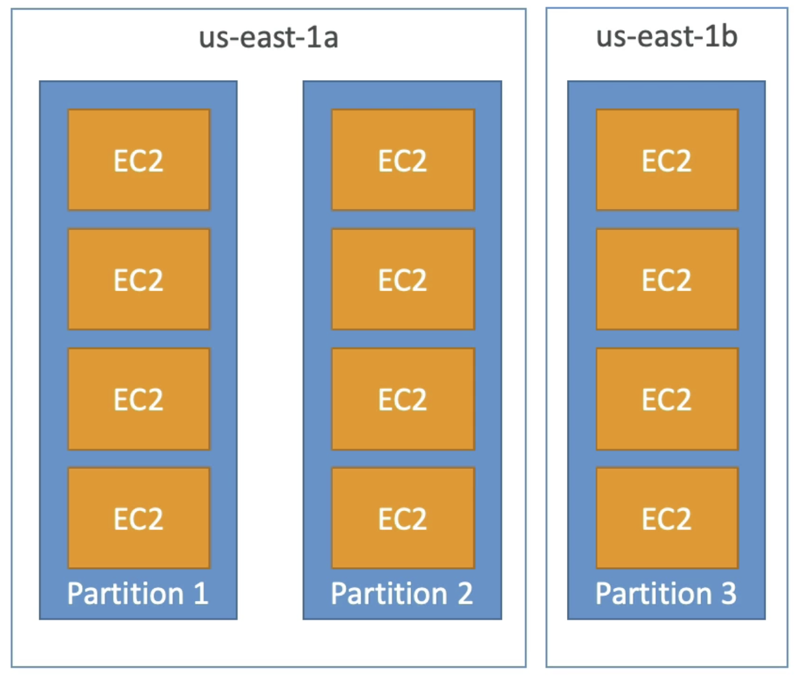

# AWS Certified Solutions Architect Associate                 

# Getting Started with AWS           

## AWS Cloud Overview - Region & AZ                

**AWS Regions**                  
AWS has **Regions** all around the world. Region has a name: us-east-1, eu-west-3, etc.                 
A region is a cluster of data centers.                  
Most AWS services are region-scoped                       

How to choose an AWS Region ?              
1. **Compliance** with data  governance and legal requirements: data never leaves a region without your explicit permission                 
2. **Proximity** to customers: reduced latency                       
3. **Available services** within a Region: not all regions have all services, new services and new features are not available in every region                       
4. **Pricing**: pricing varies region to region and is transparent in the service pricing page                    

For region-scoped services (e.g. EC2), when we switch region in AWS console, we will have a completely new different sets of resources.           

Resources are scoped to the Region for most services in AWS.                 

**AWS Availability Zones**                 
Each region has many availability zones, usually 3, min is 2, max is 6. e.g.             
Region: ap-southeast-2 has 3 AZ:             
ap-southeast-2a                
ap-southeast-2b                 
ap-southeast-2c                   

Each AZ is one or more discrete data centers with redundant power, networking and connectivity                 
They are separate from each other, so that they are isolated from disaters                  
They are connected with high bandwidth, ultra-low latency networking                        
They are linked together and form a region                 

**AWS Points of Presence (Edge Locations)**                             
Amazon has 216 Points of Presence (205 Edge Locations & 11 Regional Caches) in 84 cities across 42 countries.               
Content is delivered to end users with lower latency                

From Global Infrastrucutre, we can see which services are available within region.               

# IAM & AWS CLI           

## IAM Introduction: Users, Groups, Policies                         

**Global** services                    

IAM = Identity and Access Management        

When we create an account, we created a **root** account by default. This should NOT be used or shared.                            

We should create IAM **Users**. **Users** are people within your organisation, and can be grouped.                       

Groups can only contain Users, not other groups.                   
Users don't have to belong to a group, and user can belong to multiple groups.          

          

Users or Groups can be assigned JSON documents called policies.                
These policies define the permissions of the user.                 

In AWS you apply the **least privilege principle**: DO NOT give more permissions than a user needs.                                 

This is an example of IAM policy:                       
```
{
    "Version": "2012-10-17",
    "Statement": [
        {
            "Effect": "Allow",
            "Action": "ec2:Describe*",
            "Resource": "*"
        },
        {
            "Effect": "Allow",
            "Action": "elasticcloadbalancing:Describe*",
            "Resource": "*"
        },
        {
            "Effect": "Allow",
            "Action": [
                "cloudwatch:ListMetrics",
                "cloudwatch:GetMetricsStatistics",
                "cloudwatch:Describe*"
            ],
            "Resource": "*"
        }
    ]
}
```

Another example for the policy: AdminstratorAccess: (Note the star means everything)             

```
{
    "Version": "2012-10-17",
    "Statement": [
        {
            "Effect": "Allow",
            "Action": "*",
            "Resource": "*"
        }
    ]
}
```                               
For users, we can add tags, where we can mark the users and add in some attributes.                    

After log in we can notice that if the user accout is something like `stephane@stephane-ccp`, this means that this account is logged in as IAM user. The part after `@` is the account alias (e.g. can be `stephane-aws` for the account `stephane-ccp`, or the account name itself). If the user account is just `stephane-ccp` then this is logged in with root user (`stephane-ccp` is the account name).      

To grant permissions to User, we can either add the user into a group (which has the group policy, so this user will inhereit this group policy) or assign a policy directly to the user. We can also create our own custom policy either use the GUI or write in JSON.          

By clicing on the policy, we can also view what are the services that we have (full) access to.                 

## IAM MFA Overview

To protect the AWS account, we have 2 defense mechanisms:      

1) IAM Password Policy (helpful against brute force attack)         

1. Set minimum password length      
2. Requires specific character types: upper/lower case letters, numbers or non-alphanumeric characters.       
3. Allow all IAM users to change their own passwords       
4. Require users to change their password after some time                   
5. Prevent password reuse                 

2) Multi Factor Authentication - MFA        

On AWS this is a must and very recommended to use it. **We want to protect Root Account and IAM users**.      
MFA = password you know + security device you own         

MFA devices options in AWS:         
1) Virtual MFA device:       
Google Authenticator: phone only      
Authy: multi-device, and supports multiple tokens on a single device.       

2) Universal 2nd Factor (U2F) Security Key:      
YubiKey by Yubico (3rd party): support for multiple root and IAM users using a single security key, act as an USB-based key                

3.1) Hardware Key Fob MFA Device:    
Gemalto (3rd party)      
3.2) Hardware Key Fob MFA Device for AWS GovCloud (US):           
SurePassID (3rd party)             

## AWS CLI             

How can users access AWS ? There are 3 options:    
1) AWS Management Console (protected by password + MFA, for Root Account or other users)       
2) AWS Command Line Interface (CLI): protected by access keys      
3) AWS Software Developer Kit (SDK): this is mainly for code, (when your code is trying to access AWS), also protected by access keys    

Access keys are generated through the AWS Console. Users manage their own access keys and these keys are **private**.    
Access key have 2 components:            
Access Key ID (username) and Secret Access Key (password).   

We have to install (OS specific) client and configure the CLI with the Access Key ID and the Secret Access Key in order to use command line to access AWS.         

## AWS CloudShell

There is an alternative to install the CLI and configure it, this is called CloudShell. At the top right corner of the AWS Console there is a `terminal` icon we can launch. This is basically CLI in the cloud with pre-installed tools, storage (1 GB per AWS region) and saved files/settings.       

We can directly run AWS command directly in the CloudShell instead on the local CLI. e.g. `aws --version` to check the version of the AWS CLI installed or `aws iam list-users` to list the IAM users.        

The credentials used by the CloudShell is the same credentials as the user we logged in to the console with, at the moment we launch the CloudShell.             

## IAM Roles for AWS Service           

Some AWS services will need to perform actions on our behalf and on our account. We have to assign permissions to AWS services with IAM Roles.    

IAM Roles are just like users, but they are intended to be used *not* by physical people, but instead used by AWS Services.        

             

A quick example will be we created an EC2 instance (virtual server), and this EC2 instance would like to perform some action on AWS. To do so we need to give permissions to this EC2 instance. We will create an IAM Roles and together with the EC2 instance (as one entity), they can access AWS.     

Some common roles includes: EC2 Instance Roles, Lambda Function Roles, Roles for CloudFormation.        

## IAM Security Tools    

IAM Credentials Report (account level):      
We can create this report at the account level. This is a report that lists all your account's users and the status of their various credentials.         

IAM Access Advisor (user level):            
Access advisor shows the service permissions granted to a user and when those services were last used. We can use this information to revise your policies based on principle of least privilege.           

## IAM Best Practices

Do not use the Root Account except for AWS account setup      
One physical user = One AWS user       
**Assign users to groups** and assign permissions to groups (such that we manage permissions at a group level)           
Create a strong password policy       
Use and enforce the use of MFA              
Create and use Roles for giving permissions to AWS services           
Use Access Keys for Programmatic Access (CLI/SDK)      
Audit permissions of your account with the IAM Credential Reports (also IAM Access Advisor)    
Never share IAM users and Access keys        

## IAM Summary

Users: mapped to a physical user, has password for AWS Console         
Groups: contains users only (it is best to group users together)     
Policies: JSON document that outlines permissions for users or groups        
Roles: if we are within AWS, we can use roles to give permissions to AWS services to perform tasks      
Security: MFA + password policy        
Access Keys: access AWS using the CLI or SDK        
Audit: IAM Credential Reports and IAM Access Advisor          

# EC2 Fundamentals                

## EC2 Basics

One of the most popular AWS service and it is a Infrastructure as a Service (IaaS).            

EC2 = Elastic Compute Cloud             

It is comprised of many things (and capabilities) at a high level:            
-> You can rent virtual machinese on EC2 (they are called EC2 instances)          
-> You can store data in on their virual drives (they are called EBS volumes)              
-> You can distribute load across machines (Elastic Load Balancer, ELB)          
-> You can scale services using auto-scaling group (ASG)           

Knowing how EC2 works is *fundamental* to understand how Cloud works.      

EC2 sizing & configuration option: what can we choose for our instances (virtual servers) ?     

-> Operating System (OS): Linux or Windows or Mac        
-> How much compute power & cores (CPU)       
-> How much random-access memory (RAM)            
-> How much storage space: Network-attached (EBS & EFS) or hardware-attached (EC2 Instance Store)           
-> The Network card that is attached to the EC2 instance: speed of the card, public IP address        
-> Firewall rules: **security group**              
-> Bootstrap script (configure at first launch): Configuration script needs to be run at first launch, this is called EC2 User Data           

The `t2.micro` instance is included in the AWS free-tier. It has 1 vCPU, 1 GiB Mem and EBS storage.         

**EC2 User Data**            
It is possible to bootstrap our instances using an EC2 User Data scirpt.              
*Bootstrapping* means launching commands when a machine starts             
That script is *only run once* at the instance first start                
EC2 user data is used to automate boot tasks such as:            
-> installing updates           
-> installing software         
-> downloading common files from the internet           
The EC2 User Data Script runs with the root user (any command you have will have the pseudo rights)             

## Create an EC2 Instance with EC2 User Data to have a Website (hands-on)

1. Log in AWS Console, search for EC2, go to EC2 Console    
2. Choose region (e.g. closest to you)
3. Go to `Instances` on the right panel and `Launch Instance`
4. Choose Amazon Machine Image (AMI), we can choose from Quick Start and select Amazon Linux 2 AMI (64-bit x86) which is free-tier eligible.          
5. Choose an Instance Type (e.g. t2.micro for free tier), note that we are launching the instances in a default VPC (if we don't change the settings)          
6. Configure Instance Details: Under `User Data` we can run a user data which is only run at the first boot of the instance. (an example script is given, which is going to launch a web server onto our EC2 instance and write a file to it)
7. Add Storage (check `Delete on Termination`)
8. Add tags
9. Configure Security Group: create a new security group and Add Rule (HTTP, port 80)
10. Review and launch (will be prompted to use a key pair (for SSH)) 
11. Create a new key-pair (public-private key) and download the key pair

We can then use the public IPv4 address to access the website. To stop the instance, we can right click the instance and `Stop Instance`. To get rid of the instance, choose `Terminate Instance`.       

Note that if we stop an instance and restart it again, the public IPv4 **is going to change**. The private IPv4 will not change.        

## EC2 Instance Types Basics

AWS has the following naming convention (example):          
m5.2Xlarge         
m: **instance class**, in this case a general purpose instance         
5: **generation** of the instance (AWS improves them over time)         
2xlarge: **size** within the instance class         

**For exam we need to know this**, for various EC2 Instance Types:              
1. General Purpose        
Great for a diversity of workloads such as web servers or code repositories              
Balance between:        
-> Compute           
-> Memory              
-> Networking                  
t2.micro is a General Purpose EC2 Instance (free tier)             

2. Compute Optimized        
Great for compute-intensive tasks that require high performance processors:      
-> Batch processing workloads       
-> Media transcoding      
-> High performance web server              
-> High performance computing (HPC)            
-> Scientific modeling and machine learning            
-> Dedicated gaming servers               
Currently all the Compute Optimized EC2 Instance start with `c`, e.g. c5 or c6.     

3. Memory Optimized                
Fast performance for workloads that process large data sets in memory (RAM)       
Use cases includes:         
-> High performance, relational/non-relational databases        
-> Distributed web scale cache stores                
-> In-memory databases optimzed for BI           
-> Applications performing real-time processing of big unstructured data                   
These instances starts with `r`.             

4. Storage Optimized                      
Great for storage-intensive tasks that require high, sequential read and write access to large data sets on local storage     
Use cases include:        
-> High frequency online transaction processing (OLTP) systems    
-> Relational & NoSQL databases            
-> Cache for in-memory databases (e.g. Redis)       
-> Data warehousing applications                 
-> Distributed file systems           
These instance starts with `i`, `d` or `h1`.        

## Security Groups & Classic Ports Overview

Security Groups are the fundamental of network security in AWS.             
They control how traffic is allowed into or out of our EC2 Instances.    
Security Groups only contains *allow* rules, i.e. what is allowed to go in or go out.    
Security Groups rules can reference by IP address (i.e. where is your computer) or by Security Groups (i.e. Security Groups can reference each other).                

              

For example we are on our computer (i.e. public internet) and we would like to access our EC2 Instance. We will have to create a Security Group around our EC2 Instance (that is the firewall around it) and this Security Group is going to have rules that control which inbound traffic is allowed into the EC2 Instance and if the EC2 Instance can perform some Outbound traffic.      

Security Groups are acting as a "firewall" on EC2 Instance. They regulate:          
1. Access to Ports
2. Authorised IP ranges: IPv4 and IPv6 (e.g. 0.0.0.0/0 means any IP address is authorised)
3. Control of inbound network (i.e. from others to the EC2 Instance)
4. Control of outbound network (i.e. from EC2 Instance to others)

A quick example of Security Group works is shown below:           
     

For unauthorised inbound traffic, it will be a timeout error. By default for any Security Group, it will allow all outbound traffic out of the EC2 Instance. For example, if our EC2 Instance try to access a website, the Security Group is going to allow it.         

Security Groups good-to-know:            
-> can be attached to multiple instances          
-> instances can have multiple security groups              
-> Locked down to region/VPC combination           
-> Does live "outside" the EC2 - if traffic is blocked the EC2 instance won't see it (i.e. not like an application that runs on EC2)            
-> It is good to maintain one sepearate security group for SSH access                  
-> If your application is not accessible (time out), then it is a security group issue               
-> If your application gives a "connection refused" error, then it is an application error or it is not launched.           
-> By default, all inbound traffic is **blocked**           
-> By default, all outbound traffic is **authorised**                     

Referencing other security groups:                 
            

In the inbound rule for the EC2 instance, it is authorising Security Group 1 inbound AND Security Group 2. When another EC2 instance has Security Group 2, it can connect straight through on the port of the first EC2 instance. So regardless of the IP address, because they have the right Security Group attached to them, they are able to communicate straight through to other instances.                 

Classic Port we need to know (**EXAM**):        
1. 22 = SSH (Secure Shell) - log into a EC2 Instance on Linux
2. 21 = FTP (File Transport Protocol) - upload files into a file share
3. 22 = SFTP (Secure File Transport Protocol) - upload files using SSH
4. 80 = HTTP - access unsecured websites
5. 443 = HTTPS  - access secured websites
6. 3389 = RDP (Remote Desktop Protocol) - log into a Windows instance

## SSH Overview


## SSH with Mac

When creating the EC2 Instance, we have created a key pair and download it (e.g. `ec2tutorial.pem`). We will need this key pair to SSH into this instance.      
```
ssh -i ec2tutorial.pem ec2-user@35.180.100.144
```
`ec2-user` is basically the Linux user in Amazon Linux machine. `35.180.100.144` is the IPv4 Public IP of the EC2 Instance.      

The above command will **fail**. This is because the first time we download the file, the permission is 0644 for the file. And this is too open for the private key, this means that the private key can leak, and it is accessable by others and it is a bad permission. The remedy is to change the file permission via:      
```
chmod 0400 ec2tutorial.pem
```
Run the SSH command again and we will be able to SSH into the EC2 instance. Once we are inside we can query the user (`whoami`) or ping a website (`ping google.com`)          

Note that in Windows 10 the `chmod` command does not exist. We will have to go to the property of the `.pem` file. We cab go to the Security tab and disable inherentence then remove all other user except yourself.        

To exit we can just press `exit` or `ctrl + d` to close the connection. (or `ctrl + c` or type `exit`)      

Note that on Windows when we use PuTTY, we need the PuTTygen to convert the key pair, which is in `.pem` to `.ppk` format so that PuTTY can use. Then after launching PuTTY and put in the public IPv4 of the EC2 Instance, we need to go to Connection -> SSH -> Auth to link the `.ppk` file.            

## EC2 Instance Connect

There is another way to connect to an EC2 Instance directly from AWS. We can click Connect in the AWS EC2 dashboard (where the list of EC2 Instance is shown). We can connect via EC2 Instance Connect after use a username. Note that this methods do not work with all type of AMIs in AWS. At the backend, it upload a temporary SSH key on your EC2 Instance for you. This methods ultimately still rely on SSH, so if we remove SSH rules from the Security Groups setting we will meet a timeout error if we use EC2 Instance Connect. So even though this method is based on browser, port 22 still needs to be opened for this method

## EC2 Instance Role Demo

After we connect to our EC2 Instance (via EC2 Connect) with our user, if we perform something like `aws iam list-users`, the CLI will prompt us to configure AWS to get our credentials. We can use `aws configure` to enter AWS Access Key ID and Secret Access Key but it is very bad practice. We can attach a Role to this instance (for example a Role with `IAMReadOnlyAccess` could allow us to run `aws iam list-users` without inputing credential again)                

## EC2 Instance Launch Types

EC2 Instances purchasing options:         
1. On-Demand Instances: short workload, predictabel pricing     
Sometimes we will need to use the serve for a long time and we can get some cost saving through:        
2. Reserved(**minimum 1 year**): 3 types       
-> Reserved Instances: long workload (e.g. database)       
-> Convertible Reserved Instances: long workload with flexible instances       
-> Scheduled Reserved Instances: example, every Thurs 3-6 pm     
3. Spot Instances: short workloads, cheap, can lose instances (less reliable)      
4. Dedicated Host: book an entire physical server, control instance placement        

Exam will ask you question and expect us to find the best of EC2 for various situations for cost saving or comply with some rules.    

**EC2 On Demand**:      
We pay for what we use:       
-> Linux machine: billing per second, after the first minute         
-> All other OS: billing per hour when instance is running      
Has the *highest* cost but no upfront payment      
No long-term commitment        

Recommended for **short-term** and **un-interrupted workloads**, where you cannot predict how the application will behave.      

**EC2 Reserved Instances**:       
Up to 75% discount compared to On-Demand.        
Reservation period: 1 year = + discount | 3 years = +++ discount (ONLY 1 or 3 years, not any time in between)       
Purchasing options: no upfront | partial upfront = + discount | All upfront = ++ discount        
Reserve a specific instance type (t2.micro etc)      

Recommended for steady-state usage applications (think database)        

Convertible Reserved Instnace:      
-> can change the EC2 instance type (e.g. t2.large to c3.large)        
-> up to 54% discount      

Scheduled Reserved Instances       
-> launch within specific time window you reserve          
-> require a fraction of day / week / month      
-> still commitment over 1 to 3 years      

**EC2 Spot Instances**:       
Provides the highest discount, can get up to 90% compared to On-Demand      
Instances that you can lose at any point of time if your max price (you are willing to pay for them) is less than the current spot price (the spot price changes over time)          
The MOST cost-efficient instances in AWS       

Useful for workloads that are resilient to failure (e.g. won't lose the progress of your work if you lose that instance)       

Recommended: batch jobs, data analysis, image processing, any distributed workloads, workloads with a flexible start and end time.       
Not suitable for critical jobs or databases.          

**EC2 Dedicated Hosts**:         
An Amazon EC2 Dedicated Host is a physical server with EC2 instances capacity fully dedicated to your use. Dedicated Hosts can help you address **compliance requirements** and reduce costs by allowing you to **use your existing server-bound software licenses**.       

These hosts are going to be allocated for a 3-year period reservation.      
More expensive     

Useful for software that have complicated licensing model (BYOL - Bring Your Own License)    
Or for companies that have strong regulatory or complicance needs.        
Since AWS shares all their server with everyone, this will ensure no one is using the server except you.      

**EC2 Dedicated Instances**:      
These are for EC2 Instances running on hardware that is dedicated to you.        
May share hardware with other instances in the same account.         
No control over instance placement (hardware control). So this is more like a software-version of Dedicated Host.           
      

Which purchasing option is right for me ?       
On-Demand: coming and staying in resort whenever we like, we pay full price.           
Reserved: like planning ahead and if we plan to stay for a long time, we may get a good discount.        
Spot instances: the hotel allows people to bid for the empty rooms and the highest bidder keeps the room. You can get kick out at any time.       
Dedicated: we book entire building of the resort.        

An example of cost comparison using m4.large instance:    
   

# EC2 - Solution Architect Associate Level             

## Private vs Public vs Elastic IP        

Networking has two sorts of IPs: **IPv4** and **IPv6**.             
IPv4: 4 numbers seperated by 3 dots, e.g. 1.160.10.240             
IPv6: 3ff2: 1900:4545:3:200:f8ff:f221:67cf                

IPv4 is still the most common format used online         
IPv6 is newer and solves problems for the Internet of Things (IoT)                

IPv4 allows for **3.7 billion** different addresses in the public space:             
[0-255].[0-255].[0-255].[0-255]                  

              

When you have a public IP, you are accessible over the internet and when you have a private IP, you are only accessible within your private netowrk.             

**Fundamental Differences**:                  
Public IP:          
-> Public IP means the machine can be identified on the internet (WWW)             
-> must be unique across the whole web (not two machines can have the same public IP)           
-> can be geo-located easily           
Private IP:             
-> Private IP means the machine can only be identified on a private network only         
-> IP must be unique across the private network            
-> BUT two different private networks (e.g. 2 companies) can have the same IPs        
-> machines connect to WWW using a NAT + internet gateway (a proxy)         
-> only a specified of IPs can be used as private IP            

**Elastic IPs**         
When you stop and then start an EC2 instance, it can change its public IP.                
If you need to have a fixed public IP for your instance, you need an Elastic IP              
An Elastic IP is a public IPv4 IP you own as long as you don't delete it                
You can attach it to one instance at a time                   
With an Elastic IP address, you can mask the failure of an instance or software by rapidly remapping the address to another instance in your account                    

You can only have 5 Elastic IP in your account (you can ask AWS to increase that)               

Overall, try to avoid using Elastic IP.               
-> they often reflect poor architectural decision             
-> instead, use a random public IP and register a DNS name to it                 
-> or, use a Load Balancer and don't use a public IP              

In EC2:         
By default, your EC2 machine comes with:         
-> a private IP for the internal AWS Network         
-> a public IP, for the WWW          

When we are doing SSH into our EC2 machines:         
-> we can't use a private IP, because we are not in the same network          
-> we can only use the public IP (if you don't have a VPN)         

If your machine is stopped and then started, the public IP can change            

We can find the Elastic IP in the EC2 console (under Network & Security), and we can allocate a new IP address from Amazon's pool of IPv4 addresses. By doing this we can create an IP address we own now, and this can be allocated to a specific EC2 instance. Now if we stop and restart an EC2 instance with an Elastic IP, (the public IPv4 is going to be the same as the Elastic IP associated to this EC2 instance), the Public IPv4 will remain the same.                

## Spot Instances & Spot Fleet    

Can get a discount of up to 90% compared to On-Demand          

Define **max spot price** and get the instance while **current spot price < max**              
-> the hourly spot price varies based on offer and capacity             
-> if the current spot price > your max price you can choose to **stop** or **terminate** your instance with a 2 minutes grace period              
Other strategy: **Spot Block**            
-> "block" spot instance during a specified time frame (1 to 6 hours) without interruptions                
-> in rare situations, the instance may be reclaimed             

Used for batch jobs, data analysis, or workloads that are resilient to failures.               
Not great for critical jobs or databases                

How do we terminate a spot instance ?                 

                          

Consider a spot request: we are defining how many instances we want, maximum price we are willing to pay, launching specifications (AMI etc) and when our request is *valid from* and *valid until* and **request type**.             
There are 2 types of request types: **one-time request** or **persistent request**                

If it is a **one-time request**, as soon as your spot request is fulfiled, our instances are going to be launched and then the spot request **GOES AWAY**. If it is a **persistent**, this means that we want these requested instance as long as the spot request is valid from to valid until. This means that if the instances do get stopped/interrupted, then our spot requests will go back into action. AWS will restart spot instances for us when the conditions are met.                

We can only cancel Spot Instance requests that are open, active or disabled.               
Cancelling a spot request DOES NOT terminate instances (its our responsibility to terminate these spot instances).             
We must first cancel a spot request, and then terminate the associated spot instances, else the spot request will re-start the instances.                 

**Spot Fleets**                  
Spot Fleets = set of Spot Instances + (optional) On-demand Instances                  
The Spot Fleets will try to meet the target capacity with price constraints               
-> define possible launch pools: instance type (m5.large), OS, AZ               
-> we can have multiple launch pools, so that the fleet can choose. The fleet can choose the best and most appropriate launch pool for you                  
-> Spot Fleet stops launching instances when reaching capacity or max cost            

Strategies to allocate Spot Instances (EXAM):                
-> lowestPrice: from the pool with the lowest price (cost optimization, short workload)           
-> diversified: distributed across all pools (great for availability, long workloads)               
-> capacityOptimized: pool with the optimal capacity for the number of instances                 

Spot Fleets allow us to automatically request Spot Instances with the lowest price, i.e. Spot Fleet gives us an extra saving based on spot instances because it is smart enough to choose the right spot instance pools to allow us to get the maximum amount of savings.           

## EC2 Placement Groups

Sometimes we want control over the EC2 instance placement strategy (i.e. how the EC2 instances is placed within the AWS infrastructure)                

That strategy can be defined using placement groups              

When we create a placement group, you specify one of the following strategies for the group:          
-> *Cluster*: clusters instances into a low-latency group (hardware setup) in a single AZ - **high performance, high risk**            
-> *Spread*: spreads instances across underlying hardware (max 7 instances per group per AZ) - **critial applications**             
-> *Partition*: spreads instances across many different partitions (which rely on different sets of racks) within an AZ. Scales to 100s of EC2 instances per group (Hadoop, Cassandra, Kafka).                

**Cluster**:           

                 

For Cluster, it means that all of our EC2 instances are on the same rack (means same hardware, same AZ).            
Pros: Great network (10 Gbps bandwidth between instances)           
Cons: if the rack fails, all instances fails at the same time                
Use cases:           
-> Big Data job that needs to complete fast            
-> Application that needs extremely low latency and high network throughput              
**Willing to take on the risk of failure**                    

**Spread**:              

               

We have 3 AZ and 6 EC2 instances, and each instance is on a different hardware.          
Pros:           
-> can span across AZ              
-> reduce risk in simultaneous failure             
-> EC2 Instances are on different physical hardware            

Cons:            
-> limited to 7 instances per AZ per placement group           

Use cases:              
-> Application that needs to maximize high availability           
-> Critical applications where each instance must be isolated from failure from each other           

**Partition**:               

             

We can have up to 7 partitions per AZ. And on each partition we can have many EC2 instances.         
Each partition represent a rack on AWS -> so instances are safe from rack failure affecting one another.              
Can span across multiple AZs in the same region               
Up to 100s of EC2 instances.               
The instances in a partition do not share racks with the instances in the other partitions             
A partition failure can affect many EC2 instances but won't affect other partitions             
EC2 instances get access to the partition information as metadata.                

Use cases: HDFS, HBase, Cassandra, Kafka                

We can create new placement group and assign EC2 instances during launching, or directly create the new placement group during the instance launching (after selecting AMIs etc)            


## Elastic Network Interfaces (ENI) - Overview             

Logical component in a VPC that represents a **virtual network card**             
They are used outside of EC2 instances as well.              

             

For example we have 1 EC2 instance in a AZ. There is a primary ENI `Eth0` attached to it.           
This will provide your EC2 instance network connectivity and (e.g.) Private IP.              

Each ENI can have the following attributes:            
-> primary private IPv4, one or more secondary IPv4 (here `Eth1` is a secondary ENI, this will give another IPv4)                                
-> One Elastic IP (IPv4) per private IPv4           
-> One Public IPv4              
-> One or more security groups           
-> a MAC address             

You can create ENI independently and attach them on the fly (move them) on EC2 instances for failover         
In the example above, we can move `Eth1` so that the private IP is moved to the second EC2 instance.                      
Bound to a specific AZ.                 

ENI is automatically created during EC2 Launching, we can create ENI manually and attach to them. These manually created ENI is going to stay (under `Network interfaces`) after the EC2 instances are terminated.                

## EC2 Hibernate          

We can stop and terminate instances:             
-> Stop: the data on disk (EBS) i skept intact in the next start            
-> Terminate: any EBS volumes (root) also *set-up to be destroyed* is lost               

On start, the following happens:          
-> First start: the OS boots & the EC2 User Data script is run             
-> Following start (stop and then restart): the OS boots up, then your application starts, caches get warmed up, and that can take time           

**EC2 Hibernate**       
The in-memory (RAM) state is preserved          
The instance boot is much faster (the OS is not stopped/restarted)             
Under the hood: the RAM state is written to a file in the root EBS volume              
The root EBS volume must be encrypted           

           

Use cases:           
-> long-running processing          
-> saving the RAM state          
-> services that take time to initialise             

EC2 Hibernate - Good to know           

Supported instance families - C3, C4, C5, M3, M4, M5, R3, R4 and R5          
Instance RAM size - must be less than 150 GB          
Instance size - not supported for bare metal instances              
AMI: Amazon Linux 2, Linux AMI, Ubuntu and Windows            
RootVolume: must be EBS (so not Instance Store), encrypted and large               
Available for On-Demand and Reserved Instances                  

An instance cannot be hibernated more than 60 days             

During EC2 launching, we can enable hibernation as an additional stop behavior              

## EC2 - Advanced Concepts (Nito, vCPU, Capacity Reservations)             

1. EC2 Nitro          

Underlying Platform for the next generation of EC2 instances               
New virtualisation technology             
Allows for better performances:               
-> better networking options (enhanced netowrking, HPC, IPv6)               
-> **High Speed EBS (Nitro is necessary for 64,000 EBS IOPS - max is 32,000 on non-Nitro)**           
Better underlying security             
Instance types example:         
-> Virtualised, A1, C5, C5a, C5ad, D3, D3gen, M5, M5a etc. (anything new will have Nitro in it)            
-> Bare metal: a1.metal, c5.metal, c6g.metal, etc.             

2. vCPU           

Multiple threads can run on one CPU or Core (multithreading)            
Each thread is represented as a virtual CPU (vCPU)             
e.g. launching m5.2xlarge:              
-> 4 CPU             
-> 2 threads per CPU (8 threads total)             
-> so 8 vCPU in total

We can optimise CPU options:           
EC2 instances come with a combination of RAM and vCPU              
In some rare cases, you may want to change the vCPU options (e.g. reduce):             
-> no. of CPU cores: you can decrease it (helpful if you need high RAM and low number of CPU) - decrease licensing costs           
-> no. of threads per core: disable multithreading to have 1 thread per CPU - helpful for high performance computing (HPC) workloads           

Only specified during the instance launch            

             

3. Capacity Reservations         

Capacity Reservations ensure you have EC2 Capacity when needed          
Manual or planned end-date for the reservation         
No need for 1 or 3-year commitment           
Capacity access is immediate, you get billed as soon as it starts           

Specify:       
-> the AZ in which to reserve the capacity (only one), if needed in 3 AZ, we need to do 3 Capacity Reservations              
-> the number of instances for which to reserve capacity            
-> the instance attributes, including the instance type, tenancy, and platform/OS             

Combined with Reserved Instances and Saving Plans to do cost saving                 

# EC2 Instance Storage

# Things to do            

